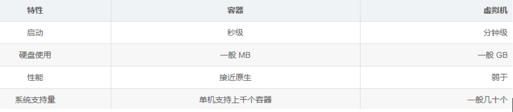
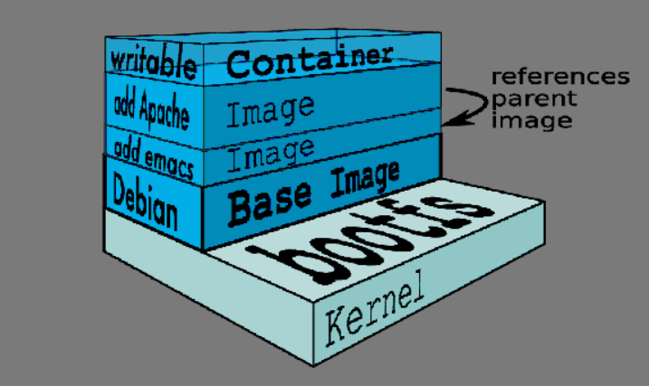
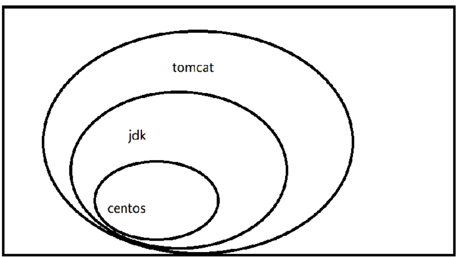
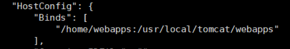
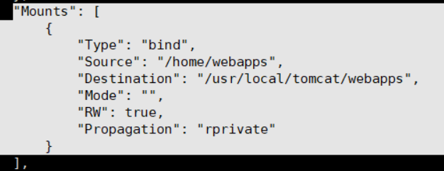
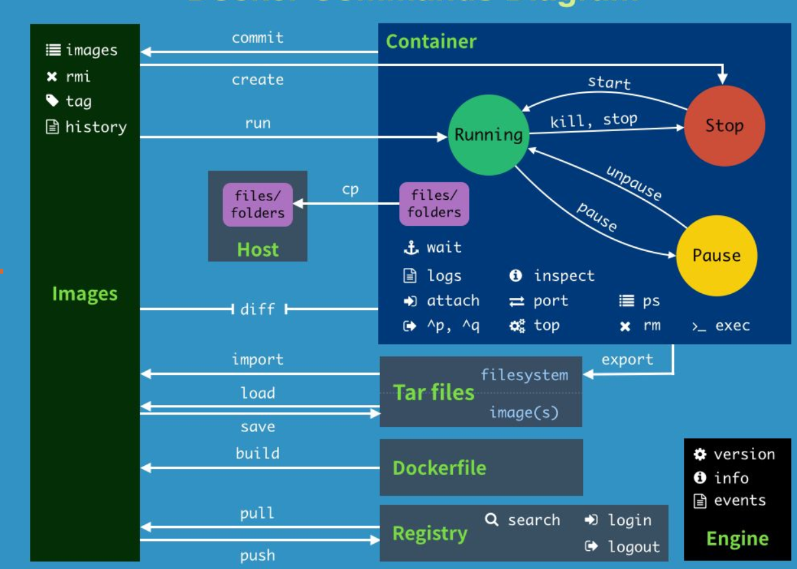

# Docker

## 简介、特点

1. 解决了运行环境和配置问题软件容器，方便做持续集成并有助于整体发布的容器虚拟化技术。
2. go语言开发
3. 容器虚拟化技术： 启动块，性能高，占地小，能装很多容器



- 更高效的系统资源利用

  - 没有杂七杂八的东西，不浪费，资源利用率高

-  更快速的启动时间

- 一致的运行环境

  - Docker 的镜像提供了除内核外完整的运行时环境，确保了应用运行环境一致性。

- 持续交付和部署
  	对开发和运维（DevOps）人员来说，最希望的就是一次创建或配置，可以在任意地方正常运行。

- 更轻松的迁移

  ​		由于 Docker 确保了执行环境的一致性，使得应用的迁移更加容易。Docker 可以在很多平台上运行，无论是物理机、虚拟机、公有云、私有云，甚至是笔记本，其运行结果是一致的。因此用户可以很轻易的将在一个平台上运行的应用，迁移到另一个平台上，而不用担心运行环境的变化导致应用无法正常运行的情况。

- 更轻松的维护和拓展

  ​		Docker 使用的分层存储以及镜像的技术，使得应用重复部分的复用更为容易，也使得应用的维护更新更加简单，基于基础镜像进一步扩展镜像也变得非常简单。此外，Docker 团队同各个开源项目团队一起维护了一大批高质量的 官方镜像，既可以直接在生产环境使用，又可以作为基础进一步定制，大大的降低了应用服务的镜像制作成本。

## 安装

Centos7 安装Docker

```bash
# step 1: 安装必要的一些系统工具
sudo yum install -y yum-utils device-mapper-persistent-data lvm2
# Step 2: 添加软件源信息
sudo yum-config-manager --add-repo http://mirrors.aliyun.com/docker-ce/linux/centos/docker-ce.repo
# Step 3: 更新并安装 Docker-CE
sudo yum makecache
sudo yum -y install docker-ce
# Step 4: 开启Docker服务
sudo service docker start
# Step 5: 配置阿里云镜像加速
sudo mkdir -p /etc/docker
sudo tee /etc/docker/daemon.json <<-'EOF'
{
  "registry-mirrors": ["https://eepymr1r.mirror.aliyuncs.com"]
}
EOF
sudo systemctl daemon-reload
sudo systemctl restart docker

# Step6.docker测试  
	 docker info
	 
        #Registry Mirrors :
        #https://eepymrlr.mirror.aliyuncs.com  #表示配置阿里云镜像加速成功
        #Live Restore Enabled :false
        #
#step7:设置开机自启动
sudo systemctl enable docker
```

## 概念

### 镜像（image）

​		docker镜像就是一个只读模板，比如，一个镜像可以包含一个完整的centos，里面仅安装apache或用户的其他应用，镜像可以用来创建docker容器，另外docker提供了一个很简单的机制来创建镜像或者更新现有的镜像，用户甚至可以直接从其他人那里下周一个已经做好的镜像来直接使用

#### UnionFs（联合文件系统）



​	UnionFs（联合文件系统）：union文件系统（UnionFs）是一种分层、轻量级并且高性能的文件系统，它支持对文件系统的修改作为一次提交来一层层的叠加，同时可以将不同目录挂载到同一个虚拟文件下。
　　Union文件系统是Docker镜像的基础，镜像可以通过分层来进行继承，基于基础镜像，可以制作各种具体的应用镜像。
　　特性：一**次同时加载多个文件系统**，但从外面看来，只能看到一个文件系统，联合加载会把各层文件系统叠加起来，这样最终的文件系统会包含所有底层的文件和目录。
**Docker的镜像实际上由一层一层的文件系统组成，这种层级的文件系统UnionFs**

- Bootfs（boot-file system）主要包含bootloader和kernel，
  - bootloader主要是引导加载kernel，Linux刚启动时会加载bootfs文件系统，在Docker镜像的最底层是bootfs，这一层与我们典型的Linux/unix系统是一样的，包含boot加载器和内核，当boot加载完成之后整个内核就能在内存中了，此时内存的使用权已由bootfs转交给内核，此时系统也会卸载bootfs。
- Rootfs（root-file system），在bootfs之上，包含的就是典型Linux系统中的/dev、/proc、/bin、/etc等标准目录和文件，rootfs就是各种不同操作系统的发行版，比如Ubuntu，Centos等等。
- 对于一个精简的OS，rootfs可以很小，只需要包括最基本的命令、工具和程序就可以了，因为底层直接用宿主机的内核，自己只需要提供rootfs就可以了，因此可见，对于不用的Linux发行版，bootfs基本是一致的，而rootfs会有差别，因此不同的发行版可以公用bootfs。
- 多个镜像从相同的父镜像构建而来，那么宿主机只需在磁盘上保存一份父镜像，同时内存中也只需加载一份父镜像就可以为所有容器服务了，并且镜像的每一层都可以被共享。

#### 镜像分层

例如：tomcat 镜像

​	tomcat 运行得有jdk支持，jdk运行得在centos上（或者其他linux）

​	Docker镜像都是只读的，当容器启动时，一个新的可写层被加载到镜像的顶部。这一层通常被称作“容器层”，“容器层”之下的都叫“镜像层”。




### 仓库（Registry)

```tex
仓库是集中存储镜像文件的地方
就阿里云来说，一般一个镜像仓库就存一种镜像的多个版本
自己的账号下>命名空间>多个仓库>多个tag[一般是不同的版本号]
```
#### 镜像推送至仓库

```tex
下载阿里云镜像

1. 登录阿里云Docker Registry
	$ sudo docker login --username=陈鹏程0621 registry.cn-hangzhou.aliyuncs.com
2. 从Registry中拉取镜像
	$ sudo docker pull registry.cn-hangzhou.aliyuncs.com/chenpc_docker/hello:[镜像版本号]

将镜像推送到阿里云

1. 登录阿里云Docker Registry
	$ sudo docker login --username=陈鹏程0621 registry.cn-hangzhou.aliyuncs.com
2. 打包镜像
	$ sudo docker tag [ImageId] registry.cn-hangzhou.aliyuncs.com/chenpc_docker/hello:[镜像版本号]
3. 上传镜像
	$ sudo docker push registry.cn-hangzhou.aliyuncs.com/chenpc_docker/hello:[镜像版本号]


备注：
chenpc_docker  命名空间名字
hello镜像仓库名字 
```


### 容器（container）

​		docker利用容器来运行应用，容器是从镜像创建的运行实例，它可以被启动，开始、停止、删除、**每个容器都是互相隔离的**，保证安全的平台，可以把容器看做是要给简易版的linux环境（包括root用户权限、镜像空间、用户空间和网络空间等）和运行再其中的应用程序

### 容器数据卷（volume）

#### 作用

容器数据卷是做**容器数据的持久化**的。和共享文件夹类似，宿主机上也会保存一份

	docker 容器数据卷是容器在运行过程中持久化数据的一种方式，卷是目录或文件，存在于一个或多个容器中，由docker 挂载到容器，但不属于联合文件系统，因此能够绕过Union File System  提供一些用于持续存储或共享数据的特性；卷的设计目的就是数据持久化，完全独立于容器的生命周期，因此docker不会在容器删除时，删除其挂载的数据卷。

**特点：**

- 数据卷可在容器之间共享或重用数据。
- 卷中的更改可以直接生效。
- 数据卷中的更改，不会包含在镜像中的更新。
- 数据卷的生命周期一直持续到没有容器使用它为止。

#### 如何挂载

1. 命令添加

   - 命令

     docker run -it -v /宿主机绝对路径:/容器内目录:权限   镜像名

     *权限：ro (readonly容器只能查看) ，可以不加，默认是读写权限*

   	示例：
   		启动Tomcat容器，并且宿主机的/home/webapps目录和容器中的 /usr/local/tomcat/webapps 目录相关联，这两个目录中的文件会互相同步
   	
   	docker run -d -p 8080:8080 --name tomcat-v  -v /home/webapps:/usr/local/tomcat/webapps tomcat
   	命令解析：
   			docker run -d    							#守护进程启动
   			-p 8080:8080								#端口映射
   			--name tomcat-v  							#容器别名
   			-v /home/webapps:/usr/local/tomcat/webapps  #容器卷  宿主机目录：容器目录
   			 tomcat										#镜像名称

2. dockerfile添加

   - step1：编写docker文件，内容如下：

     ```tex
     FROM centos
     VOLUME ["/dataVlolumeContainer1","/dataVlolumeContainer1"]
     CMD echo "finished,-----------success"
     CMD /bin/bash
     
     FROM  来自于一个父类的镜像
     VOLUME  给镜像添加一个或多个容器卷
     CMD  控制台执行的命令
     ```

   - step2：build dockerfile 生成镜像：

     ```sh
     docker build -f /chen/dockerfile -t  centos-volume  .
     
     #参数：
     #　-f  指定dockerfile 文件，默认情况下在执行命令的目录下寻找 Dockerfile 文件
     #  -t  指定镜像名称
     #   .  在当前目录下生成镜像
     ```

   - step3 运行容器

     ```bash
     docker run -it centos-volume
     ```

3. 验证：

   docker inspect 容器ID     能够看到挂载信息，查询到宿主机的挂载目录

   - 绑定信息

   

   - 容器挂载信息（把主机的哪个目录挂载到容器中）

     ```tex
     source 源头：宿主机目录
     destination目的地：容器目录
     RW =read write 读写权限
     ```

     



#### 传递共享

```bash
docker run -it --name centos1 centos-volume

docker run -it --name centos2 --volumes-from centos1 centos-volume
docker run -it --name centos3 --volumes-from centos1 centos-volume
docker inspect 容器
	可以看到3个容器的挂载信息都是一致的，宿主机的挂载目录是同一个文件夹
```

### DockerFile

#### 介绍

Dockerfile 是一个构建文件，用来构建docker镜像

Docker执行Dockerfile的大致流程
	（1）docker从基础镜像运行一个容器
	（2）执行一条指令并对容器作出修改
	（3）执行类似docker commit的操作提交一个新的镜像层
	（4）docker再基于刚提交的镜像运行一个新容器
	（5）执行dockerfile中的下一条指令直到所有指令都执行完成

#### **关键字**

```tex
FROM	    +镜像名						  		#基础镜像，父类镜像
MAINTAINER	+作者或邮箱			 	  		  	  #作者
RUN		    +linux命令							#运行一条linux指令
EXPOSE		+端口号							   #端口，容器内的端口
WORKDIR		+容器内的某个目录					 	#默认目录
ENV			+环境变量名 +目录					 	 #环境变量
ADD			+宿主机文件名 +容器内路径/文件名			#将宿主机文件添加到容器，附带解压
COPY		+宿主机文件名 +容器内路径/文件名			#将宿主机文件添加到容器，原封不动
VOLUME		+[数据卷名1，数据卷名2，···]			   #容器数据卷
CMD			+linux命令 							#执行命令
ENTRYPOINT	+linux命令 							#同CMD 
ONBUILD		+linux命令 							#子类继承此镜像，子类构建时，会执行ONBUILD


1. ADD、COPY区别
	add解压缩，copy不解压缩
2. CMD、 ENTRYPOINT区别
	2.1 CMD后跟的命令，运行容器时会被运行的参数命令覆盖
        比如： 
        dockerfile 内最后的CMD是 CMD 命令1
        docker run -d imagename 命令2 此时执行的是 命令2 
	2.2 ENTRYPOINT 后边跟的命令，运行容器时会被运行的参数命令，会当做ENTRYPOINT 的参数
        比如： 
        dockerfile 内最后的CMD是 CMD 命令1
        docker run -d imagename 命令2   此时执行的是 命令1   命令2 作为命令1 的参数
    2.3 例子：              
        CMD ls
            docker run -d imagename -l   #执行-l 报错-l命令不存在
        ENTRYPOINT ls
            docker run -d imagename -l   #执行 ls -l
```

#### 例子

- Dockerfile 文件内容

```tex
#父类镜像centos
FROM	centos
#作者 chenpc
MAINTAINER	chenpc
#把宿主机dockerfile所在目录的abc.txt拷贝到容器/usr/local/路径下，重命名为xyz.txt
COPY abc.txt /usr/local/xyz.txt
#把宿主机dockerfile所在目录的jdk与tomcat 解压后添加到容器中/usr/local/目录下
ADD jdk-8u171-linux-x64.tar.gz /usr/local/
ADD apache-tomcat-9.0.8.tar.gz /usr/local/
#安装vim编辑器
RUN yum -y install vim
#设置工作访问时候的WORKDIR路径，登录落脚点
ENV MYPATH /usr/local
WORKDIR $MYPATH
#配置java与tomcat环境变量
ENV JAVA_HOME /usr/local/jdk1.8.0_171
ENV CLASSPATH $JAVA_HOME/lib/dt.jar:$JAVA_HOME/lib/tools.jar
ENV CATALINA_HOME /usr/local/apache-tomcat-9.0.8
ENV CATALINA_BASE /usr/local/apache-tomcat-9.0.8
ENV PATH $PATH:$JAVA_HOME/bin:$CATALINA_HOME/lib:$CATALINA_HOME/bin
#容器运行时监听的端口
EXPOSE  8080
#启动时运行tomcat
# ENTRYPOINT ["/usr/local/apache-tomcat-9.0.8/bin/startup.sh" ]
# CMD ["/usr/local/apache-tomcat-9.0.8/bin/catalina.sh","run"]
CMD /usr/local/apache-tomcat-9.0.8/bin/startup.sh && tail -F /usr/local/apache-tomcat-9.0.8/bin/logs/catalina.out
```

- 构建启动tomcat

  - 构建

    ```tex
    	docker build -f  /路径/Dockerfile -t 镜像名:版本 .
    	docker build -f /chen/tomcat/Dockerfile -t tomcatchen
    ```

  - 运行

    ```bash
    docker run -d -p 9080:8080 --name mytomcat9 -v /chen/mydockerfile/tomcat9/test:/usr/local/apache-tomcat-9.0.8/webapps/test -v /chen/mydockerfile/tomcat9/tomcat9logs/:/usr/local/apache-tomcat-9.0.8/logs --privileged=true tomcatchen
    ```

## 常用命令



1. **帮助命令**

   ```tex
   docker info
   docker --help
   docker version
   ```

2. **镜像命令**

   ```tex
   docker images  								#查看本地所有镜像   -q 只显示资源名
   docker search [镜像名] 					  # 搜索镜像资源
   docker pull [镜像名]:[版本号]    				# 下载镜像
   docker rmi [镜像名]:[版本号]  				#删除本地镜像   rmi -f 强制删除
   docker rmi -f $(docker images -qa)  	 	#删除所有镜像
   docker commit -m="提交的描述信息" -a="作者"  容器ID 要创建的目标镜像名:[标签名]   
   											#Docker镜像commit 通过容器生成镜像
   ```

3. **容器命令**

   ```tex
   1. docker run [OPTIONS] IMAGE [COMMAND] [ARG...]            # 运行容器
                   --name="容器新名字"   为容器指定一个名称；
                   -d: 	后台运行容器，并返回容器ID，也即启动守护式容器；
                   -i：		以交互模式运行容器，通常与 -t 同时使用；
                   -t:		为容器重新分配一个伪输入终端，通常与 -i 同时使用；
                   -P: 	随机端口映射；
                   -p: 	指定端口映射    -p 宿主机端口:容器内端口
   2.  docker ps  [OPTIONS]          # 查询正在运行的容器
           -a  所有容器，已经停了的也算
           -l  最近的
           -n 最近几个
   3.	进入容器	
               docker exec -it 容器ID Shell命令
               docker attach 容器ID 
       退出容器  
       		exit  #关闭容器并退出
               ctrl+p+q 	#不关闭容器退出
   4. 启/停/重启/强行关闭容器：对于运行过的容器	
   	docker start/stop/restart/kill  容器名/容器ID
   5. 删除容器   
   	docker rm  容器名/容器ID   
   	docker rm  -f 容器名/容器ID   		#-f 强制删除
   	docker rm -f $(docker ps -a -q)    # 全部删除
   
   6. 从容器内拷贝文件到主机上
   	docker cp  容器ID:容器内路径 目的主机路径
   7. docker logs continerid
   	查询日志
   ```

   

## 常用安装

### Mysql

```tex
docker run -p 12345:3306 --name mysql -v /chen/mysql/conf:/etc/mysql/conf.d -v /chen/mysql/logs:/logs -v /chen/mysql/data:/var/lib/mysql -e MYSQL_ROOT_PASSWORD=root -d mysql:5.6 

----- 解释------
docker run 
-p 12345:3306  							#端口映射 宿主机12345端口:容器3306端口
--name mysql  							#容器别名 mysql
-v /chen/mysql/conf:/etc/mysql/conf.d 	# 配置目录，容器数据卷   宿主机目录:容器目录
-v /chen/mysql/logs:/logs 				# 日志目录，容器数据卷	宿主机目录:容器目录
-v /chen/mysql/data:/var/lib/mysql 		# 数据目录，容器数据卷	宿主机目录:容器目录
-e MYSQL_ROOT_PASSWORD=root  			# 设置参数 密码是root
-d 										# 守护进程启动
mysql:5.6   							#镜像名
```

### Redis

```tex
docker run -p 6379:6379 -v /chen/myredis/data:/data -v /chen/myredis/conf/redis.conf:/usr/local/etc/redis/redis.conf  -d redis:3.2 redis-server /usr/local/etc/redis/redis.conf --appendonly yes

----- 解释------
docker run 
-p 6379:6379 						#端口映射 宿主机12345端口:容器3306端口
-v /zzyyuse/myredis/data:/data 		# 数据目录，容器数据卷	宿主机目录:容器目录
-v /zzyyuse/myredis/conf/redis.conf:/usr/local/etc/redis/redis.conf  
									# 配置目录，容器数据卷   宿主机目录:容器目录
-d 									# 守护进程启动
redis:3.2							#镜像名
redis-server /usr/local/etc/redis/redis.conf --appendonly yes     
									# Shell命令 启动redis 配置文件位置  开启aof
```