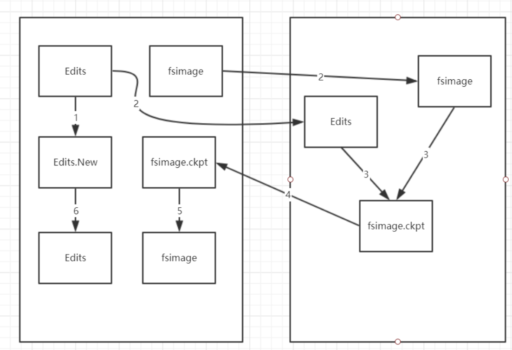
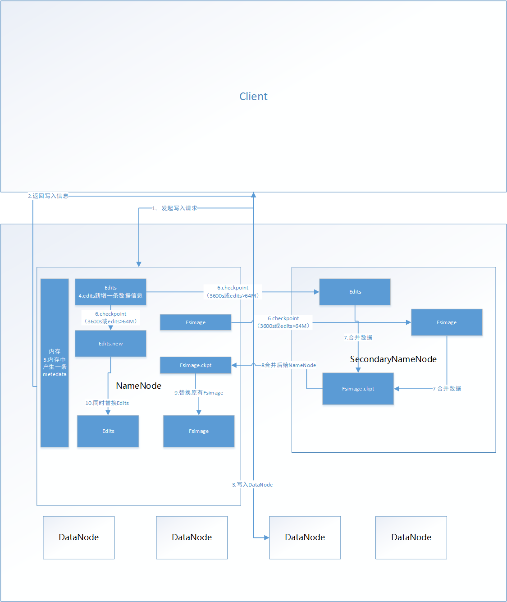
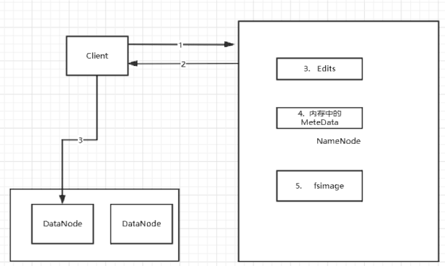
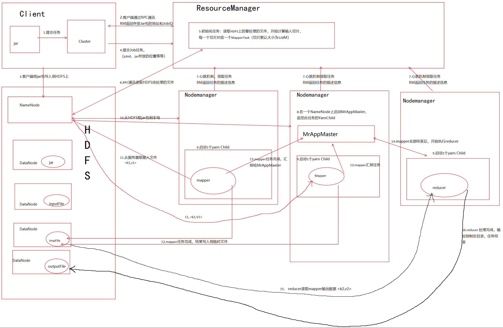

# Hadoop

## Hadoop伪分布式安装及配置

1. 需要配置好 IP及JDK，上传hadoop压缩包。解压到特定目录

2. 修改hadoop 配置文件，路径/hadoop-2.2.0/etc/hadoop

   1. 修改hadoop-env.sh 添加JDK环境变量

      ```sh
      export JAVA_HOME=/usr/java/jdk1.7.0_67
      ```

   2. 修改 core-site.xml

      ```xml
      <!-- 指定定HDFS的（NameNode）的地址 -->
      <property>
      	<name>fs.defaultFS</name>
      	<value>hdfs://node1:9000</value>
      </property>
      	<!-- 指定hadoop运行时产生文件的存储目录 -->
      <property>
      	<name>hadoop.tmp.dir</name>
      	<value>/node/hadoop-2.2.0/tmp</value>
      </property>
      ```

   3. 修改 hdfs-site.xml 

      ```xml
      <!-- 指定HDFS副本的数量  节点数集群一般为多个-->
      <property>
          <name>dfs.replication</name>
          <value>1</value>
      </property>
      ```

   4. 修改mapred-site.xml

      ```sh
      <!-- 指定mapreduce运行在yarn上 -->
      <property>
          <name>mapreduce.framework.name</name>
          <value>yarn</value>
      </property>
      ```

   5. 修改  yarn-site.xml

      ```xml
      <!-- 指定YARN的老大（ResourceManager）的地址 -->
      <property>
      	<name>yarn.resourcemanager.hostname</name>
      	<value>node1</value>
      	</property>
      <!-- mapreduce获取数据的方式 shuffle-->
      <property>
          <name>yarn.nodemanager.aux-services</name>
          <value>mapreduce_shuffle</value>
      </property>
      ```

3. 将hadoop配置到系统环境变量中 并刷新缓存

   ```bash
   vi /etc/profile 	
   export HADOOP_HOME=/itcast/hadoop-2.4.1
   export PATH=$PATH:$JAVA_HOME/bin:$HADOOP_HOME/bin:$HADOOP_HOME/sbin
   source /etc/profile
   ```

4. 格式化namenode（是对namenode进行初始化）

   ```bash
   hdfs namenode -format (hadoop namenode -format)
   ```

5. 启动hadoop

   ```bash
   先启动HDFS
   start-dfs.sh
   再启动YARN
   start-yarn.sh
   ```

6. 验证

   ```tex
     jps
   //结果如下6条数据
   27408 NameNode
   28218 Jps
   27643 SecondaryNameNode
   28066 NodeManager
   27803 ResourceManager
   27512 DataNode
   ```

7. 登陆网页http://node1:50070 （HDFS管理界面）http://node1:8088 （MR管理界面）验证

8. 配置SSH免登陆

   ```tex
   #进入到ROOT的home目录
   	cd ~/.ssh
   执行   ssh-keygen -t rsa 
   执行完这个命令后，会生成两个文件id_rsa（私钥）、id_rsa.pub（公钥）
   
   	拷贝公钥到文件~/.ssh/authorized_keys
   	cp id_rsa.pub authorized_keys
                 或者
   	ssh-copy-id node1
   
   
   A机想SSH免登陆B机 
      A机生成秘钥 
      A机把公钥发给B机     ssh-copy-id  B机IP
   ```

9. 简单的MapReduce测试

   ```sh
   1.hadoop安装目录下/node/hadoop-2.2.0/share/hadoop/mapreduce有很多jar包
                      hadoop-mapreduce-examples-2.2.0.jar 是一个样例jar包
    
   2. 文件计数，统计每个单词在文档中存在的次数
   hadoop  jar /node/hadoop-2.2.0/share/hadoop/mapreduce/hadoop-mapreduce-examples-2.2.0.jar   methodname 文件名  返回结果文件名
   一般文件和结果文件都保存在hdfs上 
   
   例如： 
   hadoop jar hadoop-mapreduce-examples-2.2.0.jar wordcount hdfs://node1:9000/words hdfs://node1:9000/wordscount
   ```

## 远程调试

### JPDA 简介

​			Sun Microsystem 的 Java Platform Debugger Architecture (JPDA) 技术是一个多层架构，使您能够在各种环境中轻松调试 Java 应用程序。JPDA 由两个接口（分别是 JVM Tool Interface 和 JDI）、一个协议（Java Debug Wire Protocol）和两个用于合并它们的软件组件（后端和前端）组成。它的设计目的是让调试人员在任何环境中都可以进行调试。

### JDWP 设置

​			JVM本身就支持远程调试，Eclipse也支持JDWP，只需要在各模块的JVM启动时加载以下参数：

- dt_socket            表示使用套接字传输。

- address=8000    JVM在8000端口上监听请求，这个设定为一个不冲突的端口即可。

- server=y             y表示启动的JVM是被调试者。如果为n，则表示启动的JVM是调试器。

- suspend=y        y表示启动的JVM会暂停等待，直到调试器连接上才继续执行。

  suspend=n      则JVM不会暂停等待。

- 需要在$HADOOP_HOME/etc/hadoop/hadoop-env.sh文件的最后添加你想debug的进程
  - #远程调试namenode
    export HADOOP_NAMENODE_OPTS="-agentlib:jdwp=transport=dt_socket,address=8888,server=y,suspend=y"
  - #远程调试datanode
    export HADOOP_DATANODE_OPTS="-agentlib:jdwp=transport=dt_socket,address=9888,server=y,suspend=y"
  - #远程调试RM
    export YARN_RESOURCEMANAGER_OPTS="-agentlib:jdwp=transport=dt_socket,address=10888,server=y,suspend=y"
  - #远程调试NM
    export YARN_NODEMANAGER_OPTS="-agentlib:jdwp=transport=dt_socket,address=10888,server=y,suspend=y"

## HDFS

### RPC通讯

​				RPC——远程过程调用协议，它是一种通过网络从远程计算机程序上请求服务，而不需要了解底层网络技术的协议。RPC协议假定某些传输协议的存在，如TCP或UDP，为通信程序之间携带信息数据。在OSI网络通信模型中，RPC跨越了传输层和应用层。RPC使得开发包括网络分布式多程序在内的应用程序更加容易。

​				RPC采用客户机/服务器模式。请求程序就是一个客户机，而服务提供程序就是一个服务器。首先，客户机调用进程发送一个有进程参数的调用信息到服务进程，然后等待应答信息。在服务器端，进程保持睡眠状态直到调用信息的到达为止。当一个调用信息到达，服务器获得进程参数，计算结果，发送答复信息，然后等待下一个调用信息，最后，客户端调用进程接收答复信息，获得进程结果，然后调用执行继续进行。

###  NameNode

- metedata：元数据 （存放在namenode的内存中）

- fsimage:元数据镜像文件。存储某一时段NameNode内存元数据信息。

- edits:操作日志文件。

- fstime:保存最近一次checkpoint的时间

  

1. Namenode始终在内存中保存metedata，用于处理“读请求”
2.  有“写请求”到来时，namenode会首先写editlog（数据信息）到磁盘，即向edits文件中写日志，成功返回后，才会修改内存（添加元数据信息metedata），并且向客户端返回
3. Hadoop会维护一个fsimage文件，也就是namenode中metedata的镜像，但是fsimage不会随时与namenode内存中的metedata保持一致（2.0以后实时同步），而是每隔一段时间通过合并edits文件来更新内容。Secondary namenode就是用来合并fsimage和edits文件来更新NameNode的metedata的。

### SecondaryNameNode

​			只有hadoop1.0 和2.0的伪分布式才会有secondryNameNode，secondryNameNode是HA的一个解决方案。但不支持热备。配置即可。

**SecondaryNameNode协助同步Fsimage**

​	从NameNode上下载元数据信息（fsimage,edits），然后把二者合并，生成新的fsimage，在本地保存，并将其推送到NameNode，替换旧的fsimage.默认在安装在NameNode节点上，但这样...不安全！



1. NameNode  生成Edits.new 文件  与edits 相同，此后dataNode的日志信息会记录在edits.new中
2.  secondaryNameNode 去NameNode取到edits与fsimage
3.  secondaryNameNode 将edits与fsimage在内存中进行合并（元数据信息的合并），生成新的fsimage
4. secondaryNameNode 将 合并完成的fsimage发给NameNode 
5. NameNode 用新的fsimage替换以前的fsimage 完成 fsimage的更新
6. NameNode中的日志文件Edits.new  替换掉原来的Edits ,后续日志信息全部写入Edits中，整个过程结束。



- 存入DataNode的文件都是以block块的形式存在，block块大小默认为128M，
- NameNode中元数据信息metedata 的数据形式如下：
  - test/a.log, 3 ,{blk_1,blk_2}, [{blk_1:[h0,h1,h3]},{blk_2:[h0,h2,h4]}]
  - 文件名，文件数量，文件块名称，文件块名及对应存储的datanode名字

### DataNode

​		DataNode提供真实文件数据的存储服务。文件块（block）：最基本的存储单位。对于文件内容而言，一个文件的长度大小是size，那么从文件的０偏移开始，按照固定的大小，顺序对文件进行划分并编号，划分好的每一个块称一个Block。HDFS默认Block大小是128MB，以一个256MB文件，共有256/128=2个Block.不同于普通文件系统的是，HDFS中，如果一个文件小于一个数据块的大小，并不占用整个数据块存储空间。Replication。多复本。默认是三个。

### 客户端写入文件流程图



1. 客户端发起写入请求到 NameNode
2. NameNode返回信息到和客户端，告知写入DataNode的位置等信息
3. 客户端将信息写入DataNode，同时，NameNode的Edits日志信息中会保存一条日志信息  （写入成功/失败信息）
4. 若写入成功，NameNode的内存中会生成一条元数据信息meteData
5. 这条写入信息保存在Edits与内存中， checkpoint后，同步至fsimage中  ，同步过程见SecondaryNameNode协助同步Fsimage流程图
6. checkpoint 的时机
   1. fs.checkpoint.period 指定两次checkpoint的最大时间间隔，默认3600秒。 
   2. fs.checkpoint.size    规定edits文件的最大值，一旦超过这个值则强制checkpoint，不管是否到达最大时间间隔。默认大小是64M。

## MapReduce

### MapReduce执行过程

#### 执行MR的命令：

​	hadoop jar <jar在linux的路径> <main方法所在的类的全类名> <参数>

#### MR执行流程

1. 客户端提交一个mr的jar包给JobClient(提交方式：hadoop jar ...)
2. JobClient通过RPC和ResourceManager进行通信，返回一个存放jar包的地址（HDFS）和jobId
3. client将jar包写入到HDFS当中(path = hdfs上的地址 + jobId)
4. 开始提交任务(任务的描述信息，不是jar, 包括jobid，jar存放的位置，配置信息等等)
5. NodeManeger进行初始化任务
6. 读取HDFS上的要处理的文件，开始计算输入分片，每一个分片对应一个Mapper
7. NodeManager通过心跳机制领取任务（任务的描述信息）
8. NodeManager下载所需的jar，配置文件等
9. NodeManager启动一个yran child子进程，用来执行具体的任务（Mapper或Reducer）
10. 将结果写入到HDFS当中

#### 流程图



## Hadoop集群模式部署

### 前期准备

1. 修改Linux主机名

2. 修改IP

3. 修改主机名和IP的映射关系

   ```
   ######注意######如果你们公司是租用的服务器或是使用的云主机（如华为用主机、阿里云主机等）
   /etc/hosts里面要配置的是内网IP地址和主机名的映射关系	
   ```

4. 关闭防火墙

5. ssh免登陆 

6. 安装JDK，配置环境变量等

7. 集群规划：

   ```tex
   主机名		   IP				安装的软件					运行的进程
   itcast01	192.168.1.201	jdk、hadoop					NameNode、DFSZKFailoverController
   itcast02	192.168.1.202	jdk、hadoop					NameNode、DFSZKFailoverController
   itcast03	192.168.1.203	jdk、hadoop					ResourceManager
   itcast04	192.168.1.204	jdk、hadoop、zookeeper		DataNode、NodeManager、JournalNode、QuorumPeerMain
   itcast05	192.168.1.205	jdk、hadoop、zookeeper		DataNode、NodeManager、JournalNode、QuorumPeerMain
   itcast06	192.168.1.206	jdk、hadoop、zookeeper		DataNode、NodeManager、JournalNode、QuorumPeerMain
   ```

8. 说明：

   1. 在hadoop2.0中通常由两个NameNode组成，一个处于active状态，另一个处于standby状态。Active NameNode对外提供服务，而Standby NameNode则不对外提供服务，仅同步active namenode的状态，以便能够在它失败时快速进行切换。
   2. hadoop2.0官方提供了两种HDFS HA的解决方案，一种是NFS，另一种是QJM。这里我们使用简单的QJM。在该方案中，主备NameNode之间通过一组JournalNode同步元数据信息，一条数据只要成功写入多数JournalNode即认为写入成功，通常配置奇数个JournalNode
   3. 这里还配置了一个zookeeper集群，用于ZKFC（DFSZKFailoverController）故障转移，当Active NameNode挂掉了，会自动切换Standby NameNode为standby状态	

### 安装步骤

1. 安装配置zooekeeper集群

   1. 解压

      ```bash
      tar -zxvf zookeeper-3.4.5.tar.gz -C /itcast/
      ```

   2. 修改配置

      ```bash
      cd /itcast/zookeeper-3.4.5/conf/
      cp zoo_sample.cfg zoo.cfg
      vim zoo.cfg
      ##修改：dataDir=/itcast/zookeeper-3.4.5/tmp
      ##在最后添加：
      server.1=itcast04:2888:3888
      server.2=itcast05:2888:3888
      server.3=itcast06:2888:3888
      ##保存退出
      ##然后创建一个tmp文件夹
      mkdir /itcast/zookeeper-3.4.5/tmp
      再创建一个空文件
      touch /itcast/zookeeper-3.4.5/tmp/myid
      最后向该文件写入ID
      echo 1 > /itcast/zookeeper-3.4.5/tmp/myid
      ```

   3. 将配置好的zookeeper拷贝到其他节点

      ```bash
      ##(首先分别在itcast05、itcast06根目录下创建一个itcast目录：mkdir /itcast)
      scp -r /itcast/zookeeper-3.4.5/ itcast05:/itcast/
      scp -r /itcast/zookeeper-3.4.5/ itcast06:/itcast/
      ##注意：修改itcast05、itcast06对应/itcast/zookeeper-3.4.5/tmp/myid内容
      ##itcast05：
      echo 2 > /itcast/zookeeper-3.4.5/tmp/myid
      ##itcast06：
      echo 3 > /itcast/zookeeper-3.4.5/tmp/myid
      ```

2. 安装配置hadoop集群

   1. 解压

      ```bash
      tar -zxvf hadoop-2.2.0.tar.gz -C /itcast/
      ```

   2. 配置HDFS（hadoop2.0所有的配置文件都在$HADOOP_HOME/etc/hadoop目录下）

      ```bash
      #将hadoop添加到环境变量中
      vim /etc/profile
      export JAVA_HOME=/usr/java/jdk1.7.0_55
      export HADOOP_HOME=/itcast/hadoop-2.2.0
      export PATH=$PATH:$JAVA_HOME/bin:$HADOOP_HOME/bin
      
      #hadoop2.0的配置文件全部在$HADOOP_HOME/etc/hadoop下
      cd /itcast/hadoop-2.2.0/etc/hadoop
      ```

      1. 修改hadoo-env.sh

         1. export JAVA_HOME=/usr/java/jdk1.7.0_55

      2. 修改core-site.xml

         ```xml
         <configuration>
             <!-- 指定hdfs的nameservice为ns1 -->
             <property>
                 <name>fs.defaultFS</name>
                 <value>hdfs://ns1</value>
             </property>
             <!-- 指定hadoop临时目录 -->
             <property>
                 <name>hadoop.tmp.dir</name>
                 <value>/node/hadoop-2.2.0/tmp</value>
             </property>
             <!-- 指定zookeeper地址 -->
             <property>
                 <name>ha.zookeeper.quorum</name>
                 <value>cluster5:2181,cluster6:2181,cluster7:2181</value>
             </property>
         </configuration>
         ```

      3. 修改hdfs-site.xml

         ```xml
         
         <configuration>
         				<!--指定hdfs的nameservice为ns1，需要和core-site.xml中的保持一致 -->
         				<property>
         					<name>dfs.nameservices</name>
         					<value>ns1</value>
         				</property>
         				<!-- ns1下面有两个NameNode，分别是nn1，nn2 -->
         				<property>
         					<name>dfs.ha.namenodes.ns1</name>
         					<value>nn1,nn2</value>
         				</property>
         				<!-- nn1的RPC通信地址 -->
         				<property>
         					<name>dfs.namenode.rpc-address.ns1.nn1</name>
         					<value>cluster1:9000</value>
         				</property>
         				<!-- nn1的http通信地址 -->
         				<property>
         					<name>dfs.namenode.http-address.ns1.nn1</name>
         					<value>cluster1:50070</value>
         				</property>
         				<!-- nn2的RPC通信地址 -->
         				<property>
         					<name>dfs.namenode.rpc-address.ns1.nn2</name>
         					<value>cluster2:9000</value>
         				</property>
         				<!-- nn2的http通信地址 -->
         				<property>
         					<name>dfs.namenode.http-address.ns1.nn2</name>
         					<value>cluster2:50070</value>
         				</property>
         				<!-- 指定NameNode的元数据在JournalNode上的存放位置 -->
         				<property>
         					<name>dfs.namenode.shared.edits.dir</name>
         					<value>qjournal://cluster5:8485;cluster6:8485;cluster7:8485/ns1</value>
         				</property>
         				<!-- 指定JournalNode在本地磁盘存放数据的位置 -->
         				<property>
         					<name>dfs.journalnode.edits.dir</name>
         					<value>/node/hadoop-2.2.0/journal</value>
         				</property>
         				<!-- 开启NameNode失败自动切换 -->
         				<property>
         					<name>dfs.ha.automatic-failover.enabled</name>
         					<value>true</value>
         				</property>
         				<!-- 配置失败自动切换实现方式 -->
         				<property>
         					<name>dfs.client.failover.proxy.provider.ns1</name>
         					<value>org.apache.hadoop.hdfs.server.namenode.ha.ConfiguredFailoverProxyProvider</value>
         				</property>
         				<!-- 配置隔离机制方法，多个机制用换行分割，即每个机制暂用一行-->
         				<property>
         					<name>dfs.ha.fencing.methods</name>
         					<value>
         						sshfence
         						shell(/bin/true)
         					</value>
         				</property>
         				<!-- 使用sshfence隔离机制时需要ssh免登陆 -->
         				<property>
         					<name>dfs.ha.fencing.ssh.private-key-files</name>
         					<value>/root/.ssh/id_rsa</value>
         				</property>
         				<!-- 配置sshfence隔离机制超时时间 -->
         				<property>
         					<name>dfs.ha.fencing.ssh.connect-timeout</name>
         					<value>30000</value>
         				</property>
         			</configuration>
         ```

      4. 修改mapred-site.xml

         ```yaml
         <configuration>
         <!-- 指定mr框架为yarn方式 -->
             <property>
                 <name>mapreduce.framework.name</name>
                 <value>yarn</value>
             </property>
         </configuration>	
         ```

      5. 修改yarn-site.xml

         ```yaml
         <configuration>
         	<!-- 指定resourcemanager地址 -->
             <property>
                 <name>yarn.resourcemanager.hostname</name>
                 <value>itcast03</value>
             </property>
             <!-- 指定nodemanager启动时加载server的方式为shuffle server -->
             <property>
                 <name>yarn.nodemanager.aux-services</name>
                 <value>mapreduce_shuffle</value>
             </property>
         </configuration>
         ```

      6. 修改slaves

         ```tex
         (slaves是指定子节点的位置，因为要在itcast01上启动HDFS、在itcast03启动yarn，所以itcast01上的slaves文件指定的是datanode的位置，itcast03上的slaves文件指定的是nodemanager的位置)
         itcast04
         itcast05
         itcast06
         ```

      7. 配置免密码登陆

         ```bash
         #首先要配置itcast01到itcast02、itcast03、itcast04、itcast05、itcast06的免密码登陆
         #在itcast01上生产一对钥匙
         ssh-keygen -t rsa
         #将公钥拷贝到其他节点，包括自己
         ssh-coyp-id itcast01
         ssh-coyp-id itcast02
         ssh-coyp-id itcast03
         ssh-coyp-id itcast04
         ssh-coyp-id itcast05
         ssh-coyp-id itcast06
         
         #配置itcast03到itcast04、itcast05、itcast06的免密码登陆
         #在itcast03上生产一对钥匙
         ssh-keygen -t rsa
         #将公钥拷贝到其他节点
         ssh-coyp-id itcast04
         ssh-coyp-id itcast05
         ssh-coyp-id itcast06
         
         #注意：两个namenode之间要配置ssh免密码登陆，别忘了配置itcast02到itcast01的免登陆
         在itcast02上生产一对钥匙
         ssh-keygen -t rsa
         ssh-coyp-id -i itcast01		
         ```

   3. 将配置好的hadoop拷贝到其他节点

      ```bash
      scp -r /itcast/ itcast02:/
      scp -r /itcast/ itcast03:/
      scp -r /itcast/hadoop-2.2.0/ root@itcast04:/itcast/
      scp -r /itcast/hadoop-2.2.0/ root@itcast05:/itcast/
      scp -r /itcast/hadoop-2.2.0/ root@itcast06:/itcast/
      ```

   4. 启动zookeeper集群（分别在itcast04、itcast05、itcast06上启动zk）

      ```bash
      ###注意：严格按照下面的步骤
      cd /itcast/zookeeper-3.4.5/bin/
      ./zkServer.sh start
      #查看状态：一个leader，两个follower
      ./zkServer.sh status
      ```

   5. 启动journalnode

      ```bash
      #（在itcast01上启动所有journalnode，注意：是调用的hadoop-daemons.sh这个脚本，注意是复数s的那个脚本）
      cd /itcast/hadoop-2.2.0
      sbin/hadoop-daemons.sh start journalnode
      #运行jps命令检验，itcast04、itcast05、itcast06上多了JournalNode进程
      ```

   6. 格式化HDFS

      ```bash
      #在itcast01上执行命令:
      hdfs namenode -format
      #格式化后会在根据core-site.xml中的hadoop.tmp.dir配置生成个文件，这里我配置的是/itcast/hadoop-2.2.0/tmp，然后将/itcast/hadoop-2.2.0/tmp拷贝到itcast02的/itcast/hadoop-2.2.0/下。
      scp -r tmp/ cluster2:/node/hadoop-2.2.0/
      ```

   7. 格式化ZK（itcast01上执行)	

      ```bash
      hdfs zkfc -formatZK
      ```

   8. 启动HDFS （itcast01上执行）

      ```bash
      sbin/start-dfs.sh
      ```

   9. 启动YARN（itcast03上执行）

      ```bash
      (#####注意#####：是在itcast03上执行start-yarn.sh，把namenode和resourcemanager分开是因为性能问题，因为他们都要占用大量资源，所以把他们分开了，他们分开了就要分别在不同的机器上启动)
      sbin/start-yarn.sh
      ```

### 验证

1. 浏览器访问

   ```tex
   http://192.168.1.201:50070
   		NameNode 'itcast01:9000' (active)
   http://192.168.1.202:50070
   		NameNode 'itcast02:9000' (standby)
   ```

2. 验证HDFS HA

   ```tex
   1. 首先向hdfs上传一个文件
   	hadoop fs -put /etc/profile /profile
   	hadoop fs -ls /
   2. 然后再kill掉active的NameNode
   	kill -9 <pid of NN>
   3. 通过浏览器访问：http://192.168.1.202:50070
   	NameNode 'itcast02:9000' (active)
   	这个时候itcast02上的NameNode变成了active
   4. 在执行命令：
   	hadoop fs -ls /
   	-rw-r--r--   3 root supergroup       1926 2014-02-06 15:36 /profile
   	刚才上传的文件依然存在！！！
   5. 手动启动那个挂掉的NameNode
   	sbin/hadoop-daemon.sh start namenode
   	通过浏览器访问：http://192.168.1.201:50070
   	NameNode 'itcast01:9000' (standby)
   ```

3. 验证YARN：

   ```bash
   ##运行一下hadoop提供的demo中的WordCount程序：
   hadoop jar share/hadoop/mapreduce/hadoop-mapreduce-examples-2.2.0.jar wordcount /profile /out
   ```