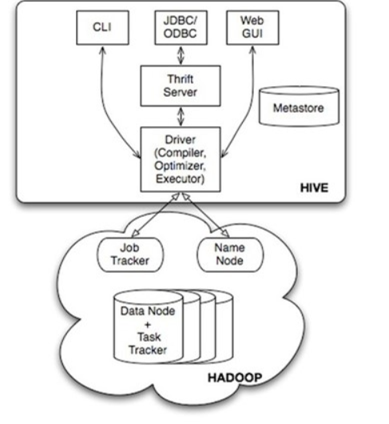

# Hive

## 简介

​			Hive是基于Hadoop的一个数据仓库工具，用来进行数据提取、转化、加载，这是一种可以存储、查询和分析存储在Hadoop中的大规模数据的机制。hive数据仓库工具能将结构化的数据文件映射为一张数据库表，并提供SQL查询功能，能将SQL语句转变成MapReduce任务来执行。

​			Hive不适合用于联机(online)事务处理，也不提供实时查询功能。它最适合应用在基于大量不可变数据的批处理作业。

​			Hive的特点包括：可伸缩（在Hadoop的集群上动态添加设备）、可扩展、容错、输入格式的松散耦合。

## 安装与配置

Hive只在一个节点上安装即可,步骤如下

1. 上传tar包

2. 解压

3. 配置mysql metastore（切换到root用户）,设置mysql允许远程连接

4. 配置hive

   1. cp hive-default.xml.template hive-site.xml 

   2. hive-site.xml（删除所有内容 保留configuration）添加如下内容：

      ```xml
      
      <property>
          <name>javax.jdo.option.ConnectionURL</name>
          <value>jdbc:mysql://app01:3306/hive?createDatabaseIfNotExist=true</value>
          <description>JDBC connect string for a JDBC metastore</description>
      </property>
      <property>
        <name>javax.jdo.option.ConnectionDriverName</name>
        <value>com.mysql.jdbc.Driver</value>
        <description>Driver class name for a JDBC metastore</description>
      </property>
      
      <property>
        <name>javax.jdo.option.ConnectionUserName</name>
        <value>root</value>
        <description>username to use against metastore database</description>
      </property>
      
      <property>
        <name>javax.jdo.option.ConnectionPassword</name>
        <value>123</value>
        <description>password to use against metastore database</description>
      </property>
      ```

## Hive体系结构

下面hadoop1.x版本，2.x版本后 hive运行在yarn上 jobtracker=resourceManager ，tasktracker=NodeManager



1. 用户接口： 主要有三个：CLI，JDBC/ODBC和 WebUI
      
      1. CLI，即Shell命令行（最常用）
      2. JDBC/ODBC 是 Hive 的Java，与使用传统数据库JDBC的方式类似（存在部分问题）
      3. WebGUI是通过浏览器访问 Hive
      
2. Hive 将元数据存储在数据库中(metastore)，目前只支持 mysql、derby。oracle

    1. Hive 中的元数据包括表的名字，表的列和分区及其属性，表的属性（是否为外部表等），表的数据所在目录等
    2. derby数据库是Hive自带的数据库metastore，但是缺陷很大（同目录只允许一个hive进程，不同目录运行hive数据不共用）derby数据保存在当前目录的metastore_db中
    3. 实际应用中，一般使用mysql作为Hive的metastore,Oracle价格昂贵大材小用（使用oracle不仅需要修改hive-site.xml),需要修改hive-metastore-0.13.0.jar中的一个配置，将LONGVARCHAR改成CLOB类型，否则Oracle会报错

3. 解释器、编译器、优化器

  ​	完成 HQL 查询语句从词法分析、语法分析、编译、优化以及查询计划（plan）的生成。生成的查询计划存储在 HDFS 中，并在随后有 MapReduce 调用执行

4. Hive 的数据存储在 HDFS 中，大部分的查询由 MapReduce 完成

  1. 包含 * 的查询，比如 select * from table 不会生成 MapRedcue 任务
  2. select count(*) from table; 会产生MapReduce任务

## MetaStore

​		元数据存储在数据库中(metastore)，目前支持 mysql、derby、oracle。

- Hive 中的元数据包括表的名字，表的列和分区及其属性，表的属性（是否为外部表等），表的数据所在目录等。

- derby数据库是Hive自带的数据库metastore，但是缺陷很大（同目录只允许一个hive进程，不同目录运行hive数据不共用），	 derby数据保存在当前目录的metastore_db中
- 实际应用中，一般使用mysql作为Hive的metastore,Oracle价格昂贵大材小用（使用oracle不仅需要修改hive-site.xml），需要修改hive-metastore-0.13.0.jar中的一个配置，将LONGVARCHAR改成CLOB类型，否则Oracle会报错

- TBLS 表维护表名，表类型等
- SDS 维护到表所在的目录，分区表所在目录（当往表所在的目录中添加文件时==往表中load数据

## HiveQL

1. 创建内部表---指定分隔符 '\t'   （先有表后有数据）

   ```sql
   create table trade_detail(id bigint, account string, income double) row format delimited fields terminated by '\t';
   ```

2. 创建外部表,指定分隔符 '\t' 指定HDFS上的目录（先有数据后有表）若目录不存在则会创建

   ```sql
   create external table td_user(id bigint,  name string) row format delimited fields terminated by '\t' location '/data';
   ```

3. 区别：

   在Hive上有两种类型的表，一种是Managed Table，另一种是External Table。它俩的主要区别在于：当我们drop表时，Managed Table会同时删去data和meta data，而External Table只会删meta data。

4. 创建分区表

   ```sql
   create table td_part(id bigint, account string, income double) partitioned by (logdate string) row format delimited fields terminated by '\t';
   ```

5. 将mysq当中的数据直接导入到hive当中

   ```bash
   sqoop import --connect jdbc:mysql://192.168.1.10:3306/itcast --username root --password 123 --table trade_detail --hive-import --hive-overwrite --hive-table trade_detail --fields-terminated-by '\t'
   sqoop import --connect jdbc:mysql://192.168.1.10:3306/itcast --username root --password 123 --table user_info --hive-import --hive-overwrite --hive-table user_info --fields-terminated-by '\t'
   ```

6. 创建一个result表保存前一个sql执行的结果

   ```sql
   create table result row format delimited fields terminated by '\t' as select t2.account, t2.name, t1.income, t1.expenses, t1.surplus from user_info t2 join (select account, sum(income) as income, sum(expenses) as expenses, sum(income-expenses) as surplus from trade_detail group by account) t1 on (t1.account = t2.account);
   	
   create table user (id int, name string) row format delimited fields terminated by '\t'
   ```

7. 将本地文件系统上的数据导入到HIVE当中

   ```bash
   load data local inpath '/root/user.txt' into table user;
   ```

8. 创建外部表

   ```sql
   create external table stubak (id int, name string) row format delimited fields terminated by '\t' location '/stubak';
   ```

9. 创建分区表,普通表和分区表区别：有大量数据增加的需要建分区表

   ```hql
   create table book (id bigint, name string) partitioned by (pubdate string) row format delimited fields terminated by '\t'; 
   
   ```

10. 分区表加载数据

    ```sql
    load data local inpath './book.txt' overwrite into table book partition (pubdate='2010-08-22');
    ```

## UDF用户自定义函数

​			编写自定义函数，要继承org.apache.hadoop.hive.ql.exec.UDF类，实现evaluate 方法。返回参数应该是HDFS数据流参数，如Text  LongWriteable等

**自定义函数调用过程：**

1. 添加jar包（在hive命令行里面执行）
   hive> add jar /root/NUDF.jar;

2. 创建临时函数
   hive> create temporary function getNation as 'cn.itcast.hive.udf.NationUDF';

3. 调用
   hive> select id, name, getNation(nation) from beauty;

4. 将查询结果保存到HDFS中
   hive> create table result row format delimited fields terminated by '\t' as select * from beauty order by id desc;	
   hive> select id, getAreaName(id) as name from tel_rec;


   create table result row format delimited fields terminated by '\t' as select id, getNation(nation) from beauties;