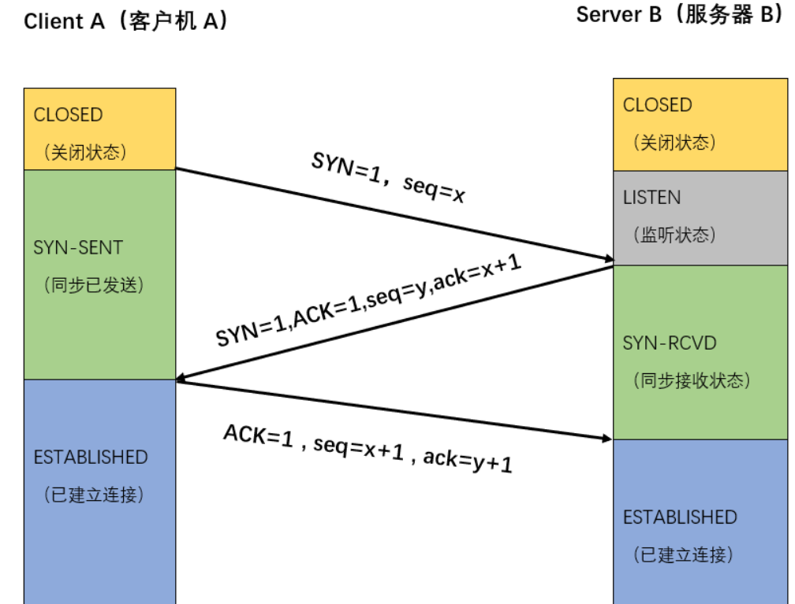

# 高并发通讯场景

1. 反向代理服务器Nginx 与 应用服务器之间的http高并发通讯（请求转发，心跳）
2. 微服务网关与微服务之间的http高并发通讯
3. 分布式微服务之间的RPC远程调用（Open Feign通讯）
4. 客户端rest接口服务的http高并发通讯

# TCP连接

## TCP四层模型与OSI七层模型

### TCP的报文格式

- 源端口号、目的端口号 ：即发送方或者接收方的port ，故计算机端口号为2^16个
- TCP序列 Seq 、TCP确认序号Ack：发送方seq +包净荷 = 接收方 ack
- 控制位 URG ACK PSH PST SYN FIN 
  - URG:  紧急标识 1 =紧急    默认 0
  - ACK ：开始建立连接时 ACK=0，SYN=1 ；建立连接后，发送的报文ACK位置必须是1 ；
  - PSH： 推送标识 push  接收后立即推送给上层  默认0
  - RST： reset 重置标识，拒绝标识  默认0
  - SYN:   syn=1 ack=0 请求连接；syn =1 ack=1 同意连接；syn=0，ack=1 通讯报文。
  - FIN： 断开连接时的报文 FIN=1 请求释放报文。

## TCP三次握手

1. **第一次握手 ：SYN=1 ，Seq=x**

   客户端（Client）向服务器（Server）发送一个SYN段(在 TCP 标头中 SYN 位字段为 1 的 TCP/IP 数据包)，该段中也包含一个客户端的初始序列号 seq = x。

2. **第二次握手 SYN=1 Seq =y   ACK =1  ack = x+1**

   服务器端返回一个 SYN +ACK 段(在 TCP 标头中SYN和ACK位字段都为 1 的 TCP/IP 数据包)，该段中包含服务器的初始序列号(Sequence number = y)。同时使 Acknowledgment number = x + 1来表示确认已收到客户端的 SYN段(Sequence number = y)。

3. **第三次握手  SYN=0 seq = x+1 ACK=1  ack=y+1**

   客户端给服务器响应一个ACK段(在 TCP 标头中 ACK 位字段为 1 的 TCP/IP 数据包)（SYN已变为0）, 该段中使 Acknowledgment number = y+ 1来表示确认已收到服务器的 SYN段(Sequence number = y)，自己的序列号则是变成seq=x+1。

## TCP四次挥手

1. **第一次挥手：**
   主动断开方（客户端，服务的都可以）向对方发送一个FIN结束请求报文，并设置序列号和确认号，随后主动断开方进入FIN_WAIT1状态，这表示主动断开方已经没有业务数据要发给对方了，准备关闭SOCKET连接了。
2. **第二次挥手：**
   被动断开方收到FIN断开请求后会发送一个ACK响应报文，表明同意断开请求。随后被动断开方就进入CLOSE-WAIT状态（等待关闭状态），此时若被动断开方还有数据要发送给主动方，主动方还会接受。被动方会持续一段时间。
   主动方收到ACK报文后，由FIN_WAIT_1转换成FIN_WAIT_2状态。
3. **第三次挥手：**
   被动断开方的CLOSE-WAIT（等待关闭）结束后，被动方会向主动方发送一个FIN+ACK报文
   表示被动方的数据都发完了。然后被动方进入LAST_ACK状态。
4. **第四次挥手：**
   主动断开方收到FIN+ACK断开响应报文后，还需进行最后确认，向被动方发送一个ACK确认报文，然后主动方进入TIME_WAIT状态，在等待完成2MSL时间后，如果期间没有收到被动方的报文，则证明对方已正常关闭，主动断开方的连接最终关闭。
   被动方在收到主动方第四次挥手发来的ACK报文后，就关闭了连接。

## TCP连接的11种状态

| 状态        | 解释                                                         |
| ----------- | ------------------------------------------------------------ |
| LISTEN      | 服务端开启监听后状态；连接监听                               |
| SYN_SENT    | 第一次握手后客户端状态；客户端底层调用connect() 发起连接请求，本地连接进入SYN_SENT 状态 |
| SYN_RCVD    | 第二次握手后服务端状态；服务端收到了连接请求，进入SYN_RCVD 状态 |
| ESTABLISHED | 第三次握手完成后，TCP连接成功建立                            |
| FIN_WAIT_1  | 第一次挥手后主动方状态；主动关闭连接的一方，调用close() 方法时，主动断开方进入FIN_WAIT_1 状态 |
| FIN_WAIT_2  | 第二次挥手后主动方状态；主动关闭连接的一方，调用close() 方法时，主动断开方进入FIN_WAIT_1 状态，然后接受到了对方的ack报文后，进入FIN_WAIT_2 状态。FIN_WAIT_2状态时，主动方不能发送报文，不会断开状态，一直等到被动方发送FIN+ACK，此时会占用系统资源。 |
| TIME_WAIT   | 第三次挥手后主动方状态；FIN_WAIT_2状态后收到被动方发送的FIN+ACK，第三次手完成。如果FIN_WAIT_1状态同时收到了FIN+ACK（第三次挥手）报文，则主动方直接进入TIME_WAIT状态，跳过FIN_WAIT_2 |
| CLOSING     | 双方同时断开连接时会出现的一种罕见状态                       |
| CLOSE_WAIT  | 第二次挥手后被动方状态；                                     |
| LAST_ACK    | 第三次挥手被动方状态；                                       |
| CLOSED      | 关闭状态                                                     |

# Http连接

## Http报文传输原理

### Http长连接的原理

# SSL/TLS协议

