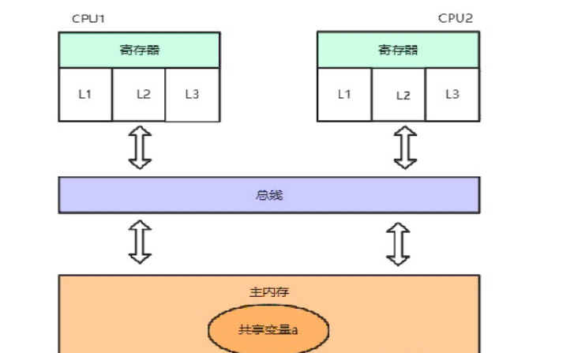
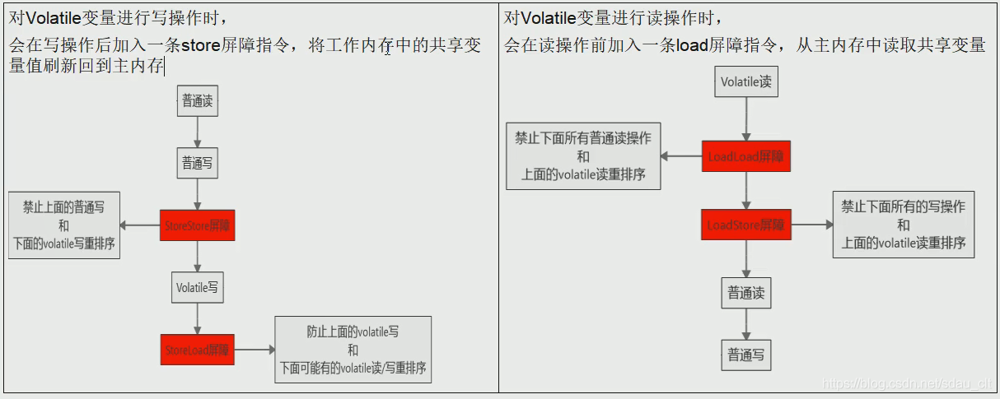
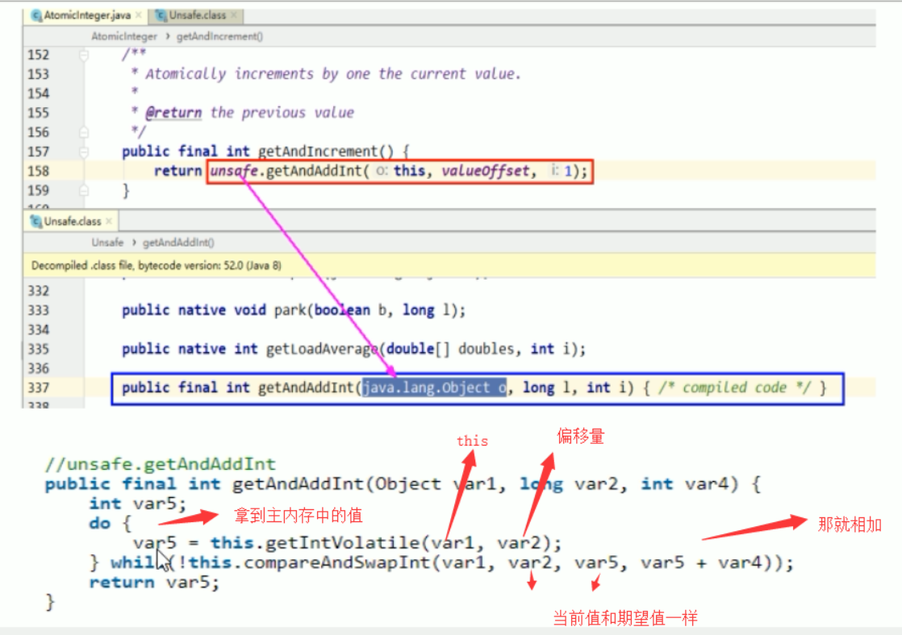
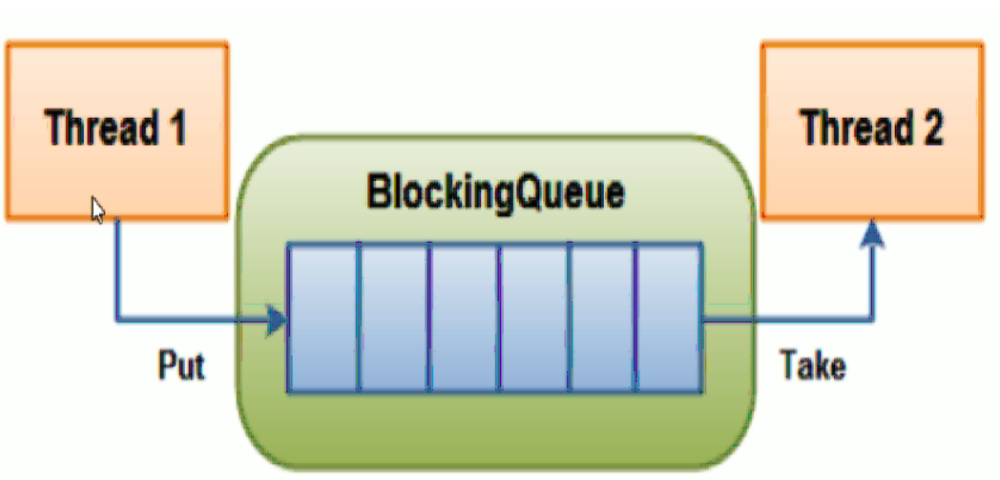
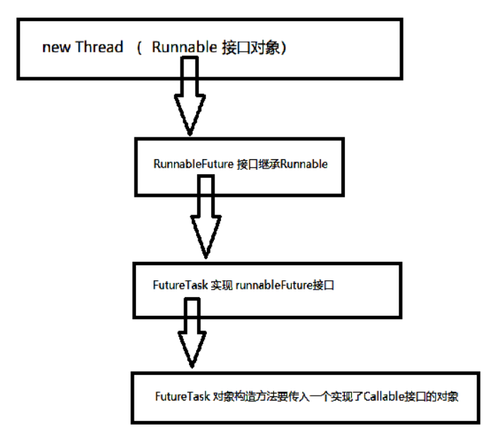
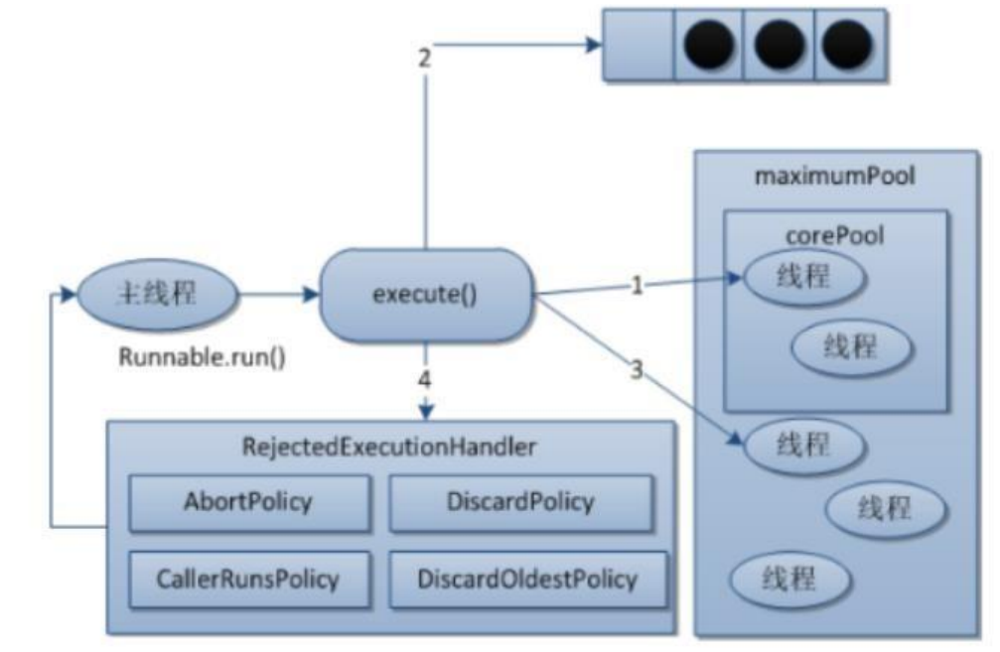

# Volatile

## 概念

​			volatile 是轻量级的同步机制。Volatile的MESI缓存一致性协议，需要不断的从主内存嗅探和CAS循环，无效的交互会导致总线带宽达到峰值。因此**不要大量使用volatile关键字**，至于什么时候使用volatile、什么时候用锁以及Syschonized都是需要根据实际场景的。

**作用**

1. **保证可见性**
2. **不保证原子性**
3. **禁止指令重排**

## 可见性

### 图解



​			当CPU1需要读取共享变量的值a时，首先会找缓存（即L1、L2、L3三级高速缓存），看看这个值是不是在L1。
很明显，缓存没办法给CPU1它想要的数据，于是只能去主内存读取共享变量的值。缓存得到共享变量的值之后，把数据交给寄存器，但是缓存留了个心眼，它把a的值存了起来，这样下次别的线程再需要a的值时，就不用再去主内存问了。

### 问题流程

**流程**

1. CPU1读取数据  a=1，    CPU1的缓存中都有数据a的副本
2. CPU2也执行读取操作，同样CPU2也有数据a=1的副本
3. CPU1修改数据 a=2，     同时CPU1的缓存以及主内存a=2
4. **CPU2再次读取a，           但是CPU2在缓存中命中数据**，此时a=1

**问题**

​		**CPU2并不知道CPU1改变了共享变量的值，因此造成了不可见问题。即CPU2不可见主内存的值**

### MESI协议

​					Intel 的MESI协议，**MESI协议保证了每个缓存中使用的共享变量的副本是一致的**。

#### 数据状态

- Modify（修改）：当缓存行中的数据被修改时，该缓存行置为M状态
- Exclusive（独占）：当只有一个缓存行使用某个数据时，置为E状态
- Shared（共享）：当其他CPU中也读取某数据到缓存行时，所有持有该数据的缓存行置为S状态
- Invalid（无效）：当某个缓存行数据修改时，其他持有该数据的缓存行置为I状态

#### 核心的思想

​			当CPU写数据时，如果发现**操作的变量是共享变量**，即在**其他CPU中也存在该变量的副本，会发出信号通知其他CPU将该变量的缓存行置为无效状态**，因此当其他CPU需要读取这个变量时，发现自己缓存中缓存该变量的缓存行是无效的，那么它就**会从内存重新读取**。而这其中，监听和通知又基于总线嗅探机制来完成。

### MESI流程

总线嗅探机制，嗅探机制其实就是一个监听器，如果是加入MESI缓存一致性协议和总线嗅探机制之后：

1. CPU1读取数据a=1，CPU1的缓存中都有数据a的副本，该缓存行置为（E）状态
2. CPU2也执行读取操作，同样CPU2也有数据a=1的副本，此时总线嗅探到CPU1也有该数据，则CPU1、CPU2两个缓存行都置为（S）状态
3. CPU1修改数据a=2，CPU1的缓存以及主内存a=2，同时CPU1的缓存行置为（S）状态，总线发出通知，CPU2的缓存行置为（I）状态
4. CPU2再次读取a，虽然CPU2在缓存中命中数据a=1，但是发现状态为（I），因此直接丢弃该数据，去主内存获取最新数据

### 总结

​			当我们使用volatile关键字修饰某个变量之后，就相当于告诉CPU：这个变量需要使用MESI和总线嗅探机制处理。从而也就保证了可见性。

## 禁止指令重排

### 概念

​			计算机在执行程序时，为了提高性能，编译器和处理器常常会对指令重排，一般分为以下三种：

​			源代码 -> 编译器优化的重排 -> 指令并行的重排 -> 内存系统的重排 -> 最终执行指令

### 指令重排序

​			在加入MESI和总线嗅探机制后，当CPU2发现当前缓存行数据无效时，会丢弃该数据，并前往主内存获取最新数据。但是这里又会产生一个问题：

​			**CPU1把数据刷回主内存是需要时间的，假如CPU2在主内存拿数据时，CPU1还没有把数据刷回来呢？**

```java
很明显，CPU2不会把资源浪费在这里傻等。它会先跳过和该数据有关的语句，继续处理后面的逻辑。
比如说如下代码：
			a = 1;
			b = 2;
			b++;
假如第一条语句需要等待CPU1数据刷新，那么CPU2可能就会先回来执行后面两条语句。因为对于CPU2来说，先执行后面两条语句不会对最终结果造成任何影响。
```

### Volatile如何禁止指令重排

Volatile实现禁止指令重排优化，从而避免了多线程环境下程序出现乱序执行的现象

#### 内存屏障

​	Memory Barrier又称内存栅栏，是一个CPU指令，它的作用有两个：

1. 保证特定操作的顺序
2. 保证某些变量的内存可见性（利用该特性实现volatile的内存可见性）

#### 工作原理

​		由于编译器和处理器都能执行指令重排的优化，如果在指令间插入一条Memory Barrier则会告诉编译器和CPU，不管什么指令都不能和这条Memory Barrier指令重排序，也就是说 通过插入内存屏障禁止在内存屏障前后的指令执行重排序优化。 内存屏障另外一个作用是刷新出各种CPU的缓存数，因此任何CPU上的线程都能读取到这些数据的最新版本。也就是过在Volatile的写和读的时候，加入屏障，防止出现指令重排的



**保证线程安全**

1. 工作内存与主内存同步延迟现象导致的可见性问题，可通过synchronized或volatile关键字解决，他们都可以使一个线程修改后的变量立即对其它线程可见
2. 对于指令重排导致的可见性问题和有序性问题可以使用volatile关键字解决，因为volatile关键字的另一个作用就是禁止重排序优化

## 不保证原子性

​		volatile 修饰的变量，多线程操作会出现写丢失，即当前线程写的能够被其他线程写覆盖。可以使用 synchronize 或者原子类来进行解决。

	volatile int a=0；
	    // 创建10个线程，线程里面进行1000次循环
	    for (int i = 0; i < 20; i++) {
	        new Thread(() -> {
	            // 里面
	            for (int j = 0; j < 1000; j++) {
	             a++
	            }
	        }, String.valueOf(i)).start();
	    }
# Synchronized有序性

​		**Synchronized无法禁止指令重排，却能保证有序性**。synchronized是Java提供的锁，可以通过他对Java中的对象加锁，并且**是一种排他的、可重入的锁。**

## as-if-serial语义

​		为了进一步提升计算机各方面能力，在硬件层面做了很多优化，如处理器优化和指令重排等，但是这些技术的引入就会导致有序性问题。我们也知道，**最好的解决有序性问题的办法，就是禁止处理器优化和指令重排，就像volatile中使用内存屏障一样**。但是，虽然很多硬件都会为了优化做一些重排，但是在Java中，**不管怎么排序，都不能影响单线程程序的执行结果**。这就是as-if-serial语义，所有**硬件优化的前提都是必须遵守as-if-serial语义**。

​			as-if-serial把**单线程**程序保护了起来，遵守as-if-serial语义的编译器，runtime 和处理器共同为编写单线程程序的程序员创建了一个幻觉：单线程程序是按程序的顺序来执行的。as-if-serial语义使单线程程序员无需担心重排序会 干扰他们，也无需担心内存可见性问题。

## synchronized为什么能保证有序性

- synchronized是Java提供的锁，可以通过他对Java中的对象加锁，并且**是一种排他的、可重入的锁。**
  - 当某个线程执行到一段被synchronized修饰的代码之前，会先进行加锁，执行完之后再进行解锁。在加锁之后，解锁之前，其他线程是无法再次获得锁的，只有这条加锁线程可以重复获得该锁。
- synchronized通过排他锁的方式就保证了同一时间内**，被synchronized修饰的代码是单线程执行的**。所以呢，这就满足了as-if-serial语义的一个关键前提，那就是**单线程**，因为有as-if-serial语义保证，单线程的有序性就天然存在了。

# CAS比较并交换

## 概念

​		CAS的全称是Compare-And-Swap，它是CPU并发原语。比较当前工作内存中的值和主物理内存中的值，如果相同则执行规定操作，否者继续比较直到主内存和工作内存的值一致为止。是由底层C++ 直接通过指针操作内存，保证一个操作为原子性的操作

```java
public final boolean compareAndSet(int expect, int update) {
    
    /**调用 unsafe中的 compareAndSwapInt方法
    this: 当前对象
    valueoffset：内存偏移量,内存地址
    expect: 期望值
    update: 修改值
	**/
    return unsafe.compareAndSwapInt(this, valueOffset, expect, update);
}
//native 修饰是指底层C++写的
public final native boolean compareAndSwapInt(java.lang.Object o, long l, int i, int i1);
```

## 示例

AtomicInteger原子类 的getAndIncrement()



假设线程A和线程B同时执行getAndInt操作（分别跑在不同的CPU上）

1. AtomicInteger里面的value原始值为3，即主内存中AtomicInteger的 value 为3，根据JMM模型，线程A和线程B各自持有一份价值为3的副本，分别存储在各自的工作内存
2. 线程A通过getIntVolatile(var1 , var2) 拿到value值3，这是线程A被挂起（该线程失去CPU执行权）
3. 线程B也通过getIntVolatile(var1, var2)方法获取到value值也是3，此时刚好线程B没有被挂起，并执行了compareAndSwapInt方法，比较内存的值也是3，成功修改内存值为4，线程B打完收工，一切OK
4. 线程A恢复，执行CAS方法，比较发现自己手里的数字3和主内存中的数字4不一致，说明该值已经被其它线程抢先一步修改过了，那么A线程本次修改失败，只能够重新读取后在来一遍了，也就是在执行do while
5. 线程A重新获取value值，因为变量value被volatile修饰，所以其它线程对它的修改，线程A总能够看到，线程A继续执行compareAndSwapInt进行比较替换，直到成功。

**Unsafe类 + CAS思想： 也就是自旋，自我旋转**

## 缺点

CAS不加锁，保证一次性，但是需要多次比较

1. 循环时间长，开销大（因为执行的是do while，如果比较不成功一直在循环，最差的情况，就是某个线程一直取到的值和预期值都不一样，这样就会无限循环）
2. 只能保证一个共享变量的原子操作
	当对一个共享变量执行操作时，我们可以通过循环CAS的方式来保证原子操作
	但是对于多个共享变量操作时，循环CAS就无法保证操作的原子性，这个时候只能用锁来保证原子性
3. ABA问题
    CAS只管开头和结尾，也就是头和尾是一样，那就修改成功，中间的这个过程，可能会被人修改过
    若 value 由 100 变成了1000，又变回了100 ，compare 100 没有问题就swap了。

# ABA问题

​	CAS只管开头和结尾，也就是头和尾是一样，那就修改成功，中间的这个过程，可能会被人修改过，由此引发了ABA问题。

**解决ABA问题**

如果T1修改的时候，版本号为2，落后于现在的版本号3，所以要重新获取最新值，这里就提出了一个使用时间戳版本号，来解决ABA问题的思路

```java
AtomicStampedReference

//step1 ： 定义了一个 内部类 用来封装你的对象和版本号
private static class Pair<T> {
    final T reference;
    final int stamp;
    private Pair(T reference, int stamp) {
        this.reference = reference;
        this.stamp = stamp;
    }
    static <T> Pair<T> of(T reference, int stamp) {
        return new Pair<T>(reference, stamp);
    }
}
//step2 ： 定义了一个 cas方法
	no1 ：  判断当前对象的 与内存中的对象是否一致
	no2： 判断 更新后的值和版本号是否与当前一致， 一致则不进行操作，返回true
	no3:   版本号和值 有一个发生了变化 ，构建一个新的pair 对象 与原来的pair 对象 进行CAS 替换
	public boolean compareAndSet(V   expectedReference,
                             V   newReference,
                             int expectedStamp,
                             int newStamp) {
    Pair<V> current = pair;
    return
        expectedReference == current.reference &&
        expectedStamp == current.stamp &&
        ((newReference == current.reference &&
          newStamp == current.stamp) ||
         casPair(current, Pair.of(newReference, newStamp)));
```

# Atomic原子类

# Collection集合

## ArrayList线程不安全

1. ArrayList 底层是数组  
new ArrayList<Integer>();  默认创建一个空数组长度为10，执行add方法 ，长度超过10 会进行自动扩容，扩容大小为原数组长度的一半


2. add 方法没有添加锁，多线程调用时会出现并发修改异常。

    java.util.ConcurrentModificationException并发修改异常就是多个线程同时操作list底层数组

### Vector  	

​			线程安全的list ,不推荐使用 ，效率低 。并发低

### Collections.synchronized()  

 		Collections集合工具类，在ArrayList外面包装一层同步机制

### CopyOnWriteArrayList

  	**写时复制技术**  《写时有锁，读时无锁  读的是原数组,写的时候写到新数组，读写分离》

```java
public boolean add(E e) {
//step: 先加锁
    final ReentrantLock lock = this.lock;
    lock.lock();
    try {
// 得到当前list 对应的数组
        Object[] elements = getArray();
        int len = elements.length;
// 拷贝创建 新的数组对象，长度+1 
        Object[] newElements = Arrays.copyOf(elements, len + 1);
// 新数组的最后一位赋予 add的对象
        newElements[len] = e;
// 设置list 的 数组为新数组
        setArray(newElements);
        return true;
    } finally {
        lock.unlock();
    }
}
```

#### 流程

**写时复制，CopyOnWrite容器即写时复制的容器**

1. **往一个容器中添加元素的时候，不直接往当前容器Object[]添加，而是先将Object[]进行copy，复制出一个新的容器object[]** newElements，然后新的容器Object[] newElements里添加原始，
2. **添加元素完后，在将原容器的引用指向新的容器 setArray(newElements)**；

#### 优点

​		可以对copyOnWrite容器进行并发的读 ，而不需要加锁，因为当前容器不需要添加任何元素。所以CopyOnWrite容器也是一种读写分离的思想，读和写不同的容器。写的时候，把ArrayList扩容一个出来，然后把值填写上去，在通知其他的线程，ArrayList的引用指向扩容后的数组

## HashSet线程不安全

 hashset 底层是hashmap实现的，hashset  add添加元素是 是把元素当做key放入hashmap中

```java
public HashSet() {
    map = new HashMap<>();
}
```

### 解决方案

1. CopyOnWriteArraySet
2. Set<String> set = Collections.synchronizedSet(new HashSet<String>());

## HashMap线程不安全

jdk1.8 会产生数据覆盖问题

```java
1  final V putVal(int hash, K key, V value, boolean onlyIfAbsent,
 2                    boolean evict) {
 3         Node<K,V>[] tab; Node<K,V> p; int n, i;
 4         if ((tab = table) == null || (n = tab.length) == 0)
 5             n = (tab = resize()).length;
 6         if ((p = tab[i = (n - 1) & hash]) == null) // 如果没有hash碰撞则直接插入元素
 7             tab[i] = newNode(hash, key, value, null);
 8         else {
 9             Node<K,V> e; K k;
10             if (p.hash == hash &&
11                 ((k = p.key) == key || (key != null && key.equals(k))))
12                 e = p;
13             else if (p instanceof TreeNode)
14                 e = ((TreeNode<K,V>)p).putTreeVal(this, tab, hash, key, value);
15             else {
16                 for (int binCount = 0; ; ++binCount) {
17                     if ((e = p.next) == null) {
18                         p.next = newNode(hash, key, value, null);
19                         if (binCount >= TREEIFY_THRESHOLD - 1) // -1 for 1st
20                             treeifyBin(tab, hash);
21                         break;
22                     }
23                     if (e.hash == hash &&
24                         ((k = e.key) == key || (key != null && key.equals(k))))
25                         break;
26                     p = e;
27                 }
28             }
29             if (e != null) { // existing mapping for key
30                 V oldValue = e.value;
31                 if (!onlyIfAbsent || oldValue == null)
32                     e.value = value;
33                 afterNodeAccess(e);
34                 return oldValue;
35             }
36         }
37         ++modCount;
38         if (++size > threshold)
39             resize();
40         afterNodeInsertion(evict);
41         return null;
42     }

```

​			假设两个线程A、B都在进行put操作，并且hash函数计算出的插入下标是相同的，当线程A执行完第六行代码后由于时间片耗尽导致被挂起，而线程B得到时间片后在该下标处插入了元素，完成了正常的插入，然后线程A获得时间片，由于之前已经进行了hash碰撞的判断，所有此时不会再进行判断，而是直接进行插入，这就导致了线程B插入的数据被线程A覆盖了，从而线程不安全。

### 解决方案

1、使用Collections.synchronizedMap(new HashMap<>());

2、使用 ConcurrentHashMap

### ConcurrentHashMap

# 锁

## 公平锁/非公平锁

### 公平锁

​		是指多个线程按照申请锁的顺序来获取锁，类似于排队买饭，先来后到，先来先服务，就是公平的，也就是队列

### 非公平锁

​		非公平锁是指多个线程获取锁的顺序，并不是按照申请锁的顺序，有可能申请的线程比先申请的线程优先获取锁，在高并发环境下，有可能造成优先级翻转，或者饥饿的线程（也就是某个线程一直得不到锁）


公平锁：就是很公平，在并发环境中，每个线程在获取锁时会先查看此锁维护的等待队列，如果为空，或者当前线程是等待队列中的第一个，就占用锁，否者就会加入到等待队列中，以后安装FIFO的规则从队列中取到自己

**非公平锁：** 非公平锁比较粗鲁，上来就直接尝试占有锁，如果尝试失败，就再采用类似公平锁那种方式。


ReenttrantLock通过构造函数指定该锁是否公平，默认是非公平锁，因为非公平锁的优点在于吞吐量比公平锁大，
`对于synchronized而言，也是一种非公平锁`、

new ReentrantLock(true) 公平锁
new ReentrantLock(false) 非公平锁

## 悲观锁/乐观锁

### 悲观锁：

1. 悲观 。悲观锁认为其他线程会去抢占，每次拿数据都会上锁，防止别人拿，其他线程阻塞。数据使用完成会释放锁，其他线程可以去拿到锁进行操作。
2. 比如 。RDBMS的行锁、表锁等   ；读写锁，独占锁（java synchonized / reentrantlock）

### 乐观锁：

​			乐观锁认为其他线程不会抢占，每次拿数据不上锁，其他线程可以同时拿到。更新数据时会比较是否和之前一致，一致就提交不一致就重新执行。
 	2. 如何比较   
​		2.1 版本号。 添加一个版本号，得到锁的时候也得到版本号，修改时版本号+1  ，提交时查看当前版本号是否与获取到的版本号一致。一致就提交，不一致就循环 retry
​		2.2 CAS  compare and swap 比较并交换。

## 共享锁/独占锁

独占锁/写锁：指该锁一次只能被一个线程所持有。对ReentrantLock和Synchronized而言都是独占锁

共享锁/读锁：指该锁可以被多个线程锁持有

对ReentrantReadWriteLock其读锁是共享，其写锁是独占

写的时候只能一个人写，但是读的时候，可以多个人同时读

读-读：能共存

读-写：不能共存

写-写：不能共存

## 可重入锁(递归锁)

可重入锁就是递归锁

​		指的是同一线程外层函数获得锁之后，内层递归函数仍然能获取到该锁的代码，在同一线程在外层方法获取锁的时候，在进入内层方法会自动获取锁
**可重入锁的最大作用就是避免死锁**

## 自旋锁

​		自旋锁：spinlock，是指尝试获取锁的线程不会立即阻塞，而是采用循环的方式去尝试获取锁。

- **优点**：循环比较获取直到成功为止，没有类似于wait的阻塞，减少线程上下文切换的消耗，

- **缺点**：当不断自旋的线程越来越多的时候，会因为执行while循环不断的消耗CPU资源

## Synchronize和Lock

synchronized 和 lock 有什么区别？用新的lock有什么好处？

1. 层面不同 一个jvm层面 、一个api层面

   - synchronized   属于JVM层面，属于java的关键字
   - Lock是具体类（java.util.concurrent.locks.Lock）是api层面的锁

2. 使用方法：

   - synchronized：不需要用户去手动释放锁，当synchronized代码执行后，系统会自动让线程释放对锁的占用
   - ReentrantLock：则需要用户去手动释放锁，若没有主动释放锁，就有可能出现死锁的现象，需要lock() 和 unlock() 配置try catch语句来完成

3. 等待是否中断

   - synchronized：不可中断，除非抛出异常或者正常运行完成
   - ReentrantLock：可中断，可以设置超时方法
     - 设置超时方法，trylock(long timeout, TimeUnit unit)
     - lockInterrupible() 放代码块中，调用interrupt() 方法可以中断

4. 加锁是否公平

   - synchronized：非公平锁

   - ReentrantLock：默认非公平锁，构造函数可以传递boolean值，true为公平锁，false为非公平锁

5. 锁绑定多个条件Condition

   - synchronized：没有，要么随机，要么全部唤醒
   - ReentrantLock：用来实现分组唤醒需要唤醒的线程，可以精确唤醒，而不是像synchronized那样，要么随机，要么全部唤醒

# 多线程工具类

## CountDownLatch  计数器

​		让一些线程阻塞直到另一些线程完成一系列操作才被唤醒

​		CountDownLatch主要有两个方法，当一个或多个线程调用await方法时，调用线程就会被阻塞。其它线程调用CountDown方法会将计数器减1（调用CountDown方法的线程不会被阻塞），当计数器的值变成零时，因调用await方法被阻塞的线程会被唤醒，继续执行

```java
CountDownLatch countDownLatch = new CountDownLatch(6);
for (int i = 0; i <= 6; i++) {
    new Thread(() -> {
        System.out.println(Thread.currentThread().getName() + "\t 上完自习，离开教室");
        countDownLatch.countDown();
    }, String.valueOf(i)).start();
}

//这里 countDownLatch.await()可以想成是一道墙，只有当计数器的值为0的时候，墙才会消失，主线程才能继续往下执行
countDownLatch.await();

System.out.println(Thread.currentThread().getName() + "\t 班长最后关门");
```

## CyclicBarrier 循环栅栏

​		CyclicBarrier的字面意思就是可循环（cyclic）使用的屏障（Barrier）。
它要求做的事情是，让一组线程到达一个屏障（也可以叫同步点）时被阻塞，直到最后一个线程到达屏障时，屏障才会开门，所有被屏障拦截的线程才会继续干活，线程进入屏障通过CyclicBarrier的await方法


```java
/**
 * CyclicBarrier循环屏障
 */
public class CyclicBarrierDemo {
	public static void main(String[] args) {
    /**
     * 定义一个循环屏障，参数1：需要累加的值，参数2 需要执行的方法
     */
    CyclicBarrier cyclicBarrier = new CyclicBarrier(7, () -> {
        System.out.println("召唤神龙");
    });

    for (int i = 0; i < 7; i++) {
        final Integer tempInt = i;
        new Thread(() -> {
            System.out.println(Thread.currentThread().getName() + "\t 收集到 第" + tempInt + "颗龙珠");

            try {
                // 先到的被阻塞，等全部线程完成后，才能执行方法
                cyclicBarrier.await();
            } catch (InterruptedException e) {
                e.printStackTrace();
            } catch (BrokenBarrierException e) {
                e.printStackTrace();
            }
        }, String.valueOf(i)).start();
    }
}
```
## Semaphore 信号量

信号量主要用于两个目的

- 一个是用于共享资源的互斥使用
- 另一个用于并发线程数的控制

**两个方法**

1. acquire  得到资源
2. release  释放资源

```java
public class SemaphoreDemo {

	public static void main(String[] args) {
        /**
         * 初始化一个信号量为3，默认是false 非公平锁， 模拟3个停车位
         */
        Semaphore semaphore = new Semaphore(3, false);

        // 模拟6部车
        for (int i = 0; i < 6; i++) {
            new Thread(() -> {
                try {
                    // 代表一辆车，已经占用了该车位
                    semaphore.acquire(); // 抢占

                    System.out.println(Thread.currentThread().getName() + "\t 抢到车位");

                    // 每个车停3秒
                    try {
                        TimeUnit.SECONDS.sleep(3);
                    } catch (InterruptedException e) {
                        e.printStackTrace();
                    }

                    System.out.println(Thread.currentThread().getName() + "\t 离开车位");

                } catch (InterruptedException e) {
                    e.printStackTrace();
                } finally {
                    // 释放停车位
                    semaphore.release();
                }
            }, String.valueOf(i)).start();
        }
    }
}
```


# 阻塞队列

## 概念

​		BlockingQueue   阻塞队列，排队拥堵，首先它是一个队列，而一个阻塞队列在数据结构中所起的作用大致如下图所示：

​		阻塞队列：好处是我们不需要关心什么时候需要阻塞线程，什么时候需要唤醒线程

 

线程1往阻塞队列中添加元素，而线程2从阻塞队列中移除元素

- `当阻塞队列是空时，从队列中获取元素的操作将会被阻塞`
  - 当蛋糕店的柜子空的时候，无法从柜子里面获取蛋糕
- 试图从空的阻塞队列中获取元素的线程将会被阻塞，直到其它线程往空的队列插入新的元素
  
- `当阻塞队列是满时，从队列中添加元素的操作将会被阻塞`
  - 当蛋糕店的柜子满的时候，无法继续向柜子里面添加蛋糕了
  - 试图往已经满的阻塞队列中添加新元素的线程，直到其它线程往满的队列中移除一个或多个元素，或者完全清空队列后，使队列重新变得空闲起来，并后续新增

## 相关实现类

- ArrayBlockQueue：由数组结构组成的有界阻塞队列
- LinkedBlockingQueue：由链表结构组成的有界（但是默认大小 Integer.MAX_VALUE）的阻塞队列
- PriorityBlockQueue：支持优先级排序的无界阻塞队列
- DelayQueue：使用优先级队列实现的延迟无界阻塞队列
- SynchronousQueue：不存储元素的阻塞队列，也即单个元素的队列
  - SynchronousQueue没有容量，与其他BlockingQueue不同，
  - SynchronousQueue是一个不存储的BlockingQueue，每一个put操作必须等待一个take操作，否者不能继续添加元素
- LinkedTransferQueue：由链表结构组成的无界阻塞队列
- LinkedBlockingDeque：由链表结构组成的双向阻塞队列

## 相关API

### 插入

- add(element )              添加元素 ， 成功true    队列满了出异常 IIIegalStateException：Queue full  
- offer(element ）          添加元素，  成功 true  队列满了 false
- offer(element ，time，unit）     添加元素 ，成功true，队列满了阻塞线程 一段时间，若这段时间还无法插入，就返回false
- put(element ）   	       添加元素，成功 true  队列满了继续等待

### 移除

- remove()	     移除元素 成功返回元素， 队列为空抛出异常java.util.NoSuchElementException
- poll() 		        移除元素 成功返回元素， 队列为空 返回NULL
- poll(time，unit）  移除元素  成功返回元素， 队列为空  等待 一段时间，若还获取不到值 返回NULL
- take()                      移除元素  成功返回元素， 队列为空  一直等待

### 检查

- element            获取当前元素 但是不会移除   队列为空获取就会报错java.util.NoSuchElementException
- peek		          获取当前元素 但是不会移除   队列为空 返回NULL

# 多线程

## 获取多线程的方法

1. 继承Thread 类

2. 实现runable 接口 重写run方法

   ```java
   class MyThread implements Runnable {
       @Override
       public void run() {
           System.out.println("MyThread run ---------");
       }
   }
   Thread t1 = new Thread(new MyThread());
   t1.start();
   ```

3. 实现Callable  接口 重写call方法

   ```java
   class MyThread2 implements Callable<String> {
       @Override
       public String call() throws Exception {
           System.out.println("MyThread2 run --------");
           return "2000";
       }
   }
   //FutureTask类，他实现了Runnable接口，并且还需要传递一个实现Callable接口的类作为构造函数
   FutureTask futureTask = new FutureTask(new MyThread2());
   Thread t2 = new Thread(futureTask, "t2");
   t2.start();
   ```

4. 线程池获取

## Callable接口

 

```java
// futureTask.get(); 能够获取call方法返回值  futureTask.get() 会导致主线程阻塞，推荐放到最后去做
Object o = futureTask.get();
System.out.println(o);

// 判断futureTask是否计算完成
while(!futureTask.isDone()) {
	// 没算完 一直在这里等待，算完了 跳出执行后边的  效果等同于 get()
}

// 多个线程执行 一个FutureTask的时候，只会计算一次
FutureTask<Integer> futureTask = new FutureTask<>(new MyThread2());
// 开启两个线程计算futureTask  只会计算一次,call方法执行一次 ，后续直接返回call方法的返回值
new Thread(futureTask, "AAA").start();
new Thread(futureTask, "BBB").start();
//如果我们要两个线程同时计算任务的话，那么需要这样写，需要定义两个futureTask
FutureTask<Integer> futureTask = new FutureTask<>(new MyThread2());
FutureTask<Integer> futureTask2 = new FutureTask<>(new MyThread2());

// 开启两个线程计算futureTask
new Thread(futureTask, "AAA").start();

new Thread(futureTask2, "BBB").start();
```

## ThreadPoolExecutor 线程池

### 作用

​		**线程池做的主要工作就是控制运行的线程的数量**，处理过程中，将任务放入到队列中，然后线程创建后，启动这些任务，如果线程数量超过了最大数量的线程排队等候，等其它线程执行完毕，再从队列中取出任务来执行。

​		**它的主要特点为：线程复用、控制最大并发数、管理线程**

### 优点

​		线程池中的**任务是放入到阻塞队列**中的，因此使用多线程有下列的好处

- 降低资源消耗

  ​		通过重复利用已创建的线程，降低线程创建和销毁造成的消耗

- 提高响应速度

  ​		当任务到达时，任务可以不需要等到线程创建就立即执行

- 提高线程的可管理性。

  ​		线程是稀缺资源，如果无线创建，不仅会消耗系统资源，还会降低系统的稳定性，使用线程池可以进行统一的分配，调优和监控

### Executors获取线程池

#### newFixedThreadPool

​		创建一个可重用固定线程数的线程池，以共享的无界队列方式来运行这些线程

```java
// 一池5个处理线程（用池化技术，一定要记得关闭）  用途： 执行长期任务
ExecutorService threadPool = Executors.newFixedThreadPool(5);
new ThreadPoolExecutor(nThreads, nThreads,
                           0L, TimeUnit.MILLISECONDS,
                           new LinkedBlockingQueue<Runnable>());
核心线程5
最大线程5
空闲线程立即关闭
任务队列是 Integer.MAX_VALUE
拒绝策略和线程工厂都是默认的
```

**结论：等待任务队列过大  堆积大量请求，导致OOM**

#### newSingleThreadExecutor

**创建一个使用单个 worker 线程的 Executor，以无界队列方式来运行该线程**

```java
// 创建一个只有一个线程的线程池   用途： 一个一个执行的场景
ExecutorService threadPool2 = Executors.newSingleThreadExecutor();
return new FinalizableDelegatedExecutorService
    (new ThreadPoolExecutor(1, 1,
                            0L, TimeUnit.MILLISECONDS,
                            new LinkedBlockingQueue<Runnable>()));

核心线程1 
最大线程1 
空闲线程立即关闭
任务队列是 Integer.MAX_VALUE
拒绝策略和线程工厂都是默认的

```

结论：等待任务队列过大  堆积大量请求，导致OOM

#### newCachedThreadPool

```java
// 创建一个拥有N个线程的线程池，根据调度创建合适的线程   用途 短期异步小程序 或者 负载轻的服务器
ExecutorService threadPool3 = Executors.newCachedThreadPool();
return new ThreadPoolExecutor(0, Integer.MAX_VALUE,
                           60L, TimeUnit.SECONDS,
                           new SynchronousQueue<Runnable>());
核心线程0 
最大线程 Integer.MAX_VALUE
空闲线程60s 关闭
任务队列 1
拒绝策略和线程工厂都是默认的
```

结论：最大线程过大，占用资源太多，会创建过多的线程  导致OOM

### 七个参数

1. **corePoolSize**   			核心线程数，线程池中的常驻核心线程数
2. **maximumPoolSize**     线程池能够容纳同时执行的最大线程数
3. **keepAliveTime**           多余的空闲线程存活时间
4. **unit**                               keepAliveTime的单位
5. **workQueue**                 任务队列，被提交的但未被执行的任务
6. threadFactory            表示生成线程池中工作线程的线程工厂，用于创建线程池 默认即可
7. handler                       拒绝策略

```java
public ThreadPoolExecutor(int corePoolSize,
                          int maximumPoolSize,
                          long keepAliveTime,
                          TimeUnit unit,
                          BlockingQueue<Runnable> workQueue) {
    this(corePoolSize, maximumPoolSize, keepAliveTime, unit, workQueue,
         Executors.defaultThreadFactory(), defaultHandler);
}

public ThreadPoolExecutor(int corePoolSize,   	//核心线程数，线程池中的常驻核心线程数
                          int maximumPoolSize,  //线程池能够容纳同时执行的最大线程数
                          long keepAliveTime,	//多余的空闲线程存活时间
                          TimeUnit unit,		//keepAliveTime的单位
                          BlockingQueue<Runnable> workQueue, //任务队列，被提交的但未被执行的任务
                          ThreadFactory threadFactory,	//表示生成线程池中工作线程的线程工厂，用于创建线程池 默认即可
                          RejectedExecutionHandler handler //拒绝策略
) 
```

### 线程池的工作原理

#### 流程



1. 在创建了线程池后，等待提交过来的任务请求

2. 当调用execute()方法添加一个请求任务时，线程池会做出如下判断

   1. 如果正在运行的线程池数量小于corePoolSize，那么马上创建线程运行这个任务
   2. 如果正在运行的线程数量大于或等于corePoolSize，那么将这个任务放入队列
   3. 如果这时候队列满了，并且正在运行的线程数量还小于maximumPoolSize，那么还是创建非核心线程like运行这个任务；
   4. 如果队列满了并且正在运行的线程数量大于或等于maximumPoolSize，那么线程池会启动饱和拒绝策略来执行

3. 当一个线程完成任务时，它会从队列中取下一个任务来执行

4. 当一个线程无事可做操作一定的时间(keepAliveTime)时，线程池会判断：

   1. 如果当前运行的线程数大于corePoolSize，那么这个线程就被停掉
   2. 所以线程池的所有任务完成后，它会最终收缩到corePoolSize的大小

#### **以顾客去银行办理业务为例，谈谈线程池的底层工作原理**

1. 最开始假设来了两个顾客，因为corePoolSize为2，因此这两个顾客直接能够去窗口办理
2. 后面又来了三个顾客，因为corePool已经被顾客占用了，因此只有去候客区，也就是阻塞队列中等待
3. 后面的人又陆陆续续来了，候客区可能不够用了，因此需要申请增加处理请求的窗口，这里的窗口指的是线程池中的线程数，以此来解决线程不够用的问题
4. 假设受理窗口已经达到最大数，并且请求数还是不断递增，此时候客区和线程池都已经满了，为了防止大量请求冲垮线程池，已经需要开启拒绝策略
5. 临时增加的线程会因为超过了最大存活时间，就会销毁，最后从最大数削减到核心数

### 拒绝策略

- AbortPolicy：中止策略 
	默认，直接抛出RejectedExcutionException异常，阻止系统正常运行
- DiscardPolicy：丢弃策略 
	 直接丢弃任务，不予任何处理也不抛出异常，如果运行任务丢失，这是一种好方案
- CallerRunsPolicy：调用者运行策略  
	 该策略既不会抛弃任务，也不会抛出异常，而是将某些任务回退到调用者
- DiscardOldestPolicy：丢弃最古老的策略  
	抛弃队列中等待最久的任务，然后把当前任务加入队列中尝试再次提交当前任务

### 自定义线程池

​	生产环境中如何配置 corePoolSize 和 maximumPoolSize，这个是根据具体业务来配置的，分为CPU密集型和IO密集型

- CPU密集型
  - CPU密集的意思是该任务需要大量的运算，而没有阻塞，CPU一直全速运行，
  - CPU密集任务只有在真正的多核CPU上才可能得到加速（通过多线程），而在单核CPU上，无论你开几个模拟的多线程该任务都不可能得到加速，因为CPU总的运算能力就那些
  - CPU密集型任务配置尽可能少的线程数量：一般公式：CPU核数 + 1个线程数

- IO密集型
  - IO密集型，即该任务需要大量的IO操作，即大量的阻塞
  - 在单线程上运行IO密集型的任务会导致浪费大量的CPU运算能力花费在等待上，所以IO密集型任务中使用多线程可以大大的加速程序的运行，即使在单核CPU上，这种加速主要就是利用了被浪费掉的阻塞时间。
  - IO密集时，大部分线程都被阻塞，故需要多配置线程数：
    - 参考公式：CPU核数 / (1 - 阻塞系数)      阻塞系数在0.8 ~ 0.9左右
    - 例如：8核CPU：8/ (1 - 0.9) = 80个线程数

# CompletableFuture

## 创建任务

###  **runAsync**    创建没有返回值的任务

```java
//CompletableFuture.runAsync 创建 没有返回值的任务 1. Runnable  2. Executor 指定线程池 3. get方法得到的是null
CompletableFuture<Void> voidCompletableFuture = CompletableFuture.runAsync(() -> {
    System.out.println("当前线程: " + Thread.currentThread().getId());
    int i = 10 / 2;
    System.out.println("运行结果: \t" + i);
}, executorService);
System.out.println(voidCompletableFuture.get()); 
```

### **supplyAsync**   创建有返回值的任务

```java
// CompletableFuture.supplyAsync 创建有返回值的任务  1. 入参Supplier 指定返回值，2 Executor 指定线程池 3. get方法可以得到返回值
CompletableFuture<Integer> integerCompletableFuture = CompletableFuture.supplyAsync(() -> {
     System.out.println("当前线程: " + Thread.currentThread().getId());
     int i = 10 / 2;
     System.out.println("运行结果: \t" + i);
     return i;
}, executorService);
System.out.println(integerCompletableFuture.get());
```

## 任务完成后处理

```java
//Premise： 开启异步任务A
CompletableFuture<Integer> integerCompletableFuture = CompletableFuture.supplyAsync(() -> {
    int i = 10 / 2;
    System.out.println("异步任务A 当前线程: " + Thread.currentThread().getId()+"\t运行结果\t" + i);
    return i;
}, executorService);

```

### **whenCompleteAsync** 

**可以感知异步任务A的结果和异常信息，但是没有返回值**

```java
integerCompletableFuture.whenCompleteAsync((t,u)->{
    System.out.println("异步任务A完成,结果\t"+ t + "\t异常信息\t"+u+"\t使用其他线程执行B任务");
    System.out.println("异步任务B当前线程: " + Thread.currentThread().getId());
}, executorService);
```

### **exceptionally** 

​	**可以感知异步任务A 异常信息，出现异常时的操作，可以设置返回值**

```java
integerCompletableFuture.exceptionally((throwable)->{
    return 10;
});
```

### **whenComplete** ||**whenCompleteAsync**  

**可以感知异步任务A的结果和异常信息，但是没有返回值**

```java
integerCompletableFuture.whenComplete((t,u)->{
    System.out.println("异步任务A完成,结果\t"+ t + "\t异常信息\t"+u+"\t使用其他线程执行B任务");
    System.out.println("异步任务B当前线程: " + Thread.currentThread().getId());
});
```

###  **handleAsync** || **handle** 

**任务完成后继续处理**

```java
integerCompletableFuture.handleAsync((result, throwable) -> {
    System.out.println("异步任务A完成,结果\t" + result + "\t异常信息\t" + throwable + "\t使用其他线程执行B任务");
    if (result != null) {
        return result * 2;
    }
    if (throwable != null) {
        return 1;
    }
    return 0;
}, executorService);
```

1. whenComplete  和 whenCompleteAsync  的区别  handle 和 handleAsync 的区别
   1. 带Async  需要传入线程池，直接使用线程池的一个空闲线程 执行异步任务B
   2. 不带Async 使用当前线程（main 线程 或者 异步任务A的线程）执行异步任务B


## 线程串行化

### **thenRun || thenRunAsync**

**不用接收异步任务A的结果,无返回值.异步任务A结束后,开启异步任务B**

```java
integerCompletableFuture.thenRunAsync(()->{
    System.out.println("thenRunAsync:不接收异步任务A的结果,无返回值.异步任务A结束,开启异步任务B 线程\t" +Thread.currentThread().getId());
},executorService);
```

### **thenAccept||thenAcceptAsync**:

​	**接收异步任务A的结果,无返回值.异步任务A结束后,开启异步任务B**

```java
integerCompletableFuture.thenAcceptAsync(res->{
    System.out.println("thenAcceptAsync:接收异步任务A的结果："+res+"无返回值.异步任务A结束,开启异步任务B 线程\t" +Thread.currentThread().getId());
}, executorService);
```

### **thenApply||thenApplyAsync:**

​	**接收异步任务A的结果,有返回值.异步任务A结束后,开启异步任务B**

```java
integerCompletableFuture.thenApplyAsync(res->{
    System.out.println("thenApplyAsync:接收异步任务A的结果："+res+"无返回值.异步任务A结束,开启异步任务B 线程\t" +Thread.currentThread().getId());
    return 100;
}, executorService);
```

## 任务组合

### 任务1组合任务2，都执行完成后执行任务3

```java
//1 runAfterBothAsync 任务3不得到任务1任务2的结果,没有返回值
future01.runAfterBothAsync(future02, ()->{
    System.out.println("任务3启动 线程\t" + Thread.currentThread().getId());
}, executorService);
//2 thenAcceptBothAsync 任务3能够得到任务1任务2的结果,没有返回值
future01.thenAcceptBothAsync(future02, (res1,res2)->{
    System.out.println("任务3启动 线程\t" + Thread.currentThread().getId()+"\t 结果是\t"+res1+"\t"+res2);
}, executorService);
//3 thenCombineAsync 任务3能够得到任务1任务2的结果,有返回值
CompletableFuture<Integer> future03 = future01.thenCombineAsync(future02, (res1, res2) -> {
    System.out.println("任务3启动 线程\t" + Thread.currentThread().getId() + "\t 结果是\t" + res1 + "\t" + res2);
    return 0;
}, executorService);
System.out.println(future03.get());
```

### 任务1 组合任务2, 只要有一个完成就执行任务3

```java
//1 runAfterEitherAsync 无法得到任务1任务2的返回结果,无返回值
future01.runAfterEitherAsync(future02, ()->{
    System.out.println("任务3开始");
}, executorService);
//2 acceptEitherAsync 得到任务1和2中执行的快的任务的结果,无返回值
future01.acceptEitherAsync(future02, (x)->{
    System.out.println("任务3开始"+x);
}, executorService);
//3 applyToEitherAsync 得到任务1和2中执行的快的任务的结果,有返回值
CompletableFuture<String> future3 = future01.applyToEitherAsync(future02, (res) -> {
    System.out.println("任务3开始" + res);
    return "任务3" + res;
}, executorService);
System.out.println(future3.get());
```

### 多个任务组合，全部完成执行下一个任务

```java
// 多个任务组合 allOf.get会阻塞等待所有异步任务完成
CompletableFuture<Void> future = CompletableFuture.allOf(future01, future02, future03, future04, future05);
future.get();
//多个任务组合，任意一个完成执行下一个任务
// 多个任务组合  anyOf.get阻塞等待一个异步任务完成，get返回第一个完成的异步任务的返回值
CompletableFuture<Object> anyOf = CompletableFuture.anyOf(future01, future02, future03, future04, future05);
anyOf.get();
```

# Fork/Join

​		Fork/Join 它可以将一个大的任务拆分成多个子任务进行并行处理，最后将子任务结果合并成最后的计算结果，并进行输出。Fork/Join 框架要完成两件事情：

- Fork：把一个复杂任务进行分拆，大事化小
- Join：把分拆任务的结果进行合并

**任务分割**：首先 Fork/Join 框架需要把大的任务分割成足够小的子任务，如果子任务比较大的话还要对子任务进行继续分割

**执行任务并合并结果**：分割的子任务分别放到双端队列里，然后几个启动线程分别从双端队列里获取任务执行。子任务执行完的结果都放在另外一个队列里，启动一个线程从队列里取数据，然后合并这些数据

## 如何使用

1. 创建ForkJoin 任务。编写类实现 ForkJoinTask 接口，主要有以下方式
   - 继承RecursiveTask类  用于有返回结果的任务
   - 继承RecursiveAction：用于没有返回结果的任务
2. 创建线程池ForkJoinPool ，执行任务
   - new ForkJoinPool().submit(task)

## Fork

​		当我们调用 ForkJoinTask 的 fork 方法时，程序会把任务放在 ForkJoinWorkerThread 的 pushTask 的 **workQueue** 中，异步地

执行这个任务，然后立即返回结果

## Join

Join 方法的主要作用是阻塞当前线程并等待获取结果

```java
public final V join() {
 int s;
 if ((s = doJoin() & DONE_MASK) != NORMAL)
 	reportException(s);
 	return getRawResult();
 }
```

首先调用 doJoin 方法，通过 doJoin()方法得到当前任务的状态来判断返回什么结果，任务状态有 4 种：

- 已完成（NORMAL）、被取消（CANCELLED）、信号（SIGNAL）和出现异常（EXCEPTIONAL）

在 doJoin()方法流程如下:

1. 首先通过查看任务的状态，看任务是否已经执行完成，如果执行完成，则直接返回任务状态；
2. 如果没有执行完，则从任务数组里取出任务并执行。
3. 如果任务顺利执行完成，则设置任务状态为 NORMAL
4. 如果出现异常，则记录异常，并将任务状态设置为 EXCEPTIONAL。

## 案例

**生成一个计算任务，计算 1+2+3 ........+1000**,**每 100 个数切分一个子任务**

```java
/**
* 递归累加
*/
public class TaskExample extends RecursiveTask<Long> 
{
    private int start;
    private int end;
    private long sum;
    /**
    * 构造函数
    * @param start
    * @param end
    */
    public TaskExample(int start, int end){
        this.start = start;
        this.end = end; 
    }
    /**
    * The main computation performed by this task.
    ** @return the result of the computation
    */
    @Override
    protected Long compute() {
        System.out.println("任务" + start + "=========" + end + "累加开始");
        //大于 100 个数相加切分,小于直接加
        if(end - start <= 100){
            for (int i = start; i <= end; i++) {
                //累加
                sum += i; 
            } 
        }else {
            //切分为 2 块
            int middle = start + 100;
            //递归调用,切分为 2 个小任务
            TaskExample taskExample1 = new TaskExample(start, middle);
            TaskExample taskExample2 = new TaskExample(middle + 1, end);
            //执行:异步
            taskExample1.fork();
            taskExample2.fork();
            //同步阻塞获取执行结果
            sum = taskExample1.join() + taskExample2.join();
    	}
        //加完返回
        return sum; 
    } 
}
```

```java
public class ForkJoinPoolDemo {
    /**
    * 生成一个计算任务，计算 1+2+3 ........+1000
    * @param args
    */
    public static void main(String[] args) {
        //定义任务
        TaskExample taskExample = new TaskExample(1, 1000);
        //定义执行对象
        ForkJoinPool forkJoinPool = new ForkJoinPool();
        //加入任务执行
        ForkJoinTask<Long> result = forkJoinPool.submit(taskExample);
        //输出结果
        try {
            System.out.println(result.get());
        }catch (Exception e){ 
            e.printStackTrace();
        }finally {
            forkJoinPool.shutdown();
        } 
    }
}
```

