# NIO

## 高并发IO的底层原理

### IO读写的基本原理

为保证系统安全，操作系统将虚拟内存划分为两部分：内核空间和用户空间。Linux中，内核模块运行在内核空间，用户程序运行在用户空间。

- 内核模块
  - 运行在内核空间，对应进程为内核态
  - 有权访问内核空间，有权访问硬件设备
  - 内核态进程可以执行任何命令，调用系统的一切资源
- 用户程序
  - 运行在用户空间，对应进程为用户态
  - 无权访问内核空间（读写），无权访问硬件设备
  - 用户态进程不能访问内核空间，不能调用内核函数，只能进行简单运算。
- IO读写
  - 用户程序进行的IO读写依赖于底层的IO读写。
    - 底层的IO位read 和write两大系统，都涉及到缓冲区。
  - 用户程序的IO读写不是物理设备的读写，是缓存的复制。用户程序IO调用底层IO进行缓存复制
    - read 将数据从内核缓冲区复制到进程缓冲区
    - write 将数据冲进程缓冲区复制到内核缓冲区


### 系统调用流程

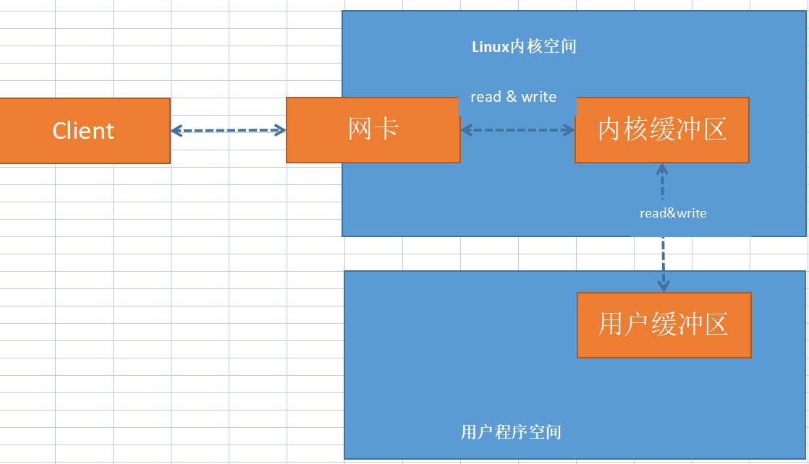

java客户端与服务端之间完成一次socket请求和响应（包含read 和write）的数据交换，流程如下：

1. 客户端发送请求

   1. Java客户端通过write系统将数据复制到内核缓冲区
   2. 客户端 Linux将内核缓冲区的请求数据通过网卡发送出去，到服务端

2. 服务端获取请求

   1. 服务端Linux从网卡接收数据，读取到内核缓冲区
   2. Java服务端程序通过调用read系统，将内核缓冲区数据复制到Java进程缓冲区

3. 服务端业务处理

   ​			服务器在进程空间完成自己的业务处理

4. 服务端返回数据

   ​			服务器处理完成，调用write系统将用户缓冲区的数据写入内核缓冲区

5. 发送给客户端

   ​			操作系统将内核缓冲区的数据写入网卡，网卡通过底层通讯协议传输给客户端

### 四种IO模型

#### 概念

- 阻塞
  - 阻塞是指用户程序的执行状态。在内核IO的执行过程中，发起IO的进程或者线程处于阻塞状态。
- 同步
  - 同步IO是用户空间主动发起IO请求，系统内核被动接收。
- 异步
  - 异步IO是系统内核主动发起IO请求，用户空间是被动接收。

#### 同步阻塞IO

- 概念

  - Blocking IO 由用户空间（或者线程）发起，需要等待内核IO操作彻底完成之后才返回用户空间的IO操作。在内核IO的执行过程中，发起请求的线程或者进程处于阻塞状态。
  - 传统的IO模型都是阻塞IO，java默认创建的socket是阻塞IO

- 流程图

  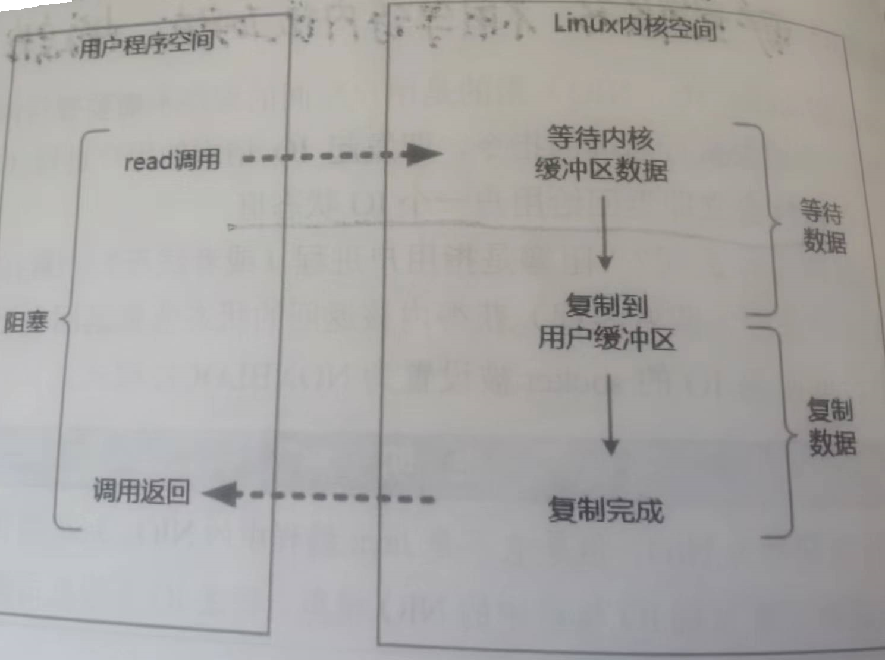

  1. IO发起read系统调用，用户线程进入阻塞状态
  2. Linux内核空间准备数据，内核缓冲区可能没有数据（比如在磁盘，没有收到完整的socket）
  3. Linux内核缓冲区数据准备完成，将内核缓冲区数据复制到用户缓冲区，然后返回结果。
  4. 用户线程接收到内核空间的返回结果，解除阻塞状态。

- 特点

  - 用户线程在内核执行的两个阶段处于阻塞状态。

- 优缺点

  - 优点：开发简单，阻塞期间，用户线程挂起不消耗CPU
  - 缺点： 高并发下，阻塞IO需要大量的线程来维护大量的网络连接，线程切换开销巨大，性能急剧下降。

#### 同步非阻塞IO

- 概念

  - Non-Blocking IO  简称NIO。不是Java NIO ，Java中的NIO（New IO）类库的IO模型是IO多路复用模型。
  - 由用户空间（或者线程）发起，不需要等待内核IO操作彻底完成就能立即返回用户空间的IO操作。在内核IO的执行过程中，发起请求的线程或者进程处于非阻塞状态。
  - 非阻塞IO中socket被设置为 nonblocking模式 

- 流程图

  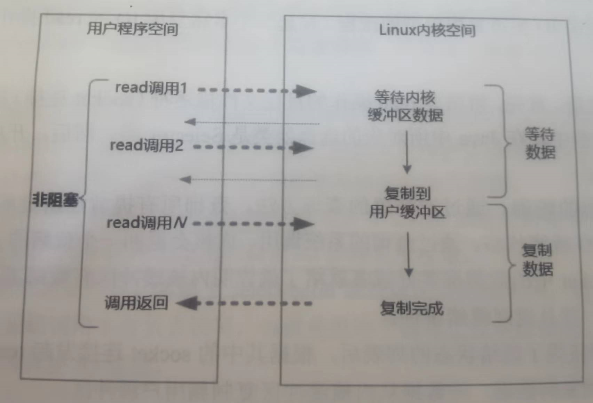

  1. 用户线程发起read系统调用，在内核系统没有准备好数据的阶段，IO请求立即返回（调用失败）
  2. 用户线程不断发送read请求，直到内核缓冲区有数据准备完成。此时用户线程处于阻塞状态，等待内核缓冲区数据复制到用户缓冲区。
  3. 内核缓冲区数据复制完成，内核返回调用结果
  4. 用户进程或者线程接收到结果，解除阻塞状态。

- 特点

  ​			用户线程需要不断的进行调用

- 优缺点

  - 优点：实时返回（内核缓冲区数据准备未完成时直接返回失败）线程不会阻塞，实时性较好
  - 缺点： 大量的轮询调用，占用CPU资源，效率低。

#### IO多路复用

- 概念

  - IO Multiplexing是经典的Reactor模式实现，也被成为异步阻塞IO。Java中的Selector 属于这种模型
  - 在Linux系统中，新的系统调用为select/epoll系统调用。通过系统调用，一个用户进程可以监控多个文件描述符，一旦某个描述符就绪（内核缓冲区可读/可写），内核空间能过将文件描述符的就绪状态返回给用户进程，用户空间根据文件描述符文的就绪状态进行IO系统调用

- 流程图

  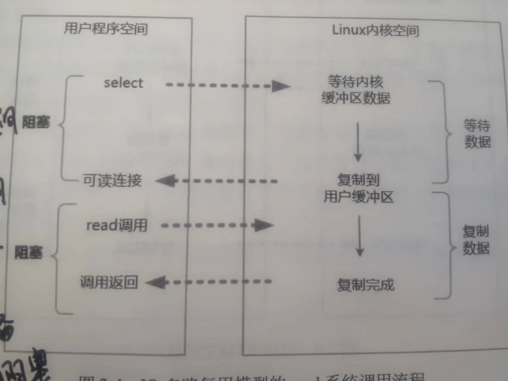

  1. 选择器注册：将需要操作的目标文件提前注册到选择器上，然后开启IO多路复用的轮询流程。
  2. 就绪状态轮询：通过选择器的查询方法，查询所有提前注册过的目标文件描述符的就绪状态，内核返回一个就绪的列表。列表中的文件都是在内核缓冲区数据准备就绪的文件。
  3. 用户线程得到就绪列表后，根据列表进行read调用。用户线程阻塞，内核空间进行数据复制到用户空间。
  4. 复制完成后，内核空间返回调用结果，用户线程解除阻塞。

- 特点

  ​		IO多路复用涉及到两种系统调用，一个是select /epoll 的就绪查询系统调用，一个是read/write系统调用。

- 优缺点

  - 优点是： 一个查询选择器可以处理成千上万的网络连接，不必创建大量的线程。
  - 缺点是：本质上select/epoll 是阻塞的属于同步IO。

#### 异步IO

- 概念

  - Asynchronous IO 简称AIO，用户空间的线程或者进程变成被动接收者，内核空间变成主动调用者。
  - 用户空间接收到通知时，内核空间已经完成了数据从内核空间到用户空间的过程，用户线程可以直接使用。类似Java的回调函数。

- 流程图

  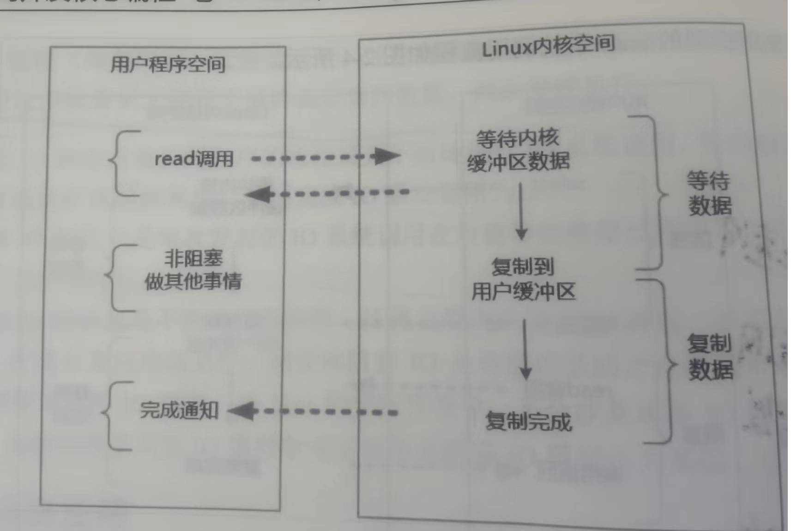

  1. 用户线程发起read请求，可以立即去做其他事情，线程不阻塞
  2. 内核开始准备数据，内核将数据冲内核缓冲区复制到用户缓冲区。
  3. 内核给线程发一个信号，或者回调用户线程的注册的回调方法，告诉read调用完成。
  4. 用户线程读取用户缓冲区的数据，完成后续操作。

- 特点

  - 在内核准备数据及复制数据的两个过程中，用户线程都不阻塞。
  - 异步IO也被成为信号驱动IO，因为用户线程需要接收内核IO操作的完成事件，或者提前注册一个内核IO完成回调函数给内核使用。

- 优缺点

  - 优点： 完全的异步，用户线程不阻塞。
  - 缺点 ： 用户程序仅仅需要进行时间的注册与接收，其他的都交给了内核。需要操作系统的支持，目前JDK支持不完善。

### 配置文件描述符限制

Linux默认文件句柄数是1024 ，即一个进程最多接收1024个socket连接。

- 查看文件句柄数

  ```bash
   ulimit -n
  ```

- 修改文件句柄数

  ```bash
  ulimit -n 100000   #进当前会话有效，重启失效
  ```

- 永久修改：

  ```tex
  修改 /etc/rc.local 添加
  ulimit -SHn 100000
  ```

- 软性极限值与硬性极限值

  ```tex
  修改/etc/security/liomits.conf添加
  soft nofile 10000   # 软性极限
  hard nofile 10000	# 硬性极限
  ```

## Java NIO

### 简介

Java NIO类库包含三大核心组件

- Channel 通道
- Buffer 缓冲区
- Selector 选择器

### NIO-Buffer类

NIO的Buffer本质上是一个内存块，既可以写入数据，也可以从中读取数据。

#### 类关系

Buffer是一个抽象类，有八个子类，如下图：

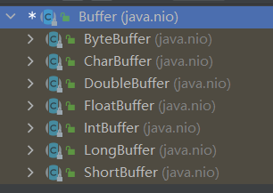

#### 属性

##### capacity（容量）

capacity表示缓冲区的大小，capacity一旦初始化，就不可改变。比如 LongBuffer.allocate(100); 表示创建一个大小为100的Long类型的缓冲区，最多可以放入100个long类型的数据。

##### position（读写位置、偏移量）

- 写模式：position初始位置为0，表示当前写入由0开始。每当一个数据写入缓冲区，position后移一位，最大可写值是limit-1，position=limit表示已经写满。
- 读模式:   当刚进入读模式时，position重置为0，读取数据时，position后移，position=limit表示无待读取数据。

##### limit（读写限制）

- 写模式： limit表示数据可以写入的最大上限，刚进入写模式时 limit =capacity
- 读模式： limit表示数据可以读取的最大上限。

##### mark（标记）

在缓冲区操作时，可以将position暂时保存到mark中，需要的时候再从mark取出标记位置，恢复到position属性中，重新从position位置开始处理。

#### 方法

| 方法名                 | 方法作用          | 说明                                                         |
| ---------------------- | ----------------- | ------------------------------------------------------------ |
| allocate(int capacity) | 获取缓冲区实例    | 默认为写模式capacity = capacity ;  position=0; limit =capacity ; |
| put(T t)               | 写入缓冲区        | 写入对象与创建缓冲区类型一致；写入n个后  position =n  ;capacity 、 limit 不变 |
| flip()                 | 写切读            | 写切读： limit = position;   position =0 ;                   |
| get()                  | 读取数据          | 读取position标记处的数据 且position ++                       |
| rewind()               | 读取重置          | position 置0，重新读取                                       |
| mark()                 | 标记              | mark  = position                                             |
| reset()                | 重新设置          | position  = mark                                             |
| clear()                | 清空缓冲区,写切读 | position = 0; limit = capacity; mark = -1;                   |

#### 使用流程

1. 获取Buffer缓冲区实例 →allocate
2. 写入数据 →put
3. 写切读→ flip
4. 读取数据→get
5. 清空缓冲区→clear

### NIO-Channel类

Java NIO一个socket连接使用一个channel表示，Java NIO中有很多通道实现。

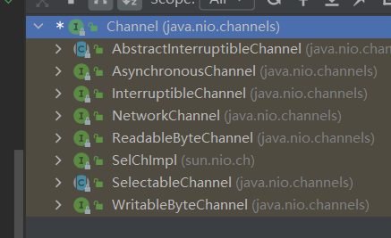

#### `FileChannel`

##### 简介

`FileChannel`是操作文件的通道，是阻塞模式。

##### 使用

- 获取通道

  ```java
  //通过文件输入流、输出流获取FileChannel
  FileInputStream fileInputStream = new FileInputStream("1.txt");
  FileChannel channel = fileInputStream.getChannel();
  
  FileOutputStream fileOutputStream = new FileOutputStream("1.txt");
  FileChannel outputStreamChannel = fileOutputStream.getChannel();
  ```

- 读取通道内数据

  ```java
  //使用read 进行读取,读取到ByteBuffer缓冲区中
  ByteBuffer byteBuffer = ByteBuffer.allocate(100);
  channel.read(byteBuffer);
  // 对于通道来说是读模式，对于缓冲区来说是写模式
  ```

- 数据写入通道

  ```java
  // 缓冲区必须是读模式，使用channel.write()将缓冲区的数据写入通道
  byteBuffer.flip();
  channel.write(byteBuffer);
  ```

- 关闭通道  close()

- 强制刷新到磁盘  force()

##### 案例

[文件NIO复制案例](https://github.com/chenpc1234/Note/tree/main/Java/NIO/Code/NioDemos/src/main/java/com/crazymakercircle/iodemo/fileDemos)

#### `SocketChannel`&&`ServerSocketChannel`

##### 简介

NIO中的`SocketChannel`对应OIO的Socket，负责数据传输；  `ServerSocketChannel`对应`ServerSocket` 负责连接的监听。都支持阻塞模式和非阻塞模式。

阻塞模式下，`SocketChannel`的连接、读、写 都是阻塞的，和Socket效率相同。

非阻塞模式下，`SocketChannel`是异步、高效的。`SocketChannel.configureBlocking(false)` 可设置为非阻塞模式。

##### 使用

- 获取通道

  - 客户端

  ```java
  // 1、获取通道（channel）
  SocketChannel socketChannel = SocketChannel.open(address);
  // 2、切换成非阻塞模式
  socketChannel.configureBlocking(false);
  //3. 连接服务器IP/port
  socketChannel.socket().connect(
      new InetSocketAddress(NioDemoConfig.SOCKET_SERVER_IP
                            , NioDemoConfig.SOCKET_SERVER_PORT));
  //4. 非阻塞模式下使用自旋确认连接到主机
  while (!socketChannel.finishConnect())
  {
      //不断的自旋、等待，或者做一些其他的事情
  }
  ```

  - 服务端

  ```java
  
  key=selector.selectedKeys().iterator().next();
  
  ServerSocketChannel server = (ServerSocketChannel) key.channel(); // key 由选择器就绪列表而来
  SocketChannel socketChannel = server.accept();
  if (socketChannel == null) continue;
  // 客户端新连接，切换为非阻塞模式
  socketChannel.configureBlocking(false);
  ```

- 读取通道内的数据

  ```java
  // 与缓冲区类似
  socketChannel.read(buffer)
  ```

- 数据写入通道

  ```java
  // 与缓冲区类似
  buffer.flip(); 
  socketChannel.write(buffer);
  ```

- 关闭通道

  ```java
  socketChannel.shutdownOutput(); //终止输出
  socketChannel.close();//关闭连接
  ```

##### 案例

[SocketChannel&ServerSocketChannel发送文件及接收文件](https://github.com/chenpc1234/Note/tree/main/Java/NIO/Code/NioDemos/src/main/java/com/crazymakercircle/iodemo/socketDemos)

#### `DatagramChannel`

##### 简介

Java NIO中，使用`DatagramChannel`来进行UDP协议的文件传输。

##### 使用

- 获取通道

  ```java
  DatagramChannel dChannel = DatagramChannel.open();
  dChannel.configureBlocking(false);
  //如果是服务端。绑定监听客户端
       datagramChannel.bind(new InetSocketAddress(
                  NioDemoConfig.SOCKET_SERVER_IP
                  , NioDemoConfig.SOCKET_SERVER_PORT));
  ```

- 读取通道内数据

  ```java
  datagramChannel.receive(buffer);
  ```

- 数据写入通道

  ```java
    buffer.flip();
  dChannel.send(buffer,
                      new InetSocketAddress(NioDemoConfig.SOCKET_SERVER_IP
                              , NioDemoConfig.SOCKET_SERVER_PORT));
  ```

- 关闭通道

  ```java
   dChannel.close();
  ```

##### 案例

[Java NIO中使用UDP协议传输数据](https://github.com/chenpc1234/Note/tree/main/Java/NIO/Code/NioDemos/src/main/java/com/crazymakercircle/iodemo/udpDemos)

### NIO-Selector

#### 选择器

- 选择器的使命是完成IO多路复用，主要工作是通道的注册、监听、事件查询。

- 一个单线程处理一个选择器，一个选择器监控很多通道。

- 通道与选择器的关联通过注册（register）完成。

  - 通道注册

    ```java
    //通道调用注册方法注册进选择器，selector是选择器实例，ops是监控的IO事件类型
    Channel.register(selector , ops );
    ```

  - IO事件类型

    - 可读 `SelectionKey.OP_READ`
    - 可写 `SelectionKey.OP_WRITE`
    - 连接 `SelectionKey.OP_CONNECT`
    - 接收 `SelectionKey.OP_ACCEPT`

#### 使用

1. 获取选择器实例

   ```java
   // 1、创建一个 Selector选择器
   Selector selector = Selector.open();
   ```

   

2. 将通道注册到选择器实例，**通道必须是非阻塞的**

   ```java
   // 2、获取通道
   ServerSocketChannel serverSocketChannel = ServerSocketChannel.open();
   // 3.设置为非阻塞
   serverSocketChannel.configureBlocking(false);
   // 4、绑定连接
   serverSocketChannel.bind(new InetSocketAddress(NioDemoConfig.SOCKET_SERVER_PORT));
   // 5、将通道注册到选择器上,并注册的IO事件为：“接收新连接”
   SelectionKey sk = serverSocketChannel.register(selector, SelectionKey.OP_ACCEPT);
   ```

3. 选择IO就绪事件，使用选择器的select()方法，`selector.selectedKeys()`得到选择键集合，迭代选择键进行判断处理，处理完成后移除选择键

   ```java
    // 6、轮询感兴趣的I/O就绪事件（选择键集合）
           while (selector.select() > 0) {
               // 7、获取选择键集合
               Iterator<SelectionKey> selectedKeys = selector.selectedKeys().iterator();
   
               while (selectedKeys.hasNext()) {
                   // 8、获取单个的选择键，并处理
                   SelectionKey selectedKey = selectedKeys.next();
                   // 9、判断key是具体的什么事件
                   if (selectedKey.isAcceptable()) {
               		//IO事件 ServerSocketChannel服务器监听通道有新链接
                   } else if (selectedKey.isConnectable()) {
                   	//IO事件 传输通道连接成功
                   } else if (selectedKey.isReadable()) {
                   	//IO事件 传输通道可读
                   } else if (selectedKey.isWritable()) {
                   	//IO事件 传输通道可写
                   }
                   // 10、移除选择键
                   selectedKeys.remove();
               }
           }
   ```

   

### 实战案例

[SocketChannel接收文件传输](https://github.com/chenpc1234/Note/tree/main/Java/NIO/Code/NioDemos/src/main/java/com/crazymakercircle/iodemo/socketDemos)

```tex
服务端
1. 定义保存文件对象 Client {文件名称
        //长度
        //开始传输的时间
        //客户端的地址
        //输出的文件通道
        //接收长度
        }
2. 定义缓冲区用于读写
3. 使用Map保存每个客户端传输，当OP_READ通道可读时，根据channel找到对应的对象Map<SelectableChannel, Client>

4. 开启服务
	4.1 获取Selector选择器
	4.2 获取通道
	4.3 设置通道非阻塞
	4.4 绑定监听的端口
	4.5 通道注册到选择器上，IO事件为（OP_ACCEPT）即ServerSocketChannel服务器监听通道有新链接
	4.6 轮询感兴趣的I/O就绪事件（选择键集合）selector.select()，迭代每个选择键
		4.6.1 接受的事件是“新连接”事件,就获取客户端新连接
				 	ServerSocketChannel server = (ServerSocketChannel) key.channel();
                    SocketChannel socketChannel = server.accept();
                    if (socketChannel == null) continue;
                    // 客户端新连接，切换为非阻塞模式
                    socketChannel.configureBlocking(false);
                    // 将客户端新连接通道注册到selector选择器上
                    SelectionKey selectionKey =
                            socketChannel.register(selector, SelectionKey.OP_READ);
                    // 将新链接保存到map中，用于后续文件读取
                    Client client = new Client();
                    client.remoteAddress
                            = (InetSocketAddress) socketChannel.getRemoteAddress();
                    clientMap.put(socketChannel, client);
              
		4.6.2 若是可读事件，就进行文件读取接收	
				Client client = clientMap.get(key.channel());
				SocketChannel socketChannel = (SocketChannel) key.channel();
				socketChannel.read(buffer) 进行读取到缓冲区
				FileChannel读取缓冲区文件
```


## Reactor模式

### OIO缺陷

#### **单线程阻塞IO**

原始网络服务器通过while循环不断监听端口是否有新链接，在执行任务时，后续请求会阻塞

导致问题：阻塞导致吞吐量太低，单线程。

```java
while(true){
    socket = accept();//阻塞、接收连接
    handle(socket);//执行任务   -- 执行过程中，会阻塞后续接收连接
}
```

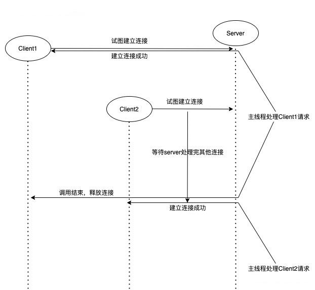

#### **多线程阻塞IO**

Connection Per Thread模式： 一个连接一个线程，每个线程处理一个连接

问题：线程太多，消耗资源。线程间的切换影响效率。

```java
ServerSocket serverSocket =new ServerSocket(8080);
while(){
   Socket socket = serverSocket.accept();
    Handle handle = new Handler(socket); // 使用socket创建专属的处理对象
    new Thread(handle).start();// 创建新的线程，单独进行处理
}
```

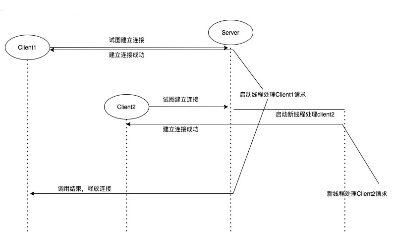

### 单Reactor单线程模式

Reactor反应器模式中有两个重要的组件

- Reactor
  - 负责IO查询事件，当检测到一个IO事件时，将事件发送给对应的Handler处理
- Handler
  - 与IO事件(或者选择键)绑定，非阻塞的处理IO事件，完成连接的建立、通道的读取、业务处理、结果返回(写入通道)。

#### 单Reactor单线程模型

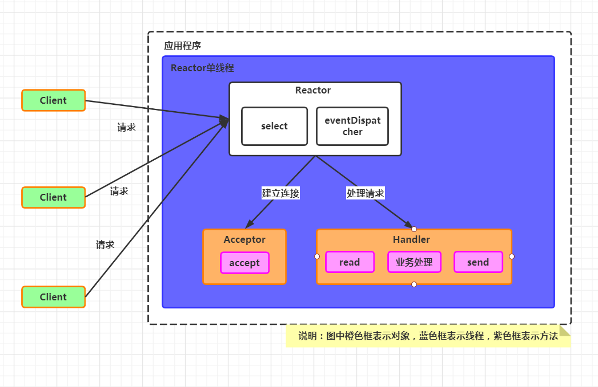


#### 单Reactor单线程服务端代码模式

```java
class EchoServerReactor implements Runnable {
    Selector selector;
    ServerSocketChannel serverSocket;
    EchoServerReactor() throws IOException {
        //开启选择器，打开通道，通道绑定端口，通道设置非阻塞、通道注册进选择器、选择键绑定连接时间处理器
        selector = Selector.open();
        serverSocket = ServerSocketChannel.open();
        InetSocketAddress address =new InetSocketAddress("127.0.0.1","12345");
        serverSocket.socket().bind(address);
        serverSocket.configureBlocking(false);
        SelectionKey sk = serverSocket.register(selector, SelectionKey.OP_ACCEPT);
        sk.attach(new AcceptorHandler());
    }
    
	public void run() {
        //轮询选择器
        while (!Thread.interrupted()) {
            selector.select();
            Set<SelectionKey> selected = selector.selectedKeys();
            Iterator<SelectionKey> it = selected.iterator();
            //迭代选择键,分发处理
            while (it.hasNext()) {
                //Reactor负责dispatch收到的事件
                SelectionKey sk = it.next();
                dispatch(sk);
            }
            selected.clear();
        }
    }
        
    //分发处理方法
    void dispatch(SelectionKey sk) {
        //调用之前attach绑定到选择键的handler处理器对象
        Runnable handler = (Runnable) sk.attachment();
        if (handler != null) {
            handler.run();
        }
    }
    // Handler:新连接处理器
    class AcceptorHandler implements Runnable {
        public void run() {
            try {
                //接收连接
                SocketChannel channel = serverSocket.accept();
                // 创建业务处理的Handler 进行业务处理
                if (channel != null){
                    new IOHandler(selector, channel); 
                }            
            } catch (IOException e) {
                e.printStackTrace();
            }
        }
    }
}
```

#### 单线程Reactor缺陷

- 单线程Reactor中，Reactor和Handler都在同一个线程内运行，当某个Handler阻塞时，会导致其他的Handler不能执行。被阻塞的Handler不仅仅负责输入输出处理的传输处理器IOHandler，还包括连接处理器AcceptorHandler，可能导致服务器无响应。

- 单线程无法发挥多核CPU的性能

### 单Reactor多线程模式

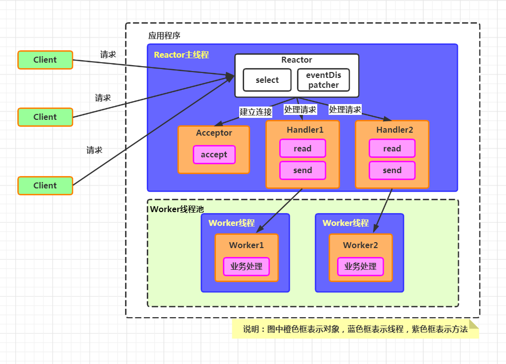

#### 单Reactor多线程与单Reactor单线程的区别

- handler只负责响应事件，不做具体的业务处理，通过read读取数据后，会分发给后面的**worker线程池**的某个线程处理业务
- worker线程池会分发独立的线程完成真正的业务，并将结果返回给handler
- handler收到响应的结果后，再通过send将结果返回给client

#### 单Reactor多线程的优缺点

- 优点：
  - 多线程可以充分利用多核CPU的处理能力
  - 采用线程池复用线程，减少创建和销毁线程带来的性能开销

- 缺点：
  - reactor处理所有事件的监听和响应，在单线程运行，高并发场景下容易出现性能瓶颈
  - 多线程数据共享和访问比较复杂

### 主从Reactor多线程模式

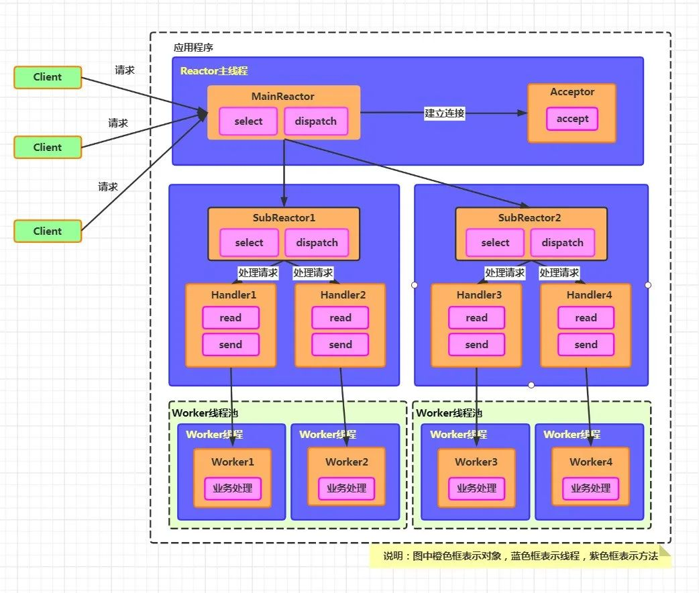

#### 多线程主从Reactor工作流程

1. Reactor主线程MainReactor对象通过select监听连接事件，收到事件后，通过Acceptor处理连接事件
2. 当Acceptor处理连接事件后，MainReactor将连接分配给SubReactor
3. SubReactor将连接加入到连接队列进行监听，并创建handler进行各种事件处理
4. 当有新事件发生时，SubReactor就会调用对应的handler进行处理
5. handler通过Read读取数据，分发给后面的worker线程处理
6. worker线程池会分配独立的worker线程进行业务处理，并返回结果
7. handler收到响应的结果后，再通过send将结果返回给client
8. MainReactor主线程可以关联多个SubReactor子线程

#### 多线程主从Reactor优点

- 主线程与子线程的数据交互简单职责明确，主线程只需要接收新连接，子线程完成后续的业务处理
- 可以通过扩展多个Reactor子线程的方式来减小单个子线程的压力，提高并发处理能力

#### 多线程主从Reactor代码模式

```java
class MultiThreadEchoServerReactor {
    ServerSocketChannel serverSocket;
    AtomicInteger next = new AtomicInteger(0);
    //selectors集合,引入多个selector选择器
    Selector[] selectors = new Selector[2];
    //引入多个子反应器
    SubReactor[] subReactors = null;
    //
    MultiThreadEchoServerReactor() throws IOException {
        //初始化多个selector选择器
        selectors[0] = Selector.open();
        selectors[1] = Selector.open();
        serverSocket = ServerSocketChannel.open();
        InetSocketAddress address = new InetSocketAddress(NioDemoConfig.SOCKET_SERVER_IP, NioDemoConfig.SOCKET_SERVER_PORT);
        serverSocket.socket().bind(address);
        serverSocket.configureBlocking(false);

        //第一个selector,负责监控新连接事件
        SelectionKey sk = serverSocket.register(selectors[0], SelectionKey.OP_ACCEPT);
        //附加新连接处理handler处理器到SelectionKey（选择键）
        sk.attach(new AcceptorHandler());

        //第一个子反应器，一子反应器负责一个选择器
        SubReactor subReactor1 = new SubReactor(selectors[0]);
        //第二个子反应器，一子反应器负责一个选择器
        SubReactor subReactor2 = new SubReactor(selectors[1]);
        
        subReactors = new SubReactor[]{subReactor1, subReactor2};
    }

    private void startService() {
        // 一子反应器对应一条线程
        new Thread(subReactors[0]).start();
        new Thread(subReactors[1]).start();
    }

    //反应器
    class SubReactor implements Runnable {
        //每条线程负责一个选择器的查询
        final Selector selector;
        public SubReactor(Selector selector) {
            this.selector = selector;
        }
        public void run() {
            try {
                while (!Thread.interrupted()) {
                    selector.select();
                    Set<SelectionKey> keySet = selector.selectedKeys();
                    Iterator<SelectionKey> it = keySet.iterator();
                    while (it.hasNext()) {
                        //Reactor负责dispatch收到的事件
                        SelectionKey sk = it.next();
                        dispatch(sk);
                    }
                    keySet.clear();
                }
            } catch (IOException ex) {
                ex.printStackTrace();
            }
        }
        void dispatch(SelectionKey sk) {
            Runnable handler = (Runnable) sk.attachment();
            //调用之前attach绑定到选择键的handler处理器对象
            if (handler != null) {
                handler.run();
            }
        }
    }
    // Handler:新连接处理器
    class AcceptorHandler implements Runnable {
        public void run() {
            try {
                SocketChannel channel = serverSocket.accept();
                if (channel != null)
                    new MultiThreadEchoHandler(selectors[next.get()], channel);
            } catch (IOException e) {
                e.printStackTrace();
            }
            if (next.incrementAndGet() == selectors.length) {
                next.set(0);
            }
        }
    }

    public static void main(String[] args) throws IOException {
        MultiThreadEchoServerReactor server =
                new MultiThreadEchoServerReactor();
        server.startService();
    }
}

```

```java
class MultiThreadEchoHandler implements Runnable {
    final SocketChannel channel;
    final SelectionKey sk;
    final ByteBuffer byteBuffer = ByteBuffer.allocate(1024);
    static final int RECIEVING = 0, SENDING = 1;
    int state = RECIEVING;
    //引入线程池
    static ExecutorService pool = Executors.newFixedThreadPool(4);
	// 选择器的selector
    MultiThreadEchoHandler(Selector selector, SocketChannel c) throws IOException {
        channel = c;
        c.configureBlocking(false);
        //仅仅取得选择键，后设置感兴趣的IO事件
        sk = channel.register(selector, 0);
        //将本Handler作为sk选择键的附件，方便事件dispatch
        sk.attach(this);
        //向sk选择键注册Read就绪事件
        sk.interestOps(SelectionKey.OP_READ);
        selector.wakeup();
    }

    public void run() {
        //异步任务，在独立的线程池中执行
        pool.execute(new AsyncTask());
    }

    //异步任务，不在Reactor线程中执行
    public synchronized void asyncRun() {
        try {
            if (state == SENDING) {
                //写入通道
                channel.write(byteBuffer);
                //写完后,准备开始从通道读,byteBuffer切换成写模式
                byteBuffer.clear();
                //写完后,注册read就绪事件
                sk.interestOps(SelectionKey.OP_READ);
                //写完后,进入接收的状态
                state = RECIEVING;
            } else if (state == RECIEVING) {
                //从通道读
                int length = 0;
                while ((length = channel.read(byteBuffer)) > 0) {
                    Logger.info(new String(byteBuffer.array(), 0, length));
                }
                //读完后，准备开始写入通道,byteBuffer切换成读模式
                byteBuffer.flip();
                //读完后，注册write就绪事件
                sk.interestOps(SelectionKey.OP_WRITE);
                //读完后,进入发送的状态
                state = SENDING;
            }
            //处理结束了, 这里不能关闭select key，需要重复使用
            //sk.cancel();
        } catch (IOException ex) {
            ex.printStackTrace();
        }
    }

    //异步任务的内部类
    class AsyncTask implements Runnable {
        public void run() {
            MultiThreadEchoHandler.this.asyncRun();
        }
    }

}
```

### Reactor优缺点

#### 优点

- 响应快
  - 不会被单个连接IO操作阻塞
- 编程简单
  - 避免了复杂的多线程同步，避免了多线程进程间的切换开销
- 可扩展
  - 可以通过反应器线程的个数来充分利用CPU资源

#### 缺点

- 门槛高，不易于调试
- 依赖系统底层IO多路复用模型
- 在同一个handle中如果出现一个长时间的数据读写，会影响这个反应器中其他通道的IO处理