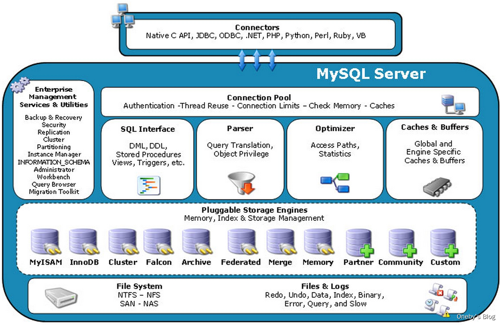
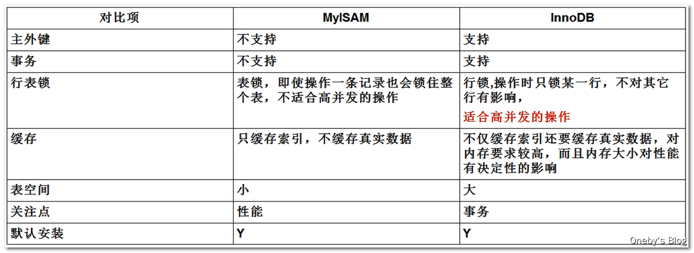
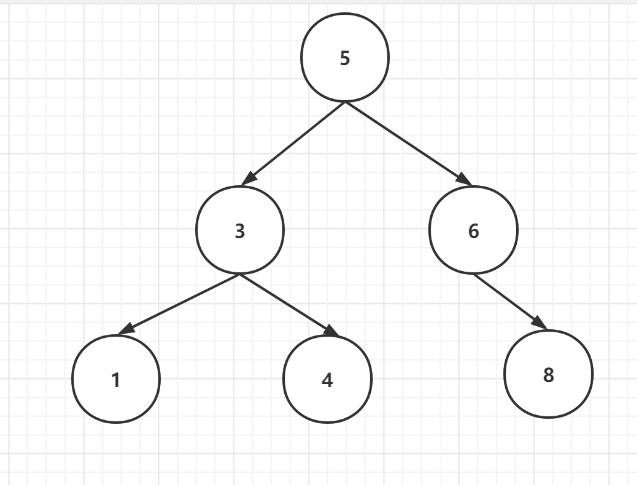
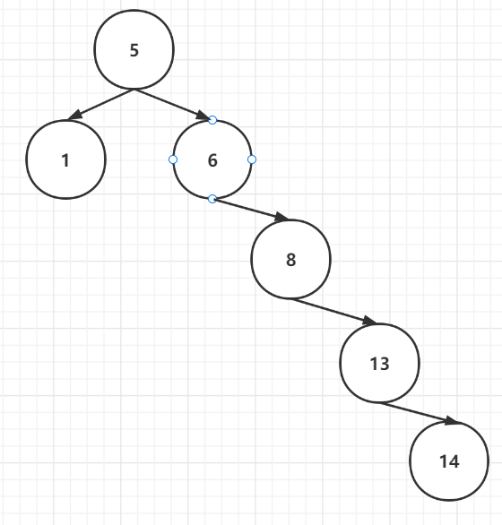
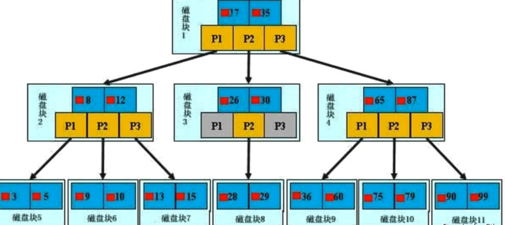
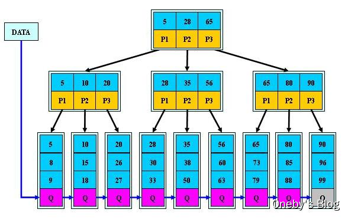

# mysql架构图



## **连接层：**

​		最上层是一些客户端和连接服务，包含本地sock通信和大多数基于客户端/服务端工具实现的类似于tcp/ip的通信。主要完成一些类似于连接处理、授权认证、及相关的安全方案。在该层上引入了线程池的概念，为通过认证安全接入的客户端提供线程。同样在该层上可以实现基于SSL的安全链接。服务器也会为安全接入的每个客户端验证它所具有的操作权限。

## **服务层**：

​		第二层架构主要完成大多数的核心服务功能，如SQL接口，并完成缓存的查询，SQL的分析和优化及部分内置函数的执行。所有跨存储引擎的功能也在这一层实现，如过程、函数等。在该层，服务器会解析查询并创建相应的内部解析树，并对其完成相应的优化如确定查询表的顺序，是否利用索引等，最后生成相应的执行操作。如果是select语句，服务器还会查询内部的缓存。如果缓存空间足够大，这样在解决大量读操作的环境中能够很好的提升系统的性能。

|||
|:--|:--|
|SQL Interface|SQL 接口。 接受用户的 SQL 命令， 并且返回用户需要查询的结果。<br/>比如 select from 就是调用 SQL Interface|
|Parser|解析器。 SQL 命令传递到解析器的时候会被解析器验证和解析|
|Optimizer|查询优化器 。SQL 语句在查询之前会使用查询优化器对查询进行优化， <br/>比如有 where 条件时， 优化器来决定先投影还是先过滤|
|Cache 和 Buffer|查询缓存。 如果查询缓存有命中的查询结果，<br/>查询语句就可以直接去查询缓存中取 数据。<br/>这个缓存机制是由一系列小缓存组成的。<br/>比如表缓存， 记录缓存， key 缓存， 权限缓存等|

## **引擎层：**

​		存储引擎层，存储引擎真正的负责了MySQL中数据的存储和提取，服务器通过APl与存储引擎进行通信。不同的存储引擎具有的功能不同，这样我们可以根据自己的实际需要进行选取。后面介绍MyISAM和InnoDB

## **存储层：**

​		数据存储层，主要是将数据存储在运行于裸设备的文件系统之上，并完成与存储引擎的交互。

## mysql 部件

1. **Connectors**：

     ​		指的是不同语言中与SQL的交互

2. **Management Serveices & Utilities**： 

     ​		系统管理和控制工具

3. **Connection Pool：**连接池

   1. 管理缓冲用户连接，线程处理等需要缓存的需求。负责监听对 MySQL Server 的各种请求，接收连接请求，转发所有连接请求到线程管理模块。
   2. 每一个连接上 MySQL Server 的客户端请求都会被分配（或创建）一个连接线程为其单独服务。而连接线程的主要工作就是负责 MySQL Server 与客户端的通信。接受客户端的命令请求，传递 Server 端的结果信息等。线程管理模块则负责管理维护这些连接线程。包括线程的创建，线程的 cache 等。

4. **SQL Interface：**SQL接口。

   ​	接受用户的SQL命令，并且返回用户需要查询的结果。比如select from就是调用SQL Interface

5. **Parser：解析器**

   - **SQL命令传递到解析器的时候会被解析器验证和解析**。

      解析器是由Lex和YACC实现的，是一个很长的脚本。
      在 MySQL中我们习惯将所有 Client 端发送给 Server 端的命令都称为 Query，在 MySQL Server 里面，连接线程接收到客户端的一个 Query 后，会直接将该 Query 传递给专门负责将各种 Query 进行分类然后转发给各个对应的处理模块。

   - **解析器的主要功能**：
     将SQL语句进行语义和语法的分析，分解成数据结构，然后按照不同的操作类型进行分类，然后做出针对性的转发到后续步骤，以后SQL语句的传递和处理就是基于这个结构的。

   - **如果在分解构成中遇到错误，那么就说明这个sql语句是不合理的**

6. **Optimizer：查询优化器**

     1. SQL语句在查询之前会使用查询优化器对查询进行优化。优化客户端发送过来的 sql 语句 ，根据客户端请求的 query 语句，和数据库中的一些统计信息，在一系列算法的基础上进行分析，得出一个最优的策略，告诉后面的程序如何取得这个 query 语句的结果

     2. 他使用的是“选取-投影-联接”策略进行查询。

          用一个例子就可以理解： select uid,name from user where gender = 1;

          这个select 查询先根据where 语句进行选取，而不是先将表全部查询出来以后再进行gender过滤

          这个select查询先根据uid和name进行属性投影，而不是将属性全部取出以后再进行过滤

          将这两个查询条件联接起来生成最终查询结果

7. **Cache和Buffer：查询缓存**

   1. 他的主要功能是将客户端提交 给MySQL 的 Select 类** query 请求的返回结果集 cache 到内存中**，与该 query 的一个 hash 值 做一个对应。该 Query 所取数据的基表发生任何数据的变化之后， MySQL 会自动使该 query 的Cache 失效。在读写比例非常高的应用系统中， Query Cache 对**性能的提高是非常显著的**。当然它**对内存的消耗也是非常大的。**
   2. 如果查询缓存有命中的查询结果，查询语句就可以直接去查询缓存中取数据。这个缓存机制是由一系列小缓存组成的。比如表缓存，记录缓存，key缓存，权限缓存等

8. **存储引擎接口**
   1. 存储引擎接口模块可以说是 MySQL 数据库中最有特色的一点了。目前各种数据库产品中，基本上只有 MySQL 可以实现其底层数据存储引擎的插件式管理。这个模块实际上只是 一个抽象类，但正是因为它成功地将各种数据处理高度抽象化，才成就了今天 MySQL 可插拔存储引擎的特色。
   2. 从上图还可以看出，**MySQL区别于其他数据库的最重要的特点就是其插件式的表存储引擎**。MySQL插件式的存储引擎架构提供了一系列标准的管理和服务支持，这些标准与存储引擎本身无关，可能是每个数据库系统本身都必需的，如SQL分析器和优化器等，而存储引擎是底层物理结构的实现，每个存储引擎开发者都可以按照自己的意愿来进行开发。
   注意：**存储引擎是基于表的，而不是数据库。**

# mysql请求流程

1. **查缓存**（Cache和Buffer）

   ​		mysql 客户端通过协议与 mysql 服务器建连接， 发送查询语句， 先检查查询缓存， 如果命中， 直接返回结果，否则进行语句解析,也就是说， 在解析查询之前， 服务器会先访问查询缓存(query cache)——它存储 SELECT 语句以及相应的查询结果集。 如果某个查询结果已经位于缓存中， 服务器就不会再对查询进行解析、 优化、 以及执行。 它仅仅将缓存中的结果返回给用户即可， 这将大大提高系统的性能。

2. **语法解析器和预处理**：（Parser） 

   ​		首先 mysql 通过关键字将 SQL 语句进行解析， 并生成一颗对应的“解析树”。 mysql 解析器将使用 mysql 语法规则验证和解析查询； 预处理器则根据一些 mysql 规则进一步检查解析数是否合法。

3. **查询优化**:(Optimizer)

   ​		当解析器认为是合法的了， 并且由优化器将其转化成执行计划。 一条查询可以有很多种执行方式，最后都返回相同的结果。 优化器的作用就是找到这其中最好的执行计划。

4. **使用索引查询数据**

   ​		然后， mysql 默认使用的 BTREE 索引， 并且一个大致方向是：无论怎么折腾 sql， 至少在目前来说， mysql 最多只用到表中的一个索引。

# 存储引擎

查看 mysql 支持的存储引擎

```sql
show engines;
```

查看mysql默认存储引擎

```sql
show variables like '%storage_engine%';
```

MyISAM 引擎和 InnoDb 引擎的对比



# 索引结构

## 二叉查找树

​	**特点：**任意节点的左子树上所有节点值不大于根节点的值，任意节点的右子树上所有节点值不小于根节点的值。查找平均复杂度O(lgn)

​	

​	**缺点**  容易产生不平衡，退化为链表结构 。极端情况可能没有左侧叶子节点,查找复杂度是O(n)  

 

## 平衡二叉树

**特点：**所有节点的左右子树高度差不能超过1；平衡二叉树的查找效率更稳定，总体的查找速度也更快。AVL树查找、插入和删除在平均和最坏情况下都是O(lgn)

**旋转**：费时间

​		AVL实现平衡的关键在于旋转操作：插入和删除可能破坏二叉树的平衡，此时需要通过一次或多次树旋转来重新平衡这个树。

- 当插入数据时，最多只需要1次旋转(单旋转或双旋转)；
- 但是当删除数据时，会导致树失衡，AVL需要维护从被删除节点到根节点这条路径上所有节点的平衡，旋转的量级为O(lgn)。

## 红黑树

**特点：**

- 确保从根到叶子的最长的可能路径不多于最短的可能路径的两倍长
- 每个节点都是红色或者黑色
- 根结点是黑色
-  所有叶子都是黑色
- 每个红色结点的两个子结点都是黑色。（从每个叶子到根的所有路径上不能有两个连续的红色结点）
- 从任一节结点到其每个叶子的所有路径都包含相同数目的黑色结点


##  B树

缩放复制
一颗 b 树， 浅蓝色的块我们称之为一个磁盘块， 可以看到每个磁盘块包含几个数据项（深蓝色所示） 和指针（黄色所示）
如磁盘块 1 包含数据项 17 和 35， 包含指针 P1、 P2、 P3
P1 表示小于 17 的磁盘块， P2 表示在 17 和 35 之间的磁盘块， P3 表示大于 35 的磁盘块
真实的数据存在于叶子节点和非叶子节点中**【查找过程】**
如果要查找数据项 29， 那么首先会把磁盘块 1 由磁盘加载到内存， 此时发生一次 IO， 在内存中用二分查找确定 29在 17 和 35 之间， 锁定磁盘块 1 的 P2 指针， 内存时间因为非常短（相比磁盘的 IO） 可以忽略不计通过磁盘块 1的 P2 指针的磁盘地址把磁盘块 3 由磁盘加载到内存， 发生第二次 IO， 29 在 26 和 30 之间， 锁定磁盘块 3 的 P2 指针通过指针加载磁盘块 8 到内存， 发生第三次 IO， 同时内存中做二分查找找到 29， 结束查询， 总计三次 IO。

## B+树

缩放复制
**【B+Tree 与 BTree 的区别】**

​			B-树的关键字（数据项）和记录是放在一起的； B+树的非叶子节点中只有关键字和指向下一个节点的索 引， 记录只放在叶子节点中。

**【B+Tree 与 BTree 的查找过程】**
			在 B 树中， 越靠近根节点的记录查找时间越快， 只要找到关键字即可确定记录的存在； 而 B+ 树中每个记录的查找时间基本是一样的， 都需要从根节点走到叶子节点， 而且在叶子节点中还要再比较关键字。从这个角度看 B 树的性能好像要比 B+ 树好， 而在实际应用中却是 B+ 树的性能要好些。 因为 B+ 树的非叶子节点不存放实际的数据，这样每个节点可容纳的元素个数比 B 树多， 树高比 B 树小， 这样带来的好处是减少磁盘访问次数。尽管 B+ 树找到一个记录所需的比较次数要比 B 树多， 但是一次磁盘访问的时间相当于成百上千次内存比较的时间， 因此实际中B+ 树的性能可能还会好些， 而且 B+树的叶子节点使用指针连接在一起， 方便顺序遍历（范围搜索）， 这也是很多数据库和文件系统使用 B+树的缘故。

