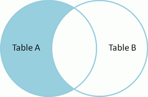

# mysql架构图


## **连接层：**

​		最上层是一些客户端和连接服务，包含本地sock通信和大多数基于客户端/服务端工具实现的类似于tcp/ip的通信。主要完成一些类似于连接处理、授权认证、及相关的安全方案。在该层上引入了线程池的概念，为通过认证安全接入的客户端提供线程。同样在该层上可以实现基于SSL的安全链接。服务器也会为安全接入的每个客户端验证它所具有的操作权限。

## **服务层**：

​		第二层架构主要完成大多数的核心服务功能，如SQL接口，并完成缓存的查询，SQL的分析和优化及部分内置函数的执行。所有跨存储引擎的功能也在这一层实现，如过程、函数等。在该层，服务器会解析查询并创建相应的内部解析树，并对其完成相应的优化如确定查询表的顺序，是否利用索引等，最后生成相应的执行操作。如果是select语句，服务器还会查询内部的缓存。如果缓存空间足够大，这样在解决大量读操作的环境中能够很好的提升系统的性能。

|||
|:--|:--|
|SQL Interface|SQL 接口。 接受用户的 SQL 命令， 并且返回用户需要查询的结果。<br/>比如 select from 就是调用 SQL Interface|
|Parser|解析器。 SQL 命令传递到解析器的时候会被解析器验证和解析|
|Optimizer|查询优化器 。SQL 语句在查询之前会使用查询优化器对查询进行优化， <br/>比如有 where 条件时， 优化器来决定先投影还是先过滤|
|Cache 和 Buffer|查询缓存。 如果查询缓存有命中的查询结果，<br/>查询语句就可以直接去查询缓存中取 数据。<br/>这个缓存机制是由一系列小缓存组成的。<br/>比如表缓存， 记录缓存， key 缓存， 权限缓存等|

## **引擎层：**

​		存储引擎层，存储引擎真正的负责了MySQL中数据的存储和提取，服务器通过APl与存储引擎进行通信。不同的存储引擎具有的功能不同，这样我们可以根据自己的实际需要进行选取。

查看 mysql 支持的存储引擎 

```sql
show engines;
```

查看mysql默认存储引擎

```sql
show variables like '%storage_engine%';
```

MyISAM 引擎和 InnoDb 引擎的对比


## **存储层：**

​		数据存储层，主要是将数据存储在运行于裸设备的文件系统之上，并完成与存储引擎的交互。

## mysql 部件

1. **Connectors**：

     ​		指的是不同语言中与SQL的交互

2. **Management Serveices & Utilities**： 

     ​		系统管理和控制工具

3. **Connection Pool：**连接池

   1. 管理缓冲用户连接，线程处理等需要缓存的需求。负责监听对 MySQL Server 的各种请求，接收连接请求，转发所有连接请求到线程管理模块。
   2. 每一个连接上 MySQL Server 的客户端请求都会被分配（或创建）一个连接线程为其单独服务。而连接线程的主要工作就是负责 MySQL Server 与客户端的通信。接受客户端的命令请求，传递 Server 端的结果信息等。线程管理模块则负责管理维护这些连接线程。包括线程的创建，线程的 cache 等。

4. **SQL Interface：**SQL接口。

   ​	接受用户的SQL命令，并且返回用户需要查询的结果。比如select from就是调用SQL Interface

5. **Parser：解析器**

   - **SQL命令传递到解析器的时候会被解析器验证和解析**。

      解析器是由Lex和YACC实现的，是一个很长的脚本。
      在 MySQL中我们习惯将所有 Client 端发送给 Server 端的命令都称为 Query，在 MySQL Server 里面，连接线程接收到客户端的一个 Query 后，会直接将该 Query 传递给专门负责将各种 Query 进行分类然后转发给各个对应的处理模块。

   - **解析器的主要功能**：
     将SQL语句进行语义和语法的分析，分解成数据结构，然后按照不同的操作类型进行分类，然后做出针对性的转发到后续步骤，以后SQL语句的传递和处理就是基于这个结构的。

   - **如果在分解构成中遇到错误，那么就说明这个sql语句是不合理的**

6. **Optimizer：查询优化器**

     1. SQL语句在查询之前会使用查询优化器对查询进行优化。优化客户端发送过来的 sql 语句 ，根据客户端请求的 query 语句，和数据库中的一些统计信息，在一系列算法的基础上进行分析，得出一个最优的策略，告诉后面的程序如何取得这个 query 语句的结果

     2. 他使用的是“选取-投影-联接”策略进行查询。

          用一个例子就可以理解： select uid,name from user where gender = 1;

          这个select 查询先根据where 语句进行选取，而不是先将表全部查询出来以后再进行gender过滤

          这个select查询先根据uid和name进行属性投影，而不是将属性全部取出以后再进行过滤

          将这两个查询条件联接起来生成最终查询结果

7. **Cache和Buffer：查询缓存**

   1. 他的主要功能是将客户端提交 给MySQL 的 Select 类** query 请求的返回结果集 cache 到内存中**，与该 query 的一个 hash 值 做一个对应。该 Query 所取数据的基表发生任何数据的变化之后， MySQL 会自动使该 query 的Cache 失效。在读写比例非常高的应用系统中， Query Cache 对**性能的提高是非常显著的**。当然它**对内存的消耗也是非常大的。**
   2. 如果查询缓存有命中的查询结果，查询语句就可以直接去查询缓存中取数据。这个缓存机制是由一系列小缓存组成的。比如表缓存，记录缓存，key缓存，权限缓存等

8. **存储引擎接口**
   
   1. 存储引擎接口模块可以说是 MySQL 数据库中最有特色的一点了。目前各种数据库产品中，基本上只有 MySQL 可以实现其底层数据存储引擎的插件式管理。这个模块实际上只是 一个抽象类，但正是因为它成功地将各种数据处理高度抽象化，才成就了今天 MySQL 可插拔存储引擎的特色。
   2. 从上图还可以看出，**MySQL区别于其他数据库的最重要的特点就是其插件式的表存储引擎**。MySQL插件式的存储引擎架构提供了一系列标准的管理和服务支持，这些标准与存储引擎本身无关，可能是每个数据库系统本身都必需的，如SQL分析器和优化器等，而存储引擎是底层物理结构的实现，每个存储引擎开发者都可以按照自己的意愿来进行开发。
   注意：**存储引擎是基于表的，而不是数据库。**

# mysql处理流程

1. **查缓存**（Cache和Buffer）

   ​		mysql 客户端通过协议与 mysql 服务器建连接， 发送查询语句， 先检查查询缓存， 如果命中， 直接返回结果，否则进行语句解析,也就是说， 在解析查询之前， 服务器会先访问查询缓存(query cache)——它存储 SELECT 语句以及相应的查询结果集。 如果某个查询结果已经位于缓存中， 服务器就不会再对查询进行解析、 优化、 以及执行。 它仅仅将缓存中的结果返回给用户即可， 这将大大提高系统的性能。

2. **语法解析器和预处理**：（Parser） 

   ​		首先 mysql 通过关键字将 SQL 语句进行解析， 并生成一颗对应的“解析树”。 mysql 解析器将使用 mysql 语法规则验证和解析查询； 预处理器则根据一些 mysql 规则进一步检查解析数是否合法。

3. **查询优化**:(Optimizer)

   ​		当解析器认为是合法的了， 并且由优化器将其转化成执行计划。 一条查询可以有很多种执行方式，最后都返回相同的结果。 优化器的作用就是找到这其中最好的执行计划。

4. **使用索引查询数据**

   ​		然后， mysql 默认使用的 BTREE 索引， 并且一个大致方向是：无论怎么折腾 sql， 至少在目前来说， mysql 最多只用到表中的一个索引。

# mysql语法

## DQL查询

### 语法

```sql
select 查询列表  
from 表1 
left(right/inner) join 表2 on 连接条件
where 筛选条件 
group by 分组字段 
having 分组后的筛选 
order by 排序列表 
limit offset, size;
```

### 手写与机读的区别

- **第一张图为手写，第二张图为机读**


- **处理流程图**


### 表的七种连接

#### 1. 内连接

 **inner join**


```sql
select * from A inner join B on A.col = B.col ; 
```

#### 2. 左外连接 

**left join （LEFT OUTER JOIN 的简写）**

- 左外连接以左表为准，右表补齐null


```sql
select * from A left join B  on A.col = B.col;
```

#### 3. 左连接

 **left join + where right_table.col is null**

- 左连接以左表为准，去掉A B 表内连接



```sql
select * from A left join B on  A.col = B.col where B.col is null;
```

#### 4. 右外连接 

**right join（right OUTER JOIN 的简写）**

- 右外连接以右表为准，左表补齐null


```sql
select * from A right join B on A.col = B.col;
```

#### 5. 右连接 

**right join + where left_table.col is null**

- 右连接以右表为准，去掉A B 表内连接


```sql
select * from A right join B on A.col = B.col where A.col is null;
```

#### 6. 全连接

 **FULL   JOIN（ FULL outer   JOIN 简写）**

<br/>


<br/>

```sql
SELECT * FROM A FULL  JOIN B ON A.col = B.col; --Mysql不支持 oracle支持

-- mysql 采用 左外连接+ 右外连接结果集即可
select * from A left join B  on A.col = B.col
union 
select * from A right join B on A.col = B.col;
```

####  7. 全外链接

 **full join + where left_table.col is null or right_table.col is null**


```sql
SELECT * FROM A FULL JOIN B ON A.col = B.col where A.col is null or B.col is null; --Mysql不支持 oracle支持

----mysql 采用 左连接+ 右连接结果集即可
select * from A left join B  on A.col = B.col where B.col is null
union 
select * from A right join B on A.col = B.col where A.col is null;
```

### 常见函数

#### 字符函数

- concat:   连接

  ```sql
  SELECT CONCAT(`name`,"-->",`sex`) FROM `user`
  ```

- substr:  截取子串

  ```sql
  SELECT substr(name,1,2) FROM `user`;  
  SELECT substr(col_name,begin,end) FROM `user`; --截取clo字段 的begin 到end位
  ```

- upper:   变大写

- lower：变小写

  ```sql
  SELECT UPPER(codes) FROM `user`;
  SELECT LOWER(codes) FROM `user`;
  ```

- replace：替换

  ```sql
  SELECT REPLACE(sex,"男","女") FROM `user`;
  ```

- length：获取字节长度

  ```sql
  SELECT LENGTH(name) FROM `user`;  //汉字占3个长度
  ```

- trim:    去前后空格

- lpad：左填充

- rpad：右填充

  ```sql
  SELECT LPAD(name,5,"你好") FROM `user`;
  SELECT rpad(name,5,"你好") FROM `user`;
  
  // SELECT rpad (col,len,padstr)   col: 字段或者某个字符串     len填充后的长度  padstr填充字符
  // padstr 会循环添加 直至len长度
  ```

- instr:   获取子串第一次出现的索引

  ```
  SELECT INSTR(`name`,"陈") FROM `user`; // 返回索引    从1开始  没有返回0
  ```

#### 数学函数

- ceil:  向上取整

- floor：向下取整

- round：四舍五入

- rand:   获取随机数，返回0-1之间的小数

- mod:   取模

- TRUNCATE(X,D):  截断

  ```sql
  SELECT TRUNCATE(age,-1) FROM `user`;
  // x 字段 或者数字    
  // D 截取  D 表示小数点后保留几位
  如果 D 为零，则返回的数字不含小数。
  D 也可以是负数，这样会把整数的部分置零
  ```

#### 日期函数

- now：返回当前日期+时间

- curdate:  返回当前日期

- curtime：返回当前时间

  ```sql
  SELECT now() FROM DUAL;
  SELECT CURDATE()FROM DUAL;
  SELECT curtime()FROM DUAL;
  ```

- year:返回年

- month：返回月

- monthname:以英文形式返回月

- day:返回日

- hour:小时

- minute:分钟

- second：秒

  ```sql
  SELECT year(now()) FROM DUAL;
  ```

- date_format:将日期转换成字符

- str_to_date:将字符转换成日期

- datediff:返回两个日期相差的天数

  ```java
  SELECT DATE_FORMAT('2011-11-11 19:11:11','%Y-%m-%d %r');
  SELECT STR_TO_DATE("August 10 2017", "%M %d %Y");
  -> 2017-08-10
      
  SELECT DATEDIFF('2001-01-01','2001-02-02');
  ```

#### 流程控制函数

- if(条件表达式，表达式1，表达式2)：如果条件表达式成立，返回表达式1，否则返回表达式2
- case情况1
  case 变量或表达式或字段
  when 常量1 then 值1
  when 常量2 then 值2
  ...
  else 值n
  end
- case情况2
  case 
  when 条件1 then 值1
  when 条件2 then 值2
  ...
  else 值n
  end

#### 分组函数

- max 最大值
- min 最小值
- sum 和
- avg 平均值
- count 计算个数

```tex
1. 以上分组函数都忽略null,都可以搭配distinct使用，实现去重的统计
2. sum和avg一般用于处理数值型 max、min、count可以处理任何数据类型
3. count函数
	count(字段)：统计该字段非空值的个数
	count(*):   统计结果集的行数
	MyISAM存储引擎，count(*)最高 InnoDB存储引擎，count(*)和count(1)效率>count(字段)
```

#### 其他函数

- version 当前数据库服务器的版本
- database 当前打开的数据库
- user当前用户
- password('字符')：返回该字符的密码形式
- md5('字符'):返回该字符的md5加密形式

## DML操作

增删改

## DDL定义

### 库

- 创建库
  create database 【if not exists】 库名【 character set 字符集名】;

- 修改库
  alter database 库名 character set 字符集名;
- 删除库
  drop database 【if exists】 库名;

### 表

- 创建表 

  ```sql
  create table 【if not exists】 表名(
  	字段名 字段类型 【约束】,
  	字段名 字段类型 【约束】,
  	。。。
  	字段名 字段类型 【约束】
      )
  ```

- 修改表

  - 添加列
    alter table 表名 add column 列名 类型 【first|after 字段名】;
  - 修改列的类型或约束
    alter table 表名 modify column 列名 新类型 【新约束】;
  - 修改列名
    alter table 表名 change column 旧列名 新列名 类型;
  - 删除列
    alter table 表名 drop column 列名;
  - 修改表名
    alter table 表名 rename 【to】 新表名;

- 删除表
  drop table【if exists】 表名;

- 复制表
  - 复制表的结构
    create table 表名 like 旧表;
  - 复制表的结构+数据
    create table 表名 
    select 查询列表 from 旧表【where 筛选】;

### 约束条件

#### 常见的约束

- NOT NULL：非空，该字段的值必填
- UNIQUE：唯一，该字段的值不可重复
- DEFAULT：默认，该字段的值不用手动插入有默认值
- CHECK：检查，mysql不支持
- PRIMARY KEY：主键，该字段的值不可重复并且非空  unique+not null
- FOREIGN KEY：外键，该字段的值引用了另外的表的字段

#### 主键和唯一

- 区别：
  - 一个表至多有一个主键，但可以有多个唯一
  - 主键不允许为空，唯一可以为空
- 相同点
  - 都具有唯一性
  - 都支持组合键，但不推荐

#### 外键

1. 用于限制两个表的关系，从表的字段值引用了主表的某字段值

2. 外键列和主表的被引用列要求类型一致，意义一样，名称无要求

3. 主表的被引用列要求是一个key（一般就是主键）

4. 插入数据，先插入主表

5. 删除数据，先删除从表,可以通过以下两种方式来删除主表的记录

   - 方式一：级联删除

     ```sql
     ALTER TABLE stuinfo ADD CONSTRAINT fk_stu_major FOREIGN KEY(majorid) REFERENCES major(id) ON DELETE CASCADE;
     ```

   - 级联置空

     ```sql
     ALTER TABLE stuinfo ADD CONSTRAINT fk_stu_major FOREIGN KEY(majorid) REFERENCES major(id) ON DELETE SET NULL;
     ```

#### 创建表时添加约束

```sql
create table 表名(
	字段名 字段类型 not null,#非空
	字段名 字段类型 primary key,#主键
	字段名 字段类型 unique,#唯一
	字段名 字段类型 default 值,#默认
	constraint 约束名 foreign key(字段名) references 主表（被引用列）

)
```

**注意：**		

| 约束类型 | 支持类型       | 是否可以起约束名   | 其他                                                         |
| -------- | -------------- | ------------------ | ------------------------------------------------------------ |
| 列级约束 | 除了外键       | 不可以             | 列级约束可以在一个字段上追加多个，中间用空格隔开，没有顺序要求 |
| 表级约束 | 除了非空和默认 | 可以，但对主键无效 |                                                              |
|          |                |                    |                                                              |

#### 修改表时添加或删除约束

1. 非空
   - 添加非空
     alter table 表名 modify column 字段名 字段类型 not null;
   - 删除非空
     alter table 表名 modify column 字段名 字段类型 ;
2. 默认
   - 添加默认
     alter table 表名 modify column 字段名 字段类型 default 值;
   - 删除默认
     alter table 表名 modify column 字段名 字段类型 ;
3. 主键
   - 添加主键
     alter table 表名 add【 constraint 约束名】 primary key(字段名);
   - 删除主键
     alter table 表名 drop primary key;
4. 唯一
   - 添加唯一
     alter table 表名 add【 constraint 约束名】 unique(字段名);
   - 删除唯一
     alter table 表名 drop index 索引名;
5. 外键
   - 添加外键
     alter table 表名 add【 constraint 约束名】 foreign key(字段名) references 主表（被引用列）;
   - 删除外键
     alter table 表名 drop foreign key 约束名;

#### 自增长列

**特点：**

1. 不用手动插入值，可以自动提供序列值，默认从1开始，步长为1
   auto_increment_increment
   如果要更改起始值：手动插入值
   如果要更改步长：更改系统变量
   set auto_increment_increment=值;
2. 一个表至多有一个自增长列
3. 自增长列只能支持数值型
4. 自增长列必须为一个key

**创建表时设置自增长列**

```sql
create table 表(
	字段名 字段类型 约束 auto_increment
)
```

**修改表时设置自增长列**
alter table 表 modify column 字段名 字段类型 约束 auto_increment
**删除自增长列**
alter table 表 modify column 字段名 字段类型 约束 

## TCL事务

#### 含义

​		事务：一条或多条sql语句组成一个执行单位，一组sql语句要么都执行要么都不执行

#### 特点（ACID）

- A 原子性：一个事务是不可再分割的整体，要么都执行要么都不执行
- C 一致性：一个事务可以使数据从一个一致状态切换到另外一个一致的状态
- I 隔离性：一个事务不受其他事务的干扰，多个事务互相隔离的
- D 持久性：一个事务一旦提交了，则永久的持久化到本地

#### 事务的使用步骤 

- 隐式（自动）事务：没有明显的开启和结束，本身就是一条事务可以自动提交，比如insert、update、delete
- 显式事务：具有明显的开启和结束

**使用显式事务：**

1. 开启事务
   set autocommit=0;
   start transaction; #可以省略

2. 编写一组逻辑sql语句
   注意：sql语句支持的是insert、update、delete

   设置回滚点：
   savepoint 回滚点名;

3. 结束事务
   提交：commit;
   回滚：rollback;
   回滚到指定的地方：rollback to 回滚点名;

#### 并发事务

1. 事务的并发问题是如何发生的？
   多个事务 同时 操作 同一个数据库的相同数据时

2. 并发问题都有哪些？

   1. 脏读：一个事务读取了其他事务还没有提交的数据，读到的是其他事务“更新”的数据
   2. 不可重复读：一个事务多次读取，结果不一样
   3. 幻读：一个事务读取了其他事务还没有提交的数据，只是读到的是 其他事务“插入”的数据

3. 如何解决并发问题
   通过设置隔离级别来解决并发问题

4. 隔离级别

   |                           | 脏读 | 不可重复读 | 幻读 |
   | ------------------------- | ---- | ---------- | ---- |
   | read uncommitted:读未提交 | X    | X          | X    |
   | read committed：读已提交  | √    | X          | X    |
   | repeatable read：可重复读 | √    | √          | X    |
   | serializable：串行化      | √    | √          | √    |


# 视图

## 概念

​			mysql5.1版本出现的新特性，本身是一个虚拟表，它的数据来自于表，通过执行时动态生成。

## 视图和表的对比

|      | 关键字 | 是否占用物理空间        | 使用         |
| ---- | ------ | ----------------------- | ------------ |
| 视图 | view   | 占用较小，只保存sql逻辑 | 一般用于查询 |
| 表   | table  | 保存实际的数据          | 增删改查     |
|      |        |                         |              |

## 优点

1. 简化sql语句
2. 提高了sql的重用性
3. 保护基表的数据，提高了安全性

## 相关操作

- 创建视图

  ```sql
  create view 视图名
  as
  查询语句;
  ```

- 修改视图

  ```sql
  方式一：
  create or replace view 视图名
  as
  查询语句;
  方式二：
  alter view 视图名
  as
  查询语句
  ```

- 删除视图

  ```sql
  drop view 视图1，视图2,...;
  ```

- 查看视图

  ```sql
  desc 视图名;
  show create view 视图名;
  ```

- 使用视图

  ```sql
  1.插入
  insert
  2.修改
  update
  3.删除
  delete
  4.查看
  select
  
  注意：视图一般用于查询的，而不是更新的，所以具备以下特点的视图都不允许更新
  ①包含分组函数、group by、distinct、having、union、
  ②join
  ③常量视图
  ④where后的子查询用到了from中的表
  ⑤用到了不可更新的视图
  ```

# 储存过程和函数

## 储存过程

### 创建 

```sql
create procedure 存储过程名(参数模式 参数名 参数类型)
begin
		存储过程体
end
```

注意：
1.参数模式：in、out、inout，其中in可以省略
2.存储过程体的每一条sql语句都需要用分号结尾

### 调用

```sq
call 存储过程名(实参列表)
```

举例：

1. 调用in模式的参数：

   call sp1（‘值’）;

2. 调用out模式的参数：

   set @name; 

   call sp1(@name);       

   select @name;

3. 调用inout模式的参数：

   set @name=值; 

   call sp1(@name); 

   select @name;

### 查看

show create procedure 存储过程名;

### 删除

drop procedure 存储过程名;

## 函数

### 创建

```sql
create function 函数名(参数名 参数类型) returns  返回类型
begin
	函数体
end
```

注意：函数体中肯定需要有return语句

### 调用

select 函数名(实参列表);

### 查看

show create function 函数名;

### 删除

drop function 函数名；

## 案例

### 创建demo表

```sql
CREATE TABLE dept
(
    deptno int unsigned primary key auto_increment,
    dname varchar(20) not null default "",
    loc varchar(8) not null default ""
)ENGINE=INNODB DEFAULT CHARSET=utf8;

CREATE TABLE emp
(
    id int unsigned primary key auto_increment,
    empno mediumint unsigned not null default 0,
    ename varchar(20) not null default "",
    job varchar(9) not null default "",
    mgr mediumint unsigned not null default 0,
    hiredate date not null,
    sal decimal(7,2) not null,
    comm decimal(7,2) not null,
    deptno mediumint unsigned not null default 0
)ENGINE=INNODB DEFAULT CHARSET=utf8;
```

### 存储函数需要设置相关参数

This function has none of DETERMINISTIC…

- 当二进制日志启用(log_bin)后，这个变量就会启用。它控制是否可以信任存储函数创建者，不会创建写入二进制日志引起不安全事件的存储函数。如果设置为0（默认值），用户不得创建或修改存储函数，除非它们具有除CREATE ROUTINE或ALTER ROUTINE特权之外的SUPER权限。 设置为0还强制使用DETERMINISTIC特性或READS SQL DATA或NO SQL特性声明函数的限制。 如果变量设置为1，MySQL不会对创建存储函数实施这些限制。 此变量也适用于触发器的创建
- 因为二进制日志的一个重要功能是用于主从复制，而存储函数有可能导致主从的数据不一致。所以当开启二进制日志后，参数log_bin_trust_function_creators就会生效，限制存储函数的创建、修改、调用

```sql
--查询参数
show variables like 'log_bin_trust_function_creators'; 
--设置参数
set global log_bin_trust_function_creators=1;
---------------------------------------------------------
--永久设置 vi my.cnf
log_bin_trust_function_creators=1
```

### 编写函数

```sql
---随机产生字符串的函数
delimiter $$ -- delimiter 命令 修改结束符为 $$
create function rand_string(n int) returns varchar(255)
begin
    declare chars_str varchar(100) default 'abcdefghijklmnopqrstuvwxyz';   --declare声明
    declare return_str varchar(255) default '';
    declare i int default 0;
    while i < n do
        set return_str = concat(return_str,substring(chars_str,floor(1+rand()*52),1));
        set i=i+1;
    end while;
    return return_str;
end $$
---随机产生部门编号的函数
delimiter $$
create function rand_num() returns int(5)
begin
    declare i int default 0;
    set i=floor(100+rand()*10);
    return i;
end $$
```

### 创建存储过程

```sql
delimiter $$
create procedure insert_emp(in start int(10),in max_num int(10))
begin
    declare i int default 0;
    set autocommit = 0;
    repeat
        set i = i+1;
        insert into emp(empno,ename,job,mgr,hiredate,sal,comm,deptno) values((start+i),rand_string(6),'salesman',0001,curdate(),2000,400,rand_num());
        until i=max_num
        end repeat;
    commit;
end $$


delimiter $$
create procedure insert_dept(in start int(10),in max_num int(10))
begin
    declare i int default 0;
    set autocommit = 0;
    repeat
        set i = i+1;
        insert into dept(deptno,dname,loc) values((start+i),rand_string(10),rand_string(8));
        until i=max_num
        end repeat;
    commit;
end $$
```

### 调用存储过程

```sql
DELIMITER ;
CALL insert_dept(100, 10);
DELIMITER ;
CALL insert_emp(100001, 500000);
```

# 流程控制结构

## 分类

顺序结构：程序从上往下依次执行
分支结构：程序按条件进行选择执行，从两条或多条路径中选择一条执行
循环结构：程序满足一定条件下，重复执行一组语句

## 分支结构

### if函数

- 功能：实现简单双分支
- 语法：
  if(条件，值1，值2)
- 位置：
  可以作为表达式放在任何位置

### case结构

- 功能：实现多分支

- 语法：

  ```sql
  case 表达式或字段
  when 值1 then 语句1;
  when 值2 then 语句2；
  ..
  else 语句n;
  end [case];
  
  case 
  when 条件1 then 语句1;
  when 条件2 then 语句2；
  ..
  else 语句n;
  end [case];
  
  ```

  

- 位置：
  可以放在任何位置，
  如果放在begin end 外面，作为表达式结合着其他语句使用
  如果放在begin end 里面，一般作为独立的语句使用

### if结构

- 功能：实现多分支

- 语法：

  ```sql
  if 条件1 then 语句1;
  elseif 条件2 then 语句2;
  ...
  else 语句n;
  end if;
  ```

- 位置：
  只能放在begin end中

## 循环结构

**循环结构只能放在begin end中**

### while   

**先判断后执行**

```sql
【名称:】while 循环条件 do
		循环体
end while 【名称】;
```

### loop 

**一般用于实现简单的死循环**

```sql
【名称：】loop
		循环体
end loop 【名称】;
```

### repeat 

 **先执行后判断，无条件至少执行一次**

```sql
【名称:】repeat
		循环体
until 结束条件 
end repeat 【名称】;
```

### 循环控制语句

leave：类似于break，用于跳出所在的循环
iterate：类似于continue，用于结束本次循环，继续下一次


# mysql锁

```sql
--手工测试
--给表加锁测试  读、写
lock table tablename read,tablename write;
--给表解锁
unlock tables;
--查询表上的锁
show open tables;
```

## **按照操作类型区分**

### 读锁    

共享锁  读锁阻塞写不阻塞读

### 写锁   

排它锁  写锁阻塞读写

## **按照锁的作用范围分类**

### 表锁

- 偏向**MYISAM**存储引擎，开销小，加锁快；

- 不会产生死锁；

- 锁定粒度大；

- 发生锁冲突的概率高，并发度很低

  ```text
  session1 给表添加写锁
  lock table tablename write;
  ---------------------------------
  session1 能CURD tablename
  session1 不能CURD othertable  会报错必须先解锁
  -------------------------------
  session2 能Retrieve     tablename
  session2 不能CUD tablename  处于阻塞状态 等待session1 解锁
  session2 能CURD othertable;
  ```

  ```text
  session1 给表添加读锁
  lock table tablename read;
  ---------------------------------
  session1 能Retrieve tablename
  session1 不能CUD tablename  会报错
  session1 不能CURD othertable  会报错必须先解锁tablename
  -------------------------------
  session2 不能CURD tablename  处于阻塞状态 等待session1 解锁
  session2 能CURD othertable;
  ```

### 行锁（支持事务）

- 偏向**InnoDB**存储引擎，开销大，加锁慢

  - InnoDB和MYISAM区别  1.支持行锁  2.支持事务
    - ACID  atomiciy 原子性、Consistent 一致性 、Isolation 隔离性 、Durable持久性
    - 并发事务带来的问题： 更新丢失、脏读、不可重复读、幻读

- 会产生死锁；

- 锁定粒度小；

- 发生锁冲突的概率低，并发度很高

  ```txt
  session1 开启事务，修改 test_innodb_lock 中的数据，varchar 不用 ’ ’ ，
  导致系统自动转换类型，导致索引失效
  ```

### 间隙锁

- 当我们用范围条件而不是相等条件检索数据，并请求共享或排他锁时，InnoDB会给符合条件的已有数据记录的索引项加锁；对于键值在条件范围内但并不存在的记录，叫做“间隙（GAP）”
- InnoDB也会对这个“间隙”加锁，这种锁机制是所谓的间隙锁（Next-Key锁）
  间隙锁的危害
  - 因为Query执行过程中通过过范围查找的话，他会锁定整个范围内所有的索引键值，即使这个键值并不存在。
  - 间隙锁有一个比较致命的弱点，就是**当锁定一个范围键值之后，即使某些不存在的键值也会被无辜的锁定，而造成在锁定的时候无法插入锁定键值范围内的任何数据**。在某些场景下这可能会对性能造成很大的危害

# 用户管理SQL

```sql
--创建名称为 zhang3 的用户， 密码设为 123123；
create user 'username' identified by 'userpasssword';
--修改用户的密码
update mysql.user set password=password('newpassword') where user='username';
--修改用户名
update mysql.user set user='newname' where user='oldname';
--删除用户
drop user 'username';
--查询用户权限
show grants;
--授权
grant 权限 1,权限 2,…权限 n on 数据库名称.表名称 to 用户名@用户地址 identified by '连接口令';
--回收权限
revoke [权限 1,权限 2,…权限 n] on 库名.表名 from 用户名@用户地址;
--查看用和权限的相关信息的 SQL 指令
select host, user, password, select_priv, insert_priv,drop_priv from mysql.user;
```

```sql
mysql> select host, user, password, select_priv, insert_priv,drop_priv from mysql.user;
+-----------+------+-------------------------------------------+-------------+-------------+-----------+
| host      | user | password                                  | select_priv | insert_priv | drop_priv |
+-----------+------+-------------------------------------------+-------------+-------------+-----------+
| localhost | root | *81F5E21E35407D884A6CD4A731AEBFB6AF209E1B | Y           | Y           | Y         |
| heygo     | root | *81F5E21E35407D884A6CD4A731AEBFB6AF209E1B | Y           | Y           | Y         |
| 127.0.0.1 | root | *81F5E21E35407D884A6CD4A731AEBFB6AF209E1B | Y           | Y           | Y         |
| ::1       | root | *81F5E21E35407D884A6CD4A731AEBFB6AF209E1B | Y           | Y           | Y         |
+-----------+------+-------------------------------------------+-------------+-------------+-----------+
4 rows in set (0.04 sec)
```

host :表示连接类型

1. % 表示所有远程通过 TCP 方式的连接
2. IP 地址 如 (192.168.1.2,127.0.0.1) 通过制定 ip 地址进行的 TCP 方式的连接
3. 机器名 通过制定 i 网络中的机器名进行的 TCP 方式的连接
4. ::1 IPv6 的本地 ip 地址 等同于 IPv4 的 127.0.0.1
5. localhost 本地方式通过命令行方式的连接 ， 比如 mysql -u xxx -p 123xxx 方式的连接。

user:表示用户名
		同一用户通过不同方式链接的权限是不一样的。
password:密码
			所有密码串通过 password(明文字符串) 生成的密文字符串。 加密算法为 MYSQLSHA1 ， 不可逆 。
			mysql 5.7 的密码保存到 authentication_string 字段中不再使用 password 字段。
select_priv , insert_priv 等
			为该用户所拥有的权限。