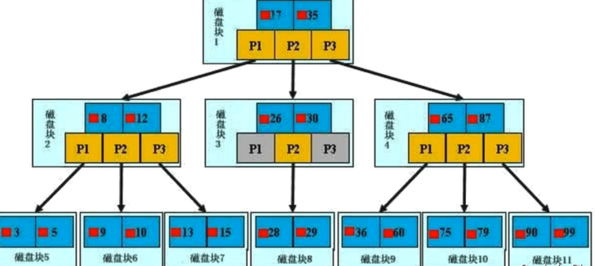

# 存储引擎

查看 mysql 支持的存储引擎

```sql
show engines;
```

查看mysql默认存储引擎

```sql
show variables like '%storage_engine%';
```

MyISAM 引擎和 InnoDb 引擎的对比


参考 ：[https://blog.csdn.net/chai471793/article/details/99563704](https://)

#  Btree 

缩放复制
一颗 b 树， 浅蓝色的块我们称之为一个磁盘块， 可以看到每个磁盘块包含几个数据项（深蓝色所示） 和指针（黄色所示）
如磁盘块 1 包含数据项 17 和 35， 包含指针 P1、 P2、 P3
P1 表示小于 17 的磁盘块， P2 表示在 17 和 35 之间的磁盘块， P3 表示大于 35 的磁盘块
真实的数据存在于叶子节点和非叶子节点中**【查找过程】**
如果要查找数据项 29， 那么首先会把磁盘块 1 由磁盘加载到内存， 此时发生一次 IO， 在内存中用二分查找确定 29在 17 和 35 之间， 锁定磁盘块 1 的 P2 指针， 内存时间因为非常短（相比磁盘的 IO） 可以忽略不计通过磁盘块 1的 P2 指针的磁盘地址把磁盘块 3 由磁盘加载到内存， 发生第二次 IO， 29 在 26 和 30 之间， 锁定磁盘块 3 的 P2 指针通过指针加载磁盘块 8 到内存， 发生第三次 IO， 同时内存中做二分查找找到 29， 结束查询， 总计三次 IO。

# B+tree 

缩放复制
**【B+Tree 与 BTree 的区别】**B-树的关键字（数据项）和记录是放在一起的； B+树的非叶子节点中只有关键字和指向下一个节点的索                        引， 记录只放在叶子节点中。

**【B+Tree 与 BTree 的查找过程】**
在 B 树中， 越靠近根节点的记录查找时间越快， 只要找到关键字即可确定记录的存在； 而 B+ 树中每个记录的查找时间基本是一样的， 都需要从根节点走到叶子节点， 而且在叶子节点中还要再比较关键字。从这个角度看 B 树的性能好像要比 B+ 树好， 而在实际应用中却是 B+ 树的性能要好些。 因为 B+ 树的非叶子节点不存放实际的数据，这样每个节点可容纳的元素个数比 B 树多， 树高比 B 树小， 这样带来的好处是减少磁盘访问次数。尽管 B+ 树找到一个记录所需的比较次数要比 B 树多， 但是一次磁盘访问的时间相当于成百上千次内存比较的时间， 因此实际中B+ 树的性能可能还会好些， 而且 B+树的叶子节点使用指针连接在一起， 方便顺序遍历（范围搜索）， 这也是很多数据库和文件系统使用 B+树的缘故。

