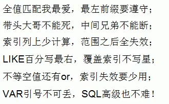

# 索引优化

## 什么时候需要建立索引

1. 主键自动建立唯一索引
2. 频繁作为查询的条件的字段应该创建索引
3. 查询中与其他表关联的字段，外键关系建立索引
4. 频繁更新的字段不适合创建索引
5. Where 条件里用不到的字段不创建索引
6. 单间/组合索引的选择问题，Who？（在高并发下倾向创建组合索引）
7. 查询中排序的字段，排序字段若通过索引去访问将大大提高排序的速度
8. 查询中统计或者分组字段

## 单表如何添加索引

1. 给经常查询的字段添加索引
2. 尽量添加联合索引
3. 联合索引若为3个及以上字段 col1 col2 col3  则在查询时 col2 不应该使用范围查找 会引起索引失效
   1. 这是因为按照B+Tree索引的工作原理，先排序 Col1，如果遇到相同的 Col1则再排序col2，如果遇到相同的 col2则再排序 col3。
   2. 当col2 字段在联合索引里处于中间位置时，因为col2>1条件是一个范围值（所谓 range），MySQL 无法利用索引再对后面的views部分进行检索，即 range 类型查询字段后面的索引无效。
4. 索引字段一般不超过5个

## 双表：左右连接如何添加索引

** 左连接给右表添加索引 ，右连接给左表添加索引**

1. left join 条件用于确定如何从右表搜索行。结果集左边数据全部包含，右表数据部分包含，应该给右表添加索引。right join 同理；
2. LEFT JOIN条件用于确定如何从右表搜索行，左边一定都有，所以右边是我们的关键点，一定需要建立索引。
3. RIGHT JOIN条件用于确定如何从左表搜索行，右边一定都有，所以左边是我们的关键点，一定需要建立索引。
4. 编写双表连接时，尽量使用小表驱动大表，索引建立在大表上。

## 三表 如何添加索引

给被驱动表添加索引

## 如何添加索引结论

1. 尽可能减少join语句中的NestedLoop的循环总次数     NestedLoop=嵌套循环
2. 小结果集驱动大结果集  
3. 优先优化nestedloop 的内层循环
4. 保证join语句中被驱动表上的join字段被索引
5. 无法保证被驱动表的join条件字段被索引并且内存资源充足的前提下不要吝啬JoinBuffer的设置

## 如何编写高效查询SQL

```sql
table{
col1
col2
col3
col4
col5
}
idx(col1,col2,col3,col4) ;

```

1. 全值匹配（查询条件或结果与索引一致）
   ```sql
   select * from table where col1=? and col2=? and col3=? and col4=? 
   ```
2. **<u>最佳左前缀法则</u>**：如果组合索引含多个字段，要遵守最左前缀法则。指的是**查询从索引的最左前列开始并且不跳过索引中的列**。 必须col1开始，不能跳过col2 ，col3，否则索引可能会失效或部分失效
   ```sql
   select * from table where col1=? and col2=? ; --部分使用索引 col1 col2
   select * from table where col1=? and col3=? and col4=? --部分使用索引  col1
   select * from table where col2=? and col3=? and col4=?  --无法使用索引
   ```
3. **不在索引列上做任何操作**（计算、函数、（自动or手动）类型转换），会导致索引失效而转向全表扫描
   
   <br/>
4. 存储引擎不能使用**索引中范围条件右边的列**
   ```sql
   --返回查询右侧列全部失效
   --部分使用索引 col1 col2 col1用于定位col2 用于排序
   select * from table where col1=? and col2>=? and col3=? and col4=? 
   --部分使用索引 col1  用于排序  
   select * from table where col1 >=? and col2=? and col3=? and col4=?
   
   ```
5. **尽量使用覆盖索引**（只访问索引的查询（索引列和查询列一致）），**减少select ***, **按需取数据**
6. mysql在**使用不等于（!=或者<>）的时候无法使用索引会导致全表扫描**
7. is null，is not null 也无法使用索引（早期版本不能走索引，后续版本应该优化过，可以走索引）
8. like以通配符开头全表扫描，索引失效 ，**不能%开头**
   ```sql
   select * from table where col1 like '%xxx%'；-- 索引失效
   select * from table where col1 like '%xxx'；-- 索引失效
   select * from table where col1 like 'xxx%'；-- 索引不失效 索引range范围查找
   
   --必须要使用左右百分号的查询，可以考虑使用覆盖索引名来解决
   
   select col1,col2,col3,col4 from table where col1 like '%xxx%'；-- 索引不失效 index 覆盖索引 
   ```
9. **字符串不加单引号索引失效 **
   ```sql
   --VARCHAR 类型  不加引号必定失效
   
   ```
10. **少用or，用它连接时会索引失效**

<br/>



<br/>

# 查询优化

### 永远小表驱动大表

**小的数据集驱动大的数据集**

IN 与EXISTS区别

```sql
--IN
select * from table where col in (subquery)
--将子查询的结果，作为主查询的查询条件

```

```sql
--EXISTS
select * from table where exists (subquery)
--将主查询的数据，放到子查询中做条件验证，根据验证结果，决定主查询数据是否保留

```

案例分析：

```sql
--例子
select * from A where id in (select AID from B);
--按照执行计划
--1. select * from B
--2. select * from A where ID= drive;
--此时属于B数据集驱动A数据集
select * from A where exists(select 1 from B where B.aid=A.id);
--按照执行计划
--1. select * from A
--2. select * from B where B.ID= A.ID;
--此时属于A数据集驱动B数据集

--结论： B数据集小的时候，使用IN 更好  A数据集小的时候 exists更好

```

# 排序优化

```sql
table {
  col1;
  col2;
  col3;
  col4;
}
idx_col12(col1.col2,col3);
```

1. order by 尽量使用index排序  不使用filesort排序（最左前缀，同升同降）
   ```sql
   select col1 from table where ???  order by col1;--index排序
   select col1 from table where ???  order by col2;--filesort排序
   select col1 from table where ???  order by col1,col2;--index排序
   select col1 from table where ???  order by col2,col1;--filesort排序  排序的先后顺序会影响索引，查询不会
   
   select col1 from table where ???  order by col1,col2 desc;--filesort排序
   select col1,col2 from table where col1='xxx' order by col2; --index排序 
   select col1,col2 from table where col1='xxx' order by col3; --filesort排序 缺col2 断层
   select col1,col2 from table where col4='xxx' order by col2; --filesort排序
   select col1,col2 from table where col1 in('xxx','xxx') order by col2; --filesort排序 col1 范围
   select col1,col2 from table where col1 > 'xxx' order by col2; --filesort排序 col1 范围
   select col1,col2 from table where col1 like 'xxx%' order by col2; --filesort排序 col1 范围
   
   --大忌！！！千万别写select*
   --filesort排序 因为字段col3 col4不在索引队列上会产生filesort
   select *  from table where ???  order by col1;
   
   ```
2. mysql能为排序与查询使用相同的索引（单次查询只能使用1个索引）
3. 提高max_length_for_sort_data 和sort_buffer_size 缓冲区大小

***

**关于Filesort文件内排序**

**Filesort 排序**

当查询的字段大小综合小于max_length_for_sort_data而且排序字段不是大字段（TEXT|BLOB）类型时，会用改进后的算法---单路排序，否则用老算法---多路排序。

- 双路排序：Mysql4.1之前是使用双路排序，字面的意思就是两次扫描磁盘，最终得到数据，读取行指针和ORDER BY列，对他们进行排序，然后扫描已经排好序的列表，按照列表中的值重新从列表中读取对数据输出。也就是从磁盘读取排序字段，在buffer进行排序，再从磁盘读取其他字段。文件的磁盘IO非常耗时的。
- 单路排序：在Mysql4.1之后，出现了第二种算法，就是单路排序。从磁盘读取查询所需要的所有列，按照ORDER BY在buffer对它进行排序，然后扫描排序后的列表进行输出，它的效率更快一些，避免了第二次读取数据。并且把随机IO变成了顺序IO，但是它会使用更多的空间，因为它把每一行都保存在了内存里。

**Filesort在内存还是磁盘排序？**

- MySQL 中的 Filesort 并不一定是在磁盘文件中进行排序的，也有可能在内存中排序，内存排序还是磁盘排序取决于排序的数据大小和 sort_buffer_size 配置的大小。
- 如果 “排序的数据大小” < sort_buffer_size: 内存排序
如果 “排序的数据大小” >sort_buffer_size: 磁盘排序

**select   +Order by **

- 如果写select * from table order by col 按照 单路排序，从表中查询所有列，可能会导致 查询列的数据大于sort_buff_size 
- 假设只需要查10个字段，但是SELECT *会查80个字段，那么就容易把sort_buffer缓冲区用满。
两种算法的数据都有可能超出sort_buffer的容量，超出之后，会创建tmp文件进行合并排序，导致多次I/O，但是用单路排序算法的风险会更大一些，所以要提高sort_buffer_size大小。

***

# 分组优化

**group by 优化与Order by 大致相同，group by 实际是先排序后分组**

where 高于having 能在where写的不要再having写
