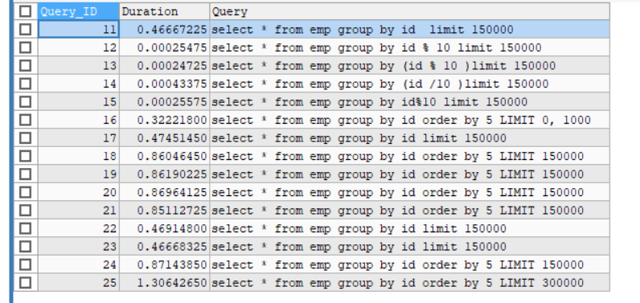
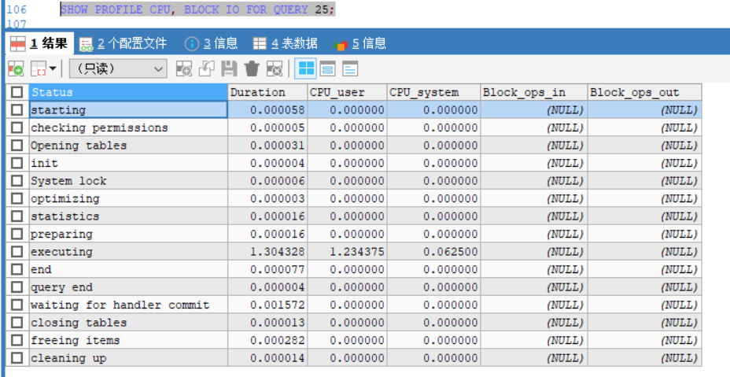

# MySQL 性能

## 常见性能瓶颈

CPU 瓶颈：CPU在饱和的时候一般发生在数据装入在内存或从磁盘上读取数据时候
IO 瓶颈：磁盘I/O瓶颈发生在装入数据远大于内存容量时
服务器硬件的性能瓶颈：top、free、iostat和vmstat来查看系统的性能状态

## MySQL Query Optimizer 查询优化器

1. MySQL 中有专门负责优化SELECT语句的优化器模块，主要功能：通过计算分析系统中收集到的统计信息，为客户端请求的Query提供他认为最优的执行计划（MySQL认为最优的数据检索方式，但不见得是DBA认为是最优的，这部分最耗费时间）
2. 当客户端向MySQL 请求一条Query，命令解析器模块完成请求分类，区别出是SELECT并转发给MySQL Query Optimizer时，MySQL Query Optimizer 首先会对整条Query进行优化，处理掉一些常量表达式的预算，直接换算成常量值。并对Query中的查询条件进行简化和转换，如去掉一些无用或显而易见的条件、结构调整等。然后分析 Query中的Hint信息（如果有），看显示Hint信息是否可以完全确定该Query的执行计划。如果没有Hint 或Hint 信息还不足以完全确定执行计划，则会读取所涉及对象的统计信息，根据Query进行写相应的计算分析，然后再得出最后的执行计划。

# Explain 执行计划

## 语法

```sql
mysql> explain select * from tbl_emp;
+----+-------------+---------+------+---------------+------+---------+------+------+-------+
| id | select_type | table   | type | possible_keys | key  | key_len | ref  | rows | Extra |
+----+-------------+---------+------+---------------+------+---------+------+------+-------+
|  1 | SIMPLE      | tbl_emp | ALL  | NULL          | NULL | NULL    | NULL |    8 | NULL  |
+----+-------------+---------+------+---------------+------+---------+------+------+-------+
```

## ID 

**（select查询的序列号，包含一组数字，表示查询中执行select子句或操作表的顺序）**

  ID值越大越先执行，ID值相同从上往下执行(按照explain执行结果)。

## select_type

**查询的类型，主要用于区别普通查询、联合查询、子查询等复杂查询**

|||
|--|--|
|SIMPLE|简单的select查询，查询中不包含子查询或者UNION|
|PRIMARY|查询中若包含任何复杂的子部分，最外层查询则被标记为PRIMARY|
|SUBQUERY|在SELECT或者WHERE列表中包含了子查询|
|DERIVED|在FROM列表中包含的子查询被标记为DERIVED（衍生）<br/>MySQL会递归执行这些子查询，把结果放在临时表里|
|UNION|若第二个SELECT出现在UNION之后，则被标记为UNION；<br/>若UNION包含在FROM子句的子查询中，外层SELECT将被标记为：DERIVED|
|UNION RESULT|从UNION表获取结果的SELECT|

## table  表名

## type 访问类型

**type显示的是访问类型，是较为重要的一个指标，结果值从最好到最坏依次是：**

**一般来说，得保证查询至少达到range级别，最好能达到ref**

system>const>eq_ref>ref>fultext>ref_or_null>index_merge>unique_subquery>index_subquery>range>index>ALL
**system>const>eq_ref>ref>range>index>ALL**

<br/>

1. **system**：表只有一行记录（等于系统表），这是const类型的特例，平时不会出现，这个也可以忽略不计
2. **const**：表示通过索引一次就找到了，const用于比较primary key或者unique索引。因为只匹配一行数据，所以很快。如将主键置于where列表中，MySQL就能将该查询转换为一个常量
3. **eq_ref**：唯一性索引，对于每个索引键，表中只有一条记录与之匹配，常见于主键或唯一索引扫描
4. **ref**：非唯一索引扫描，返回匹配某个单独值的所有行。本质上也是一种索引访问，它返回所有匹配某个单独值的行，然而，它可能会找到多个符合条件的行，所以他应该属于查找和扫描的混合体
5. **range**：只检索给定范围的行，使用一个索引来选择行。key列显示使用了哪个索引一般就是在你的where语句中出现了between、<、>、in等的查询这种范围扫描索引扫描比全表扫描要好，因为他只需要开始索引的某一点，而结束于另一点，不用扫描全部索引
6. **index：Full **Index Scan，index与ALL区别为index类型只遍历索引树。这通常比ALL快，因为索引文件通常比数据文件小。（也就是说虽然all和index都是读全表，但index是从索引中读取的，而all是从硬盘数据库文件中读的）
7. **all**： Full  Table Scan， 全表扫描

## possible_keys 可能使用的索引

显示可能应用在这张表中的索引，一个或多个
若查询涉及的字段上存在索引，则该索引将被列出，但不一定被查询实际使用

## key  实际使用的索引

实际使用的索引，如果为null，则没有使用索引

若查询中使用了覆盖索引，则该索引仅出现在key列表中

## key_len 索引字节数

1. 表示索引中使用的字节数，可通过该列计算查询中使用的索引的长度。在不损失精确性的情况下，**长度越短越好**
2. key_len显示的值为索引最大可能长度，并非实际使用长度，即key_len是根据表定义计算而得，不是通过表内检索出的

## ref 索引字段

显示**索引哪一列被使用了**，如果可能的话，最好是一个常数。

哪些列或常量被用于查找索引列上的值

<br/>

## rows 需要读取的行数

获得查询结果需要读取的行数，结果正确，越小越好

## Extra  非常重要的额外信息

1. ### **Using filesort（文件排序）**
   
   MySQL中无法利用索引完成排序操作成为“文件排序”，说明mysql会对数据使用一个外部的索引排序，而不是按照表内的索引顺序进行读取，**需要尽快优化**
2. ### **Using temporary（创建临时表）**
   
   使用了临时表保存中间结果，MySQL在对查询结果排序时使用临时表。
   
   常见于排序 order by 和分组查询 group by,**需要立即优化 SQL**!!!  
   
   order by 和group by  sql编写优化，索引添加
3. ### **Using index：**
   
   使用到了覆盖索引**，Covering Index，也说为覆盖索引**
   
   如果同时**出现using where**，表明索引被用来执行索引键值的查找 **where条件查找用到了用了索引**
   如果同时**没有出现using where**，表明索引用来读取数据而非执行查找动作  ** select 查询的字段用了索引**
   
   **覆盖索引**：就是s**elect的数据列只用从索引中就能够取得，不必读取数据行**，MySQL可以利用索引返回select列表中的字段，而不必根据索引再次读取数据文件，换句话说查询列要被所建的索引覆盖。
   
   如果要使用覆盖索引，一定要注意select列表中只取出需要的列，不可select * ，因为如果将所有字段一起做索引会导致索引文件过大，查询性能下降。
4. ### **Using where：表明使用了where过滤**
5. ### **Using join buffer：表明使用了连接缓存**
   
   可以考虑适当调整连接缓存大小
6. ### **impossible where**
   
   where子句的值总是false，不能用来获取任何元组    where 1!=1;
7. ### **select tables optimized away**
   
   在没有GROUPBY子句的情况下，基于索引优化MIN/MAX操作或者对于MyISAM存储引擎优化COUNT(*)操作，不必等到执行阶段再进行计算，查询执行计划生成的阶段即完成优化。
8. ### **distinct**
   
   优化distinct，在找到第一匹配的元组后即停止找同样值的工作

# 开启Sql慢查询日志

## 查询参数及设置

```sql
--查询
show variables like '%slow_query_log%';
--开启 当前库生效 mysql重启后失效
set global slow_query_log = 1;
--永久生效 修改配置文件 my.conf
slow_query_log = 1
slow_query_log_file = /opt/mysql/mysql-slow.log  --配置一个路径下的文件即可
log_output = FILE
--多久是慢SQL 默认10s  >10s 是慢SQL
--查询
SHOW VARIABLES LIKE '%long_query_time%';
--设置
SET GLOBAL long_query_time = 3 ; --任意秒值 需要重新连接才能查询到
--永久生效 修改配置文件 my.conf
long_query_time = 3
--查询有多少条慢SQL记录
show global status like '%Slow_queries%';
```

## mysqldumpslow工具使用

```sql
-s，是order的顺序

al  平均锁定时间

ar  平均返回记录时间

at  平均查询时间（默认）

c    计数

l    锁定时间

r    返回记录

t    查询时间
```

```sql
-t，是top n的意思，即为返回前面多少条的数据
-g，后边可以写一个正则匹配模式，大小写不敏感的
-s 按照那种方式排序
    c：访问计数
    l：锁定时间
    r:返回记录
    al：平均锁定时间
    ar：平均访问记录数
    at：平均查询时间
```

```sqlserver
-- 得到返回记录集最多的10个SQL
mysqldumpslow -s r -t 10 /var/lib/mysql/Heygo-slow.log
-- 得到访问次数最多的10个SQL
mysqldumpslow -s c- t 10/var/lib/mysql/Heygo-slow.log
-- 得到按照时间排序的前10条里面含有左连接的查询语句
mysqldumpslow -s t -t 10 -g "left join" /var/lib/mysql/Heygo-slow.log
-- 另外建议在使用这些命令时结合 | 和more使用，否则有可能出现爆屏情况
mysqldumpslow -s r -t 10 /var/lib/mysql/Heygo-slow.log | more
```

# showProfile

- 参数查询及日志

```sql
--查看 Show Profile 是否开启
show variables like ‘profiling%’; 
--开启 Show Profile
set profiling=on; 
```

- 编写测试SQL
  ```sql
  select * from emp group by id%10 limit 150000;
  select * from emp group by id%10 limit 150000;
  select * from emp group by id%20 order by 5;
  ```
- 查看结果 show profiles; 
  
  
- 诊断SQL
  ```sql
   --查看 SQL 语句执行的具体流程以及每个步骤花费的时间
  show profile cpu, block io for query SQL编号;
  
  ALL：显示所有的开销信息
  BLOCK IO：显示块IO相关开销
  CONTEXT SWITCHES：上下文切换相关开销
  CPU：显示CPU相关开销信息
  IPC：显示发送和接收相关开销信息
  MEMORY：显示内存相关开销信息
  PAGE FAULTS：显示页面错误相关开销信息
  SOURCE：显示和Source_function，Source_file，Source_line相关的开销信息
  SWAPS：显示交换次数相关开销的信息
  ```



- **重点关注！！！！**

1. converting HEAP to MyISAM：查询结果太大，内存都不够用了往磁盘上搬了。
2. Creating tmp table：创建临时表，mysql 先将拷贝数据到临时表，然后用完再将临时表删除
3. Copying to tmp table on disk：把内存中临时表复制到磁盘，危险！！！
4. locked：锁表

# 全局日志

- sql命令行配置方式配置

```sql
set global general_log=1;
set global log_output='TABLE';
```

- 配置文件方式配置 my.cnf

```sh
# 开启
general_log=1

# 记录日志文件的路径
general_log_file=/path/logfile

# 输出格式
log_output=FILE
```

- 查看日志记录

```sql
select * from mysql.general_log;
```