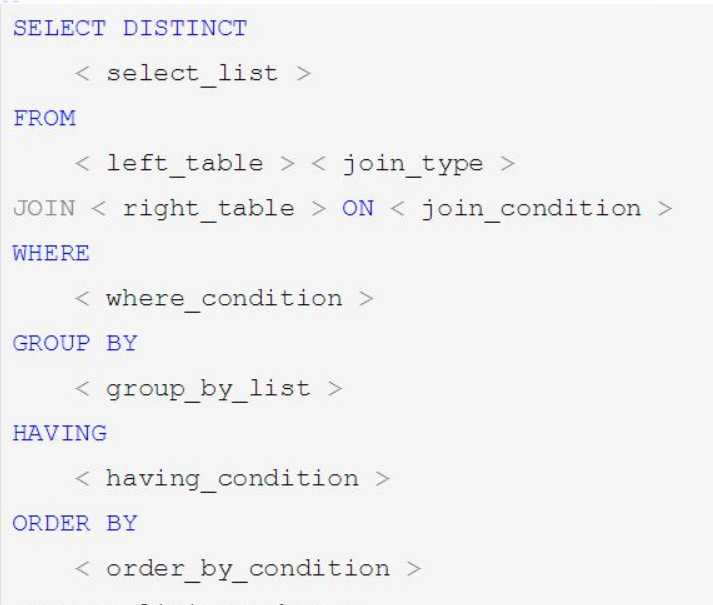
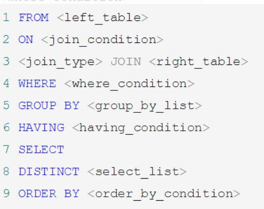
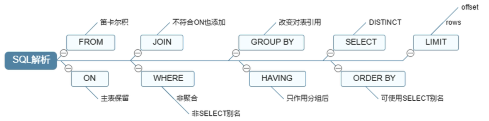
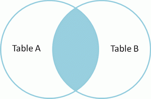
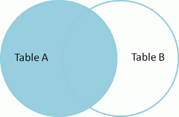
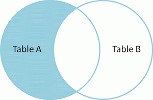
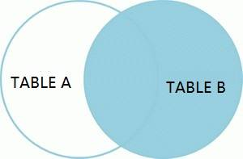
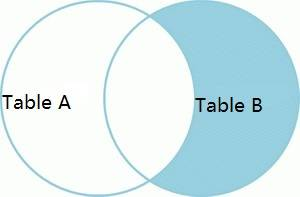
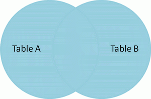
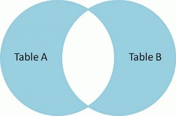

# 常用SQL

```sql
--查询所有database;
show databases;
--查询此空间下所有表
show tables;
--查询词表所有索引
show index from table_name;
--查询mysql支持的存储引擎
show engines;

--查询mysql的变量
show variables like '%%' 

--添加索引=
create index idx_name on table_name(col_name,col_name......) ;
alter table table_name add index idx_name(col_name,col_name......) ;
--删除索引
DROP INDEX index_name ON table_name;
ALTER TABLE table_name DROP INDEX index_name;
```

#  SQL解析

- **手写SQL**



- **机读SQL**



- **处理流程图**



# 七种连接

## 1. 内连接 

### inner join



```sql
select * from A inner join B on A.col = B.col ; 
```

## 2. 左外连接 

### left join （LEFT OUTER JOIN 的简写）

- 左外连接以左表为准，右表补齐null



```sql
select * from A left join B  on A.col = B.col;
```

## 3. 左连接 

### left join + where right_table.col is null

- 左连接以左表为准，去掉A B 表内连接



```sql
select * from A left join B on  A.col = B.col where B.col is null;
```

## 4. 右外连接 

### right join（right OUTER JOIN 的简写）

- 右外连接以右表为准，左表补齐null



```sql
select * from A right join B on A.col = B.col;
```

## 5.右连接 

### right join + where left_table.col is null

- 右连接以右表为准，去掉A B 表内连接



```sql
select * from A right join B on A.col = B.col where A.col is null;
```

## 6.全连接 

### FULL   JOIN（ FULL outer   JOIN 简写）

<br/>



<br/>

```sql
SELECT * FROM A FULL  JOIN B ON A.col = B.col; --Mysql不支持 oracle支持

-- mysql 采用 左外连接+ 右外连接结果集即可
select * from A left join B  on A.col = B.col
union 
select * from A right join B on A.col = B.col;
```

##  7 全外链接 

### full join + where left_table.col is null or right_table.col is null



```sql
SELECT * FROM A FULL JOIN B ON A.col = B.col where A.col is null or B.col is null; --Mysql不支持 oracle支持

----mysql 采用 左连接+ 右连接结果集即可
select * from A left join B  on A.col = B.col where B.col is null
union 
select * from A right join B on A.col = B.col where A.col is null;
```
