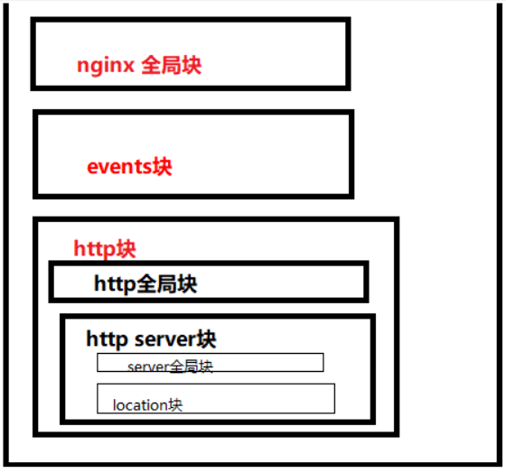
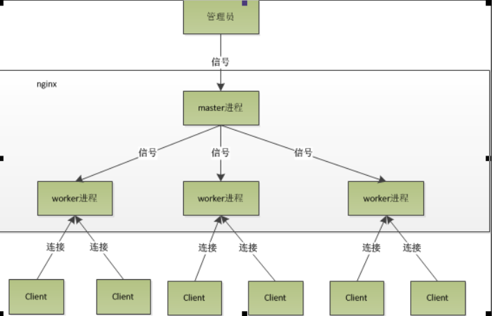

# Nginx

## 特点

​			Nginx 是高性能的http和  反向代理服务器，使用的是异步非阻塞IO模型，IO多路复用

## 安装

1. 安装依赖
	
	```bash
	yum -y install make zlib zlib-devel gcc-c++ libtool  openssl openssl-devel
	```
	
2. 安装 prce

  ```bash
  tar zxvf pcre-8.35.tar.gz
  cd pcre-8.35
  ./configure
  make && make install
  ```

3. 安装 nginx

  ```bash
  tar -zxvf nginx-1.20.0.tar.gz 
    cd nginx-1.20.0/
    ./configure 
   make
   make install
  cd /usr/local/nginx 
  ./nginx -v
  ```

4. ```bash
   ##启动 	
   ./nginx
   #停止	
   ./nginx -s stop
   ##重新加载 	
   ./nginx -s reload 
   ```

## 配置文件

 

- nginx全局块：
  - 配置影响nginx全局的指令。一般有运行nginx服务器的用户组，nginx进程pid存放路径，日志存放路径，配置文件引入，允许生成worker process数等。
- events块：
  - 配置影响nginx服务器或与用户的网络连接。有每个进程的最大连接数，选取哪种事件驱动模型处理连接请求，是否允许同时接受多个网路连接，开启多个网络连接序列化等。
- http块：
  - 可以嵌套多个server，配置代理，缓存，日志定义等绝大多数功能和第三方模块的配置。如文件引入，mime-type定义，日志自定义，是否使用sendfile传输文件，连接超时时间，单连接请求数等。
- server块：
  - 配置虚拟主机的相关参数，一个http中可以有多个server。
- location块：
  - 配置请求的路由，以及各种页面的处理情况。

```tex
############全局块  Begin ###########################
#user  nobody;
worker_processes  1;
#error_log  logs/error.log;
#error_log  logs/error.log  notice;
#error_log  logs/error.log  info;
#pid        logs/nginx.pid;
############全局块 End ###########################
#############events块 Begin ######################
events {
    worker_connections  1024;
}
#############events块 End ######################
#############http 块 Begin ######################
http {
	#######http全局块 begin
    include       mime.types;
    default_type  application/octet-stream;
#log_format  main  '$remote_addr - $remote_user [$time_local] "$request" '
#                  '$status $body_bytes_sent "$http_referer" '
#                  '"$http_user_agent" "$http_x_forwarded_for"';

#access_log  logs/access.log  main;

sendfile        on;
#tcp_nopush     on;

#keepalive_timeout  0;
keepalive_timeout  65;

#gzip  on;
#######http全局块 end
#######http server  start
server {
    listen       80;
    server_name  localhost;

    #charset koi8-r;

    #access_log  logs/host.access.log  main;

    location / {
        root   html;
        index  index.html index.htm;
    }

    #error_page  404              /404.html;

    # redirect server error pages to the static page /50x.html
    #
    error_page   500 502 503 504  /50x.html;
    location = /50x.html {
        root   html;
    }

}

#######http server  end
}
```


## 反向代理

### 概念

- 正向代理： 我们通过代理服务器访问一个网站www.abc.com，客户端配置代理服务器，有代理服务器进行转发请求，访问网站www.abc.com   生活中常用的就是海外代理服务器上外网
- 反向代理：客户端访问网站，网站设计架构中服务器tomcat前设置了代理服务器nginx，代理服务器配置了相应的路由策略，将客户端的请求转发到服务器上。这就是反向代理，客户端无感，反向代理服务器将客户端请求转发到服务器

### 配置

​			nginx安装在 192.168.121.132机器  

​			实现: 访问nginx所在服务器80端口时，nginx会把请求发到代理的proxy_pass上去 

1.  修改server 块监听端口，server_name改为ip地址，不改也行

    ```tex
      server {
        listen       80;
        server_name  192.168.121.131;
    ```
    
2.  修改 location 块，添加proxy_pass代理地址  131 的tomcat

    ```java
        location / {
    	proxy_pass	http://192.168.121.131:8080;
        root   html;
        index  index.html index.htm;
    }
    ```


3. 配置 nginx安装在 192.168.121.132机器

   ```tex
   http://192.168.121.132:8000/edu/a.html         转到133 服务器tomcat 
   http://192.168.121.132:8000/chen/b.html	       转到131 服务器tomcat 
   
   localtion  后/chen/ 表示 以chen 开头的请求  
   
   server {
           listen       8000;
           server_name   mylistener;
           location /chen/ {
               proxy_pass	http://192.168.121.131:8080;
               root   html;
               index  index.html index.htm;
           }
             location /edu/ {
               proxy_pass	http://192.168.121.133:8080;
               root   html;
               index  index.html index.htm;
           }
       }
   
   ```

## 负载均衡

### 配置

1. http块添加 	upstream 
	
	```tex
	upstream myserver{
		server	192.168.121.131:8080;
		server	192.168.121.133:8080;
	} 
	```
	
2. server 块 代理地址改为upstream  的名字

   ```tex
   server {
       listen       8001;
       server_name   mylistener2;
       location /lb/ {
   		proxy_pass	http://myserver;
           root   html;
           index  index.html index.htm;
       }
   }
   ```

### load balance策略

- 默认的负载均衡策略是轮询

  ```tex
  upstream myserver{
      server	192.168.121.131:8080;
      server	192.168.121.133:8080;
  } 
  ```

  

- 权重 weight： weight默认=1  越大权重越高

  ```tex
  upstream myserver{
      server	192.168.121.131:8080	weight=2;
      server	192.168.121.133:8080	weight=10;
  } 
  ```

-   ip_hash

  负载均衡器按照基于客户端IP的分配方式，这个方法确保了相同的客户端的请求一直发送到相同的服务器，以保证session会话。这样每个访客都固定访问一个后端服务器，可以解决session不能跨服务器的问题

  ```tex
  upstream myserver{
      ip_hash;
      server	192.168.121.131:8080	weight=2;
      server	192.168.121.133:8080	weight=10;
  }   
  注意：
  在nginx版本1.3.1之前，不能在ip_hash中使用权重（weight）
  ```

- fair 按照服务器端的响应时间来分配请求，响应时间短的优先分配

  ```tex
  upstream myserver{
      server	192.168.121.131:8080;
      server	192.168.121.133:8080;
      fair; 
  }  
  ```

-  least_conn 请求转发给连接数较少的后端服务器

  ```tex
  upstream myserver{
      least_conn;
      server	192.168.121.131:8080;
      server	192.168.121.133:8080;
  }  
  ```

### 参数

- max_fails

  ​			设置在fail_timeout参数设置的时间内最大失败次数，如果在这个时间内，所有针对该服务器的请求都失败了，那么认为该服务器会被认为是停机了，

- fail_time

  ​			服务器会被认为停机的时间长度,默认为10s。

- backup

  ​			标记该服务器为备用服务器。当主服务器停止时，请求会被发送到它这里。

- down

  ​			标记服务器永久停机了。

  ```tex
  ## fail_timeout与max_fails结合使用。
   server localhost:8083   max_fails=3 fail_timeout=20s;
  
  ```

## 动静分离

### 概念

### 配置

1. 创建静态目录
	
	```tex
	在nginx 所在服务器跟目录创建/chen/html  文件夹及  /chen/photo 文件夹
	分别放入html文件及图片
	```
	
2. 配置nginx,指定相关目录

  ```tex
  server {
       listen       8000;
       server_name   mylistener;                     
       location /html/ {
           root   /chen/;		#服务器目录
           index  index.html index.htm;
       }
         location /photo/ {
           root	/chen/;  #服务器目录
           autoindex on;  #列表 支持显示文件列表
       }
   }
  ```

## 高可用配置

### 安装	

- 2台服务器安装nginx keepalived

  ```bash
  yum install keepalived -y
  ```

### 配置

1. 修改主机和备机 /etc/keepalived/keepalived.conf  注意修改  

   ```tex
   # 全局配置
   global_defs {
   #	notification_email {
   #	  acassen@firewall.loc
   #	  failover@firewall.loc
   #	  sysadmin@firewall.loc
   #	}
   # script_user root
   #enable_script_security
   #notification_email_from Alexandre.Cassen@firewall.loc
   #smtp_ server 192.168.227.3 
   #smtp_connect_timeout 30
   	router_id cloud_1	                     # hostname 记得把主机名和ip映射配置到/etc/hosts
   }
   # 检测脚本配置
   vrrp_script chk_http_ port {
     # 脚本路径
   	script "/usr/local/src/nginx_check.sh"    # 检查nginx是否运行脚本
   	interval 2                                # (检测脚本执行的间隔)2s
   	weight 2                                  #权重，如果这个脚本检测为真，服务器权重+2
   }
   vrrp_instance VI_1 {
     # 标识主/从服务器
   	state MASTER                            #备份服务器上将 MASTER 改为 BACKUP
     # 绑定网卡 通过 ifconfig 查看
   	interface ens33                         #网卡名称
     # 主/从服务器的路由id
   	virtual_router_id 51                    #主、备机的virtual_router_id必须相同
     # 优先级
   	priority 100                            #主、备机取不同的优先级，主机值较大，备份机值较小
   	advert_int 1	                        #每隔1s发送一次心跳
     # 权限校验配置
   	authentication {						# 校验方式， 类型是密码，密码1111
           auth type PASS
           auth pass 1111
       }
     # 虚拟ip配置
   	virtual_ipaddress { 				# 虛拟ip
   		192.168.121.140 				# VRRP 虛拟ip地址
   	}
   }
   ```

2. 编写检查脚本 nginx_check.sh

   ```bash
   #!/bin/bash
   A=`ps -C nginx --no-header | wc -l`
   if [ $A -eq 0 ];then
       /usr/local/nginx/sbin/nginx
       sleep 4
       if [ `ps -C nginx --no-header | wc -l` -eq 0 ];then
           killall keepalived
       fi
   fi
   ```

3. 启动

   1. 分别启动两个机器的nginx
   2. 分别启动两个机器的 keepalived
      	systemctl start keepalived.service

## 工作原理



1. 在nginx启动后，**会有一个master进程和多个worker进程**
   1. **master进程主要用来管理worker进程**
      接受信号，将信号分发给worker进程，监听worker进程工作状态，当worker进程退出时(非正常)，启动新的worker进程。
   2. **worker进程处理基本的网络事件**。
      - 多个worker进程之间是对等的，他们同等竞争来自客户端的请求，各进程互相之间是独立的 。一个请求，只可能在一个worker进程中处理，一个worker进程，不可能处理其它进程的请求。 
      - worker进程的个数是可以设置的，一般我们会设置与机器cpu核数一致，这里面的原因与nginx的进程模型以及事件处理模型是分不开的 。
2. **worker进程是如何处理用户的请求呢**？
   1. 首先master会根据配置文件生成一个监听相应端口的socket，然后再faster出多个worker进程，这样每个worker就可以接受从socket过来的消息（其实这个时候应该是每一个worker都有一个socket，只是这些socket监听的地址是一样的）。
   2. 当一个连接过来的时候，每一个worker都能接收到通知，但是只有一个worker能和这个连接建立关系，其他的worker都会连接失败，这就是所谓的惊群
   3. 为了解决惊群问题，nginx提供一个共享锁accept_mutex，有了这个共享锁后，就会只有一个worker去接收这个连接。当一个worker进程在accept这个连接之后，就开始读取请求，解析请求，处理请求，产生数据后，再返回给客户端，最后才断开连接，这样一个完整的请求就是这样的了。
3. 当master接收到重新加载的信号会怎么处理(./nginx -s reload)
   - master会重新加载配置文件，然后启动新的进程，使用的新的worker进程来接受请求，并告诉老的worker进程他们可以退休了，老的worker进程将不会接受新的，老的worker进程处理完手中正在处理的请求就会退出。
4. nginx 支持的最大并发数
   - 静态请求	worker * worker支持最大连接数 /2
   - 反向代理	worker * worker支持最大连接数 /4

## Demo

Windows→hosts→虚拟机Nginx→gateway 网关→微服务

1. 配置 域名对应的IP  修改windows hosts 文件

   ```tex
   # 虚拟机地址
   192.168.121.150 gulimall.com
   ```

   

2. 配置nginx  负载均衡 

   ```tex
   #  server 为 gateway 网关的地址 端口
   upstream gulimall{
   	server 192.168.121.100:88;
   }
   # 监听 80 端口 所有请求 负载均衡到 网关  ； 转发是设置 host信息，不然会丢失，影响 gateway进行 host断言
   server {
       listen       80;
       listen  [::]:80;
       server_name  gulimall.com;
       location / {
           proxy_set_header Host $host;
           proxy_pass http://gulimall;
       }
   }
   ```

   

3. 配置 gateway网关的路由， 根据host信息 负载均衡到指定的微服务product上

   ```yaml
   spring:
     application:
       name: gateway
     cloud:
       nacos:
         discovery:
           server-addr: localhost:8848
       gateway:
         discovery:
           locator:
             enabled: true  #开启服务发现，配置服务名称进行动态路由
         routes:
   	- id: gulimall_host_route
    uri: lb://product
    predicates:
      - Host=**.gulimall.com,gulimall.com
   ```