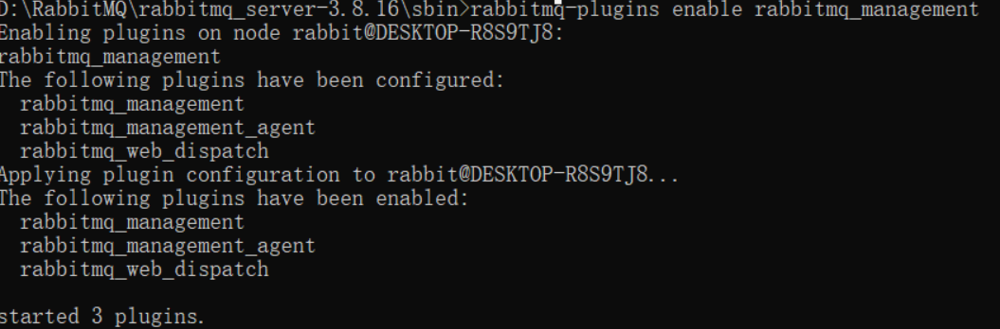
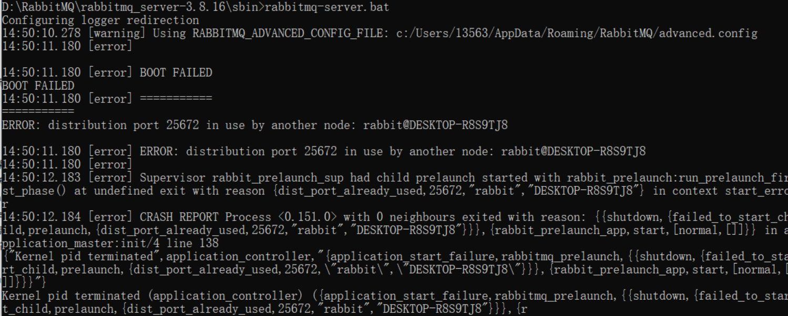
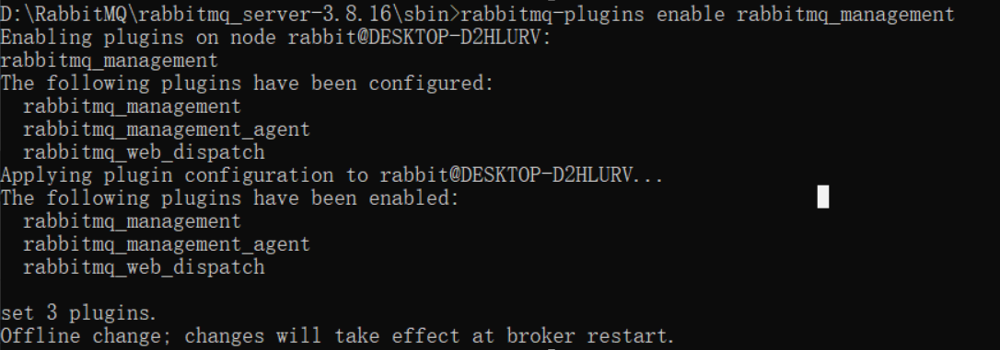
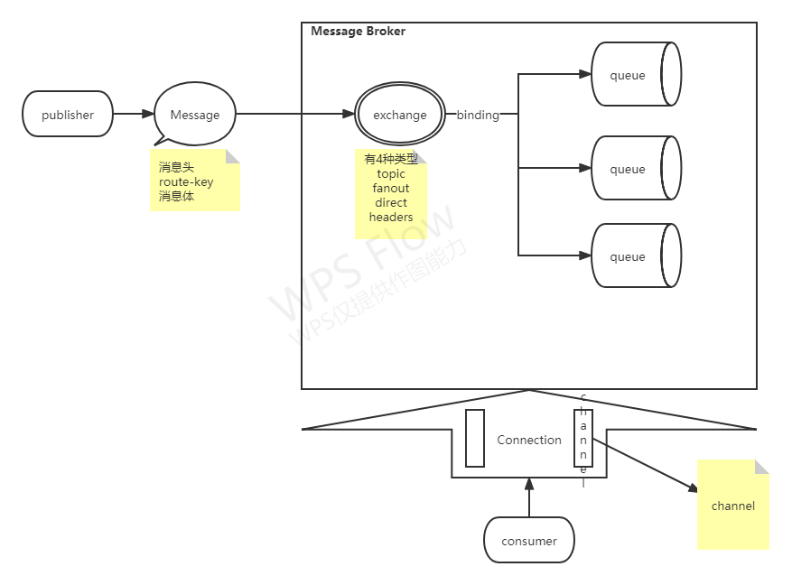

# RabbitMQ

## 安装

### windows安装

1. 下载安装Erlang   https://www.erlang.org/downloads

2. 下载安装RabbitMQ  https://www.rabbitmq.com/download.html

3. 配置ERLANG_HOME  和path

4. 配置  RABBITMQ_SERVER 和Path

5. CMD管理员模式在RABBITMQ_SERVER 的sbin下，执行
   rabbitmq-plugins enable rabbitmq_management
   成功示例：
   
   


6. 启动 执行  rabbitmq-server.bat   验证http://localhost:15672/
   以下错误没有问题：错误信息 25672端口被占用，其实RabbitMQ早就起来了，重复启动，可以停了重启
   
   

#### windows用户名含有中文解决方案

开始安装好RabbitMQ和erlang，然后发现链接不上，到电脑服务里面发现RabbitMQ服务未启动，手动启动之后又停止，搜百度之后发现是因为中文用户名导致的，在C盘用户目录下我设置的用户名是中文，里面存放rabbitmq_server服务不能有中文，解决办法：

1.  管理员运行cmd，然后打开RabbitMQ安装目录，执行

   1. rabbitmq-service.bat remove

   2. set RABBITMQ_BASE=D:\RabbitMQ\mqdata

      其中 D:\RabbitMQ\mqdata是自定义的目录，应该是一个软连接，绕过 c\user\用中文用户名\AppData\Roaming\RabbitMQ 这个文件夹，这样就不会有中文路径的问题了）

   3. rabbitmq-service.bat install

   4. rabbitmq-plugins enable rabbitmq_management

   5. 

2. 去服务管理里面启动服务，安装RabbitMQ

### docker安装

```bash
docker run -d --name rabbitmq -p 5671:5671 -p 5672:5672 -p 4369:4369 -p 25672:25672 -p 15671:15671 -p 15672:15672 rabbitmq

docker update rabbitmq --restart=always
#默认不开启管理界面，需要进入容器打开
docker exec -it rabbitmq /bin/bash

rabbitmq-plugins enable rabbitmq_management
```


## 结构示意图



## SpringBoot整合RabbitMQ

1. pom文件引入rabbitmq 的相关依赖

   ```xml
   <dependency>
       <groupId>org.springframework.boot</groupId>
       <artifactId>spring-boot-starter-amqp</artifactId>
       <version>2.5.1</version>
   </dependency>
   ```

2. 添加配置 rabbitmq的相关配置

   ```yaml
   spring:
       rabbitmq:
         host: glsc
         port: 5672
         virtual-host: /
   ```