# 主从复制

## 为什么需要主从复制

​		Redis虽然读取写入的速度都特别快，但是也会产生读压力特别大的情况。**为了分担读压力，Redis支持主从复制，Redis的主从结构可以采用一主多从或者级联结构，Redis主从复制可以根据是否是全量分为全量同步和增量同步**。

## 主从复制结构

- 主从复制，是指将一台Redis服务器的数据，复制到其他的Redis服务器。前者称为主节点(master)，后者称为从节点(slave)。

- 数据的复制是单向的，只能由主节点到从节点。

- 默认情况下，每台Redis服务器都是主节点；且一个主节点可以有多个从节点(或没有从节点)，但一个从节点只能有一个主节点。

 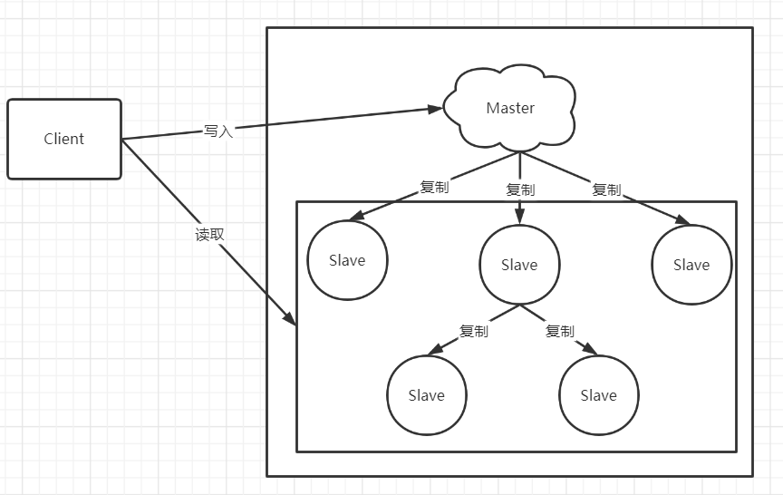

## 主从复制的特点

1. 采用异步复制；
2. 一个主redis可以含有多个从redis；
3. 每个从redis可以接收来自其他从redis服务器的连接；
4. 主从复制对于主redis服务器来说是非阻塞的，这意味着当从服务器在进行主从复制同步过程中，主redis仍然可以处理外界的访问请求；
5. 主从复制对于从redis服务器来说也是非阻塞的，这意味着，即使从redis在进行主从复制过程中也可以接受外界的查询请求，只不过这时候从redis返回的是以前老的数据，如果你不想这样，那么在启动redis时，可以在配置文件中进行设置，那么从redis在复制同步过程中来自外界的查询请求都会返回错误给客户端；（虽然说主从复制过程中对于从redis是非阻塞的，但是当从redis从主redis同步过来最新的数据后还需要将新数据加载到内存中，在加载到内存的过程中是阻塞的，在这段时间内的请求将会被阻，但是即使对于大数据集，加载到内存的时间也是比较多的）；

## 主从复制的作用

1. 数据冗余：主从复制实现了数据的热备份，是持久化之外的一种数据冗余方式。
2. 故障恢复：当主节点出现问题时，可以由从节点提供服务，实现快速的故障恢复；实际上是一种服务的冗余。
3. 负载均衡：在主从复制的基础上，配合读写分离，可以由主节点提供写服务，由从节点提供读服务（即写Redis数据时应用连接主节点，读Redis数据时应用连接从节点），分担服务器负载；尤其是在写少读多的场景下，通过多个从节点分担读负载，可以大大提高Redis服务器的并发量。
4. 读写分离：可以用于实现读写分离，主库写、从库读，读写分离不仅可以提高服务器的负载能力，同时可根据需求的变化，改变从库的数量；
5. 高可用基石：除了上述作用以外，主从复制还是哨兵和集群能够实施的基础，因此说主从复制是Redis高可用的基础。

## 主从复制的原理

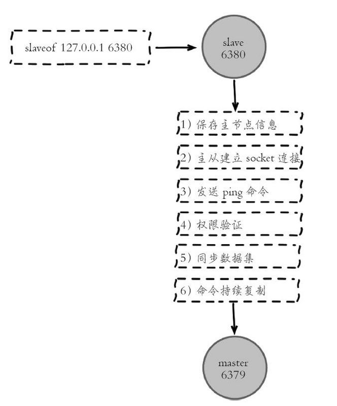

### 保存主节点（master）信息

  	执行 slaveof 后 Redis 会打印如下日志：
  	
  	 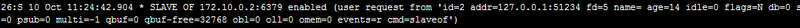   

  ### 从节点与主节点建立网络连接

-  从节点（slave）内部通过每秒运行的定时任务维护复制相关逻辑，当定时任务发现存在新的主节点后，会尝试与该节点建立网络连接。

   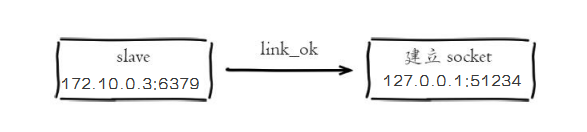

- 从节点与主节点建立网络连接。

  - 从节点会建立一个 socket 套接字，从节点建立了一个端口为51234的套接字，专门用于接受主节点发送的复制命令。从节点连接成功后打印如下日志：

      	 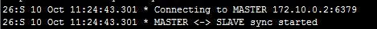

- 如果从节点无法建立连接，定时任务会无限重试直到连接成功或者执行 slaveofnoone 取消复制。
  - 关于连接失败，可以在从节点执行 info replication 查看 master_link_down_since_seconds 指标，它会记录与主节点连接失败的系统时间。从节点连接主节点失败时也会每秒打印如下日志，方便发现问题：
  -    

   

  ### 发送 ping 命令   

  连接建立成功后从节点发送 ping 请求进行首次通信， ping 请求主要目的如下：

  - 检测主从之间网络套接字是否可用。
  - 检测主节点当前是否可接受处理命令。

  如果发送 ping 命令后，从节点没有收到主节点的 pong 回复或者超时，比如网络超时或者主节点正在阻塞无法响应命令，从节点会断开复制连接，下次定时任务会发起重连。

   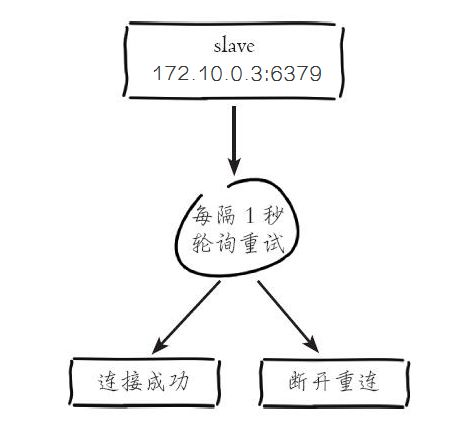 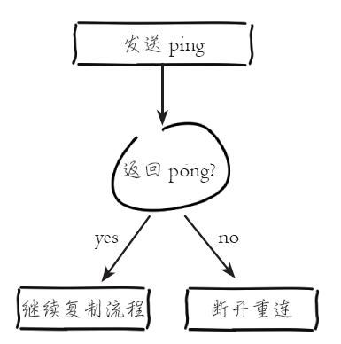

  从节点发送的 ping 命令成功返回，Redis 打印如下日志，并继续后续复制流程：

     

  ### 权限验证

  如果主节点设置了 requirepass 参数，则需要密码验证，从节点必须配置 masterauth 参数保证与主节点相同的密码才能通过验证。如果验证失败复制将终止，从节点重新发起复制流程。

  ### 同步数据集

   主从复制连接正常通信后，对于首次建立复制的场景，主节点会把持有的数据全部发送给从节点，这部分操作是耗时最长的步骤。

  ### 命令持续复制

   当主节点把当前的数据同步给从节点后，便完成了复制的建立流程。接下来主节点会持续地把写命令发送给从节点，保证主从数据一致性。

## 主从复制的方式

**Redis主从同步策略**
	主从刚刚连接的时候，进行全量同步；全同步结束后，进行增量同步。当然，如果有需要，slave 在任何时候都可以发起全量同步。redis 策略是，无论如何，首先会尝试进行增量同步，如不成功，要求进行全量同步。

### 全量同步

Redis全量复制一般发生在Slave初始化阶段，这时Slave需要将Master上的所有数据都复制一份。具体步骤如下：

1. 从服务器连接主服务器，发送SYNC命令；
2. 主服务器接收到SYNC命名后，开始执行BGSAVE命令生成RDB文件并使用缓冲区记录此后执行的所有写命令；
3. 主服务器BGSAVE执行完后，向所有从服务器发送快照文件，并在发送期间继续记录被执行的写命令；
4.  从服务器收到快照文件后丢弃所有旧数据，载入收到的快照
5. 主服务器快照发送完毕后开始向从服务器发送缓冲区中的写命令；
6. 从服务器完成对快照的载入，开始接收命令请求，并执行来自主服务器缓冲区的写命令；

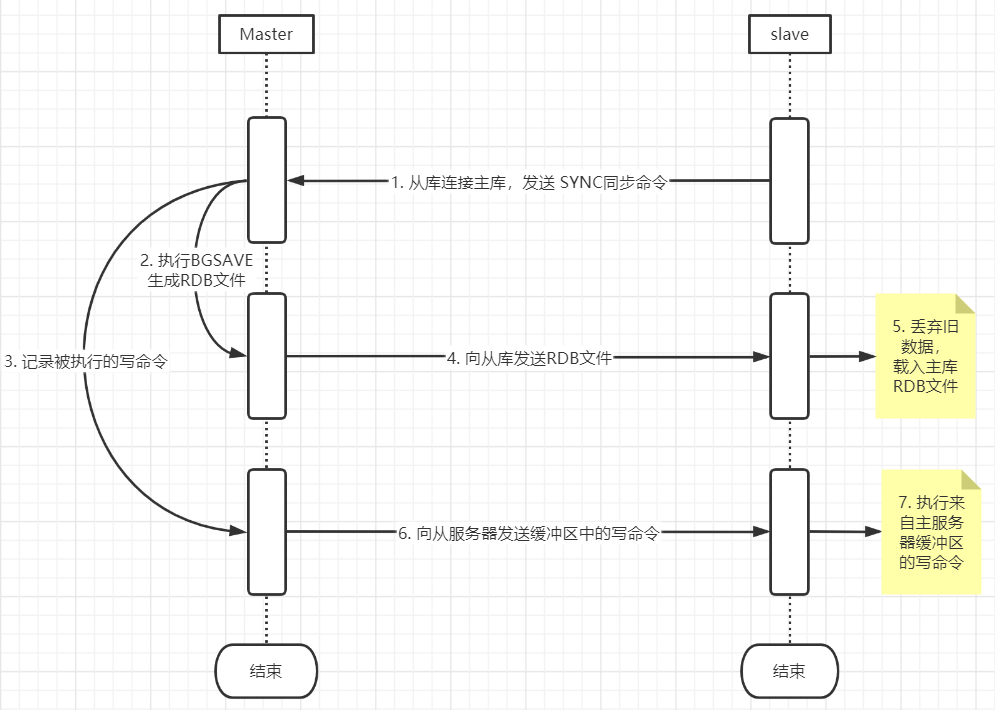


### 部分同步

​	从Redis 2.8开始，如果遭遇连接断开，重新连接之后可以从中断处继续进行复制，而不必重新同步。

​	它的工作原理是这样：

- 主服务器端为复制流维护一个内存缓冲区（in-memory backlog）。
- 主从服务器都维护一个复制偏移量（replication offset）和 master run id ，当连接断开时，从服务器会重新连接上主服务器，然后请求继续复制
  - 假如主从服务器的两个master run id相同，并且指定的偏移量在内存缓冲区中还有效，复制就会从上次中断的点开始继续。
  - 如果其中一个条件不满足，就会进行完全重新同步（在2.8版本之前就直接进行完全重新同步）。因为主运行id不保存在磁盘中，如果从服务器重启的话就只能进行完全同步了。
  - 部分重新同步这个新特性内部使用PSYNC命令，旧的实现中使用SYNC命令。Redis2.8版本可以检测出它所连接的服务器是否支持PSYNC命令，不支持的话使用SYNC命令。

## 主从复制的配置方式

- **配置方式**： 

  ​	在从服务器指定主服务器的地址 		

  - ```bash
    slaveof 127.0.0.1 6379
    ```

- 主机宕机，提升某一个从机为主机 

  - ```sh
     slaveof no one
    ```

# 哨兵模式（Sentinel）

## 功能

- **监控**(Monitoring): 
  - 哨兵(sentinel) 会不断地检查你的Master和Slave是否运作正常。
- **提醒**(Notification):
  - 当被监控的某个 Redis出现问题时, 哨兵(sentinel) 可以通过 API 向管理员或者其他应用程序发送通知。
- **自动故障迁移**(Automatic failover):
  - 当一个Master不能正常工作时，哨兵(sentinel) 会开始一次自动故障迁移操作,它会将失效Master的其中一个Slave升级为新的Master, 并让失效Master的其他Slave改为复制新的Master; 当客户端试图连接失效的Master时,集群也会向客户端返回新Master的地址,使得集群可以使用Master代替失效Master。

例如下图所示：

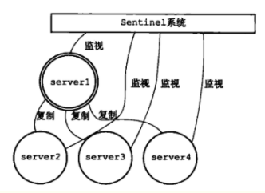

在Server1 掉线后：

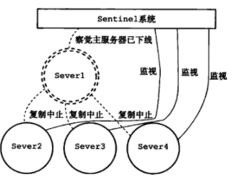

升级Server2 为新的主服务器：

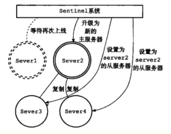

### 监控功能

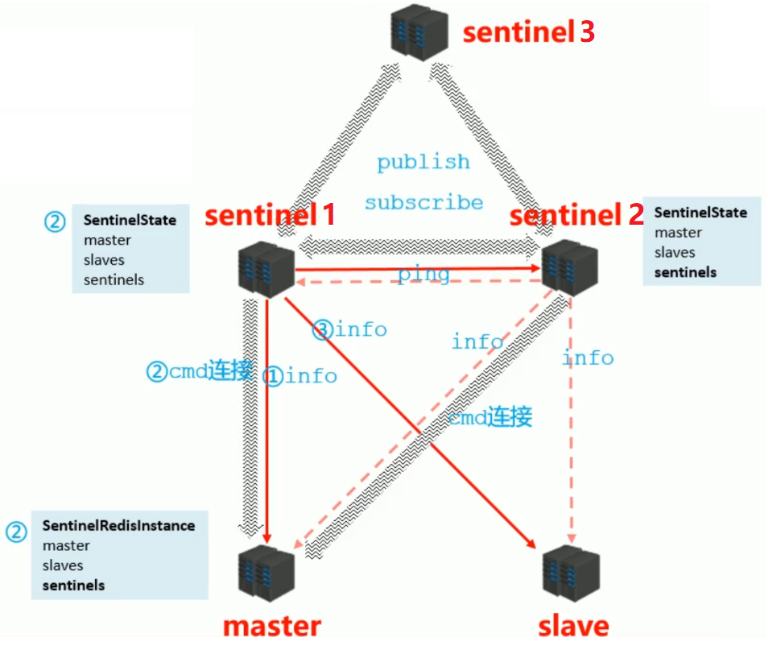

1. 哨兵1向master发送info指令之后，会建立一个cmd连接，创建的连接是用来发送命令的
2. 创建好cmd连接之后，会在哨兵1这一端保存目前他所获得的所有信息，另一端master也会保存自己持有的信息
3. 然后哨兵1根据从master获取的关于salve的信息，向slave发送info指令，得到salve的信息，丰富这一端所保存的信息
4. 当新增一个新的哨兵2时，哨兵2向master发送info指令，建立cmd连接，根据master中的信息可以得到之前已经存在的哨兵1，在己这一端保存已经获得的信息。然后判断哨兵1是否在线，与哨兵1建立连接，二者互相交换各自的信息，并且双方会持续的ping，保证他们之间是畅通的
5. 哨兵2根据从master获得的slave信息，再从slave获取信息，丰富自己所保存的信息
6. 再新增一个哨兵3时，与之前的过程类似，最终三个哨兵建立起了关系网。关系网中三者会互相交换、发送信息，关系网中的这种工作模式称为发布订阅模式

### 提醒功能

​	哨兵通过建立的cmd连接，向master、slave发送 `hello` 指令，得到他们的信息，然后在关系网中共享：

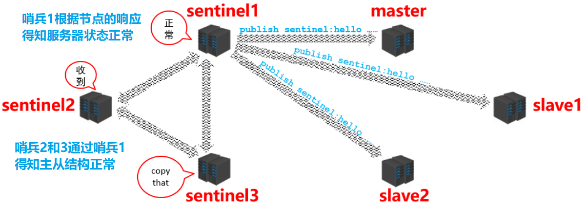

### 自动故障转移功能

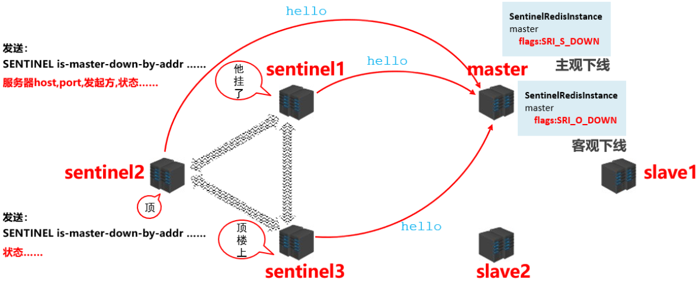

1. **master主观下线**：

   - 哨兵1始终得不到master的回应，主观判断master宕机，标记 sdown（一个哨兵认为master 挂了，主观下线（Subjectively Down， 简称 SDOWN））

2. **提醒：**

   - 哨兵1在关系网中传递消息，向其他哨兵发送图中左上角的消息

3. **master客观下线**

   - 其他哨兵得到消息之后，全部向master发送消息，确定master是否宕机，他们也会将自己得到的结果发送给关系网中的其他哨兵，确定master宕机后，将标记改为 odown（所有哨兵探测之后，超过一半的哨兵认为master宕机，客观下线（Objectively Down， 简称 ODOWN））

4. **哨兵选举**

   ​	当认定master宕机之后，此时需要选举新的master，由哪个哨兵完成这件事要**通过哨兵之间的选举决定**，具体过程如下所述：

   1. 在选举的时候每个哨兵手里都有一票，每个哨兵都会发出一个指令，在内网里边告诉其他哨兵自己当选举人，比如说sentinel1和sentinel2发出这个选举指令，那么sentinel3接收到他们的申请之后，sentinel3就会把自己的一票投给其中一方，根据到达的先后顺序投票，获得票的那一方就会多一张选举票，按照这样的一种形式，最终会有一个选举结果，获得票数最多的哨兵会被获选
   2. 在这个过程中有可能会存在失败的现象，比如第一轮没有选举成功，那就会接着进行第二轮第三轮直到完成选举

5. **Master 挑选**

   ​	当完成哨兵之间的选举之后，接下来就要**由选举胜出的哨兵去slave中挑选一个，将其变成新的master**，具体的流程如下所述：

   ​	1. 先排除

   ​		不在线的、 响应慢的、 与原master断开时间久的

   2. 再选择
      优先级高的获选
      offset较大的获选（比较大说明同步原来master的数据最多）
      若还没有选出，则最后根据runid选出

6. **Master 设置及通知** 

   ​	选出新的master之后，哨兵发送指令给服务器：

   1. 向新的master发送 slaveof no one 指令
   2. 向其他slave发送 slaveof 新masterIP端口 指令
   3. 同时还要告诉其他的哨兵新master是谁

## 哨兵选举

### **为什么要选领导者？**

简单来说，就是因为只能有一个sentinel节点去完成故障转移。
sentinel is-master-down-by-addr这个命令有两个作用，一是确认下线判定，二是进行领导者选举。

### **选举规则：**

1. 所有的sentinel都有公平被选举成领头的资格。
2. 所有的sentinel都有且只有一次将某个sentinel选举成领头的机会（在一轮选举中），一旦选举某个sentinel为领头，不能更改
3. sentinel设置领头sentinel是先到先得，一旦当前sentinel设置了领头sentinel，以后要求设置sentinel为领头请求都会被拒绝。
4. 每个发现服务客观下线的sentinel，都会要求其他sentinel将自己设置成领头。
5. 当一个sentinel（源sentinel）向另一个sentinel（目sentinel）发送is-master-down-by-addr ip port current_epoch runid命令的时候，runid参数不是*，而是sentinel运行id，就表示源sentinel要求目标sentinel选举其为领头。
6. 源sentinel会检查目标sentinel对其要求设置成领头的回复，如果回复的leader_runid和leader_epoch为源sentinel，表示目标sentinel同意将源sentinel设置成领头。
7. 如果某个sentinel被半数以上的sentinel设置成领头，那么该sentinel既为领头。
8. 如果在限定时间内，没有选举出领头sentinel，暂定一段时间，再选举。

### **选举过程：**

1. 每个做主观下线的sentinel节点向其他sentinel节点发送上面那条命令，要求将它设置为领导者。
2. 收到命令的sentinel节点如果还没有同意过其他的sentinel发送的命令（还未投过票），那么就会同意，否则拒绝。
3. 如果该sentinel节点发现自己的票数已经过半且达到了quorum的值，就会成为领导者如果这个过程出现多个sentinel成为领导者，则会等待一段时间重新选举。 

## 配置使用哨兵模式

1. 配置Redis的主从服务器，修改redis.conf文件如下

   主服务器

   ```tex
   # 使得Redis服务器可以跨网络访问
   bind 0.0.0.0
   # 设置密码
   requirepass "123456"
   ```

   从服务器

   ```tex
   # 使得Redis服务器可以跨网络访问
   bind 0.0.0.0
   # 设置密码
   requirepass "123456"
   # 指定主服务器，注意：有关slaveof的配置只是配置从服务器，主服务器不需要配置
   slaveof 192.168.11.128 6379
   # 主服务器密码，注意：有关slaveof的配置只是配置从服务器，主服务器不需要配置
   masterauth 123456
   ```

2. 配置3个哨兵 每个哨兵的配置都是一样的。在Redis安装目录下有一个sentinel.conf文件，copy一份进行修改

   ```tex
   # 禁止保护模式
   protected-mode no
   # 配置监听的主服务器，这里sentinel monitor代表监控，mymaster代表服务器的名称，可以自定义，192.168.11.128代表监控的主服务器，6379代表端口，2代表只有两个或两个以上的哨兵认为主服务器不可用的时候，才会进行failover操作。
   sentinel monitor mymaster 192.168.11.128 6379 2
   # sentinel author-pass定义服务的密码，mymaster是服务名称，123456是Redis服务器密码
   # sentinel auth-pass <master-name> <password>
   sentinel auth-pass mymaster 123456
   ```

3. 启动服务器和哨兵

   ```tex
   # 启动Redis服务器进程
   ./redis-server ../redis.conf
   # 启动哨兵进程
   ./redis-sentinel ../sentinel.conf
   ```

   启动顺序： 1.启动主服务器redis  2. 启动从服务器redis  3. 启动哨兵

   

# Redis集群

## 一致性哈希

### 概念

​		一致性哈希将整个哈希值空间组织成一个虚拟的圆环，如假设某哈希函数H的值空间为0-2^32-1（即哈希值是一个32位无符号整形），整个哈希空间环如下


- 假设有四个节点： NodeA 、NodeB、 NodeC、 NodeD 经过hash运算后 落在圆环上的思哥点
- 正常情况 4个对象  ObjectA  ObjectB ObjectC ObjectD  使用相同的函数Hash计算出哈希值，并确定此数据在环上的位置，从此位置沿环顺时针“行走”，第一台遇到的服务器就是其应该定位到的服务器顺时针落入 对应的节点
- 一致性哈希的容错性： 若节点C 挂掉  ObjectC  就会落入到D 节点， 此时AB 节点不受影响
- 一致性哈希的拓展性：假设加入一个节点X，节点X落入B/C 两个节点之间，那么 对象C 会落入X节点， 只有节点C 收到影响  ABD都不受到影响 

### Hash倾斜

- 一致性Hash算法在服务节点太少时，容易因为节点分部不均匀而造成数据倾斜（被缓存的对象大部分集中缓存在某一台服务器上）问题，例如系统中只有两台服务器，其环分布如下：

  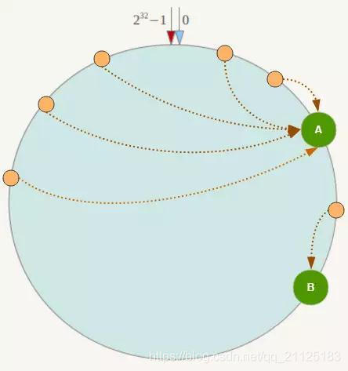

  - 此时必然造成大量数据集中到Node A上，而只有极少量会定位到Node B上，从而出现hash环偏斜的情况，当hash环偏斜以后，缓存往往会极度不均衡的分布在各服务器上。

- 在一致性哈希算法中，为了尽可能的满足平衡性，其引入了虚拟节点。

  - “虚拟节点”（ virtual node ）是实际节点（机器）在 hash 空间的复制品（ replica ），一实际个节点（机器）对应了若干个“虚拟节点”，这个对应个数也成为“复制个数”，“虚拟节点”在 hash 空间中以hash值排列。
  - 节点A 虚拟节点 A#1 A#2 A#3  节点B 虚拟节点 B#1 B#2 B#3

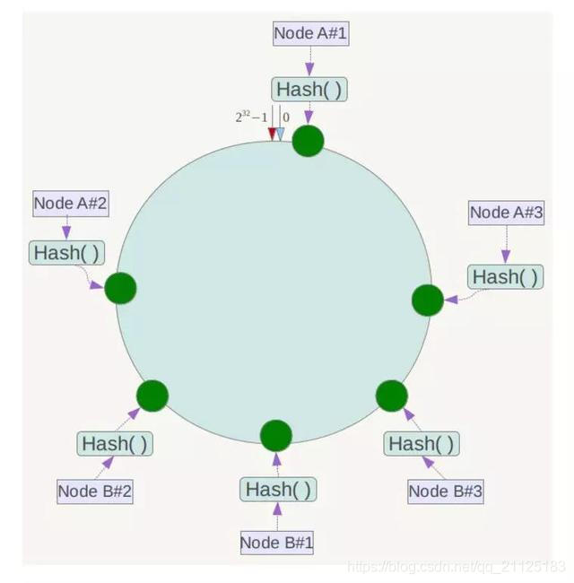

## Redis 集群介绍

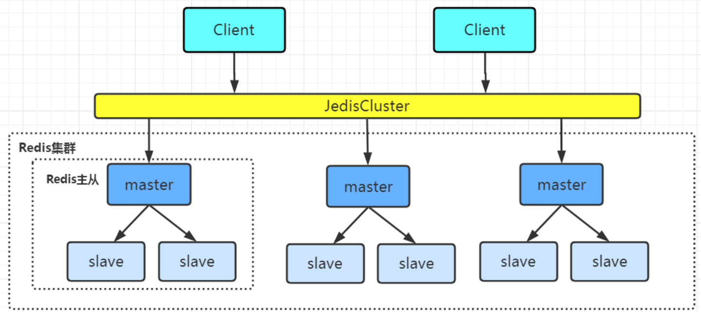

​		Redis集群是一个由**多个主从节点群**组成的分布式服务集群，它具有**复制、高可用和分片**特性。Redis集群不需要sentinel哨兵也能完成节点移除和故障转移的功能

#### 优点：

- Redis集群有多个master，可以**减小访问瞬断问题的影响**；
  - 若集群中有一个master挂了，正好需要向这个master写数据，这个操作需要等待一下；但是向其他master节点写数据是不受影响的。
- Redis集群有多个master，可以提供更高的并发量；　　
- Redis集群可以分片存储，这样就可以存储更多的数据；

## Redis集群原理

### 架构

​		Redis Cluster 将所有数据划分为 **16384** 个 slots（槽位），每个节点负责其中一部分槽位。槽位的信息存储于每个节点中。只有master节点会被分配槽位，slave节点不会分配槽位。

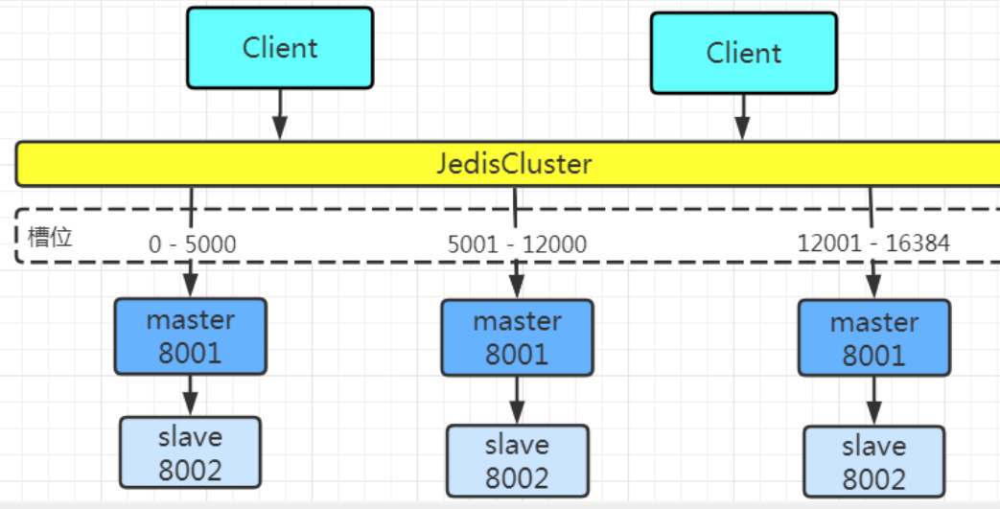

　　当Redis Cluster 的客户端来连接集群时，它也会得到一份集群的槽位配置信息，并将其缓存在客户端本地。这样当客户端要查找某个 key 时，可以直接定位到目标节点。同时因为槽位的信息可能会存在客户端与服务器不一致的情况，还需要纠正机制来实现槽位信息的校验调整

### **跳转重定位**

1. 当客户端向一个节点发出了指令，首先当前节点会计算指令的 key 得到槽位信息，判断计算的槽位是否归当前节点所管理；
2. 若槽位不归当前节点管理，这时它会向客户端发送一个特殊的跳转指令携带目标操作的节点地址，告诉客户端去连这个节点去获取数据。
3. 客户端收到指令后除了跳转到正确的节点上去操作，还会同步更新纠正本地的槽位映射表缓存，后续所有 key 将使用新的槽位映射表。

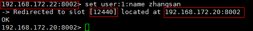

###  集群节点之间的通信机制

​		在握手成功后，两个节点之间会**定期**发送ping/pong消息，交换**数据信息**

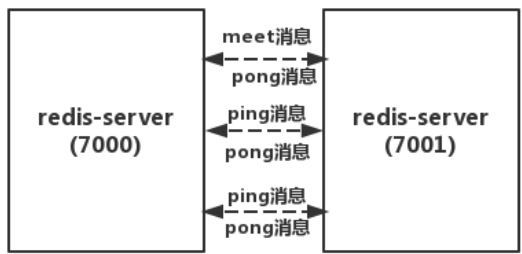

发送的消息如下

​	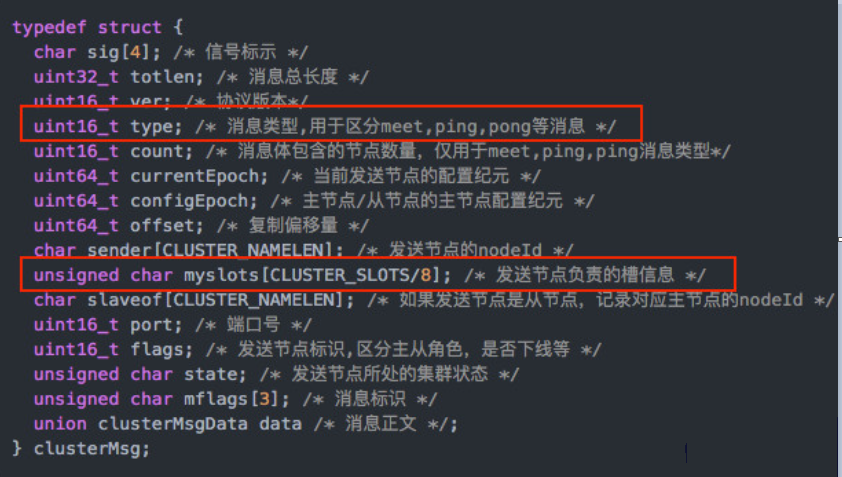


### **Redis集群选举原理** 

​		当 slave 发现自己的 master 变为 fail 状态时，便尝试进行 FailOver，以期成为新的 master。由于挂掉的 master 有多个 slave，所以这些 slave 要去竞争成为 master 节点，过程如下：

1. slave1，slave2都 发现自己连接的 master 状态变为 Fail；

2. 它们将自己记录的集群 currentEpoch（选举周期） 加1，并使用 gossip 协议去广播 FailOver_auth_request 信息；

3. 其他节点接收到slave1、salve2的消息（只有master响应），判断请求的合法性，并给 slave1 或 slave2 发送 FailOver_auth_ack（对每个 epoch 只发一次ack）；  在一个选举周期中，一个master只会响应第一个给它发消息的slave；

4. slave1 收集返回的 FailOver_auth_ack，它收到**超过半数的 master 的 ack** 后变成新 master； （这也是集群为什么至少需要3个master的原因，如果只有两个master，其中一个挂了之后，只剩下一个主节点是不能选举成功的） 

5. 新的master节点去广播 Pong 消息通知其他集群节点，不需要再去选举了。

   ```tex
   1. 从节点并不是在主节点一进入FAIL 状态就马上尝试发起选举，而是有一定延迟，一定的**延迟确保我们等待FAIL状态在集群中传播**，2. slave如果立即尝试选举，其它masters或许尚未意识到FAIL状态，可能会拒绝投票。
   3. 延迟计算公式：**DELAY = 500ms + random(0 ~ 500ms) + SLAVE_RANK \* 1000ms**
   　　SLAVE_RANK：表示此slave已经从master复制数据的总量的rank。
   　　Rank越小代表已复制的数据越新。这种方式下，持有最新数据的slave将会首先发起选举（理论上）
   ```

**Redis集群为什么至少需要三个master节点，并且推荐节点数为奇数？**
　　因为新master的选举需要大于半数的集群master节点同意才能选举成功，如果只有两个master节点，当其中一个挂了，是达不到选举新master的条件的。

## Redis 集群搭建

1. ***创建6个redis实例（6个节点）并启动***

   1. Redis集群至少需要3个节点，因为投票容错机制要求超过半数节点认为某个节点挂了该节点才是挂了，所以2个节点无法构成集群。

   2. 要保证集群的高可用，需要每个节点都有从节点，也就是备份节点，所以Redis集群至少需要6台服务器。

   3. 

      1. 创建文件夹

      ```bash
      mkdir -p /usr1/redis/redis-cluster/8001 /usr1/redis/redis-cluster/8002
      ```

      2. 将redis安装目录下的 redis.conf 文件分别拷贝到8001目录下
      3. 修改redis.conf 配置

      ```tex
      port 8001
      daemonize yes
      pidfile "/var/run/redis_8001.pid"
      
      #指定数据文件存放位置，必须要指定不同的目录位置，不然会丢失数据
      dir /usr1/redis/redis-cluster/8001/
      
      #启动集群模式
      cluster-enabled yes
      
      #集群节点信息文件，这里800x最好和port对应上
      cluster-config-file nodes-8001.conf
      
      # 节点离线的超时时间
      cluster-node-timeout 5000
      
      #去掉bind绑定访问ip信息
      #bind 127.0.0.1
      
      #关闭保护模式
      protected-mode no 
      
      #启动AOF文件
      appendonly yes
      
      #如果要设置密码需要增加如下配置：
      #设置redis访问密码
      requirepass redis-pw
      
      #设置集群节点间访问密码，跟上面一致
      masterauth redis-pw
      ```

      4. 把上面修改好的配置文件拷贝到8002文件夹下，并将8001修改为8002

         ```sh
         cp /usr1/redis/redis-cluster/8001/redis.conf /usr1/redis/redis-cluster/8002
         cd /usr1/redis/redis-cluster/8002/
         vim redis.conf
         
         #批量修改字符串
         :%s/8001/8002/g
         ```

      5. 将本机（192.168.1.1）机器上的文件拷贝到另外两台机器上

         ```bash
         scp /usr1/redis/redis-cluster/8001/redis.conf  root@192.168.1.2:/usr1/redis/redis-cluster/8001/
         scp /usr1/redis/redis-cluster/8002/redis.conf  root@192.168.1.2:/usr1/redis/redis-cluster/8002/
         
         scp /usr1/redis/redis-cluster/8001/redis.conf  root@192.168.1.3:/usr1/redis/redis-cluster/8001/
         scp /usr1/redis/redis-cluster/8002/redis.conf  root@192.168.1.3:/usr1/redis/redis-cluster/8002/
         ```

      6. 启动实例

         ```tex
         redis-server /usr1/redis/redis-cluster/8001/redis.conf 
         redis-server /usr1/redis/redis-cluster/8002/redis.conf 
         ```

2. **redis-cli 创建整个 redis 集群**

   ```bash
   redis-cli -a redis-pw --cluster create --cluster-replicas 1 192.168.1.1:8001 192.168.1.1:8002 192.168.1.2:8001 192.168.1.2:8002 192.168.1.3:8001 192.168.1.3:8002
   
   #-a : 密码
   #--cluster-replicas 1  每一个master 节点下有只有一个slave
   #  6个节点的ip：port
   ```

3. **验证集群**

   1. 连接任意一个节点

   ```sh
   redis-cli -a redis-pw -c -h 192.168.1.1 -p 8001
   
   -a  密码  -c 集群模式   -h指定ip  -p 指定端口
   ```

   2. 查看集群信息    cluster info  
   3. 查看节点列表    cluster nodes

4. **关闭集群**

   ```bash
   redis‐cli ‐a redis-pw ‐c ‐h 192.168.1.1 ‐p 8002 shutdown
   ```

## Redis集群的扩容与收缩

### 扩容

#### 1. 准备新节点

- 配置与其他节点相同
- 启动两个节点
- 新节点会作为孤儿节点运行，没有和其他节点与之通信

#### 2. 加入集群

- CLUSTER MEET 命令加入集群
  - 新加入的节点都是主节点，因为没有负责槽位，所以不能接受任何读写操作
- 新节点功能
  - 新节点迁移槽和数据实现扩容。
  - 作为其他主节点的从节点负责故障转移

```tex
######在7000节点上对这两个节点进行meet操作######
redis-cli -p 7000 cluster meet 127.0.0.1 7006
 
redis-cli -p 7000 cluster meet 127.0.0.1 7007
 
######对7006和7007设置主从关系######
redis-cli -p 7007 cluster replicate 5b68d95032c435e77ebada6f743258613b2bcd43
######在7000节点上操作，设置其为7006的从节点，所以后面的节点ID是7006的######
 
######查看各个节点的主从关系信息######
redis-cli -p 7000 cluster nodes
```


#### 3. 迁移槽和数据

MIGRATE

```tex
######使用redis-trib.rb工具来迁移数据######
redis-trib.rb reshard 127.0.0.1:7000
 
######输入迁移槽的数量，这里迁移4096个槽######
How many slots do you want to move (from   to  )?4096
 
######指定槽迁移的目标节点，这里用7006的节点ID######
what is the receiving node ID ? 5b68d95032c435e77ebada6f743258613b2bcd43
 
all
yes
```

### 收缩

#### 1. 先看看各个节点槽的数量

```tex
redis-cli -p 7000 cluster nodes | grep 7006
 5b68d95032c435e77ebada6f743258613b2bcd43 127.0.0.1:7006@17006 master - 0 1551930833000 7 connected 0-1364 5462-6826 10923-12287
```


#### 2. 创建迁移槽的计划

```tex
######创建一个迁移槽的计划，把1366个槽从7006迁移到7000节点中，这个命令在7006中执行######
redis-trib.rb reshard --from 5b68d95032c435e77ebada6f743258613b2bcd43 --to 5004860d06da1aeb4474bde7dba0cde9301cd124 --slots 1366 127.0.0.1:7006
 
Do you want to proceed with the proposed reshard plan (yes/no)? yes
 
######创建一个迁移槽的计划，把1366个槽从7006迁移到7001节点中，这个命令在7006中执行######
redis-trib.rb reshard --from 5b68d95032c435e77ebada6f743258613b2bcd43 --to 44184b66eb1e6b622b6bf45dc5c134142698498f --slots 1366 127.0.0.1:7006
 
Do you want to proceed with the proposed reshard plan (yes/no)? yes
 
######创建一个迁移槽的计划，把1365个槽从7006迁移到7002节点中，这个命令在7006中执行######
redis-trib.rb reshard --from 5b68d95032c435e77ebada6f743258613b2bcd43 --to a93846e2c63d5c224ab205b1fa5e218f7fdf5311 --slots 1365 127.0.0.1:7006
 
Do you want to proceed with the proposed reshard plan (yes/no)? yes
```


#### 3. 下线节点

移除从节点，然后再移除主节点，因为如果你先移除主节点，会触发集群的故障转移。

```tex
######在7000节点中执行下线7007节点的命令，后面的节点ID是7007的节点ID信息######
redis-trib.rb del-node 127.0.0.1:7000 cf1952aff90651c717dadaa8348404d446680013
 
######在7000节点中执行下线7006节点的命令，后面的节点ID是7006的节点ID信息######
redis-trib.rb del-node 127.0.0.1:7000 5b68d95032c435e77ebada6f743258613b2bcd43
 
######先下线从节点后下线主节点是为了避免触发主从故障转移机制######
```


## Java 操作 Redis 集群

1. maven引入相关依赖

   ```tex
   <dependency>
    <groupId>org.springframework.boot</groupId>
    <artifactId>spring‐boot‐starter‐data‐redis</artifactId>
   </dependency>
    
   <dependency>
    <groupId>org.apache.commons</groupId>
    <artifactId>commons‐pool2</artifactId>
   </dependency>
   ```

2. 配置文件

   ```tex
   server:
     port: 8080
   spring:
     redis:
     database: 0
     timeout: 3000
     password: redis-pw
     cluster:
       nodes: 192.168.1.1:8001,192.168.1.1:8002,192.168.1.2:8001,192.168.1.2:8002,192.168.1.3:8001,192.168.1.3:8002
     lettuce:
     pool:
     max‐idle: 50
     min‐idle: 10
     max‐active: 100
     max‐wait: 1000
   ```

   

# Redis 常见使用方式优缺点

redis 的几种常见使用方式包括：

- 单机模式
- 主从模式
- 哨兵模式(sentinel)
- 集群模式(cluster)
- 第三方模式

## 单机模式

​		Redis 单副本，采用单个 Redis 节点部署架构，没有备用节点实时同步数据，不提供数据持久化和备份策略，适用于数据可靠性要求不高的纯缓存业务场景。

### **优点：**

1. 架构简单，部署方便。
2. 高性价比：缓存使用时无需备用节点(单实例可用性可以用 supervisor 或 crontab 保证)，当然为了满足业务的高可用性，也可以牺牲一个备用节点，但同时刻只有一个实例对外提供服务。
3. 高性能。

### **缺点：**

1. 不保证数据的可靠性。
2. 在缓存使用，进程重启后，数据丢失，即使有备用的节点解决高可用性，但是仍然不能解决缓存预热问题，因此不适用于数据可靠性要求高的业务。
3. 高性能受限于单核 CPU 的处理能力(Redis 是单线程机制)，CPU 为主要瓶颈，所以适合操作命令简单，排序、计算较少的场景。也可以考虑用 Memcached 替代。

## 主从模式

​		Redis 采用主从(可以多从)部署结构，相较于单副本而言最大的特点就是主从实例间数据实时同步，并且提供数据持久化和备份策略。主从实例部署在不同的物理服务器上，根据公司的基础环境配置，可以实现同时对外提供服务和读写分离策略。

### **优点：**

1. 高可靠性：一方面，采用双机主备架构，能够在主库出现故障时自动进行主备切换，从库提升为主库提供服务，保证服务平稳运行;另一方面，开启数据持久化功能和配置合理的备份策略，能有效的解决数据误操作和数据异常丢失的问题。
2. 读写分离策略：从节点可以扩展主库节点的读能力，有效应对大并发量的读操作。

### **缺点：**

1. 故障恢复复杂，如果没有 RedisHA 系统(需要开发)，当主库节点出现故障时，需要手动将一个从节点晋升为主节点，同时需要通知业务方变更配置，并且需要让其它从库节点去复制新主库节点，整个过程需要人为干预，比较繁琐。
2. 主库的写能力受到单机的限制，可以考虑分片。
3. 主库的存储能力受到单机的限制，可以考虑 Pika。
4. 原生复制的弊端在早期的版本中也会比较突出，如：Redis 复制中断后，Slave 会发起 psync，此时如果同步不成功，则会进行全量同步，主库执行全量备份的同时可能会造成毫秒或秒级的卡顿;又由于 COW 机制，导致极端情况下的主库内存溢出，程序异常退出或宕机;主库节点生成备份文件导致服务器磁盘 IO 和 CPU(压缩)资源消耗;发送数 GB 大小的备份文件导致服务器出口带宽暴增，阻塞请求，建议升级到最新版本。

## 哨兵模式

​		Redis Sentinel 是 2.8 版本后推出的原生高可用解决方案，其部署架构主要包括两部分：Redis Sentinel 集群和 Redis 数据集群。其中 Redis Sentinel 集群是由若干 Sentinel 节点组成的分布式集群，可以实现故障发现、故障自动转移、配置中心和客户端通知。Redis Sentinel 的节点数量要满足 2n+1(n>=1)的奇数个。

### **优点：**

1. Redis Sentinel 集群部署简单。
2. 能够解决 Redis 主从模式下的高可用切换问题。
3. 很方便实现 Redis 数据节点的线形扩展，轻松突破 Redis 自身单线程瓶颈，可极大满足 Redis 大容量或高性能的业务需求。
4. 可以实现一套 Sentinel 监控一组 Redis 数据节点或多组数据节点。

### **缺点：**

1. 部署相对 Redis 主从模式要复杂一些，原理理解更繁琐。
2. 资源浪费，Redis 数据节点中 slave 节点作为备份节点不提供服务。
3. Redis Sentinel 主要是针对 Redis 数据节点中的主节点的高可用切换，对 Redis 的数据节点做失败判定分为主观下线和客观下线两种，对于 Redis 的从节点有对节点做主观下线操作，并不执行故障转移。
4. 不能解决读写分离问题，实现起来相对复杂。

## 集群模式

​		Redis Cluster 是 3.0 版后推出的 Redis 分布式集群解决方案，主要解决 Redis 分布式方面的需求，比如，当遇到单机内存，并发和流量等瓶颈的时候，Redis Cluster 能起到很好的负载均衡的目的。Redis Cluster 集群节点最小配置 6 个节点以上(3 主 3 从)，其中主节点提供读写操作，从节点作为备用节点，不提供请求，只作为故障转移使用。Redis Cluster 采用虚拟槽分区，所有的键根据哈希函数映射到 0～16383 个整数槽内，每个节点负责维护一部分槽以及槽所印映射的键值数据。

### **优点：**

1. 无中心架构。
2. 数据按照 slot 存储分布在多个节点，节点间数据共享，可动态调整数据分布。
3. 可扩展性：可线性扩展到 1000 多个节点，节点可动态添加或删除。
4. 高可用性：部分节点不可用时，集群仍可用。通过增加 Slave 做 standby 数据副本，能够实现故障自动 failover，节点之间通过 gossip 协议交换状态信息，用投票机制完成 Slave 到 Master 的角色提升。
5. 降低运维成本，提高系统的扩展性和可用性。

### **缺点：**

1. Client 实现复杂，驱动要求实现 Smart Client，缓存 slots mapping 信息并及时更新，提高了开发难度，客户端的不成熟影响业务的稳定性。目前仅 JedisCluster 相对成熟，异常处理部分还不完善，比如常见的“max redirect exception”。
2. 节点会因为某些原因发生阻塞(阻塞时间大于 clutser-node-timeout)，被判断下线，这种 failover 是没有必要的。
3. 数据通过异步复制，不保证数据的强一致性。
4. 多个业务使用同一套集群时，无法根据统计区分冷热数据，资源隔离性较差，容易出现相互影响的情况。
5. Slave 在集群中充当“冷备”，不能缓解读压力，当然可以通过 SDK 的合理设计来提高 Slave 资源的利用率。
6. Key 批量操作限制，如使用 mset、mget 目前只支持具有相同 slot 值的 Key 执行批量操作。对于映射为不同 slot 值的 Key 由于 Keys 不支持跨 slot 查询，所以执行 mset、mget、sunion 等操作支持不友好。
7. Key 事务操作支持有限，只支持多 key 在同一节点上的事务操作，当多个 Key 分布于不同的节点上时无法使用事务功能。
8. Key 作为数据分区的最小粒度，不能将一个很大的键值对象如 hash、list 等映射到不同的节点。
9. 不支持多数据库空间，单机下的 redis 可以支持到 16 个数据库，集群模式下只能使用 1 个数据库空间，即 db 0。
10. 复制结构只支持一层，从节点只能复制主节点，不支持嵌套树状复制结构。
11. 避免产生 hot-key，导致主库节点成为系统的短板。
12. 避免产生 big-key，导致网卡撑爆、慢查询等。
13. 重试时间应该大于 cluster-node-time 时间。
14. Redis Cluster 不建议使用 pipeline 和 multi-keys 操作，减少 max redirect 产生的场景。

> 优点多，缺点也多啊，事物都有双面性。