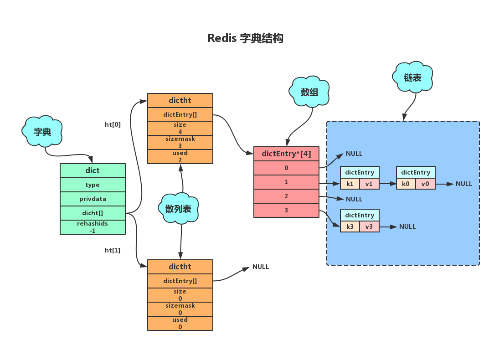
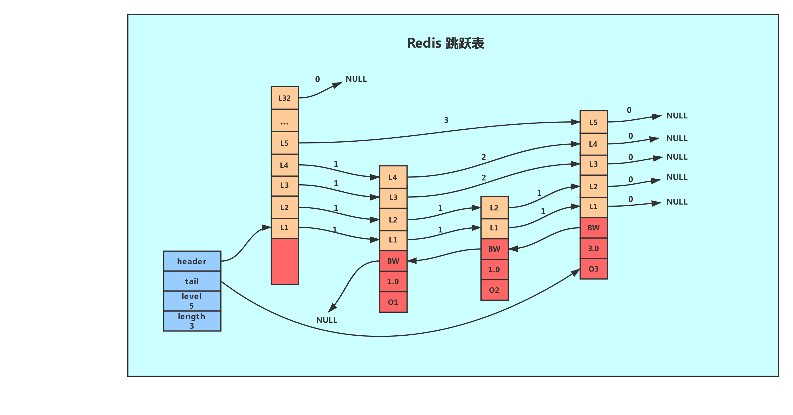
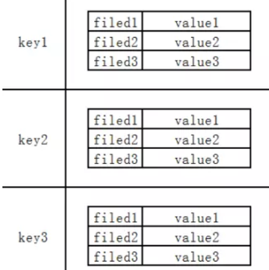

# Redis 底层结构

## Redis对象结构体

```c
/*
 * Redis 对象
 */
typedef struct redisObject {
    // 类型 4bits
    unsigned type:4;
    // 编码方式 4bits
    unsigned encoding:4;
    // LRU 时间（相对于 server.lruclock） 24bits
    unsigned lru:22;
    // 引用计数 Redis里面的数据可以通过引用计数进行共享 32bits
    int refcount;
    // 指向对象的值 64-bit
    void *ptr;
} robj;// 16bytes
```

```tex
type对应了Redis中的五种基本数据类型
-------------------------------------------------
OBJ_STRING 0          	String
OBJ_LIST 1  			list
OBJ_SET 2				set
OBJ_ZSET 3				zset
OBJ_HASH 4				hash
```

```tex
encoding则对应了 Redis 中的十种编码方式
-------------------------------------------------
OBJ_ENCODING_RAW 0     		raw
OBJ_ENCODING_INT 1     		int
OBJ_ENCODING_HT 2      		ht
OBJ_ENCODING_ZIPMAP 3  		zipmap   // 已废弃
OBJ_ENCODING_LINKEDLIST 4 	linked list
OBJ_ENCODING_ZIPLIST 5 		ziplist
OBJ_ENCODING_INTSET 6  		intset
OBJ_ENCODING_SKIPLIST 7  	skiplist
OBJ_ENCODING_EMBSTR 8  		Embedded sds String
OBJ_ENCODING_QUICKLIST 9 	quicklist (linked list of ziplists)
```


## 八种数据结构


### 简单动态字符串SDS

​		当Redis需要一个可以被修改的字符串时，就会使用SDS来表示。在Redis数据库里，包含字符串值的键值对都是由SDS实现的(Redis中**所有的键都是由字符串对象实现的即底层是由SDS实现**，**Redis中所有的值对象中包含的字符串对象底层也是由SDS实现**)。

```c
struct sdshdr{
    //int 记录buf数组中未使用字节的数量 如上图free为0代表未使用字节的数量为0
    int free;
    //int 记录buf数组中已使用字节的数量即sds的长度 如上图len为5代表未使用字节的数量为5
    int len;
    //字节数组用于保存字符串 sds遵循了c字符串以空字符结尾的惯例目的是为了重用c字符串函数库里的函数
    char buf[];
}
```

####  为什么要使用SDS

​			Redis定位于一个高性能的内存数据库，其面向的就是大数据量，大并发，频繁读写，高响应速度的业务。因此在保证安全稳定的情况下，性能的提升非常重要。而SDS这种数据结构屏蔽了C字符串的一些缺点，可以提供安全高性能的字符串操作。		

SDS这种数据结构相对于C字符串有以下优点:

- 杜绝缓冲区溢出
- 减少字符串操作中的内存重分配次数（空间预分配。惰性空间释放）
- 二进制安全(SDS API都会以二进制的方式来处理buf数组里的数据，使用len属性的值而不是空字符来判断字符串是否结束)

#### 缓冲区溢出


  C字符串，如果程序员在字符串修改的时候如果忘记给字符串重新分配足够的空间，那么就会发生内存溢出，如上图所示，忘记给s1分配足够的内存空间, s1的数据就会溢出到s2的空间, 导致s2的内容被修改.。而Redis提供的SDS其内置的空间分配策略则可以完全杜绝这种事情的发生。当API需要对SDS进行修改时, API会首先会检查SDS的空间是否满足条件, 如果不满足, API会自动对它动态扩展, 然后再进行修改。


#### 内存重分配

##### C字符串内存重分配

  		在C字符串中，如果对字符串进行修改，那么我们就不得不面临内存重分配。因为C字符串是由一个N+1长度的数组组成，如果字符串的长度变长，我们就必须对数组进行扩容，否则会产生内存溢出。而如果字符串长度变短，我们就必须释放掉不再使用的空间，否则会发生内存泄漏。

##### SDS空间分配策略

  对于Redis这种具有高性能要求的内存数据库，如果每次修改字符串都要进行内存重分配，无疑是巨大的性能损失。而Redis的SDS提供了两种空间分配策略来解决这个问题。

1. 空间预分配

   我们知道在数组进行扩容的时候，往往会申请一个更大的数组，然后把数组复制过去。为了提升性能，我们在分配空间的时候并不是分配一个刚刚好的空间，而是分配一个更大的空间。Redis同样基于这种策略提供了空间预分配。当执行字符串增长操作并且需要扩展内存时，程序不仅仅会给SDS分配必需的空间还会分配额外的未使用空间，其长度存到free属性中。其分配策略如下:

   - 如果修改后len长度将小于1M,这时分配给free的大小和len一样,例如修改过后为10字节, 那么给free也是10字节，buf实际长度变成了10+10+1 = 21byte
   - 如果修改后len长度将大于等于1M,这时分配给free的长度为1M,例如修改过后为30M,那么给free是1M.buf实际长度变成了30M+1M+1byte

   

2. 惰性空间释放

   惰性空间释放用于字符串缩短的操作。当字符串缩短是，程序并不是立即使用内存重分配来回收缩短出来的字节，而是**使用free属性记录起来**，并等待将来使用。

   

Redis通过空间预分配和惰性空间释放策略在字符串操作中一定程度上减少了内存重分配的次数。但这种策略同样会造成一定的内存浪费，因此Redis SDS API提供相应的API让我们在有需要的时候真正的释放SDS的未使用空间。

- **raw**

​	

- **embstr**

  

### Redis链表（双向无环链表）

 Redis链表使用双向无环链表。


如图所示，Redis使用一个listNode结构来表示。

```
typedef struct listNode
{ 
	// 前置节点 
	struct listNode *prev; 
	// 后置节点 
	struct listNode *next; 
	// 节点的值 
	void *value; 
} listNode;
```

#### list结构


  同时Redis为了方便的操作链表，提供了一个list结构来持有链表。如下图所示


```
typedef struct list{
    //表头节点
    listNode *head;
    //表尾节点
    listNode *tail;
    //链表所包含的节点数量
    unsigned long len;
    //节点值复制函数
    void *(*dup)(void *ptr);
    //节点值释放函数
    void *(*free)(void *ptr);
    //节点值对比函数
    int (*match)(void *ptr,void *key);
}list;
```

#### Redis链表结构其主要特性如下:

- 双向：链表节点带有前驱、后继指针获取某个节点的前驱、后继节点的时间复杂度为0(1)。
- 无环: 链表为非循环链表表头节点的前驱指针和表尾节点的后继指针都指向NULL，对链表的访问以NULL为终点。
- 带表头指针和表尾指针：通过list结构中的head和tail指针，获取表头和表尾节点的时间复杂度都为O(1)。
- 带链表长度计数器:通过list结构的len属性获取节点数量的时间复杂度为O(1)。
- 多态：链表节点使用void*指针保存节点的值，并且可以通过list结构的dup、free、match三个属性为节点值设置类型特定函数，所以链表可以用来保存各种不同类型的值。

### 字典

####  Redis字典的实现

  		Redis字典使用散列表最为底层实现，一个散列表里面有多个散列表节点，每个散列表节点就保存了字典中的一个键值对。



##### 1 字典

```
typedef struct dict{
         //类型特定函数
         void *type;
         //私有数据
         void *privdata;
         //哈希表-见2
         dictht ht[2];
         //rehash 索引 当rehash不在进行时 值为-1
         int trehashidx; 
}dict;
```

type属性和privdata属性是针对不同类型的键值对，为创建多态字典而设置的。

- type属性是一个指向dictType结构的指针，每个dictType用于操作特定类型键值对的函数，Redis会为用途不同的字典设置不同的类型特定函数。
- privdata属性则保存了需要传给给那些类型特定函数的可选参数。

```
typedef struct dictType
{
         //计算哈希值的函数 
         unsigned int  (*hashFunction) (const void *key);
         //复制键的函数
         void *(*keyDup) (void *privdata,const void *key);
         //复制值的函数
         void *(*keyDup) (void *privdata,const void *obj);
          //复制值的函数
         void *(*keyCompare) (void *privdata,const void *key1, const void *key2);
         //销毁键的函数
         void (*keyDestructor) (void *privdata, void *key);
         //销毁值的函数
         void (*keyDestructor) (void *privdata, void *obj);
}dictType;
```

- ht属性是一个包含两个项的数组，数组中的每个项都是一个dictht哈希表， 一般情况下，字典只使用ht[0] 哈希表, ht[1]哈希表只会对ht[0]哈希表进行rehash时使用。
- rehashidx记录了rehash目前的进度，如果目前没有进行rehash，值为-1。

##### 2 散列表

```
typedef struct dictht
{
         //哈希表数组，C语言中，*号是为了表明该变量为指针，有几个* 号就相当于是几级指针，这里是二级指针，理解为指向指针的指针
         dictEntry **table;
         //哈希表大小
         unsigned long size;
         //哈希表大小掩码，用于计算索引值
         unsigned long sizemask;
         //该哈希已有节点的数量
         unsigned long used;
}dictht;
```

- table属性是一个数组，数组中的每个元素都是一个指向dict.h/dictEntry结构的指针，每个dictEntry结构保存着一个键值对
- size属性记录了哈希表的大小，也是table数组的大小
- used属性则记录哈希表目前已有节点(键值对)的数量
- sizemask属性的值总是等于 size-1(从0开始)，这个属性和哈希值一起决定一个键应该被放到table数组的哪个索引上面（索引下标值）。

##### 3 散列表节点

```
//哈希表节点定义dictEntry结构表示，每个dictEntry结构都保存着一个键值对。
typedef struct dictEntry
{
         //键
         void *key;
         //值
         union{
           void *val;
            uint64_tu64;
            int64_ts64;
            }v;
         // 指向下个哈希表节点，形成链表
         struct dictEntry *next;
}dictEntry;
```

key属性保存着键值中的键，而v属性则保存着键值对中的值，其中键值(v属性)可以是一个指针，或uint64_t整数，或int64_t整数。 next属性是指向另一个哈希表节点的指针，这个指针可以将多个哈希值相同的键值对连接在一起，解决键冲突问题。

####  Redis如何解决散列冲突

#####  链表法

  当有两个或以上的键被分配到散列表数组同一个索引上时，就发生了键冲突。Redis使用链表法解决散列冲突。每个散列表节点都有一个next指针，多个散列表节点next可以用next指针构成一个单向链表，被分配到同一个索引上的多个节点可以使用这个单向链表连接起来。


如图所示,当键k0和k1的经过散列函数得到索引值都为1时，就会使用next指针将两个节点连接起来。而由于节点没有指向链尾的指针，因此新的节点总是插入到链表的头部，排在已有节点的前面。

#####  Redis rehash

  随着操作的进行，散列表中保存的键值对会也会不断地增加或减少，为了保证负载因子维持在一个合理的范围，当散列表内的键值对过多或过少时，内需要定期进行rehash，以提升性能或节省内存。Redis的rehash的步骤如下:


1. 为字典的ht[1]散列表分配空间，这个空间的大小取决于要执行的操作以及ht[0]当前包含的键值对数量(即:ht[0].used的属性值)

   - 扩展操作：ht[1]的大小为 第一个大于等于ht[0].used*2的2的n次方幂。如:ht[0].used=3则ht[1]的大小为8，ht[0].used=4则ht[1]的大小为8。
   - 收缩操作: ht[1]的大小为 第一个大于等于ht[0].used的2的n次方幂。

   

2. 将保存在ht[0]中的键值对重新计算键的散列值和索引值，然后放到ht[1]指定的位置上。

   

3. 将ht[0]包含的所有键值对都迁移到了ht[1]之后，释放ht[0],将ht[1]设置为ht[0],并创建一个新的ht[1]哈希表为下一次rehash做准备。

   

**rehash操作需要满足以下条件:**

1. 服务器目前没有执行BGSAVE(rdb持久化)命令或者BGREWRITEAOF(AOF文件重写)命令，并且散列表的负载因子大于等于1。
2. 服务器目前正在执行BGSAVE命令或者BGREWRITEAOF命令，并且负载因子大于等于5。
3. 当负载因子小于0.1时，程序自动开始执行收缩操作。

Redis这么做的目的是基于操作系统创建子进程后写时复制技术，避免不必要的写入操作。(有关BGSAVE、BGREWRITEAOF以及写时复制会在后续持久化一文详细介绍)。

##### 渐进式 rehash

  对于rehash我们思考一个问题如果散列表当前大小为 1GB，要想扩容为原来的两倍大小，那就需要对 1GB 的数据重新计算哈希值，并且从原来的散列表搬移到新的散列表。这种情况听着就很耗时，而生产环境中甚至会更大。为了解决一次性扩容耗时过多的情况，可以将扩容操作穿插在插入操作的过程中，分批完成。当负载因子触达阈值之后，只申请新空间，但并不将老的数据搬移到新散列表中。当有新数据要插入时，将新数据插入新散列表中，并且从老的散列表中拿出一个数据放入到新散列表。每次插入一个数据到散列表，都重复上面的过程。经过多次插入操作之后，老的散列表中的数据就一点一点全部搬移到新散列表中了。这样没有了集中的一次一次性数据搬移，插入操作就都变得很快了。

  Redis为了解决这个问题采用渐进式rehash方式。以下是Redis渐进式rehash的详细步骤:

1. 为 `ht[1]` 分配空间， 让字典同时持有 `ht[0]` 和 `ht[1]` 两个哈希表。
2. 在字典中维持一个索引计数器变量 `rehashidx` ， 并将它的值设置为 `0` ，表示 rehash 工作正式开始。
3. 在 rehash 进行期间， 每次对字典执行添加、删除、查找或者更新操作时， 程序除了执行指定的操作以外， 还会顺带将 `ht[0]` 哈希表在 `rehashidx` 索引上的所有键值对 rehash 到 `ht[1]` ， 当 rehash 工作完成之后， 程序将 `rehashidx` 属性的值增一。
4. 随着字典操作的不断执行， 最终在某个时间点上， `ht[0]` 的所有键值对都会被 rehash 至 `ht[1]` ， 这时程序将 `rehashidx` 属性的值设为 `-1` ， 表示 rehash 操作已完成。

**说明:**

**1.因为在进行渐进式 rehash 的过程中，字典会同时使用 `ht[0]` 和 `ht[1]` 两个哈希表，所以在渐进式 rehash 进行期间，字典的删除（delete）、查找（find）、更新（update）等操作会在两个哈希表上进行。**

**2. 在渐进式 rehash 执行期间，新添加到字典的键值对一律会被保存到 `ht[1]` 里面，而 `ht[0]` 则不再进行任何添加操作：这一措施保证了 `ht[0]` 包含的键值对数量会只减不增，并随着 rehash 操作的执行而最终变成空表。**


### 跳跃表

#### 简介

 		Redis使用跳跃表作为有序集合键的底层实现之一,如果一个有序集合包含的**元素数量比较多**,又或者有序集合中元素的**成员是比较长的字符串**时, Redis就会使用跳跃表来作为有序集合健的底层实现

​		**跳跃表在链表的基础上增加了多级索引以提升查找的效率，但其是一个空间换时间的方案，必然会带来一个问题——索引是占内存的**。原始链表中存储的有可能是很大的对象，而索引结点只需要存储关键值值和几个指针，并不需要存储对象，因此当节点本身比较大或者元素数量比较多的时候，其优势必然会被放大，而缺点则可以忽略。

#### 结构

 		Redis的跳跃表由zskiplistNode和skiplist两个结构定义,其中 zskiplistNode结构用于表示跳跃表节点,而 zskiplist结构则用于保存跳跃表节点的相关信息



蓝色是skiplist

- header:指向跳跃表的表头节点，通过这个指针程序定位表头节点的时间复杂度就为O(1)
- tail:指向跳跃表的表尾节点,通过这个指针程序定位表尾节点的时间复杂度就为O(1)
- level:记录目前跳跃表内,层数最大的那个节点的层数(表头节点的层数不计算在内)，通过这个属性可以再O(1)的时间复杂度内获取层高最好的节点的层数。
- length:记录跳跃表的长度,也即是,跳跃表目前包含节点的数量(表头节点不计算在内)，通过这个属性，程序可以再O(1)的时间复杂度内返回跳跃表的长度

右侧是zskiplistnode

- 层(level):

   节点中用1、2、L3等字样标记节点的各个层,L1代表第一层,L代表第二层,以此类推。

   每个层都带有两个属性:前进指针和跨度。前进指针用于访问位于表尾方向的其他节点,而跨度则记录了前进指针所指向节点和当前节点的距离(跨度越大、距离越远)。在上图中,连线上带有数字的箭头就代表前进指针,而那个数字就是跨度。当程序从表头向表尾进行遍历时,访问会沿着层的前进指针进行。

   每次创建一个新跳跃表节点的时候,程序都根据幂次定律(powerlaw,越大的数出现的概率越小)随机生成一个介于1和32之间的值作为level数组的大小,这个大小就是层的“高度”。

- 后退(backward)指针：

   节点中用BW字样标记节点的后退指针,它指向位于当前节点的前一个节点。后退指针在程序从表尾向表头遍历时使用。与前进指针所不同的是每个节点只有一个后退指针，因此每次只能后退一个节点。

- 分值(score):

   各个节点中的1.0、2.0和3.0是节点所保存的分值。在跳跃表中,节点按各自所保存的分值从小到大排列。

- 成员对象(oj):

   各个节点中的o1、o2和o3是节点所保存的成员对象。在同一个跳跃表中,各个节点保存的成员对象必须是唯一的,但是多个节点保存的分值却可以是相同的:分值相同的节点将按照成员对象在字典序中的大小来进行排序,成员对象较小的节点会排在前面(靠近表头的方向),而成员对象较大的节点则会排在后面(靠近表尾的方向)。

#### 总结

- 跳跃表基于单链表加索引的方式实现
- 跳跃表以空间换时间的方式提升了查找速度
- Redis有序集合在节点元素较大或者元素数量较多时使用跳跃表实现
- Redis的跳跃表实现由 zskiplist和 zskiplistnode两个结构组成,其中 zskiplist用于保存跳跃表信息(比如表头节点、表尾节点、长度),而zskiplistnode则用于表示跳跃表节点
- Redis每个跳跃表节点的层高都是1至32之间的随机数
- 在同一个跳跃表中,多个节点可以包含相同的分值,但每个节点的成员对象必须是唯一的跳跃表中的节点按照分值大小进行排序,当分值相同时,节点按照成员对象的大小进行排序。

### 整数集合IntSet

​		整数集合(intset)是Redis用于保存整数值的集合抽象数据结构,它可以保存类型为int16_t、int32_t或者int64_t的整数值,并且保证集合中不会出现重复元素

```
//每个intset结构表示一个整数集合
typedef struct intset{
    //编码方式
    uint32_t encoding;
    //集合中包含的元素数量
    uint32_t length;
    //保存元素的数组
    int8_t contents[];
} intset;
```

- contents数组是整数集合的底层实现，整数集合的每个元素都是 contents数组的个数组项(item),各个项在数组中按值的大小从小到大有序地排列,并且数组中不包含任何重复项。
- length属性记录了数组的长度。
- intset结构将contents属性声明为int8_t类型的数组,但实际上 contents数组并不保存任何int8t类型的值, contents数组的真正类型取决于encoding属性的值。encoding属性的值为INTSET_ENC_INT16则数组就是uint16_t类型，数组中的每一个元素都是int16_t类型的整数值(-32768——32767)，encoding属性的值为INTSET_ENC_INT32则数组就是uint32_t类型，数组中的每一个元素都是int16_t类型的整数值(-2147483648——2147483647)。

**int16_t 整数类型**   


如果数字过大，就会进行类型的升级 升到int32_t ,升级后就不会降低了

#### **整数类型的升级**


### 压缩列表

​		压缩列表(zip1ist)是列表和哈希的底层实现之一。

 	 当一个列表只包含少量列表项,并且每个列表项要么就是小整数值,要么就是长度比较短的字符串,那么Redis就会使用压缩列表来做列表的底层实现。


#### **总结**

- 压缩列表是Redis为节约内存自己设计的一种顺序型数据结构。
- 压缩列表被用作列表键和哈希键的底层实现之一。
- 压缩列表可以包含多个节点,每个节点可以保存一个字节数组或者整数值。
- 添加新节点到压缩列表,或者从压缩列表中删除节点,可能会引发连锁更新操作,但这种操作出现的几率并不高

### **int** 基本数字类型


### 快速列表 quickList	

quickist(快速链表) ： 统一用quicklist来存储列表对象，`quicklist`存储了一个双向列表，每个列表的节点是一个`ziplist`，所以实际上quicklist就是`linkedlist`和`ziplist`的结合。


# 五大数据类型

## String

### 简介

​			String是redis最基本的类型，一个key对应一个value,一个redis中字符串value最多可以是512M。    String类型是二进制安全的。意思是redis的string可以包含任何数据。字符串类型的值是字符串（简单的字符串、复杂的字符串JSON、XML）、数字（整数、浮点数），甚至是二进制（图片、音频、视频）等。


### 一般用途

- 作为缓存层,缓存热点数据
- Redis字符串可以自增自减的特性可以用来做计数器、限速器、自增ID生成等
- 分布式系统的Session共享
- 二进制数据的存储

### **内部编码**

- **int**   使用整数值实现的字符串对象 【小于20字节数字】

- **embstr**：使用 embstr 编码的动态字符串实现的字符串对象【value 长度 <= 44 byte】

- **raw**:         动态字符串实现的字符串对象【value 长度 > 44 byte】

  ```c
  createStringObject(const char *ptr, size_t len) {
      if (len <= OBJ_ENCODING_EMBSTR_SIZE_LIMIT)
          return createEmbeddedStringObject(ptr,len);
      else
          return createRawStringObject(ptr,len);
  }
  //embstr申请或释放内存，只需要一次操作（一次性分配 robj *o = zmalloc(sizeof(robj)+sizeof(struct sdshdr8)+len+1); //而raw需要两次（一次为raw分配sdshdr对象，另一次为redisObject分配对象（ptr指向sds对象））
  ```

  

## Hash

### 简介

​		Redis hash 是一个键值对集合。Redis hash是一个String类型的field和value的映射表，hash特别适合用于存储对象。类似Java里面的Map<String,Object>。




### 一般用途

​		Hash 适合存储经常变动的对象信息，String 更适合于存储字符串

### **内部编码**

- **ziplist（压缩列表）**：当哈希类型中元素个数小于 hash-max-ziplist-entries 配置（默认 512 个），同时所有值都小于 hash-max-ziplist-value 配置（默认 64 字节）时，Redis 会使用 ziplist 作为哈希的内部实现。

  

- **hashtable（哈希表）**：当上述条件不满足时，Redis 则会采用 hashtable 作为哈希的内部实现。 hashtable 编码的哈希对象使用字典作为底层实现， 哈希对象中的每个键值对都使用一个字典键值对来保存

  

## List

### 简介

​	List是无序可重复的,List数据结构是链表结构，**是双向的，可以在链表左，右两边分别操作**。链表的操作无论是头和尾效率都极高，但假如是对中间元素进行操作，效率就很惨淡了，需要使用栈的时候，我们可以使用列表对象来实现

- 如果key不存在，创建新的链表
- 如果移除了所有的值，空链表，也代表不存在
- 在两边插入或者改动值，效率最高。


### 一般用途

- 比如 twitter 的关注列表，粉丝列表等都可以用 Redis 的 list 结构来实现
  - 可以利用lrange命令，做基于Redis的分页功能，性能极佳，用户体验好。
- 消息队列
  - 列表类型可以使用 rpush 实现先进先出的功能，同时又可以使用 lpop 轻松的弹出（查询并删除）第一个元素，所以列表类型可以用来实现消息队列
- 发红包的场景
  - 在发红包的场景中，假设发一个10元，10个红包，需要保证抢红包的人不会多抢到，也不会少抢到

### 内部编码

#### V3.2 之前

- ziplist（压缩列表）：
  - 当列表中元素个数小于 512（默认）个，并且列表中每个元素的值都小于 64（默认）个字节时，Redis 会选择用 ziplist 来作为列表的内部实现以减少内存的使用。当然上述默认值也可以通过相关参数修改：list-max-ziplist-entried（元素个数）、list-max-ziplist-value(元素值)。
- linkedlist（链表）：当列表类型无法满足 ziplist 条件时，Redis 会选择用 linkedlist 作为列表的内部实现。

#### V3.2之后

- quickist(快速链表) ： 统一用quicklist来存储列表对象，`quicklist`存储了一个双向列表，每个列表的节点是一个`ziplist`，所以实际上quicklist就是`linkedlist`和`ziplist`的结合。

  

## Set

### 简介

​		Redis的Set是String类型的无序集合。它是通过HashTable实现实现的。Redis set 对外提供的功能与 list 类似是一个列表的功能，特殊之处在于 set 是可以**自动排重**的，当你需要存储一个列表数据，又不希望出现重复数据时，set 是一个很好的选择，并且 set 提供了判断**某个成员是否在一个 set 集合内的重要接口**，这个也是 list 所不能提供的。

### 一般用途

​		点赞、收藏、标签 。可以自动过滤重复点赞的人

```tex
    1）点赞的人：SADD like:1 1001 1002 1003 1004 1005
    2）取消点赞：SREM like:1 1002
    3）检查用户是否点赞过：
        SISMEMBER like:1 1002
        SISMEMBER like:1 1005
    4）获取点赞人员列表：SMEMBERS like:1
    5）获取点赞总人数：SCARD like:1
```

### 内部编码

-   int(整数集合)：			当集合中的元素都是整数，并且集合中的元素个数小于 512 个时

-   hashtable(哈希表)：    当上述条件不满足时，Redis 会采用 hashtable 作为底层实现。

  set 的内部实现是一个 value 永远为 null 的 HashMap，实际就是通过计算 hash 的方式来快速排重的，这也是 set 能提供判断一个成员是否在集合内的原因。

## Zset

### 简介

​			Redis zset 和 set 一样也是string类型元素的集合，且不允许重复的成员。不同的是每个元素都会关联一个double类型的分数。
​			redis正是通过分数来为集合中的成员进行从小到大的排序。zset的成员是唯一的，但分数(score)却可以重复。

### 一般用途

- 百度搜索热点
  - Redis sorted set 的使用场景与 set 类似，区别是 set 不是自动有序的，而 sorted set 可以通过用户额外提供一个**优先级（score）的参数**来为成员排序，并且是**插入有序的，即自动排序**。当你**需要一个有序的并且不重复的集合列表**，那么可以选择 sorted set 数据结构。

### 内部编码

- ziplist(压缩列表)：当有序集合的元素个数小于 128 个(默认设置)，同时每个元素的值都小于 64 字节(默认设置)，Redis 会采用 ziplist 作为有序集合的内部实现。
- skiplist(跳跃表)：当上述条件不满足时，Redis 会采用 skiplist 作为内部编码。
 


 
