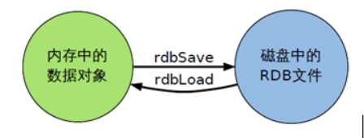
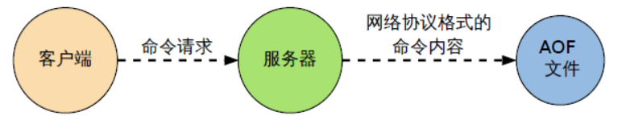

# 配置文件redis.conf

| 配置项                       | 含义、默认值                                                 |
| ---------------------------- | :----------------------------------------------------------- |
| daemonize                    | 默认no。no = 非守护进程 yes= 守护进程                        |
| bind                         | 绑定的主机地址，主从复制时使用                               |
| port                         | 默认端口6379                                                 |
| loglevel                     | 日志级别共4个：debug、verbose、notice、warning，默认为 notice |
| databases                    | 默认16。 数据库的数量                                        |
| timeout                      | 默认300 。当客户端闲置多长秒后关闭连接，如果指定为 0 ，表示关闭该功能 |
| maxclients                   | 设置同一时间最大客户端连接数，默认无限制                     |
| appendonly no                | 指定是否在每次更新操作后进行日志记录，Redis 在默认情况下是异步的把数据写入磁盘，如果不开启，可能会在断电时导致一段时间内的数据丢失。因为 redis 本身同步数据文件是按上面 save 条件来同步的，所以有的数据会在一段时间内只存在于内存中。默认为 no |
| maxmemory <bytes>            | 指定 Redis 最大内存限制。达到最大内存后，Redis 会先尝试清除已到期或即将到期的 Key，当此方法处理 后，仍然到达最大内存设置，将无法再进行写入操作，但仍然可以进行读取操作。Redis 新的 vm 机制，会把 Key 存放内存，Value 会存放在 swap 区 |
| maxmemory-policy  noeviction | 缓存清理策略 默认noeviction。还有LRU(最近最少)  LFU(最近最久) 等 |
| save <seconds><changes>      | RDB配置开启，别表示 900 秒（15 分钟）内有 1 个更改，300 秒（5 分钟）内有 10 个更改以及 60 秒内有 10000 个更改。save 900 1		save 300 10		save 60 10000 |
| rdbcompression               | RDB持久化存储至本地数据库时是否压缩数据 yes                  |
| dir ./                       | RDB持久化文件指定本地数据库存放目录                          |
| dbfilename                   | RDB持久化文件保存到本地的文件名，默认值为 dump.rdb           |
| requirepass foobared         | 设置 Redis 连接密码，如果配置了连接密码，客户端在连接 Redis 时需要通过 AUTH 命令提供密码，默认关闭 |
| include /path/to/local.conf  | 指定包含其它的配置文件，可以在同一主机上多个Redis实例之间使用同一份配置文件，而同时各个实例又拥有自己的特定配置文件 |

# Redis持久化

## RDB (redis database)

### 简介

​		RDB是将一段时间内的SNAPSHOTTING保存到rdb文件中。Redis会单独创建(fork)一个子进程来进行持久化，会先将数据写入到 一个临时文件中，待持久化过程都结束了，再用这个临时文件替换上次持久化好的文件。整个过程中，主进程是不进行任何IO操作的，这就确保了极高的性能。如果需要进行大规模数据的恢复，且对于数据恢复的完整性不是非常敏感，那RDB方式要比AOF方式更加的高效。RDB的缺点是最后一次持久化后的数据可能丢失。

### 配置

RDB是配置在redis.conf中，默认配置开启若不开启. 则修改此配置   改为 save ""

```tex
save 900 1                     	900s  有1次key操作 会保存 比如set key value
save 300 10                   	300s  有10次key操作 会保存 比如set key value
save 60 10000 				  	60s  有1万次key操作 会保存 比如set key value
```

- stop-writes-on-bgsave-error yes    （后台存储存储发生错误时禁止写入，默认为yes）
- rdbcompression yes                         （启动rdb文件采用LZF压缩，耗费CPU资源，默认为yes）
- rdbchecksum yes                             （对rdb数据进行校验，耗费CPU资源，默认为yes）
- dbfilename dump.rdb                     （rdb文件名称）
- dir ./            	                                    （rdb文件前缀目录，这里是相对目录，和redis.conf是同一个目录）

### 如何触发RDB快照

1. 每符合上述条件时会产生一个dump.rdb文件，持续增长覆盖（满足redis.conf 中 save条件） 
2. 输入命令save或者是bgsave
   - save：save时只管保存，其它不管，全部阻塞
   - bgsave：Redis会在后台异步进行快照操作， 快照同时还可以响应客户端请求。可以通过lastsave 命令获取最后一次成功执行快照的时间
3. 执行flushall清库命令，也会产生dump.rdb文件，但里面是空的，无意义

### 数据恢复

​			只需要将rdb文件拷贝到dir下即可

### 优缺点

- 优势
  - 适合大规模的数据恢复
  - 对数据完整性和一致性要求不高
- 劣势
  - 在一定间隔时间做一次备份，所以如果redis意外down掉的话，就会丢失最后一次快照后的所有修改（因为大约都是好几分钟保存一次，需要满足触发条件）
  - Fork的时候，内存中的数据被克隆了一份，大致2倍的膨胀性需要考虑。

### 总结



1. RDB是一个非常紧凑的文件
2. RDB在保存RDB文件时父进程唯一需要做的就是fork出一个子进程，接下来的工作全部由子进程来做，父进程不需要再做其他I0操作，所以RDB持久化方式可以最大化redis的性能。与AOF相比，在恢复大的数据集的时候，RDB方式会更快一一些。数据丢失风险大。
3. RDB需要经常fork子进程来保存数据集到硬盘上，当数据集比较大的时候fork的过程是非常耗时的吗，可能会导致Redis在一些毫秒级不能回应客户端请求。

## AOF(append only file)

### 简介

​		AOF就是日志记录，以日志的形式来记录每个写操作，将Redis执行过的所有写指令记录下来(读操作不记录)， 只许追加文件但不可以改写文件，redis启动之初会读取该文件重新构建数据，换言之，redis 重启的话就根据日志文件的内容将写指令从前到后执行一次以完成数据的恢复工作。

### 配置

```tex
修改配置文件 redis.conf
1. 开启aof
appendonly no   #AOF默认关闭   启动：改为yes
2. 设置aof保存触发方式
appendfsync always     	---总是保存
appendfsync everysec    ---每秒保存
appendfsync no 			--从不保存
```

### AOF文件重写

**why**

​		AOF采用文件追加方式，文件会越来越大。为避免出现此种情况，新增了重写机制，当AOF文件的大小超过所设定的阈值时，Redis就会启动AOF文件的内容压缩， 只保留可以恢复数据的最小指令集。可以使用命令bgrewriteaof    --异步重写aof

**重写原理**
		AOF文件持续增长而过大时，会fork出一条新进程来将文件重写(也是先写临时文件最后再rename)。**遍历新进程的内存中数据，每条记录有一条的Set语句。重写aof文件的操作，并没有读取旧的aof文件，而是将整个内存中的数据库内容用命令的方式重写了一个新的aof文件，这点和快照有点类似**。到一定是时候，启动一个新的进程，将内存中的数据重新编写成aof文件，知识：**set一个最终状态**

**触发机制**
		Redis会记录上次重写时的AOF大小，默认配置是当AOF文件大小是上次rewrite后大小的一倍且文件大于64M时触发
		auto-aof-rewrite-percentage 100
		auto-aof-rewrite-min-size 64mb

### 优缺点

- **优势**
  - 每修改同步：appendfsync always 同步持久化 每次发生数据变更会被立即记录到磁盘 性能较差但数据完整性比较好
  - 每秒同步：appendfsync everysec 异步操作，每秒记录 如果一秒内宕机，有数据丢失
  - 不同步：appendfsync no 从不同步
- **劣势**
  - 相同数据集的数据而言aof文件要远大于rdb文件，恢复速度慢于rdb
  - aof运行效率要慢于rdb,每秒同步策略效率较好，不同步效率和rdb相同

### 总结



- AOF文件时一个只进行追加的日志文件
- Redis可以在AOF文件体积变得过大时，自动地在后台对AOF进行重写
- AOF文件有序地保存了对数据库执行的所有写入操作，这些写入操作以Redis协议的格式保存，因此AOF文件的内容非常容易被人读懂，对文件进行分析也很轻松
- 对于相同的数据集来说，AOF文件的体积通常要大于RDB文件的体积
- 根据所使用的fsync 策略，AOF的速度可能会慢于RDB

## RDB和AOF的区别和优缺点

​		redis有两种持久化方式，aof和rdb。aof相当于日志记录操作命令，rdb相当于数据的快照。

1. 安全性来讲由于aof的记录能够精确到秒级追加甚至逐条追加（基于fsync机制），而rdb只能是全量复制，aof明显高于rdb。
2. 性能来讲rdb就略胜一筹，rdb是redis性能最大化的体现，它不用每秒监控是否有数据写入，当达到触发条件后就自动fork一个子进程进行全量更新，速度也很快。
3. 容灾回复方面rdb更是能够快速的恢复数据，而aof需要读取再写入，相对慢了很多。

### RDB    --体积小速度快性能高

**优点**：

1. 体积更小：	相同的数据量rdb数据比aof的小，因为rdb是紧凑型文件
2. 恢复更快：    因为rdb是数据的快照，基本上就是数据的复制，不用重新读取再写入内存
3. 性能更高:     父进程在保存rdb时候只需要fork一个子进程，无需父进程的进行其他io操作，也保证了服务器的性能。

**缺点**：

1. 故障丢失:  
   - 因为rdb是全量的，我们一般是使用shell脚本实现30分钟或者1小时或者每天对redis进行rdb备份，（注，也可以是用自带的策略），但是最少也要5分钟进行一次的备份，所以当服务死掉后，最少也要丢失5分钟的数据。
2. 耐久性差:
   - 相对aof的异步策略来说，因为rdb的复制是全量的，即使是fork的子进程来进行备份，当数据量很大的时候对磁盘的消耗也是不可忽视的，尤其在访问量很高的时候，fork的时间也会延长，导致cpu吃紧，耐久性相对较差。

### AOF   --数据全

**优点**

1. 数据保证：
   - 我们可以设置fsync策略，一般默认是everysec，也可以设置每次写入追加，所以即使服务死掉了，咱们也最多丢失一秒数据
2. 自动缩小：
   - 当aof文件大小到达一定程度的时候，后台会自动的去执行aof重写，此过程不会影响主进程，重写完成后，新的写入将会写到新的aof中，旧的就会被删除掉。但是此条如果拿出来对比rdb的话还是没有必要算成优点，只是官网显示成优点而已。

**缺点**

1. 性能相对较差：它的操作模式决定了它会对redis的性能有所损耗
2. 体积相对更大：尽管是将aof文件重写了，但是毕竟是操作过程和操作结果仍然有很大的差别，体积也毋庸置疑的更大。
3. 恢复速度更慢：
