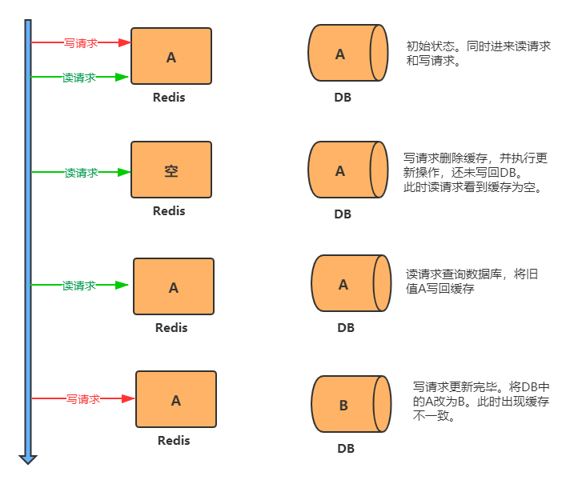
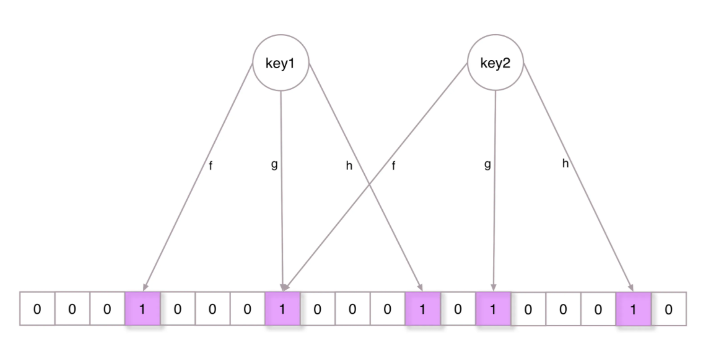

# 分布式锁

## 本地锁synchronized  Lock锁问题

​		针对于单个应用进程的锁，独立部署可以，分布式环境多节点或者多进程下不可用。

## redis锁

### 原理：

​			利用redis中String类型的setnx 命令进行加锁，只有key不存在时，才能执行setnx(key,value) 

​			redis中要求加锁原子性，解锁原子性。加锁使用setnx(key,value)  ，解锁使用lua脚本，保证加解锁的原子性

### redis分布式加锁过程

step1 加锁  setnx(key,value)   step2 执行业务逻辑  step3 解锁

```tex
问题1. 执行业务逻辑出错，无法解锁导致死锁 -->    finally 里解锁
问题2. 执行业务逻辑服务器崩溃、断电，导致死锁-->设置锁的过期时间
问题3. 锁的过期时间 < 执行业务逻辑时间-->解锁异常；其他线程加锁，多次查询数据库；之前的线程解锁了其他线程的锁,key相同
								 -->锁时间自动续期 （redisson 看门狗）or 设置较大的锁时间
问题4：线程解锁了其他线程的锁,key相同 -->设置不同的 value  解锁时比较value 并解锁 ,使用REDIS LUA脚本,保证比较和解锁的原子性
```

```java
private Map<String, List<Catalog2Vo>> methodWithRedisLock() {
        String catelogJson = null;
        /**
         * 1. 占据锁 使用setNx  设置锁过期时间 30s
         * 2. 删除锁
         *    2.1 保证删除的是自己的锁，不然锁过期了，其他线程拿到锁，可能删除的是其他线程的锁
         *          --> value值设置为随机值，删除的时候进行比较然后删除
         *    2.2 业务时间超过锁时间
         *          --> 1. 设置锁过期时间时设置的大一些
         *          --> 2. 锁续期 -->看门狗机制
         */
        String lockRandom = UUID.randomUUID().toString();
        Boolean lock = redisTemplate.opsForValue().setIfAbsent("lock", lockRandom, 30, TimeUnit.SECONDS);
        if (lock) {
            try {
                return getStringListMap();
            } finally {
                /**
                 *  此代码需要保证原子性 ，使用 Redis Lua脚本
                 */
                String script = "if redis.call(\"get\",KEYS[1]) == ARGV[1] then\n" +
                        "    return redis.call(\"del\",KEYS[1])\n" +
                        "else\n" +
                        "    return 0\n" +
                        "end";
                redisTemplate.execute(new DefaultRedisScript<Long>(script, Long.class), Arrays.asList("lock"), lockRandom);
            }
        } else {
            try {
                TimeUnit.SECONDS.sleep(3);
            } catch (InterruptedException e) {
                e.printStackTrace();
            }
            return getCatelogJsonWithRedisLock();
        }
    }
```

## Redis分布式锁主从架构锁失效问题如何解决

### 问题来源：

​		它加锁时只作用在一个Redis节点上，即使Redis通过sentinel保证高可用，如果这个master节点由于某些原因发生了主从切换，那么就会出现锁丢失的情况:

1. 在Redis的master节点上拿到了锁;
2. 但是这个加锁的key还没有同步到slave节点;
3. master故障，发生故障转移，slave节点升级为master节点;
4. 导致锁丢失

### 问题解决

#### **RedLock算法**

```tex
设置N个相互独立，不存在主从复制或者其他集群协调机制的Redis master节点
为了取到锁，客户端应该执行以下操作:

1. 获取当前Unix时间，以毫秒为单位。
2. 依次尝试从N个实例，使用相同的key和随机值获取锁。
3. 客户端使用当前时间减去开始获取锁时间（步骤1记录的时间）就得到获取锁使用的时间。当且仅当从大多数（这里是3个节点）的Redis节点都取到锁，并且使用的时间小于锁失效时间时，锁才算获取成功。
4. 如果取到了锁，key的真正有效时间等于有效时间减去获取锁所使用的时间（步骤3计算的结果）。
5. 如果因为某些原因，获取锁失败（没有在至少N/2+1个Redis实例取到锁或者取锁时间已经超过了有效时间），客户端应该在所有的Redis实例上进行解锁（即便某些Redis实例根本就没有加锁成功）。
```

#### 问题

​	Redlock 必须「强依赖」**多个节点的时钟是保持同步的**，一旦有节点时钟发生错误，那这个算法模型就失效了。redission已经弃用

## Redis&Zookeeper锁架构异同

- zk分布式锁：
  - 就是某个节点尝试创建临时znode，此时创建成功了就获取了这个锁；
  - 这个时候别的客户端来创建锁会失败，只能注册个监听器监听这个锁。
  - 释放锁就是删除这个znode，一旦释放掉就会通知客户端，然后有一个等待着的客户端就可以再次重新加锁。

- 区别：
  - 加锁
    - zk分布式锁，获取不到锁，注册个监听器即可，不需要不断主动尝试获取锁，性能开销较小
    - redis分布式锁需要自己不断去尝试获取锁，比较消耗性能；
  - 解锁
    - 如果是redis获取锁的那个客户端bug了或者挂了，那么只能等待超时时间之后才能释放锁；
    - 而zk的话，因为创建的是临时znode，只要客户端挂了，znode就没了，此时就自动释放锁
    - redis ap 可用性
      zookeeper cp一致性

## 大并发的分布式锁架构该如何设计

Redisson：

1. 以毫秒为单位获取当前时间；使用**相同的key和具有唯一性的value**（例如UUID+TID）顺序从每一个Redis节点中加锁。
2. 客户端需要设置连接、响应超时，并且**超时时间应该<锁失效时间**。这样可以避免Redis宕机，客户端还在等待响应结果。
3. 如果Redis没有在单位时间内响应，客户端应该快速失败请求另外的Redis；当满足>=N/2+1个节点加锁成功，且锁的使用时间<失效时间时，才算加锁成功；
4. 加锁成功后，**key的真正有效时间等于有效时间减去获取锁使用时间**； （redlock）
5. 客户端加锁失败时，需要在所有Redis节点上进行解锁，以防止在某些Redis节点上加锁成功但客户端无响应或超时而影响其它客户端无法加锁。
6. 只要客户端1一旦加锁成功，就会启动一个w**atch dog看门狗**，他是一个后台线程，会每隔10秒检查一下，如果客户端1还持有锁key，那么就会**不断的延长锁key的生存时间**。

## Redisson分布式锁

​		见Redisson 章节

# 缓存穿透、雪崩、击穿

1. 缓存穿透

  - 原因： 	   若从数据库查询的返回结果是空值，没有保存到redis，大规模的查询不存在的数据时，数据库压力增大，缓存失效，导   致缓存穿透。
  - 方案：          缓存查询的空值也应该保存在redis中
      - 缓存大量空值不行--->布隆过滤器

2. 缓存雪崩

  - 原因：	      若缓存的key 失效时间一致，大量的key在同一时间失效。 数据库压力会突然增大，导致缓存雪崩
  - 方案：          缓存的key的失效时间，应该加上随机时间，防止同一时间key大规模失效

3. 缓存击穿

  - 原因：		某个热点key在某个时间(大规模查询到达是)失效，此时会大量访问数据库，数据库压力会突然增大，导致缓存穿透
  - 方案:           访问数据库加锁

# Redis缓存一致性问题

## 双写模式

先更新数据库，再更新缓存

- 不可行。
- 原因分析：
  - 频繁更新缓存浪费资源（写多读少的场景）
  - 缓存数据计算复杂，浪费性能（可能涉及多张表的计算）
  - 线程并发安全问题。（更新缓存的顺序不一致，导致脏数据）

## 失效模式

### 1. 先更新数据库，再删除缓存

1. **使用方式**

   - 基本读取： 先读缓存，缓存中没有数据的话，去数据库中读取，然后存入缓存中，同时返回响应。
   - 先更新数据库，后删除缓存。

2. **存在问题**

   - 数据库更新成功，缓存删除失败。导致数据库中的数据是最新的，但缓存中的是旧数据。
   - 并发问题：导致数据库中的数据是最新的，但缓存中的是旧数据(概率很低)
     1. 读请求去查询缓存时，缓存刚好失效。  
     2. 读请求去查询数据库，得到旧值。
     3. 写请求将新值写入数据库，写请求删除缓存。
     4. 读请求将旧值写入缓存。
   - 分析并发问题出现的概率、
     - 概率非常低，因为条件需要具备读缓存失效，而且并发一个写操作。读操作必须在写操作前进入数据库操作，而又要晚于写操作更新缓存。但实际上写操作比读操作慢得多，所以概率非常小。

3. **解决方案**

   ​	启动一个订阅程序去订阅数据库的`binlog`，获得需要操作的数据。在应用程序中，另起一段程序，获得这个订阅程序传来的信息，进行删除缓存操作

   

### 2. 先删缓存，再更新数据库

1. **问题分析**：

   1. 同时进入两个请求，一个写请求，一个读请求。
   2. 写请求先删除redis中的数据，然后去数据库进行更新操作。
   3. 读请求判断redis中有没有数据，没有数据时去请求数据库，拿到数据后写入缓存。（此时写请求还未更新DB成功，故读请求拿到的是旧数据）
   4. 写请求更新DB成功后，出现缓存与数据库不一致问题。

   

2. **使用了MySQL的读写分离架构，造成双写不一致的原因：**
   1. 同时进入两个请求，一个写请求，一个读请求。
   2. 写请求删除缓存，更新成功主库的数据。但还没同步到从库。
   3. 读请求判断redis中有没有数据，没有数据时去请求从库，拿到数据后写入缓存。（此时拿到的是旧值）
   4. 数据库完成主从同步，从库变为新值。
3. **解决办法：延时双删策略**
   1. 先删除缓存
   2. 再写数据库
   3. 读请求写入缓存是添加过期时间（加锁保证并发读写）
   4. 该方案解决了高并发情况下，同时有读请求与写请求时导致的不一致问题。读取速度快，但是可能会出现短时间的脏数据。

## 总结：

1. 放入缓存的数据不应该是实时性、一致性要求极高的数据。实时性要求高，应该查询数据库。
2. 不应该过度设计，增加系统复杂性

# Redis是单线程还是多线程？

- Redis单线程模型，指的是**执行 Redis 命令的核心模块是单线程的**，而不是整个 Redis 实例就一个线程，Redis 其他模块还有各自模块的线程的。
  - Redis基于Reactor模式开发了网络事件处理器，这个处理器被称为文件事件处理器。它的组成结构为4部分：多个套接字、IO多路复用程序、文件事件分派器、事件处理器。因为文件事件分派器队列的消费是单线程的`，所以Redis才叫单线程模型。

- Redis 不仅仅是单线程
        一般来说 Redis 的瓶颈并不在 CPU，而在内存和网络。如果要使用 CPU 多核，可以搭建多个 Redis 实例来解决。

- Redis6.0为什么网络处理要引入多线程？
  - 内存不够的话，可以加内存或者做数据结构优化和其他优化等。但网络的性能优化才是大头，网络 IO 的读写在 Redis 整个执行期间占用了大部分的 CPU 时间，如果把网络处理这部分做成多线程处理方式，那对整个 Redis 的性能会有很大的提升。**Redis 的多线程部分只是用来处理网络数据的读写和协议解析，执行命令仍然是单线程**


# Redis持久化数据和缓存怎么做扩容？

1. 如果Redis被当做缓存使用，使用一致性哈希实现动态扩容缩容。
2. 如果Redis被当做一个持久化存储使用，必须使用固定的keys-to-nodes映射关系，节点的数量一旦确定不能变化。否则的话(即Redis节点需要动态变化的情况），必须使用可以在运行时进行数据再平衡的一套系统，而当前只有Redis集群可以做到这样。

# Redis 对过期数据的处理

1. 惰性删除:
   - 惰性删除不会去主动删除数据,而是在访问数据的时候，再检查当前键值是否过期，如果过期则执行删除并返回 null 给客户端，如果没有过期则返回正常信息给客户端。
2. 定期删除:
   - Redis会周期性的随机测试一批设置了过期时间的key并进行处理。测试到的已过期的key将被删除。
     - LRU（the least recently used 最近最少使用）算法
       - 如果一个数据在最近没有被访问到，那么在未来被访问的可能性也很小，因此当空间满的时候，最久没有被访问的数据最先被置换(淘汰)
       - LRU算法通常通过双向链表来实现，添加元素的时候，直接插入表头，访问元素的时候，先判断元素是否在链表中存在，如果存在就把该元素移动至表头。淘汰的时候 把队尾的一些删掉；

# Redis布隆过滤器

## 需求：

有10亿个号码，现在又来了10万个号码，要快速准确判断这10万个号码是否在10亿个号码库中

解决办法一：将10亿个号码存入数据库中，进行数据库查询，准确性有了，但是速度会比较慢。

解决办法二：将10亿号码放入内存中，比如Redis缓存中，这里我们算一下占用内存大小：10亿*8字节=8GB，通过内存查询，准确性和速度都有了，但是大约8gb的内存空间，挺浪费内存空间的

#### 解决缓存穿透的问题

一般情况下，先查询缓存是否有该条数据，缓存中没有时，再查询数据库。当数据库也不存在该条数据时，每次查询都要访问数据库，这就是缓存穿透。缓存穿透带来的问题是，当有大量请求查询数据库不存在的数据时，就会给数据库带来压力，甚至会拖垮数据库。

可以使用布隆过滤器解决缓存穿透的问题，把已存在数据的key存在布隆过滤器中。当有新的请求时，先到布隆过滤器中查询是否存在，如果不存在该条数据直接返回；如果存在该条数据再查询缓存查询数据库。


## 布隆过滤器：

​	一种数据结构，是由一串很长的二进制向量组成，可以将其看成一个二进制数组。既然是二进制，那么里面存放的不是0，就是1，但是初始默认值都是0。



对某个值进行 多次hash 操作，将对应的数字改为1

**判断数据是否存在**

​	对于一个值，若经过hash运算后，对应节点的值 有1个是0，那么这个值一定不存在

​	若全部都是1，可能存在，也可能不存在

## 使用

- redis

```sh
> bf.add one-more-filter fans1
(integer) 1
> bf.add one-more-filter fans2
(integer) 1
> bf.add one-more-filter fans3
(integer) 1
> bf.exists one-more-filter fans1
(integer) 1
> bf.exists one-more-filter fans2
(integer) 1
> bf.exists one-more-filter fans3
(integer) 1
> bf.exists one-more-filter fans4
(integer) 0
> bf.madd one-more-filter fans4 fans5 fans6
1) (integer) 1
2) (integer) 1
3) (integer) 1
> bf.mexists one-more-filter fans4 fans5 fans6 fans7
1) (integer) 1
2) (integer) 1
3) (integer) 1
4) (integer) 0

```

- redisson java

```java
11         Config config = new Config();
12         config.useSingleServer().setAddress("redis://192.168.14.104:6379");
13         config.useSingleServer().setPassword("123");
14         //构造Redisson
15         RedissonClient redisson = Redisson.create(config);
16 
17         RBloomFilter<String> bloomFilter = redisson.getBloomFilter("phoneList");
18         //初始化布隆过滤器：预计元素为100000000L,误差率为3%
19         bloomFilter.tryInit(100000000L,0.03);
20         //将号码10086插入到布隆过滤器中
21         bloomFilter.add("10086");
22 
23         //判断下面号码是否在布隆过滤器中
24         System.out.println(bloomFilter.contains("123456"));//false
25         System.out.println(bloomFilter.contains("10086"));//true
```


# Redis的哨兵模式

​		见： redis 主从复制&集群		

# redis集群扩容与收缩

​		见： redis 主从复制&集群	

# Redis底层ZSet跳表是如何设计与实现的

​	见：redis 数据结构

# Redis底层ZSet实现压缩列表和跳表如何选择

​	见：redis 数据结构

# 双十一亿级用户日活统计如何用Redis快速计算

# 双十一电商推荐系统如何用Redis实现

# 双十一电商购物车系统如何用Redis实现

hash

```tex
//增加购物车,key=商品ID,value=数量
hset cart:1001 10021 1
hset cart:1001 10025 1
hset cart:1001 10025 1
//全选功能-获取所有该用户的所有购物车商品
hgetall cart:1001
//商品数量-购物车图标上要显示购物车里商品的总数
hlen cart:1001
//删除-要能移除购物车里某个商品,删除了购物车里商品ID为10079的商品
hdel cart:1001 10079 
//增加某个商品的数量 ,使购物车产品id为10021的商品数量增加了1.
hincrby cart:1001 10021 1
//减少某个商品的数量 ,使购物车产品id为10021的商品数量减少了1.
hincrby cart:1001 10021 -1
```


# 微信的社交App朋友圈关注模型如何设计实现

Zset 

```tex
//假设两个用户。用户ID分别为1001和2001。
zadd 1001:follow time(时间戳) 2001  
zadd 2001:fans time(时间戳) 1001  
//取消关注
zrem 1001:follow 2001
zrem 2001:follow 1001
//查看粉丝列表
zrange 1001:fans 0 -1
//查看关注列表
zrange 1001:follow 0 -1
//关注数量
zcard 1001:follow
//我单向关注Ta。即我关注的Ta，但是Ta并没有关注我的
zscore 1001:follow 2001 //true
zscore 1001:follow 2001 //false
//Ta单向关注我。即Ta关注我了，我并没有关注Ta
zscore 1001:follow 2001 //false  
zscore 1001:fans 2001 //true  
//互相关注。即我关注了Ta，Ta也关注了我
zscore 1001:follow 2001 //true  
zscore 1001:fans 2001 //true  
```


# 美团单车如何基于Redis快速找到附近的车

​	新的数据类型： GEO：地理信息定位（Geolocation）

```tex
//添加Palermo，Catania的地理空间位置到Sicily
GEOADD Sicily 13.361389 38.115556 "Palermo" 15.087269 37.502669 "Catania"

//从Sicily里返回Palermo，Catania的位置（经度和纬度）
GEOPOS Sicily Palermo Catania

//计算Palermo,Catania两个位置之间的距离,支持单位：m(米，默认单位);km(千米);mi(英里);ft(英尺)。
GEODIST Sicily Palermo Catania km

//georadius 格式：
// GEORADIUS key longitude latitude radius m|km|ft|mi [WITHCOORD] [WITHDIST] [WITHHASH] [COUNT count] [ASC|DESC] [STORE key] [STOREDIST key]
//参数说明：
//WITHDIST: 在返回位置元素的同时， 将位置元素与中心之间的距离也一并返回。
//WITHCOORD: 将位置元素的经度和维度也一并返回。
//WITHHASH: 以 52 位有符号整数的形式， 返回位置元素经过原始 geohash 编码的有序集合分值。 这个选项主要用于底层应用或者调试， 实际中的作用并不大。
//COUNT 限定返回的记录数。
//ASC: 查找结果根据距离从近到远排序。
//DESC: 查找结果根据从远到近排序。
//以(15,37)为中心,返回Sicily当中,与中心的距离不超过200km的所有位置元素。
GEORADIUS Sicily 15 37 200 km WITHDIST

//以Agrigento为中心,返回Sicily当中,与中心的距离不超过200km的所有位置元素。
GEORADIUSBYMEMBER Sicily Agrigento 100 km

```

