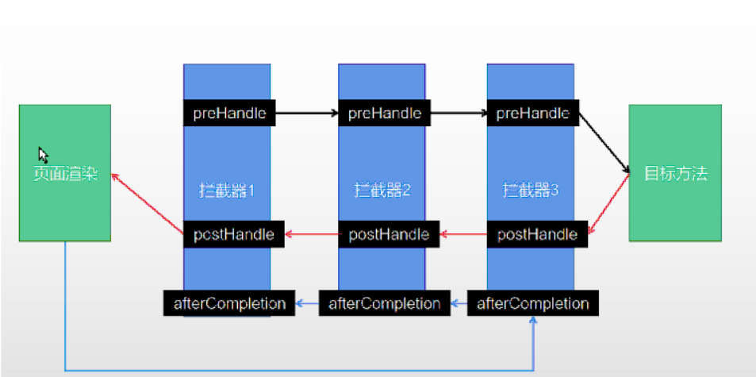
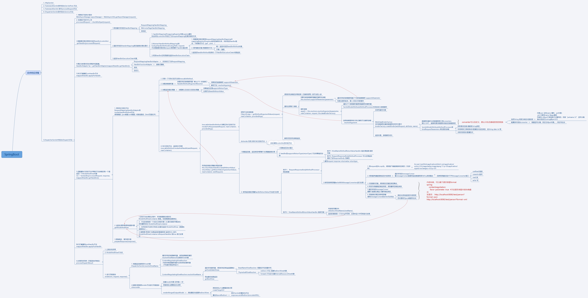

# SpringBoot

​		Spring Boot 是 Spring 开源组织下的子项目，是 Spring 组件一站式解决方案，主要是简化了使用 Spring 的难度，简省了繁重的配置，提供了各种启动器，开发者能快速上手

**优点**

1. 容易上手，提升开发效率，为 Spring 开发提供一个更快、更广泛的入门体验。
2. 开箱即用，远离繁琐的配置。
3. 提供了一系列大型项目通用的非业务性功能，例如：内嵌服务器、安全管理、运行数据监控、运行状况检查和外部化配置等。
4. 没有代码生成，也不需要XML配置。
5. 避免大量的 Maven 导入和各种版本冲突。

## SpringBoot相关注解

- @SpringBootApplication
  - @SpringBootConfiguration：组合了 @Configuration 注解，实现配置文件的功能。
  - @EnableAutoConfiguration：打开自动配置的功能，也可以关闭某个自动配置的选项，如关闭数据源自动配置功能： @SpringBootApplication(exclude = { DataSourceAutoConfiguration.class })。
  - @ComponentScan：Spring组件扫描。
- 组件添加
  - @Configuration 配置类
  - @Bean 组件
  - @Component 	组件
    - @Controller 	控制层
    - @Service 	服务层
    - @Repository	数据库层
    - @mapper 	数据库层
  - @ComponentScan	指定扫描包路径，一般用于主配置类，默认是主配置类所在包及其子包
  - @Import	必须添加在组件类上，导入一个或者多个组件	
  - @import({A.class,B.class,C.class}) 	自动调用ABC3个类的无参构造器，将ABC放入到容器中
  - Conditional 条件装配
    - @ConditionalOnMissingBean 	指定的bean不存在时才生效
    - @ConditionalOnBean    指定的bean存在时才生效
    - @ConditionalOnMissingClass    指定类型的bean组件不存在时生效
    - @ConditionalOnClass    指定类型的bean组件存在时生效
    - @ConditionalOnSingleCandidate     指定类型的bean组件是单实例时生效
- 原生配置文件引入
  - @ImportResource   添加在类上，后面跟xml文件路径，原生的import方式
    - @ImportResource("classpath:beans.xml")
      public class MyConfig {}
- 配置绑定
  - @ConfigurationProperties   配置绑定。使用在properties配置类上，类属性绑定对应前缀的配置
  - @EnableConfigurationProperties + @ConfigurationProperties
  - @Component + @ConfigurationProperties
- 请求
  - @RequestMapping
    - @GetMapping
    - @PostMapping
  - @RequestParam  请求参数
  - @RequestBody  请求体
  - @PathVariable
  - 

## Spring配置文件加载顺序

**bootstrap的配置文件优先加载**

application配置

1. config/application.properties（项目根目录中config目录下）
2. config/application.yml
3. application.properties（项目根目录下）
4. application.yml
5. resources/config/application.properties（项目resources目录中config目录下）
6. resources/config/application.yml
7. resources/application.properties（项目的resources目录下）
8. resources/application.yml

注：

    1、如果同一个目录下，有application.yml也有application.properties，默认先读取application.properties。
    
    2、如果同一个配置属性，在多个配置文件都配置了，默认使用第1个读取到的，后面读取的不覆盖前面读取到的。
    
    3、创建SpringBoot项目时，一般的配置文件放置在“项目的resources目录下”
## Spring自动配置原理

**xxxxxAutoConfiguration ---> 组件  --->** **xxxxProperties里面拿值  ----> application.properties**

注解 @SpringBootApplication 由三个注解组成：

- @SpringBootConfiguration：组合了 @Configuration 注解，实现配置文件的功能。

- @ComponentScan：Spring组件扫描。

- @EnableAutoConfiguration：打开自动配置的功能，。

  - @AutoConfigurationPackage

    ```java
    @Import(AutoConfigurationPackages.Registrar.class)  //给容器中导入一个组件
    public @interface AutoConfigurationPackage {}
    ```

  - @Import(AutoConfigurationImportSelector.class)

    ```tex
    1、利用getAutoConfigurationEntry(annotationMetadata);给容器中批量导入一些组件
    2、调用List<String> configurations = getCandidateConfigurations(annotationMetadata, attributes)
    		获取到所有需要导入到容器中的配置类 默认127个
    3、利用工厂加载 Map<String, List<String>> loadSpringFactories(@Nullable ClassLoader classLoader)；得到所有的组件
    4、从META-INF/spring.factories位置来加载一个文件。
    	默认扫描我们当前系统里面所有META-INF/spring.factories位置的文件
        spring-boot-autoconfigure-2.3.4.RELEASE.jar包里面也有META-INF/spring.factories
    ```

- 按需装配
  - 虽然我们127个场景的所有自动配置启动的时候默认全部加载。xxxxAutoConfiguration
    按照条件装配规则（@Conditional），最终会按需配置。

1. SpringBoot先加载所有的自动配置类  xxxxxAutoConfiguration
2. 每个自动配置类按照条件进行生效，默认都会绑定配置文件指定的值。xxxxProperties里面拿。xxxProperties和配置文件进行了绑定
3. 生效的配置类就会给容器中装配很多组件
4. 只要容器中有这些组件，相当于这些功能就有了
5. 定制化配置

- - 用户直接自己@Bean替换底层的组件
  - 用户去看这个组件是获取的配置文件什么值就去修改。

# Spring请求

## 静态资源

- **静态资源存放目录**
  - /static
  - /public
  - /resources
  - /META-INF/resources


	访问 xxx.js 先看controller能不能处理，不能处理去看静态资源有没有，还没有就会出404error
- 给静态资源加前缀、改变静态资源默认位置

  ```yaml
  spring:
  	mvc:
   		static-path-pattern: /res/**         	#添加前缀
      resources:
      	static-locations: [classpath:/haha/]   	#改变静态资源默认位置
  ```

-  欢迎页（配置前缀会失效）、Favicon 图标（配置前缀会失效）

  ```tex
  静态资源路径下  index.html   Favicon.io
  ```

-  原理 WebMvcAutoConfiguration配置类
  - 具体查看
    org.springframework.boot.autoconfigure.web.servlet.WebMvcAutoConfiguration.EnableWebMvcConfiguration#addResourceHandlers 方法

## 动态请求

### Rest风格支持

使用的提交方式不同，执行的controller方法不同

1. 开启rest 风格支持

```yaml
spring:
  mvc:
    hiddenmethod:
      filter:
        enabled: true   #开启页面表单的Rest功能
```

2. 使用rest风格编写html 

   - 表单提交方式   method=post，
   - 添加隐藏域    _method=put  表示使用put方式提交

3. Controller对应处理方法标注

   @RequestMapping(value = "/user",method = RequestMethod.GET)
   @RequestMapping(value = "/user",method = RequestMethod.POST)
   @RequestMapping(value = "/user",method = RequestMethod.PUT)
   @RequestMapping(value = "/user",method = RequestMethod.DELETE)

### 路径变量请求

1. 编写  @GetMapping("/car/{id}/owner/{username}")
2. 使用  @PathVariable 注解得到id 、username 的值
   @PathVariable("id") Integer id,
   @PathVariable("username") String name,
3. 也可以不指定 明确的值 获取全部的变量kv键值对
   @PathVariable Map<String,String> pv

```java
//controller：
@GetMapping("/car/{id}/owner/{username}")
public Map<String,Object> getCar(
		@PathVariable("id") Integer id,
		@PathVariable("username") String name,
		@PathVariable Map<String,String> pv){
	
}
```

### 矩阵变量请求

​	矩阵变量请求基于路径变量请求，SpringBoot默认是禁用了矩阵变量的功能

手动开启： 配置中添加configurePathMatch组件

```java
@Configuration
public class MyConfig {
    public WebMvcConfigurer webMvcConfigurer(){
        return  new WebMvcConfigurer() {
            @Override
            public void configurePathMatch(PathMatchConfigurer configurer) {
                //获取到UrlPathHelper
                UrlPathHelper urlPathHelper=new UrlPathHelper();
                //开启矩阵变量
                urlPathHelper.setRemoveSemicolonContent(false);
                configurer.setUrlPathHelper(urlPathHelper);
            }
        };
    }
}
```

```tex
示例1：请求路径 url=/boss/1;age=20/2;age=10
@GetMapping("/boss/{bossId}/{empId}")
public Map boss(
		@MatrixVariable(value = "age",pathVar = "bossId") Integer bossAge,
		@MatrixVariable(value = "age",pathVar = "empId") Integer empAge){
  		1. bossAge =20 
        2. empAge =10	
}

示例2  请求路径：url=/cars/sell;low=34;brand=byd,audi,yd
@GetMapping("/cars/{path}")
public Map carsSell(
	@MatrixVariable("low") Integer low,
	@MatrixVariable("brand") List<String> brand,
	@PathVariable("path") String path){
1. low =34
2. brand ={byd,audi,yd}
3.path = sell }
```

### 其他请求参数获取

1. 获取请求头信息
    @RequestHeader("User-Agent") String userAgent,
    @RequestHeader Map<String,String> header

2. 获取cookie
   @CookieValue("ga") String _ga,
   @CookieValue("ga") Cookie cookie

3. 获取request 域中的属性

   1. 比如请求转发forward 转发前设置了一个信息  

      ​	request.setAttribute("msg","你好")

   2. name在转发的方法可以使用requestAttribute 获取
       @RequestAttribute("msg") String msg

# Spring处理

## 拦截器




1. 编写拦截器 **实现HandlerInterceptor 接口** 重写 3个方法

2. 将拦截器配置到容器中,配置拦截器代码如下：
	
```java
@Configuration
public class AdminWebConfig implements WebMvcConfigurer {
   
    @Override
    public void addInterceptors(InterceptorRegistry registry) {
        registry.addInterceptor(new LoginInterceptor())
                .addPathPatterns("/**")  //所有请求都被拦截包括静态资源
                .excludePathPatterns("/","/login","/css/**","/fonts/**","/images/**","/js/**"); //放行的请求
 }
	}
```

3. 拦截器代码如下：

```java
@Slf4j
public class LoginInterceptor implements HandlerInterceptor {
@Override
public boolean preHandle(HttpServletRequest request, HttpServletResponse response, Object handler) throws Exception {

    String requestURI = request.getRequestURI();
    log.info("preHandle拦截的请求路径是{}",requestURI);
    }
    return false;
}

/**
 * 目标方法执行完成以后
 */
@Override
public void postHandle(HttpServletRequest request, HttpServletResponse response, Object handler, ModelAndView modelAndView) throws Exception {
    log.info("postHandle执行{}",modelAndView);
}

/**
 * 页面渲染以后
 */
@Override
public void afterCompletion(HttpServletRequest request, HttpServletResponse response, Object handler, Exception ex) throws Exception {
    log.info("afterCompletion执行异常{}",ex);
}
}
```
## 文件上传

1. 页面配置

  - 注意： post 提交 、enctype="multipart/form-data"、type="file"、 多文件multiple

    ```html
    <form role="form" th:action="@{/upload}" method="post" enctype="multipart/form-data">
        <div class="form-group">
            <label for="exampleInputEmail1">Email address</label>
            <input type="email" name="email" class="form-control" id="exampleInputEmail1" placeholder="Enter email">
        </div>
        <div class="form-group">
            <label for="exampleInputPassword1">Password</label>
            <input type="password" name="password" class="form-control" id="exampleInputPassword1" placeholder="Password">
        </div>
        <div class="form-group">
            <label for="exampleInputFile">单文件上传</label>
            <input type="file" id="exampleInputFile" name="photo">
            <p class="help-block">Example block-level help text here.</p>
        </div>
        <div class="form-group">
            <label for="exampleInputFile">多文件上传</label>
            <input type="file" id="exampleInputFiles"  name="photos" multiple>
            <p class="help-block">Example block-level help text here.</p>
        </div>
      <!--  <div class="checkbox">
            <label>
                <input type="checkbox"> Check me out
            </label>
        </div>-->
        <button type="submit" class="btn btn-primary">Submit</button>
    </form>
    
    ```

2. 后台代码编写
	
	- @RequestPart("headerImg") MultipartFile headerImg    取单个文件
	
	- @RequestPart("photos") MultipartFile[] photos	取多个文件
	
	- ```java
	   /**
	     * MultipartFile 自动封装上传过来的文件
	       /
	  @PostMapping("/upload")
	  public String upload(@RequestParam("email") String email,
	                   @RequestParam("username") String username,
	                   @RequestPart("headerImg") MultipartFile headerImg,
	                   @RequestPart("photos") MultipartFile[] photos) throws IOException {
	  log.info("上传的信息：email={}，username={}，headerImg={}，photos={}",
	               email,username,headerImg.getSize(),photos.length);
	  //单文件
	      if(!headerImg.isEmpty()){
	          //保存到文件服务器，OSS服务器
	          String originalFilename = headerImg.getOriginalFilename();
	          headerImg.transferTo(new File("H:\\cache\\"+originalFilename));
	      }
	  //多文件
	      if(photos.length > 0){
	         for (MultipartFile photo : photos) {
	                   if(!photo.isEmpty()){
	                       String originalFilename = photo.getOriginalFilename();
	                       photo.transferTo(new File("H:\\cache\\"+originalFilename));
	                   }
	               }
	           }
	      return "main";
	  }
	  ```
	
	  

## 异常处理

### 默认处理

​		默认情况下，Spring Boot提供/error处理所有错误的映射。出错了会重新发送一个/error请求。

- 对于机器客户端，它将生成JSON响应，其中包含错误，HTTP状态和异常消息的详细信息。
- 对于浏览器客户端，响应一个“ whitelabel”错误视图，以HTML格式呈现相同的数据.(内容协商)
  - error/下的4xx，5xx页面会被自动解析 （静态资源目录下的/error/或者模板引擎目录/error/）
  -  error/404.html   error/5xx.html；有精确的错误状态码页面就匹配精确，没有就找 4xx.html；如果都没有就触发白页

### 自定义异常处理


## 添加原生组件（servlet、filter、listener）

**step1： 主配置类添加ServletComponentScan** 

* **ServletComponentScan 服务组件扫描，扫描指定路径下的组件@webServlet @webFilter @webListener等**
  * //@ServletComponentScan(basePackages = "com.chen.admin.servlet")

**step2： 编写servlet**

```java
@WebServlet(urlPatterns = "/myServlet")
@Slf4j
public class MyServlet  extends HttpServlet {
    @Override
    protected void doGet(HttpServletRequest req, HttpServletResponse resp) throws ServletException, IOException {
        log.info("/myServlet doGet执行");
        resp.getWriter().write("88888");
    }
}
```

**step3 编写Filter** 

    @WebFilter(urlPatterns={"/myServlet","/css/*","/images/*"})
    @Slf4j
    public class MyFilter implements Filter {
        @Override
        public void init(FilterConfig filterConfig) throws ServletException {
            log.info("Filter初始化完成");
        }
        @Override
        public void doFilter(ServletRequest request, ServletResponse response, FilterChain chain) throws IOException, ServletException {
            log.info("doFilter方法执行");
            chain.doFilter(request, response);
        }
        @Override
        public void destroy() {
            log.info("Filter销毁");
        }
    }
**step4 编写Listener** 

```java
/**

 * 自定义监听器 使用 @webListener注解

 * 一，监听servlet上下文对象生命周期的监听器

 * 实现ServletContextListener接口

 * 二，监听HttpSession对象的声明周期的监听器

 * 实现HttpSessionListener接口

 * 三，监听HttpServletRequest对象的声明周期

 * 实现ServletRequestListener接口

 * 四，监听ServletContext属性操作的监听器

 * 实现ServletContextAttributeListener接口

 * 五，监听HttpSession属性操作的监听器

 * 实现HttpSessionAttributeListener接口

 * 六，监听ServletRequest属性操作监听器

 * 实现ServletRequestAttributeListener接口

 * @author chenpc

 * @version 1.0

 * @since 2021/3/15/03/15  10:18
   */
   @WebListener
   @Slf4j
   public class MyListener implements ServletContextListener {
       @Override
       public void contextInitialized(ServletContextEvent sce) {
           log.info("项目已启动");
       }

       @Override
       public void contextDestroyed(ServletContextEvent sce) {
           log.info("项目已停止");
       }
   }
```

## 数据层整合

### 整合JDBC

1. 引入依赖

	 <dependency>
	            <groupId>org.springframework.boot</groupId>
	            <artifactId>spring-boot-starter-data-jdbc</artifactId>
	</dependency>

2. 导入数据库驱动

    <dependency>
        <groupId>mysql</groupId>
        <artifactId>mysql-connector-java</artifactId>
    	<version>8.0.22</version>
    </dependency>
3. 配置数据源

   ```yaml
   spring:
     datasource:
    #数据源连接配置
    	url: jdbc:mysql://localhost:3306/springboot?serverTimezone=GMT%2B8&useUnicode=true&characterEncoding=utf-8
    	username: root
    	password: root
    	driver-class-name: com.mysql.cj.jdbc.Driver
   ```

4. 测试使用

   ```java
   @Slf4j
   @SpringBootTest
   class Boot05WebAdminApplicationTests {
       @Autowired
       JdbcTemplate jdbcTemplate;
       @Test
       void contextLoads() {
   //        jdbcTemplate.queryForObject("select * from account_tbl")
   //        jdbcTemplate.queryForList("select * from account_tbl",)
           Long aLong = jdbcTemplate.queryForObject("select count(*) from account_tbl", Long.class);
           log.info("记录总数：{}",aLong);
       }
   }
   ```

### 整合Mybatis

1. pom引入mybatis依赖

   ```tex
       <dependency>
           <groupId>org.mybatis.spring.boot</groupId>
           <artifactId>mybatis-spring-boot-starter</artifactId>
           <version>2.1.4</version>
       </dependency>
   ```

2. 配置yaml  配置mybatis规则

```yaml
#mybatis:
#全局配置文件位置 可以不设置 使用底边的configuration配置
#  #config-location: classpath:mybatis/mybatis-config.xml  
#  mapper-locations: classpath:mybatis/mapper/*.xml  #sql映射文件位置。必须配置
#  configuration:
#    map-underscore-to-camel-case: true  #开启驼峰命名

```

3. 配置mybatis全局配置文件mybatis-config.xml  可以不配置

   - 在/resources/mybatis/ 下创建mybatis-config.xml,例如：

   ```xml
   <?xml version="1.0" encoding="UTF-8" ?>
   <!DOCTYPE configuration
     PUBLIC "-//mybatis.org//DTD Config 3.0//EN"
     "http://mybatis.org/dtd/mybatis-3-config.dtd">
   <configuration>
   <settings>
     <setting name="mapUnderscoreToCamelCase" value="false"/>   ##驼峰命名 开启=true 默认false
   </settings>
   </configuration>
   ```

4. 声明 mapper 接口 、编写xml映射文件

   - 在接口上添加@mapper  注解

   - 主配置类标注，指定某个包是mapper

     @MapperScan("com.atguigu.admin.mapper")

### 整合mybatisplus

1. 依赖引入       不用引入mybatis 因为有带的

   ```tex
   <dependency>
              <groupId>com.baomidou</groupId>
              <artifactId>mybatis-plus-boot-starter</artifactId>
              <version>3.4.1</version>
   </dependency>
   ```

2. 配置文件、配置类

   1. mapperLocations 自动配置好的。有默认值。classpath*:/mapper/**/*.xml；
      任意包的类路径下的所有mapper文件夹下任意路径下的所有xml都是sql映射文件

   2. @Mapper 标注的接口也会被自动扫描；建议直接 @MapperScan批量扫描就行
      @SpringBootApplication
      @MapperScan("com.chen.admin.mapper")
      public class DemoWebAdminApplication {}

   3. 配置文件

      ```yaml
      mybatis-plus:
        configuration:
          map-underscore-to-camel-case: true  #默认就是true 开启驼峰命名
      ```

   4. 编写配置类 不然分页会失效

      ```java
      @Configuration
      @MapperScan("com.chen.admin.mapper")
      public class MybatisPlusConfig {
          @Bean
          public MybatisPlusInterceptor mybatisPlusInterceptor() {
              MybatisPlusInterceptor interceptor = new MybatisPlusInterceptor();
              interceptor.addInnerInterceptor(new PaginationInnerInterceptor(DbType.MYSQL));
              return interceptor;
          }
      }
      ```

3. 特点

   1. 具有写好的curd mapper类继承basemapper即可

      ```java
      @TableName("Dynamic_Table")
            public interface TableMapper extends BaseMapper<DynamicTable> {
      
      }
      ```

   2. 服务接口继承 IService  服务实现类 继承ServiceImpl   因为Iservice里有很多写好的接口

   3. ```java
      public interface TableService extends IService<DynamicTable> {
      /**
       * 保存多个表数据
       * @param dynamicTables 表数据集合
       */
      public void saveTables(List<DynamicTable> dynamicTables);
      }
      ```

   4. ```java
      @Service
      public class TableServiceImpl extends ServiceImpl<TableMapper,DynamicTable>implements TableService {
          @Autowired
          TableMapper tableMapper;
      
          @Override
          public void saveTables(List<DynamicTable> dynamicTables){
              for (DynamicTable dynamicTable : dynamicTables) {
                      tableMapper.insert(dynamicTable);
              }
          }
      }
      ```

4. 其他注意

   1. 实例类属性在表中不存在时，使用 @TableField(exist = false)标注不存在，比如enable不存在
      @TableName(value = "tab_user")   // 关联数据库的tab_user表

   2. ```java
      @Data
      @TableName(value = "tab_user")   // 关联数据库的tab_user表
      public class User {
          private  String userName;
          private  String userPassword;
          @TableField(exist = false)
          private  String enable;   // 不存在此字段
      }
      ```

### 整合Redis

1. 引入redis starter

   ```tex
   <dependency>
       <groupId>org.springframework.boot</groupId>
       <artifactId>spring-boot-starter-data-redis</artifactId>
   </dependency>
   <dependency>
       <groupId>redis.clients</groupId>
       <artifactId>jedis</artifactId>
   </dependency>
   ```

2. 配置yaml 

   ```yaml
   #redis配置
   spring:
   redis:
     host: 192.168.121.128
     port: 6379
     password: 123456
     client-type: jedis   //默认是Lettuce   lettuce并发更好
     jedis:
       pool:
         max-active: 10    #线程池
   cache:
     redis:
       use-key-prefix: false
   ```

3. 使用
   	使用StringRedisTemplate 或者 redisTemplate

# SpringMVC请求处理流程



[Spring流程思维导图]: SpringBoot.assets/SpringMCV.xmind

