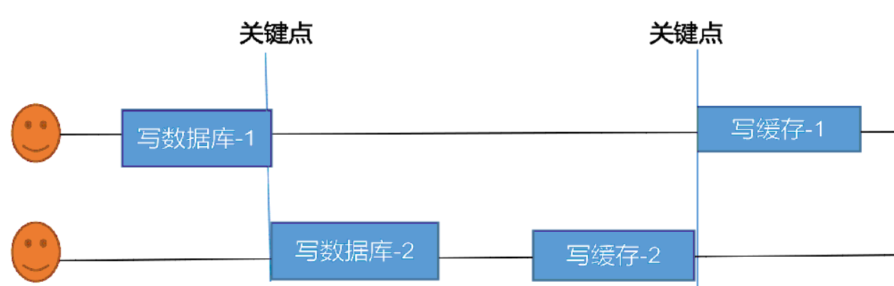
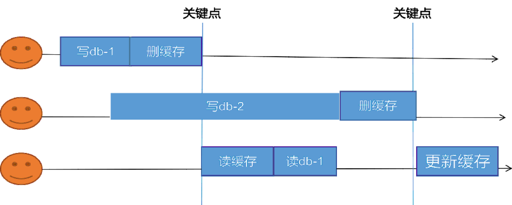

# SpringCache

## 缓存一致性问题

​			数据保存在 Redis缓存中 ，修改数据库数据时，应该同时修改缓存的数据。保证缓存的结果与数据库结果一致。缓存一致性的两种方式如下:

- 双写模式：  修改数据库时，同时更新缓存内容
- 失效模式:    修改数据库时，删除缓存，等待下一次 请求，查询数据库加入缓存

**缓存一致性存在的问题：**

- 双写模式

  

  A线程操作完成数据库后至写缓存的时间段内，B线程抢先执行。  此时数据库是B线程内容，缓存是A线程内容。添加读写锁解决此问题。

- 失效模式问题

  

  1. A 线程更新操作，操作完成，先写后删除（DB 有最新数据，缓存没有数据）
  2. B线程更新操作，写数据库未完成，删除缓存未完成（DB没有最新数据，缓存没有数据）
  3. C线程读操作，读取缓存没有数据（被A线程删了），然后去读数据库，此时B线程数据库修改没完成，C线程读的是A线程写的内容。
  4. B线程删除缓存后，C线程更新缓存。
  5. 此时数据库时B线程的内容，缓存是A线程的内容 。数据库与缓存不一致。--》添加读写锁解决

**总结：**

1. 放入缓存中的数据不应该是实时性要求特别高的数据
2. 建议使用失效模式，加入缓存中添加过期时间，过期后的第一次访问去数据库查询数据，保证数据一致性
3. 读写数据时，添加分布式的读写锁，保证缓存数据一致性

## 整合SpringCache

1. 微服务引入SpringCache依赖

   ```xml
   <dependency>
        <groupId>org.springframework.boot</groupId>
        <artifactId>spring-boot-starter-cache</artifactId>
   </dependency>
   ```

2. 指定SpringCache缓存类型

   ```yaml
   spring:
     cache:
       type: redis #指定缓存类型为redis
       redis:
         ///指定redis中的过期时间为1h
         time-to-live: 3600000
   ```

3. 开启缓存注解 ，启动类添加@EnableCaching

4. Service 方法添加 @Cacheable注解

   value 指定缓存的分区，分区可以指定多个，将结果缓存到多个分区中

   key 指定缓存的名字   可以是方法名称   #root.method.name 是当前方法名	

   sync = true表示该方法的缓存被读取时会加锁

   ```java
   @Cacheable(value = {"category"},key = "#root.method.name",sync = true)
   public List<CategoryEntity> getLeve1Categorys() {...}
   ```

5. 指定缓存序列化方式为json

   ```java
   @Configuration
   public class MyCacheConfig {
       @Bean
       public org.springframework.data.redis.cache.RedisCacheConfiguration redisCacheConfiguration(
               CacheProperties cacheProperties) {
           CacheProperties.Redis redisProperties = cacheProperties.getRedis();
           org.springframework.data.redis.cache.RedisCacheConfiguration config = org.springframework.data.redis.cache.RedisCacheConfiguration
                   .defaultCacheConfig();
           //指定缓存序列化方式为json
           config = config.serializeValuesWith(
                   RedisSerializationContext.SerializationPair.fromSerializer(new GenericJackson2JsonRedisSerializer()));
           //设置配置文件中的各项配置，如过期时间
           if (redisProperties.getTimeToLive() != null) {
               config = config.entryTtl(redisProperties.getTimeToLive());
           }
           if (redisProperties.getKeyPrefix() != null) {
               config = config.prefixKeysWith(redisProperties.getKeyPrefix());
           }
           if (!redisProperties.isCacheNullValues()) {
               config = config.disableCachingNullValues();
           }
           if (!redisProperties.isUseKeyPrefix()) {
               config = config.disableKeyPrefix();
           }
           return config;
       }
   }
   ```

6. 失效模式配置

   - @CachePut  ，添加@CachePut注解的方法，会把方法的返回值put到缓存里面缓存起来。它通常用在新增方法上。

   - @CacheEvict ，添加CacheEvict注解的方法，会清空指定缓存。一般用在更新或者删除的方法上。

     - @CacheEvict(value = {"category"},key= "key")   // 删除category分区下 指定的key

     - @CacheEvict(value = {"category"},allEntries = true)  //删除缓存category下的所有cache

     - @Caching组合多种操作

       ```java
       //删除 key1 和key2 
       @Caching(evict = {
               @CacheEvict(value = {"category"},key = "key1"),
               @CacheEvict(value = {"category"},key = "key2")
       })
       ```

       