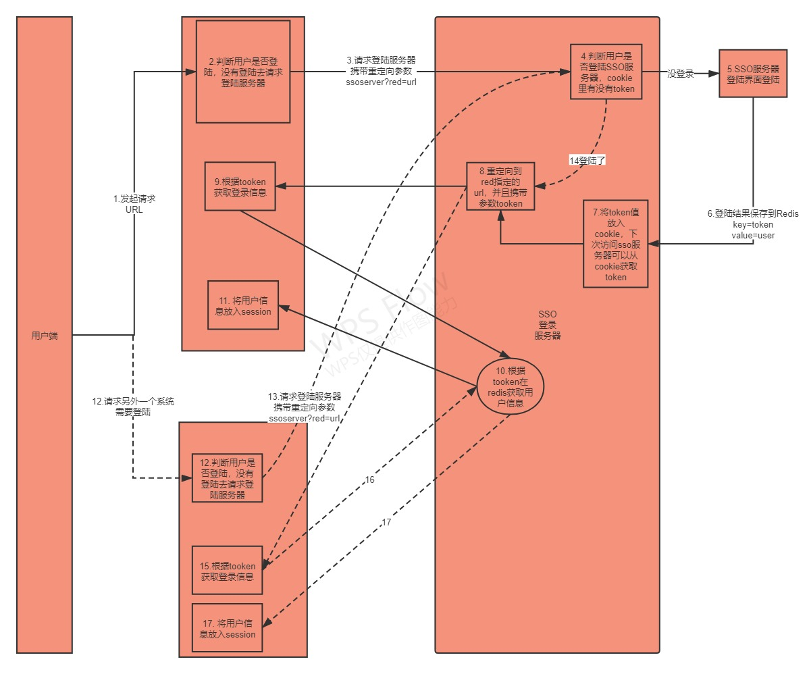
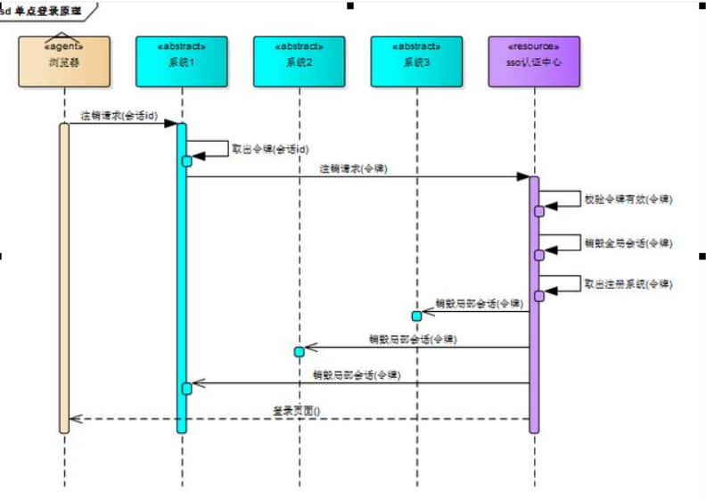

# SingleSignOn 单点登录

​		单点登录是在多个应用系统中，用户只需要登录一次就可以访问所有相互信任的应用系统的保护资源，若用户在某个应用系统中进行注销登录，所有的应用系统都不能再直接访问保护资源，有一个独立的认证中心，只有认证中心才能接受用户的用户名和密码等信息进行认证，其他系统不提供登录入口，只接受认证中心的间接授权。间接授权通过令牌实现，当用户提供的用户名和密码通过认证中心认证后，认证中心会创建授权令牌，在接下来的跳转过程中，授权令牌作为参数发送给各个子系统，子系统拿到令牌即得到了授权，然后创建局部会话。

## 客户端与服务器端的功能

### 客户端：

1. 拦截子系统未登录用户请求，跳转至sso认证中心
2. 接收并存储sso认证中心发送的令牌
3. 与服务器端通信，校验令牌的有效性
4. 建立局部会话
5. 拦截用户注销请求，向sso认证中心发送注销请求
6. 接收sso认证中心发出的注销请求，销毁局部会话

### 服务器端：

1. 验证用户的登录信息
2. 创建全局会话
3. 创建授权令牌
4. 与客户端通信发送令牌
5. 校验客户端令牌有效性
6. 系统注册
7. 接收客户端注销请求，注销所有会话

## 单点登录流程

## 单点注销

