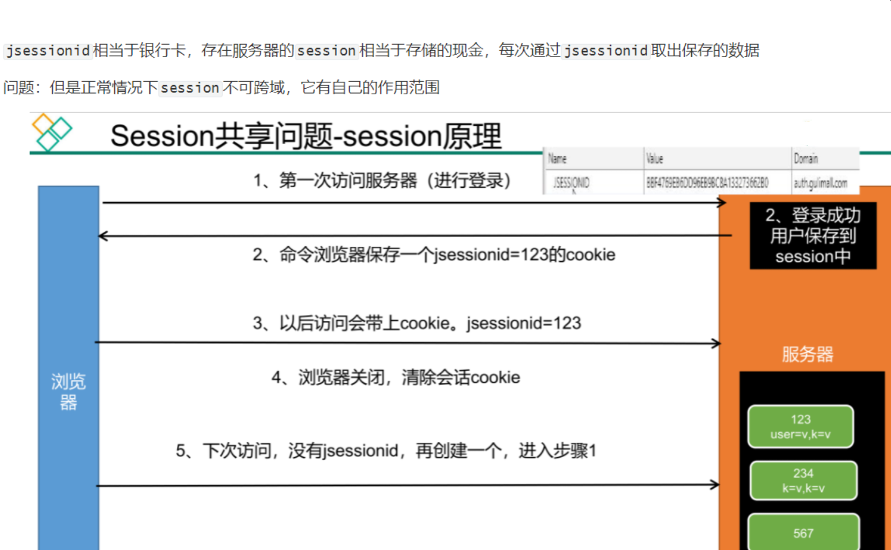
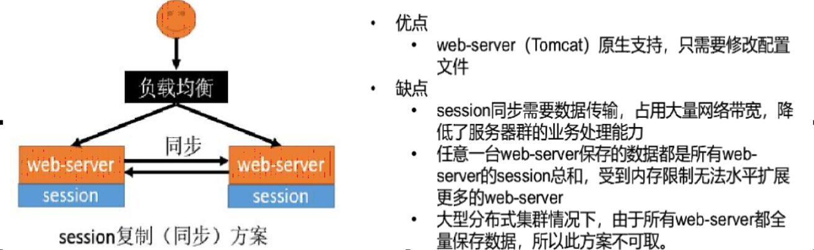
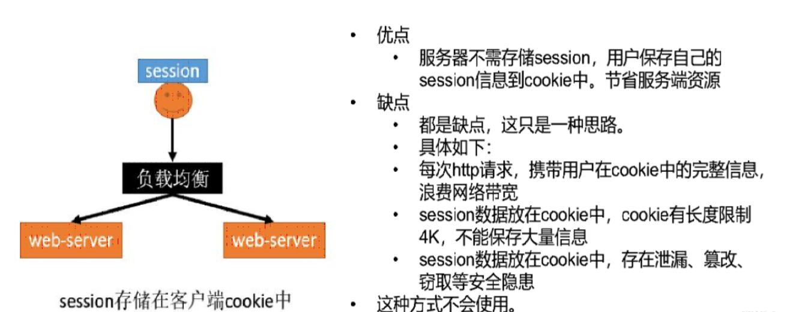
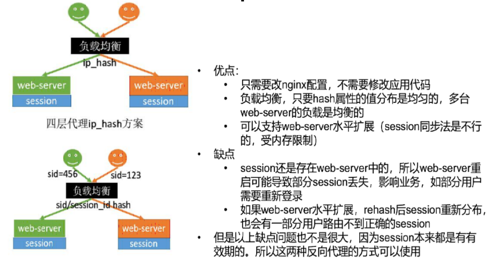
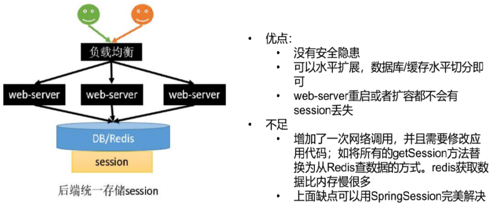

# SpringSession

## Session共享问题

- 同一个服务集群间需要session共享，即Session 共享
- 不同的服务之间需要session共享，即Session跨域



## Session共享解决方案

1. session 复制

   

2. 客户端存储

   

3. Nginx 负载均衡策略 使用IPHASH 或者业务字段hash，保证同一个ip发起的落入同一个服务器

   

4. 后端统一存储，服务器Session 统一保存在redis中

   

## 微服务整合SpringSession

1. 微服务添加Spring session相关依赖

   ```xml
   <!-- 整合spring session-->
   <dependency>
       <groupId>org.springframework.session</groupId>
       <artifactId>spring-session-data-redis</artifactId>
   </dependency>
   ```

2. 配置文件中指定Session的保存方式

   ```properties
   spring.session.store-type: redis
   ```

3. 配置类或者主启动类添加@EnableRedisHttpSession，开启Redishttpsession功能

4. 添加配置文件，指定session序列化方式以及解决session跨域问题

   ```java
   @Configuration
   public class GulimallSessionConfig {
       //配置redis 使用json序列化
       @Bean
       public RedisSerializer<Object> springSessionDefaultRedisSerializer() {
           return new GenericJackson2JsonRedisSerializer();
       }
   
       @Bean
       public CookieSerializer cookieSerializer() {
           DefaultCookieSerializer serializer = new DefaultCookieSerializer();
           //配置cookie名称
           serializer.setCookieName("GULISESSIONID");
           //配置cookie的名字作用域
           serializer.setDomainName("gulimall.com");
           return serializer;
       }
   }
   ```

## SpringSession 工作原理

​	大致工作原理是提供一个从redis操作Session的类，使用过滤器封装request、response，重写代理对象的getsession方法，具体代码分析如下：

1. @EnableRedisHttpSession 

   →@Import(RedisHttpSessionConfiguration.class)  

   ​	→  继承 SpringHttpSessionConfiguration 
   ​		→  组件 RedisIndexedSessionRepository   操作redis 增删改查
   ​	     → 组件  SessionRepositoryFilter                 过滤器，每个请求都会经过

2. RedisIndexedSessionRepository 

   有getsession方法 setsession 方法 ，总之就是对session的增删改查操作

3. SessionRepositoryFilter

   1. 构造方法只有一个有参构造 ，加载了SessionRepository  即组件RedisIndexedSessionRepository 

      ```java
      public SessionRepositoryFilter(SessionRepository<S> sessionRepository) {
      	if (sessionRepository == null) {
      		throw new IllegalArgumentException("sessionRepository cannot be null");
      	}
      	this.sessionRepository = sessionRepository;
      }
      ```

   2. 重写了dofilter 方法，对原生的request、 response 进行封装成 SessionRepositoryRequestWrapper 、SessionRepositoryResponseWrapper。 代理模式

      ```java
      @Override
      protected void doFilterInternal(HttpServletRequest request, HttpServletResponse response, FilterChain filterChain)
      		throws ServletException, IOException {
      	request.setAttribute(SESSION_REPOSITORY_ATTR, this.sessionRepository);
      
      	SessionRepositoryRequestWrapper wrappedRequest = new SessionRepositoryRequestWrapper(request, response);
      	SessionRepositoryResponseWrapper wrappedResponse = new SessionRepositoryResponseWrapper(wrappedRequest,
      			response);
      	
      	try {
      		filterChain.doFilter(wrappedRequest, wrappedResponse);
      	}
      	finally {
      		wrappedRequest.commitSession();
      	}
      
      }
      ```

   3. 重写 SessionRepositoryRequestWrapper中getsession方法，利用SessionRepository 得到session ，即redis中取Session。