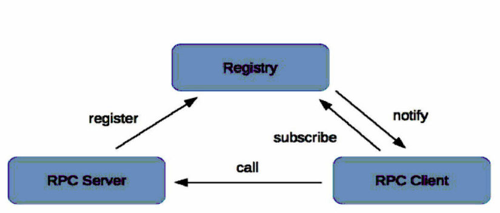
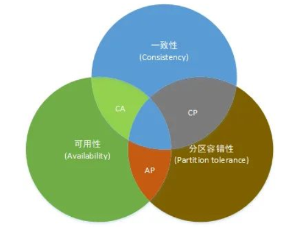

# 服务注册与发现

- 代码地址：[chenpc1234/SpringCloud (github.com)](https://github.com/chenpc1234/SpringCloud)
- 参考资料：[尚硅谷SpringCloud框架开发教程(SpringCloudAlibaba微服务分布式架构丨Spring Cloud)_哔哩哔哩_bilibili](https://www.bilibili.com/video/BV18E411x7eT?spm_id_from=333.337.search-card.all.click)

## 概念



- 服务提供者（RPC Server）
  - RPC Server提供服务，在启动时向 Registry 注册自身服务，并向 Registry 定期发送心跳汇报存活状态。
- 服务消费者（RPC Client）
  - RPC Client 调用服务，在启动时向 Registry 订阅服务，把 Registry 返回的服务节点列表缓存在本地内存中，并与 RPC Sever 建立连接。
- 服务注册中心（Registry）
  - 当 RPC Server 节点发生变更时，Registry 会同步变更，RPC Client 感知后会刷新本地内存中缓存的服务节点列表。RPC Client 从本地缓存的服务节点列表中，基于负载均衡算法选择一台 RPC Sever 发起调用。

## CAP理论

		

​		CAP理论指的是在一个分布式系统中,Consistency(一致性)、Availability(可用性)、Partition Tolerance(分区容错性)，不能同时成立。对应分布式系统，分区容错性是必须要考虑的。

### CP 型注册中心

​			牺牲可用性来保证数据强一致性，最典型的例子就是 ZooKeeper，etcd，Consul 了。

​			ZooKeeper 集群内只有一个 Leader，而且在 Leader 无法使用的时候通过 Paxos 算法选举出一个新的 Leader。这个 Leader 的目的就是保证写信息的时候只向这个 Leader 写入，Leader 会同步信息到 Followers，这个过程就可以保证数据的强一致性。但如果多个 ZooKeeper 之间网络出现问题，造成出现多个 Leader，发生脑裂的话，注册中心就不可用了。

​			etcd 和 Consul 集群内都是通过 raft 协议来保证强一致性，如果出现脑裂的话， 注册中心也不可用。

### AP 型注册中心，

​			牺牲一致性来保证可用性，最典型的例子就是 Eureka 了。对比下 Zookeeper，Eureka 不用选举一个 Leader，每个 Eureka 服务器单独保存服务注册地址，因此有可能出现数据信息不一致的情况。但是当网络出现问题的时候，每台服务器都可以完成独立的服务。

## Eureka

​		Eureka是[Netflix](https://baike.baidu.com/item/Netflix/662557)开发的服务发现框架，本身是一个基于[REST](https://baike.baidu.com/item/REST/6330506)的服务，主要用于定位运行在AWS域中的中间层服务，以达到负载均衡和中间层服务故障转移的目的。SpringCloud将它集成在其子项目spring-cloud-netflix中，以实现SpringCloud的服务发现功能。

### 微服务整合Eureka双机

1. 创建两个EurekaServer 微服务，引入eureka server，主启动类添加@EnableEurekaServer 注解

  ```pom
  <!--        引入eureka server-->
  <dependency>
      <groupId>org.springframework.cloud</groupId>
      <artifactId>spring-cloud-starter-netflix-eureka-server</artifactId>
  </dependency>
  ```

  ```java
  @SpringBootApplication
  @EnableEurekaServer
  public class EurekaMain7001 {
      ...
  }
  ```

2. 修改yaml 配置文件

   ```yaml
   server:
     port: 7001
   eureka:
     instance:
       hostname: eureka7001.com  #eureka 服务端实例名称
     client:
       register-with-eureka: false   #不向eureka注册中心注册自己
       fetch-registry: false     #表示为注册中心  只需要维护服务实例，不需要检索服务
       #设置eureka server交互的地址(查询服务和注册服务需要依赖地址)
       serviceUrl:
         defaultZone: http://eureka7002.com:7002/eureka/   
     server:
       enable-self-preservation: false  #关闭Eureka自我保护模式
   ```

   ```yaml
   server:
     port: 7002
   eureka:
     instance:
       hostname: eureka7002.com  #eureka 服务端实例名称
     client:
       register-with-eureka: false   #不向eureka注册中心注册自己
       fetch-registry: false     #表示为注册中心  只需要维护服务实例，不需要检索服务
       #设置eureka server交互的地址(查询服务和注册服务需要依赖地址)
       serviceUrl:
         defaultZone: http://eureka7001.com:7001/eureka/
   ```

3. 修改其他微服务pom文件，添加 eureka client 相关依赖

  ```pom
  <dependency>
       <groupId>org.springframework.cloud</groupId>
       <artifactId>spring-cloud-starter-netflix-eureka-client</artifactId>
  </dependency>
  ```

4. 修改其他微服务yaml配置文件，添加eureka 相关配置

  ```yaml
  spring:
    application:
    	name: order
  eureka:
    client:
       register-with-eureka: true   #注册
       fetch-registry: true   #是否从eureka server 已有的注册信息
       service-url:
     		defaultZone: http://localhost:7001/eureka   #服务端url
  ```

5. 微服务主启动 添加@EnableEurekaClient 注解 ，微服务消费者使用RestTemplate 调用时，调用地址修改为微服务提供者的服务名

   ```java
   //private static final String PAYMENT_URL="http://localhost:8001";
   private static final String PAYMENT_URL="http://CLOUD-PAYMENT-SERVICE";
   ```

6. 微服务开启RestTemplate 的负载均衡，添加LoadBalanced

   ```java
   @Configuration
   public class ApplicationContextConfig {
       @Bean
       @LoadBalanced
       public RestTemplate getRestTemplate(){
           return new RestTemplate();
       }
   }
   ```

### Eureka服务发现

1. 使用 @EnableDiscoveryClient 标注主启动类

2. 查询服务中引入DiscoveryClient 组件,使用discoveryClient 可以获取微服务注册信息

   ```java
   @Resource
   private DiscoveryClient discoveryClient;
   
   List<String> services = discoveryClient.getServices();
   for (String service : services) {
       System.out.println("*******"+service);
       List<ServiceInstance> instances = discoveryClient.getInstances(service);
       for (ServiceInstance instance : instances) {
           System.out.println(instance.getServiceId() + instance.getInstanceId() + instance.getUri());
       }
   }
   ```

### Eureka Server 自我保护

​		EurekaServer 在网络故障情况下 不会将EurekaClient 立即踢出，默认情况 一定时间没有接受到某个微服务实例的心跳。EurekaServer会注销该实例 （90s），但是考虑到微服务实例是正常运行，仅由于网络故障导致微服务实例无法发送心跳，这种情况不应该移除此实例。

​		Eureka采用自我保护解决，某个Server节点短时间丢失过多客户端时，这个节点就会进入自我保护模式，不会移除微服务注册信息

​		EurekaServer 关闭自我保护,在Server端yaml配置中添加

```yaml
eureka:
    server:
      enable-self-preservation: false  #关闭Eureka自我保护模式
```

## Zookeeper

### Zookeeper安装

​	见zookeeper相关笔记

### 微服务整合zookeeper

1. pom 引入 zookeeper 的依赖

   ```pom
   <!--        引入zookeeper的依赖  对应zookeeper版本 解决jar包冲突-->
        <dependency>
            <groupId>org.springframework.cloud</groupId>
            <artifactId>spring-cloud-starter-zookeeper-discovery</artifactId>
            <exclusions>
                <exclusion>
                    <groupId>org.apache.zookeeper</groupId>
                    <artifactId>zookeeper</artifactId>
                </exclusion>
            </exclusions>
        </dependency>
        <dependency>
            <groupId>org.apache.zookeeper</groupId>
            <artifactId>zookeeper</artifactId>
            <version>3.4.5</version>
            <exclusions>
                <exclusion>
                        <groupId>org.slf4j</groupId>
                        <artifactId>slf4j-api</artifactId>
                </exclusion>
                <exclusion>
                    <groupId>org.slf4j</groupId>
                    <artifactId>slf4j-log4j12</artifactId>
                </exclusion>
                <exclusion>
                    <groupId>log4j</groupId>
                    <artifactId>log4j</artifactId>
                </exclusion>
            </exclusions>
        </dependency>
   ```

2. 微服务修改yaml，配置zookeeper集群地址

   ```yaml
   spring:
     application:
    name: cloud-payment-zk-service
     cloud:
    zookeeper:
      connect-string: 192.168.8.205:2181,192.168.8.206:2181,192.168.8.207:2181
   ```

3. 微服务主启动类添加服务发现 @EnableDiscoveryClient

   ```java
   @SpringBootApplication
   @EnableDiscoveryClient
   public class PaymentMain8004 {
    public static void main(String[] args) {
        SpringApplication.run(PaymentMain8004.class, args);
    }
   }
   ```

4. 消费者获取服务Demo

   ```java
   private static final String PAYMENT_URL="http://cloud-payment-zk-service";
   
   @Resource
   private DiscoveryClient discoveryClient;
   @Resource
   private RestTemplate restTemplate;
   
   @GetMapping("/consumer/qryPayment/{id}")
   public  CommonResult<Payment> query(@PathVariable("id") Long id){
       return restTemplate.getForObject(PAYMENT_URL+"/qryPayment/"+id, CommonResult.class);
   }
   
   @GetMapping("/test")
   private DiscoveryClient test(){
       List<String> services = discoveryClient.getServices();
       for (String service : services) {
           System.out.println("*******"+service);
           List<ServiceInstance> instances = discoveryClient.getInstances(service);
           for (ServiceInstance instance : instances) {
               System.out.println(instance.getServiceId() + instance.getInstanceId() + instance.getUri());
           }
       }
   }
   ```

## consul服务注册与发现

### consul安装

- windows 官网下载 解压双击运行consul.exe

- 查看版本

  consul -version

- 使用开发模式启动 

  consul agent -dev

- 查看界面

  http://localhost:8500/ui/dc1/services 

### 微服务整合consul

1. 微服务修改pom文件，引入consul依赖

   ```pom
   <!--        引入consul的依赖-->
   <dependency>
       <groupId>org.springframework.cloud</groupId>
       <artifactId>spring-cloud-starter-consul-discovery</artifactId>
   </dependency>
   ```

2. 微服务修改yaml文件，添加consul相关配置信息

   ```yaml
   spring:
     cloud:
    consul:
      host: localhost
      port: 8500
      discovery:
        service-name: ${spring.application.name}
   ```

3. 微服务主启动类 添加服务发现 @EnableDiscoveryClient

   ```java
   @SpringBootApplication
   @EnableDiscoveryClient
   public class PaymentMain8004 {
    public static void main(String[] args) {
        SpringApplication.run(PaymentMain8004.class, args);
    }
   }
   ```

4. 微服务消费者获取服务Demo

   ```java
   private static final String PAYMENT_URL="http://cloud-payment-consul-service";
   
   @Resource
   private DiscoveryClient discoveryClient;
   @Resource
   private RestTemplate restTemplate;
   
   @GetMapping("/consumer/qryPayment/{id}")
   public  CommonResult<Payment> query(@PathVariable("id") Long id){
       return restTemplate.getForObject(PAYMENT_URL+"/qryPayment/"+id, CommonResult.class);
   }
   
   @GetMapping("/test")
   private DiscoveryClient test(){
       List<String> services = discoveryClient.getServices();
       for (String service : services) {
           System.out.println("*******"+service);
           List<ServiceInstance> instances = discoveryClient.getInstances(service);
           for (ServiceInstance instance : instances) {
               System.out.println(instance.getServiceId() + instance.getInstanceId() + instance.getUri());
           }
       }
   }
   ```