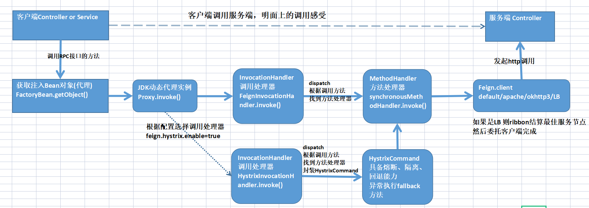

# Feign深度剖析

##  JDK动态代理

- *动态代理类* （是一个实现在类创建时在运行时指定的接口列表的类，具有如下所述的行为。
-  *代理接口*是由代理类实现的接口。
-  *代理实例*是代理类的一个实例。 每个代理实例都有一个关联的*调用处理程序*对象，它实现了接口`InvocationHandler`。 通过其代理接口之一的代理实例上的方法调用将被分派到实例调用处理程序的`invoke`方法，传递代理实例， `java.lang.reflect.Method`被调用方法的`java.lang.reflect.Method`对象以及包含参数的类型`Object` Object的数组。 调用处理程序适当地处理编码方法调用，并且返回的结果将作为方法在代理实例上调用的结果返回。

```java
//返回指定接口的代理类的实例，该接口将方法调用分派给指定的调用处理程序。
public static Object newProxyInstance(ClassLoader loader,
                                      类<?>[] interfaces,
                                      InvocationHandler h)
                               throws IllegalArgumentException
//loader - 类加载器来定义代理类
//interfaces - 代理类实现的接口列表
//h - 调度方法调用的调用处理函数
```


```java
public class JdkProxyDemo {

    interface Foo {
        void foo();
        void too();
    }

    static class Target implements Foo {
        @Override
        public void foo() {
            System.out.println(" target foo");
        }
        @Override
        public void too() {
            System.out.println(" target too");
        }
    }
    /**
     * jdk代理只能针对接口进行代理
     * 内部采用asm技术动态生成字节码（）
     *
     * @param args
     */
    public static void main(String[] args) {

        Foo proxy = (Foo) Proxy.newProxyInstance(Foo.class.getClassLoader(), new Class[]{Foo.class}, new InvocationHandler() {
            @Override
            public Object invoke (Object proxy, Method method, Object[]args) throws Throwable {
                System.out.println("before");
                Object result = method.invoke(new Target(), args);
                //代理类返回的是目标方法执行的结果
                System.out.println("after");
                return result;
            }
        });
        proxy.foo();
        proxy.too();
    }
}
```


## Feign RPC客户端组件

### Feign调用处理器InvocationHandler

- 默认的调用处理器 `FeignInvocationHandler`

  - ```java
     static class FeignInvocationHandler implements java.lang.reflect.InvocationHandler {
            private final feign.Target target; 
      	     //rpc方法反射实例与方法处理器的映射
            private final Map<Method,feign.InvocationHandlerFactory.MethodHandler> dispatch;
                	//
           public invoke(Object proxy,Method method,Object[] args) throws java.lang.Throwable { 
      	       	return dispatch.get(method).invoke(args);
           }
     }
    ```

  - FeignInvocationHandler 保存了rpc方法反射实例与方法处理器的映射, invoke方法`dispatch.get(method)`根据被调用的rpc方法的反射实例找到对应的方法处理器MethodHandler,然后调用方法处理器的invoke方法 完成实际的RPC远程调用。

- 结合Hystrix的调用处理器 `HystrixInvocationHandler`

### Feign方法处理器MethodHandler

`MethodHandler`只是一个简单的feign的接口，定义了一个完成远程URL请求的方法，得到请求的返回结果。

```java
static interface MethodHandler {
    java.lang.Object invoke(java.lang.Object[] objects) throws java.lang.Throwable;
}
```

- SynchronousMethodHandler同步方法处理器实现类

  ```java
  @Override
  public Object invoke(Object[] argv) throws Throwable {
      // 生成请求模板
      RequestTemplate template = buildTemplateFromArgs.create(argv);
      Options options = findOptions(argv);
      Retryer retryer = this.retryer.clone();
      while (true) {
          try {
              // 执行rest请求和处理响应
              return executeAndDecode(template, options);
          } catch (RetryableException e) {
              ...
          }
      }
  ```

  ```java
  Object executeAndDecode(RequestTemplate template, Options options) throws Throwable {
  	//1. 生成请求实例
    Request request = targetRequest(template);
    ...
    try {
    	//2. 客户端执行请求，发起RPC远程调用
      response = client.execute(request, options);
      //3. 获取response响应，解码响应结果
      response = response.toBuilder()
          .request(request)
          .requestTemplate(template)
          .build();
    } catch (IOException e) {
    ...
  }
  ```

### Feign客户端组件

客户端组件负责最终Http请求(Rest请求)的执行。

```java
public interface Client {
  Response execute(Request request, Options options) throws IOException;
}
```

#### 客户端实现类

性能 `Client.Default  < ApachehttpClient <  OkHttpClient`

- Client.Default 

  - JDK自带的HttpURLConnection 提交http请求 → 性能低

- ApachehttpClient

  - 使用ApachehttpClient 开源组件提交http请求 需要引入依赖

  - ```xml
    <dependency>
        <groupId>org.apache.httpcomponents</groupId>
        <artifactId>httpclient</artifactId>
        <version>${httpclient.version}</version>
    </dependency>
    ```

- OkHttpClient

  - 使用OkHttp3开源组件提交http请求-google公司的

- LoadBalancerFeignClient

  - 使用ribbon开源组件实现负载均衡功能
  - 内部封装客户端 feign.Client类型可以是以上三种或者其他

## Feign动态代理实例创建流程


### feign应用启动初始化过程

1. @EnableFeignClients 开启feign的装配和远程代理实例的创建，并且导入了`FeignClientsRegistrar` ,FeignClientsRegistrar可以扫描@FeignClient 注解的接口
2. 通过对@FeignClient注解的接口进行扫描，生成远程调用的动态代理实例。
   1. `FeignClientsRegistrar` 扫描@FeignClient的接口，创建接口的FactoryBean工厂类实例，将实例注入到IOC容器中
   2. 引用时(@Autowired) ，Spring通过工厂实例的getObject方法得到动态代理实例。
3. 对于每一个RPC远程调用的方法，Feign根据注解(@RequestMapping)生成方法处理器实例(MethodHandler)，方法处理器中包含一个请求模板 `RequestTemplate`，`RequestTemplate`包含所有的请求信息。

### FactoryBean工厂

​			FactoryBean注册到IOC容器中之后，从Spring上下文中获取Bean时（@autowired @resource），获取的是FactoryBean的getObject返回的对象。前提是实现spring FactoryBean 接口

Feign客户端动态代理是使用`FeignClientFactoryBean`方式创建的，原因如下：

- ​			RPC客户端动态代理的Bean 是JDK动态代理生成的
- ​            RPC客户端动态代理的Bean属性值比较多，都是@FeignClient注解完成的

### FeignClientFactoryBean工厂创建RPC客户端代理实例

FeignClientFactoryBean.getObject() `→`  this.getTarget`→`  Feign.Bulider.target()  `→` build().newInstance(target)  创建RPC客户端代理实例。

1. FeignClientFactoryBean 实现了SpringFactory接口，获取Bean时，调用 FeignClientFactoryBean.getObject()

2.  FeignClientFactoryBean.getObject() 调用 FeignClientFactoryBean.getTarget()

3.  FeignClientFactoryBean.getTarget() 调用 Feign.Bulider.target() 

4.  Feign.Bulider.target() 调用 build().newInstance(target)   , build() 方法返回的是new ReflectiveFeign 是Feign类型

5. ReflectiveFeign.newInstance 创建了RPC代理对象并返回

   1. targetToHandlersByName.apply(target) 方法解析，循环接口方法，创建方法处理器

      ```java
      private final SynchronousMethodHandler.Factory factory;
      public Map<String, MethodHandler> apply(Target target) {
          // Contract协议解析方法
          List<MethodMetadata> metadata = contract.parseAndValidateMetadata(target.type());
          
         	....
          // SynchronousMethodHandler 工厂创建方法处理器
      	factory.create(target, md, buildTemplate, options, decoder, errorDecoder));
      }
      ```

      apply(target) 方法通过Contract协议将 Feign 接口的方法配置、注解 解析成List<MethodMetadata> metadata 列表

   2. 遍历所有方法 target.type().getMethods()， 将第一步返回的方法处理器集合封装成 Map<Method, MethodHandler> methodToHandler

   3. 创建调用处理器InvocationHandler

   4. JDK动态代理 创建动态代理的RPC客户端

      ```java
      public <T> T newInstance(Target<T> target) {
          Map<String, MethodHandler> nameToHandler = targetToHandlersByName.apply(target);
          。。。
      	InvocationHandler handler = factory.create(target, methodToHandler);
      	T proxy = (T) Proxy.newProxyInstance(target.type().getClassLoader(),
              new Class<?>[] {target.type()}, handler);
          
          return proxy;
      }
      ```


## Feign远程调用的执行流程



1. 通过SpringIOC 容器获取到动态代理实例的装配
2. 执行InvocationHandler调用处理器的invoke方法
3. 执行MethodHandler方法处理器的invoke方法
4. 通过客户端成员完成远程URL的调用

## 其他

- FeignInvocationHandler  生产不要用
  - 没有异常的熔断检测和恢复机制
  - 没有使用http连接池技术
- Client是LoadBalancerFeignClient 基于Ribbon负载均衡，可定义LB策略
  - default.Client不能用,使用的是JDK的HTTPURLConnection连接，虽然1.8中使用了池技术，但依旧效率很低
  - 效率OKhttp3 > apacheClient
  - 开启apacheClient  
    - pom依赖    org.apache.httpcomponents 的  httpclient
    - feign.httpclient.enable=true
  - 开启OKhttp3   
    - pom依赖    okhttp   &&   feign-okhttp
    - feign.httpclient.enable=false
    - feign.okhttp.enable=true