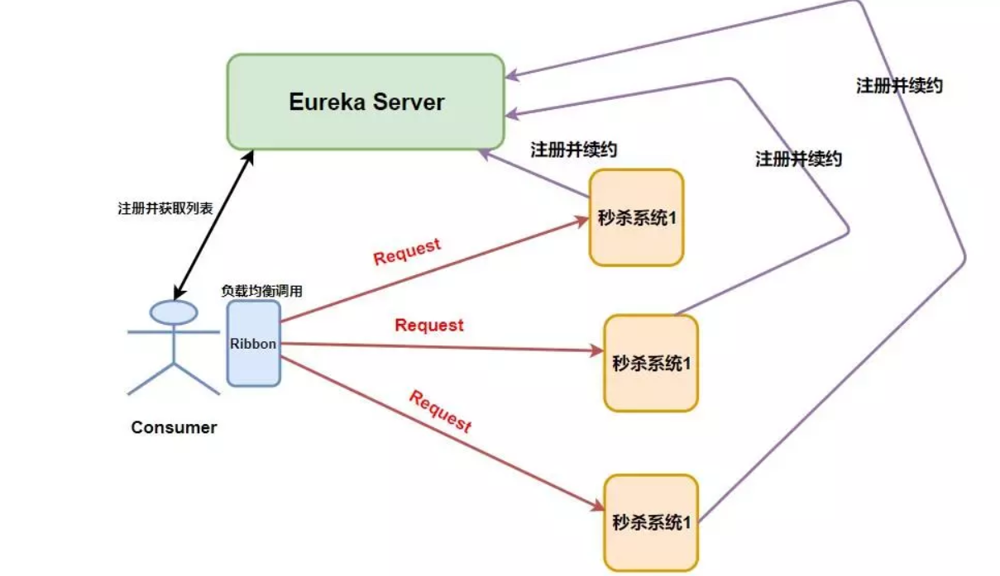
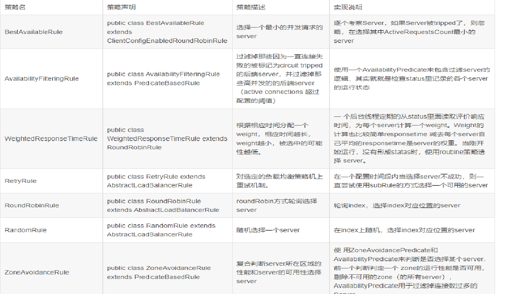

# 服务调用

- 代码地址：[chenpc1234/SpringCloud (github.com)](https://github.com/chenpc1234/SpringCloud)
- 参考资料：[尚硅谷SpringCloud框架开发教程(SpringCloudAlibaba微服务分布式架构丨Spring Cloud)_哔哩哔哩_bilibili](https://www.bilibili.com/video/BV18E411x7eT?spm_id_from=333.337.search-card.all.click)

## RestTemplate

​		RestTemplate 是从 Spring3.0 开始支持的一个 HTTP 请求工具，它提供了常见的REST请求方案的模版，例如 GET 请求、POST 请求、PUT 请求、DELETE 请求以及一些通用的请求执行方法 exchange 以及 execute。

​		RestTemplate 继承自 InterceptingHttpAccessor 并且实现了 RestOperations 接口，其中 RestOperations 接口定义了基本的 RESTful 操作，这些操作在 RestTemplate 中都得到了实现。

### 添加RestTemplate组件

```java
@Configuration
public class ApplicationContextConfig {
    @Bean
    @LoadBalanced
    public RestTemplate getRestTemplate(){
        return new RestTemplate();
    }
}
```

### RestTemplate  API

​		RestTemplate定义了36个与REST资源交互的方法，其中的大多数都对应于HTTP的方法。其实，这里面只有11个独立的方法，其中有十个有三种重载形式，而第十一个则重载了六次，这样一共形成了36个方法。

| 方法              | 作用                                                         |
| ----------------- | ------------------------------------------------------------ |
| delete()          | 在特定的URL上对资源执行HTTP DELETE操作                       |
| exchange()        | 在URL上执行特定的HTTP方法，返回包含对象的ResponseEntity，这个对象是从响应体中映射得到的 |
| execute()         | 在URL上执行特定的HTTP方法，返回一个从响应体映射得到的对象    |
| getForEntity()    | 发送一个HTTP GET请求，返回的ResponseEntity包含了响应体所映射成的对象 |
| getForObject()    | 发送一个HTTP GET请求，返回的请求体将映射为一个对象           |
| postForEntity()   | POST数据到一个URL，返回包含一个对象的ResponseEntity，这个对象是从响应体中映射得到的 |
| postForObject()   | POST 数据到一个URL，返回根据响应体匹配形成的对象             |
| headForHeaders()  | 发送HTTP HEAD请求，返回包含特定资源URL的HTTP头               |
| optionsForAllow() | 发送HTTP OPTIONS请求，返回对特定URL的Allow头信息             |
| postForLocation() | POST 数据到一个URL，返回新创建资源的URL                      |
| put()             | PUT 资源到特定的URL                                          |

#### Get请求

​		RestTemplate 的get方法可以分为两类: getForEntity() 和 getForObject()

- getForEntity() 

  ​		返回值类型 ResponseEntity继承了HttpEntity. 封装了返回的响应信息,包括 响应状态,响应头和响应体。

  - 无参数的 getForEntity 方法

    ```java
    ResponseEntity<List> responseEntity = restTemplate.getForEntity("http://localhost/getAll", Object.class);
    ```

  - 有参数的getForEntity 请求,参数列表,可以使用 {} 进行url路径占位符

    ```java
    //有参数的 getForEntity 请求,参数列表
    ResponseEntity<UserEntity> responseEntity = restTemplate.getForEntity("http://localhost/get/{id}", UserEntity.class, id);
    //有参数的 get 请求,使用map封装参数
    ResponseEntity<UserEntity> responseEntity = restTemplate.getForEntity("http://localhost/get/{id}", UserEntity.class, map);
    ```

- getForObject

  getForObject 和 getForEntity 用法几乎相同,指示返回值返回的是 响应体,省去了我们 再去 getBody() 

  ```java
  //无参数的 getForObject 请求
  List<UserEntity> list = restTemplate.getForObject("http://localhost/getAll", List.class);
  //有参数的 getForObject 请求
  UserEntity userEntity = restTemplate.getForObject("http://localhost/get/{id}", UserEntity.class, id);
  //有参数的 get 请求,使用map封装请求参数
  UserEntity userEntity = restTemplate.getForObject("http://localhost/get/{id}", UserEntity.class, map);
  ```

#### Post请求

```java
return restTemplate.postForObject(PAYMENT_URL+"/payment/create", payment, CommonResult.class);

// 有参数的 postForEntity 请求
ResponseEntity<String> responseEntity = restTemplate.postForEntity("http://localhost/saveByType/{type}", userEntity, String.class, type);
// 有参数的 postForEntity 请求,使用map封装
ResponseEntity<String> responseEntity = restTemplate.postForEntity("http://localhost/saveByType/{type}", userEntity, String.class,map);

```

## Ribbon

### 简介

​			Ribbon是基于 Netflix ribbon实现的套客户端负载均衡的工具。简单的说, Ribbon是 Netflix发布的开源项目,主要功能是提供客户端的软件负载均衡算法和服务调用。 

​			Ribbon客户端组件提供一系列完善的配置项如连接超时,重试等。简单的说,就是在配置文件中列岀 Load Balancer(简称LB)后面所有的机器,Ribbon会自动的帮助你基于某种规则(如简单轮询τ随机连接等)去连接这些机器。我们很容易使用 Ribbon实现自定义的负载均衡算法。



### 负载均衡策略

​	Ribbon提供了IRule 来约定了负载均衡的策略，接口及相关实现类如下

```java
public interface IRule{
    /*
     * choose one alive server from lb.allServers or
     * lb.upServers according to key
     * 
     * @return choosen Server object. NULL is returned if none
     *  server is available 
     */

    public Server choose(Object key);
    
    public void setLoadBalancer(ILoadBalancer lb);
    
    public ILoadBalancer getLoadBalancer();    
}
```



### Ribbon自定义LB策略

1. 编写 RULE配置类，配置类所在路径不能被SpringBoot 扫描到，添加返回值为IRule接口的组件,类型为负载均衡策略的类型

   ```java
   @Configuration
   public class RibbonRule {
       @Bean
       public IRule getNewRule(){
           return new RandomRule();  // 第3步完成后修改此处
       }
   }
   ```

2. 在主启动类添加配置@RibbonClient(name = "CLOUD-PAYMENT-SERVICE",configuration = RibbonRule.class)

   1. name 后加微服务提供者的服务名，configuration 为自己的rule类

   2. ```java
      @SpringBootApplication
      @EnableEurekaClient
      @EnableDiscoveryClient
      @RibbonClient(name = "CLOUD-PAYMENT-SERVICE",configuration = RibbonRule.class)
      public class OrderMain80 {
      
      }
      ```

3. 自定义Ribbon 负载均衡策略，实现IRule接口，重写 choose 方法，修改第一步的返回值为自己编写的负载均衡策略。

   ```java
   @Override
   public Server choose(Object key) {
       ILoadBalancer lb = getLoadBalancer();
       if (lb == null) {
           return null;
       }
       Server server = null;
   
       while (server == null) {
           if (Thread.interrupted()) {
               return null;
           }
           List<Server> upList = lb.getReachableServers();
           List<Server> allList = lb.getAllServers();
   
           int serverCount = allList.size();
           if (serverCount == 0) {
               return null;
           }
           int index = getServerIndex(serverCount);
   
           server = upList.get(index);
           if (server == null) {
               Thread.yield();
               continue;
           }
           if (server.isAlive()) {
               return (server);
           }
           server = null;
           Thread.yield();
       }
   
       return server;
   }
   
   
   /**
   
    * 编写自己的逻辑  获取应该使用哪个服务器提供服务
    * @param modulo 服务个数
    * @return 服务下标
      */
   private int getServerIndex(int modulo) {
       for (;;) {
           int current = nextServerCyclicCounter.get();
           int next = current+1;
           if (nextServerCyclicCounter.compareAndSet(current, next)){
               System.out.println(current);
               if (current <=10 ){
                   return 0;
               }else {
                   return 1;
               }
           }
       }
   }
   ```

## OpenFeign

### 简介

​		Feign是一个声明式的Web Service客户端。它的出现使开发Web Service客户端变得很简单。使用Feign只需要创建一个接口加上对应的注解，比如：FeignClient注解。Feign有可插拔的注解，包括Feign注解和JAX-RS注解。Feign也支持编码器和解码器，Spring Cloud Open Feign对Feign进行增强支持Spring MVC注解，可以像Spring Web一样使用HttpMessageConverters等。
​		Feign是一种声明式、模板化的HTTP客户端。在Spring Cloud中使用Feign，可以做到使用HTTP请求访问远程服务，就像调用本地方法一样的，开发者完全感知不到这是在调用远程方法，更感知不到在访问HTTP请求。

### 特点

1. 可插拔的注解支持，包括Feign注解和JAX-RS注解。
2. 支持可插拔的HTTP编码器和解码器（Gson，Jackson，Sax，JAXB，JAX-RS，SOAP）。
3. 支持Hystrix和它的Fallback。
4. 支持Ribbon的负载均衡。
5. 支持HTTP请求和响应的压缩。
6. 灵活的配置：基于 name 粒度进行配置
7. 支持多种客户端：JDK URLConnection、apache httpclient、okhttp，ribbon）
8. 支持日志
9. 支持错误重试
10. url支持占位符
11. 可以不依赖注册中心独立运行

### 服务调用

1. 微服务修改pom文件，引入openfeign 依赖

   ```pom
   <dependency>
       <groupId>org.springframework.cloud</groupId>
       <artifactId>spring-cloud-starter-openfeign</artifactId>
   </dependency>
   ```

2. 微服务注册进服务注册中心


3. 微服务主启动类开启Feign （添加 @EnableFeignClients）

   ```java
   @SpringBootApplication
   @EnableFeignClients
   public class OrderOpenFeignMain83 {
   }
   ```

4. 微服务编写服务调用接口

   添加@FeignClient(value = "CLOUD-PAYMENT-SERVICE") 注解

   value 是微服务提供者的服务名，编写接口方法：方法为服务提供者的Controller方法

   ```java
   @FeignClient(value = "CLOUD-PAYMENT-SERVICE")
   @Component
   public interface IPaymentService {
      @GetMapping("/qryPayment/{id}")
      public CommonResult queryPayment(@PathVariable("id") Long id);
   }
   
   
   服务提供者方法示例：
   @GetMapping("/qryPayment/{id}")
   private CommonResult queryPayment(@PathVariable("id") Long id){
       Payment payment = paymentService.queryPayment(id);
       if (payment!=null){
           return new CommonResult(200, "success8001", payment);
       }else {
           return new CommonResult(500, "failed8001");
       }
   }
   ```

5. 微服务controller 或者service 调用步骤4编写的接口

   ```java
   @RestController
   @Slf4j
   public class OrderController {
   
       @Resource
       private IPaymentService paymentService;
   
       @GetMapping("/consumer/qryPayment/{id}")
       public  CommonResult<Payment> query(@PathVariable("id") Long id){
           return paymentService.queryPayment(id);
       }
   }
   ```

### 超时控制

​		OpenFeign 默认等待1秒，服务端 1s无法返回结果会报错。yaml配置文件中可修改

```yaml
ribbon:
  ReadTimeout: 5000   #指的是建立连接所用的时间,适用于网络王正常的情况下两端连接所用的时间
  ConnectTimeout: 5000  #指的是建立连接后从服务器读取到可用资源所用的时间
  MaxAutoRetries: 1 #同一台实例最大重试次数,不包括首次调用
  #MaxAutoRetriesNextServer: 1 #重试负载均衡其他的实例最大重试次数,不包括首次调用
  #OkToRetryOnAllOperations: false  #是否所有操作都重试
```

### 日志管理

**OpenFeign  添加日志**

1. 添加配置类,将组件Logger.Level 注入到Spring容器中

   ```java
   @Configuration
   public class FeignConfig {
       @Bean
       Logger.Level feignLogLevel(){
           return Logger.Level.FULL;
       }
   }
   ```

2. 修改yaml文件，添加需要监控的服务

  ```yaml
   logging:
     level:
    com.chen.cloud.service.IPaymentService: debug  #debug 级别监控IPaymentService 接口服务
  ```
