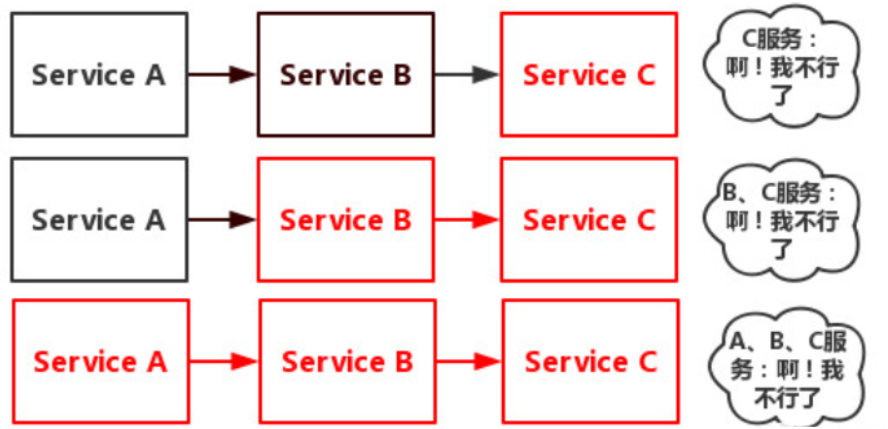
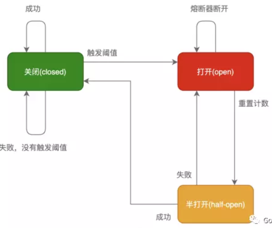
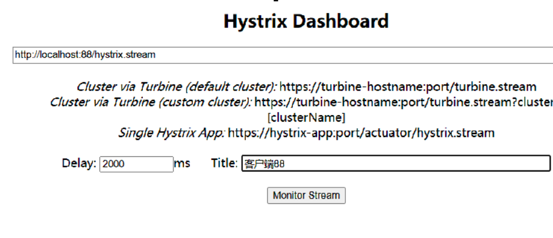
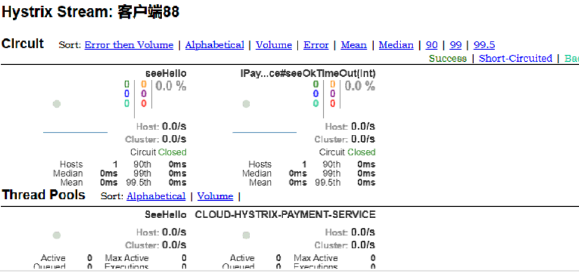

# 服务雪崩

​			多个微服务之间调用的时候，假设微服务A调用微服务B和微服务C，微服务B和微服务C又调用其它的微服务，这就是所谓的“扇出。如果扇出的链路上某个微服务的调用晌应时间过长或者不可用，对微服务A的调用就会占用越来越多的系统资源，进而引起系统崩溃，所谓的“雪崩效应”。



## 解决服务雪崩的方式

### 服务降级

​			服务降级是当服务器压力剧增的情况下，根据当前业务情况及流量对一些服务和页面有策略的降级，以此释放服务器资源以保证核心任务的 正常运行。

​			服务降级是指消费者的待遇下降了，从RPC调用环节来讲，就是消费者去访问一个本地的伪装者而不是真实的服务。

### 服务熔断

​			在互联网系统中，当下游服务因访问压力过大而响应变慢或失败，上游服务为了保护系统整体的可用性，可以暂时切断对下游服务的调用。这种牺牲局部，保全整体的措施就叫做熔断。

### 服务限流

​			限流的目的是通过对并发访问/请求进行限速或者一个时间窗口内的的请求进行限速来保护系统，一旦达到限制速率则可以拒绝服务（定向到错误页或告知资源没有了）、排队或等待（比如秒杀、评论、下单）、降级（返回兜底数据或默认数据，如商品详情页库存默认有货）。
​			一般开发高并发系统常见的限流有：限制总并发数（比如数据库连接池、线程池）、限制瞬时并发数（如nginx的limit_conn模块，用来限制瞬时并发连接数）、限制时间窗口内的平均速率（如Guava的RateLimiter、nginx的limit_req模块，限制每秒的平均速率）；其他还有如限制远程接口调用速率、限制MQ的消费速率。另外还可以根据网络连接数、网络流量、CPU或内存负载等来限流。

### 断路器

​			断路器本身是种开关装置,当某个服务单元发生故障之后,通过断路器的故障监控(类似熔断保险丝),向调用方返回一个符合
预期的、可处理的备选响应(FallBack)。而不是长时间的等待或者抛出调用方无法处理的异常,这样就保证了服务调用方的线程不会
被长时间、不必要地占用,从而避免了故障在分布式系统中的蔓延,乃至雪崩

## 服务降级/熔断异同点

### 相同点

1. **目的很一致**，都是从可用性可靠性着想，为防止系统的整体缓慢甚至崩溃，采用的技术手段；
2. **最终表现类似**，对于两者来说，最终让用户体验到的是某些功能暂时不可达或不可用；
3. **粒度一般都是服务级别**，当然，业界也有不少更细粒度的做法，比如做到数据持久层（允许查询，不允许增删改）；
4. **自治性要求很高**，熔断模式一般都是服务基于策略的自动触发，降级虽说可人工干预，但在微服务架构下，完全靠人显然不可能，开关预置、配置中心都是必要手段；

### 区别

1. **触发原因不一样**，服务熔断一般是某个服务（下游服务）故障引起，而服务降级一般是从整体负荷考虑；
2. **管理目标的层次不一样**
   - 熔断其实是一个框架级的处理，每个微服务都需要（无层级之分）
   - 降级一般需要对业务有层级之分（比如降级一般是从最外围服务开始）
3. **实现方式不一样**
   - 服务降级具有代码侵入性(由控制器完成/或自动降级)
   - 熔断一般为自我熔断。服务熔断会触发服务降级

# Hystrix

## 简介

​			官网   ：https://github.com/Netflix/Hystrix

​			Hystriⅸ是—个用于处理分布式系统的延迟和容错的开源库,在分布式系统里,许多依赖不可避免的会调用失败,比如超时、异常等,
Hystriⅸ能够保证在一个依赖出问题的情况下,不会导致整体服务失败,避免级联故障,以提髙分布式系统的殚弹性。

## 服务降级

### 服务降级配置

1. 微服务全部加入注册中心，OpenFeign可访问

2. 服务降级一般 在微服务消费者端，在微服务消费者端添加服务降级

   1.  微服务消费者Pom文件引入 hystrix 依赖

      ```xml
      <dependency>
          <groupId>org.springframework.cloud</groupId>
          <artifactId>spring-cloud-starter-netflix-hystrix</artifactId>
      </dependency>
      ```

   2. 主启动类添加@EnableCircuitBreaker，开启Hystrix

      ```java
      @SpringBootApplication
      @EnableEurekaClient
      @EnableCircuitBreaker
      public class xxx{
       public static void main(String[] args) {
           SpringApplication.run(xxx.class, args);
       }
      }
      ```

   3. yaml中配置hystrix 全局降级时间。 也可以在指定方法上添加

      ```yaml
      hystrix:
        command:
          default:
            execution:
              isolation:
                thread:
                  timeoutInMilliseconds: 5000
      ```

### 服务降级三种方式

#### 方法1：方法单独处理

​		劣势(每个方法单独处理，单独编写配置，很麻烦，代码冗余)

```java
/**
1. 需要降级的method上 添加 @HystrixCommand 注解
2. fallbackMethod 指定降级方法，方法的返回值和入参必须一致，否则会报错
3. 配置触发降级时间2s 否则降级时间为第4步全局配置的时间5s

@HystrixProperty(name = "execution.isolation.thread.timeoutInMilliseconds",value = "2000") 

 */
@GetMapping("/consumer/seeOk/seeOkOut/{id}")
@HystrixCommand(fallbackMethod = "fallback",commandProperties = {
        @HystrixProperty(name = "execution.isolation.thread.timeoutInMilliseconds",value = "2000")
})
public CommonResult<Payment> seeOkTimeOut(@PathVariable("id") int id){
    return paymentService.seeOkTimeOut(id);
}

public CommonResult<Payment> fallback(@PathVariable("id") int id){
    return new CommonResult<>(300, "出错啦！！！ 服务提供者 2s 没给我数据");
}
```


#### 方法2: 类层级处理

​	劣势（降级方法和fallback在一起，代码耦合高）

```java
1.类上标注@DefaultProperties(defaultFallback = "globalFallback")  指定默认的fallback 方法
2.方法标注@HystrixCommand ，降级会调用默认的方法
3.同上 若不指定触发降级时间，则按照yaml全局配置处理
4.默认方法的返回值 必须和 需要降级的方法返回值一致，否者会报错

@DefaultProperties(defaultFallback = "globalFallback")
public class OrderController {
@GetMapping("/consumer/seeOk/seeOkOut2/{id}")
@HystrixCommand
public CommonResult<Payment> seeOkTimeOut2(@PathVariable("id") int id){
    return paymentService.seeOkTimeOut(id);
}
public CommonResult<Payment> globalFallback(){
    return new CommonResult<>(300, "全局服务降级");
}
```

#### 方法3：使用Openfeign 的hystrix功能

1.   yaml中打开feign的hystrix功能

   ```yaml
   feign:
     hystrix:
       enabled: true
   ```

2. Feign服务接口添加 fallback 指定接口实现类

   ```java
   @FeignClient(value = "CLOUD-HYSTRIX-PAYMENT-SERVICE",fallback = PaymentService.class) 
   @Component
   public interface IPaymentService {}
   ```

3. 编写 Feign接口实现类添加到容器中，编写实现方法，实现方法为调用服务失败的fallback方法

### Openfeign降级时间问题

​		Openfeign 超时时间和以下3 个时间有关系 ：yaml配置ribbon时间 、yaml配置hystrix时间 、 类上标注hystrix时间，      

- ribbon的时间是openfeign ，rest请求响应的时间超时的话会报错 read time out
- hystrix 超时时间是触发降级方法的时间  
- 若hystrix 时间大于 ribbon时间 ，微服务生产者响应时间大于ribbon时间时，会直接time out错误触发降级
- 开启openfeign hystrix 功能时，必须配置hystrix yaml全局配置 -->目前尚不清楚
  - 必须在yaml中添加hystrix全局时间 、 //todo
- 类上标注hystrix时间最小，会采用类指定的fallback方法或者是方案2中的fallback 方法
- 类上标注的时间不是最小的，会直接调用openfeign 的fallback方法

```yaml
ribbon:
  ReadTimeout: 5000   #指的是建立连接所用的时间,适用于网络王正常的情况下两端连接所用的时间
  ConnectTimeout: 5000  #指的是建立连接后从服务器读取到可用资源所用的时间

hystrix:
  command:
    default:
      execution:
        isolation:
          thread:
            timeoutInMilliseconds: 3000
```

## 服务熔断

### 原理及流程



**关闭 (Closed)：**

​			在这种状态下，我们需要一个计数器来记录调用失败的次数和总的请求次数，如果在某个时间窗口内，失败的失败率达到预设的阈值，则切换到断开状态，此时开启一个超时时间，当到达该时间则切换到半关闭状态，该超时时间是给了系统一次机会来修正导致调用失败的错误，以回到正常的工作状态。在关闭状态下，调用错误是基于时间的，在特定的时间间隔内会重置，这能够防止偶然错误导致熔断器进去断开状态

**打开 (Open)：**

​			在该状态下，发起请求时会立即返回错误，一般会启动一个超时计时器，当计时器超时后，状态切换到半打开状态，也可以设置一个定时器，定期的探测服务是否恢复

**半打开 (Half-Open)：**
			在该状态下，允许应用程序一定数量的请求发往被调用服务，如果这些调用正常，那么可以认为被调用服务已经恢复正常，此时熔断器切换到关闭状态，同时需要重置计数。

​			如果这部分仍有调用失败的情况，则认为被调用方仍然没有恢复，熔断器会切换到关闭状态，然后重置计数器，半打开状态能够有效防止正在恢复中的服务被突然大量请求再次打垮。

**重点：**

- 快照时间窗口+请求总数阈值+ 错误百分比阈值，必须3个同时满足才行

  快照时间窗口内调用次数达到*requestVolumeThreshold*  失败率达到*errorThresholdPercentage*

  断路器CLOSE-->OPEN

- 故障处理时间 *sleepWindowInMilliseconds*

  - 内部这是一般为平均故障处理时间，默认5s  ，OPEN多久之后变更为HALF-OPEN HALF-OPEN。可以放行一部分请求，若能响应会变成CLOSED ，否者刷新计数器及时间  还是HALF-OPEN

### 服务熔断配置案例

服务熔断基于服务降级：开启服务熔断 ,一下是抛出异常的模拟  也可以设置为超时，
服务熔断其实就是自动化的服务降级，降级后还可以恢复正常逻辑

```java
@HystrixCommand(fallbackMethod = "seeError",commandProperties = {
        @HystrixProperty(name = "circuitBreaker.enabled",value = "true"),  //开启断路器
        @HystrixProperty(name = "circuitBreaker.requestVolumeThreshold",value = "10"), // 请求次数
        @HystrixProperty(name = "circuitBreaker.sleepWindowInMilliseconds",value = "10000"), //断路器打开后再次请求的休眠期
        @HystrixProperty(name = "circuitBreaker.errorThresholdPercentage",value = "50"),   //失败率
})
public CommonResult<Payment> seeHello(@PathVariable("id") int id){
    if (id<0){
        throw  new RuntimeException("不能是负数，抛出异常测试熔断");
    }
    return paymentService.seeOkTimeOut(id);
}
public CommonResult<Payment> seeError(@PathVariable("id") int id){
    return new CommonResult<>(500, "服务熔断  OPEN--seeError");
}
```

## 配置总结

https://github.com/Netflix/Hystrix/wiki/Configuration

### 线程隔离(Isolation)

- execution.isolation.strategy
  - 配置请求隔离的方式，有 threadPool（线程池，默认）和 semaphore（信号量）两种，信号量方式高效但配置不灵活，我们一般采用 Java 里常用的线程池方式。
- execution.timeout.enabled
  - 是否给方法执行设置超时，默认为 true。
- execution.isolation.thread.timeoutInMilliseconds
  - 方法执行超时时间，默认值是 1000，即 1秒，此值根据业务场景配置。
- execution.isolation.thread.interruptOnTimeout ||  execution.isolation.thread.interruptOnCancel：
  - 是否在方法执行超时/被取消时中断方法。需要注意在 JVM 中我们无法强制中断一个线程，如果 Hystrix 方法里没有处理中断信号的逻辑，那么中断会被忽略。
- execution.isolation.semaphore.maxConcurrentRequests：
  - 默认值是 10，此配置项要在 execution.isolation.strategy 配置为 semaphore 时才会生效，它指定了一个 Hystrix 方法使用信号量隔离时的最大并发数，超过此并发数的请求会被拒绝。信号量隔离的配置就这么一个，也是前文说信号量隔离配置不灵活的原因。

### 统计器(Metrics)

​		Hystrix 的统计器是由滑动窗口来实现的，我们可以这么来理解滑动窗口：一位乘客坐在正在行驶的列车的靠窗座位上，列车行驶的公路两侧种着一排挺拔的白杨树，随着列车的前进，路边的白杨树迅速从窗口滑过，我们用每棵树来代表一个请求，用列车的行驶代表时间的流逝，那么，列车上的这个窗口就是一个典型的滑动窗口，这个乘客能通过窗口看到的白杨树就是 Hystrix 要统计的数据。

​		桶： bucket 是 Hystrix 统计滑动窗口数据时的最小单位。同样类比列车窗口，在列车速度非常快时，如果每掠过一棵树就统计一次窗口内树的数据，显然开销非常大，如果乘客将窗口分成十分，列车前进行时每掠过窗口的十分之一就统计一次数据，开销就完全可以接受了。 Hystrix 的 bucket （桶）也就是窗口 N分之一 的概念。


- metrics.rollingStats.timeInMilliseconds：
  - 此配置项指定了窗口的大小，单位是 ms，默认值是 1000，即一个滑动窗口默认统计的是 1s 内的请求数据。
- metrics.healthSnapshot.intervalInMilliseconds：
  - 它指定了健康数据统计器（影响 Hystrix 熔断）中每个桶的大小，默认是 500ms，在进行统计时，Hystrix 通过 metrics.rollingStats.timeInMilliseconds / metrics.healthSnapshot.intervalInMilliseconds 计算出桶数，在窗口滑动时，每滑过一个桶的时间间隔时就统计一次当前窗口内请求的失败率。
- metrics.rollingStats.numBuckets：
  - Hystrix 会将命令执行的结果类型都统计汇总到一块，给上层应用使用或生成统计图表，此配置项即指定了，生成统计数据流时滑动窗口应该拆分的桶数。此配置项最易跟上面的 metrics.healthSnapshot.intervalInMilliseconds 搞混，认为此项影响健康数据流的桶数。 此项默认是 10，并且需要保持此值能被 metrics.rollingStats.timeInMilliseconds 整除
- metrics.rollingPercentile.enabled：
  - 是否统计方法响应时间百分比，默认为 true 时，Hystrix 会统计方法执行的 1%,10%,50%,90%,99% 等比例请求的平均耗时用以生成统计图表。

- metrics.rollingPercentile.timeInMilliseconds
  - 统计响应时间百分比时的窗口大小，默认为 60000，即一分钟。

- metrics.rollingPercentile.numBuckets：
  - 统计响应时间百分比时滑动窗口要划分的桶用，默认为6，需要保持能被metrics.rollingPercentile.timeInMilliseconds 整除。

- metrics.rollingPercentile.bucketSize：
  - 统计响应时间百分比时，每个滑动窗口的桶内要保留的请求数，桶内的请求超出这个值后，会覆盖最前面保存的数据。默认值为 100，在统计响应百分比配置全为默认的情况下，每个桶的时间长度为 10s = 60000ms / 6，但这 10s 内只保留最近的 100 条请求的数据。

### 熔断器(Circuit Breaker)

- circuitBreaker.enabled：
  - 是否启用熔断器，默认为 true;

- circuitBreaker.forceOpen  ||  circuitBreaker.forceClosed：
  - 是否强制启用/关闭熔断器，强制启用关闭都想不到什么应用的场景，保持默认值，不配置即可。

- circuitBreaker.requestVolumeThreshold：
  - 启用熔断器功能窗口时间内的最小请求数。试想如果没有这么一个限制，我们配置了 50% 的请求失败会打开熔断器，窗口时间内只有 3 条请求，恰巧两条都失败了，那么熔断器就被打开了，5s 内的请求都被快速失败。此配置项的值需要根据接口的 QPS 进行计算，值太小会有误打开熔断器的可能，值太大超出了时间窗口内的总请求数，则熔断永远也不会被触发。建议设置为 QPS * 窗口秒数 * 60%。

- circuitBreaker.errorThresholdPercentage：
  - 在通过滑动窗口获取到当前时间段内 Hystrix 方法执行的失败率后，就需要根据此配置来判断是否要将熔断器打开了。 此配置项默认值是 50，即窗口时间内超过 50% 的请求失败后会打开熔断器将后续请求快速失败。

- circuitBreaker.sleepWindowInMilliseconds：
  - 熔断器打开后，所有的请求都会快速失败，但何时服务恢复正常就是下一个要面对的问题。熔断器打开时，Hystrix 会在经过一段时间后就放行一条请求，如果这条请求执行成功了，说明此时服务很可能已经恢复了正常，那么会将熔断器关闭，如果此请求执行失败，则认为服务依然不可用，熔断器继续保持打开状态。此配置项指定了熔断器打开后经过多长时间允许一次请求尝试执行，默认值是 5000。

### 其他(Context/Fallback)

- requestCache.enabled：
  - 是否启用请求结果缓存。默认是 true，但它并不意味着我们的每个请求都会被缓存。缓存请求结果和从缓存中获取结果都需要我们配置 cacheKey，并且在方法上使用 @CacheResult 注解声明一个缓存上下文。

- requestLog.enabled：
  - 是否启用请求日志，默认为 true。

- fallback.enabled：
  - 是否启用方法回退，默认为 true 即可。

- fallback.isolation.semaphore.maxConcurrentRequests：
  - 回退方法执行时的最大并发数，默认是10，如果大量请求的回退方法被执行时，超出此并发数的请求会抛出 REJECTED_SEMAPHORE_FALLBACK 异常。

## Dashboard图形化监控

1. 新建微服务，引入hystrix-dashboard

   ```xml
   <dependency>
        <groupId>org.springframework.cloud</groupId>
        <artifactId>spring-cloud-starter-netflix-hystrix-dashboard</artifactId>
   </dependency>
   ```

2. 修改要监控的微服务启动类，添加组件ServletRegistrationBean 

   ```java
   @SpringBootApplication
   @EnableFeignClients
   @EnableCircuitBreaker
   public class HystrixFeignOrderMain88 {
       public static void main(String[] args) {
           SpringApplication.run(HystrixFeignOrderMain88.class,args);
       }
       @Bean
       public ServletRegistrationBean getServlet(){
           HystrixMetricsStreamServlet streamServlet =new HystrixMetricsStreamServlet();
           ServletRegistrationBean registrationBean =new ServletRegistrationBean(streamServlet);
           registrationBean.setLoadOnStartup(1);
           registrationBean.addUrlMappings("/hystrix.stream");
           registrationBean.setName("HystrixMetricsStreamServlet");
           return registrationBean;
       }
   }
   ```

3. 访问 http://localhost:9001/hystrix   输入要监控的地址  http://localhost:88/hystrix.stream

   

 
