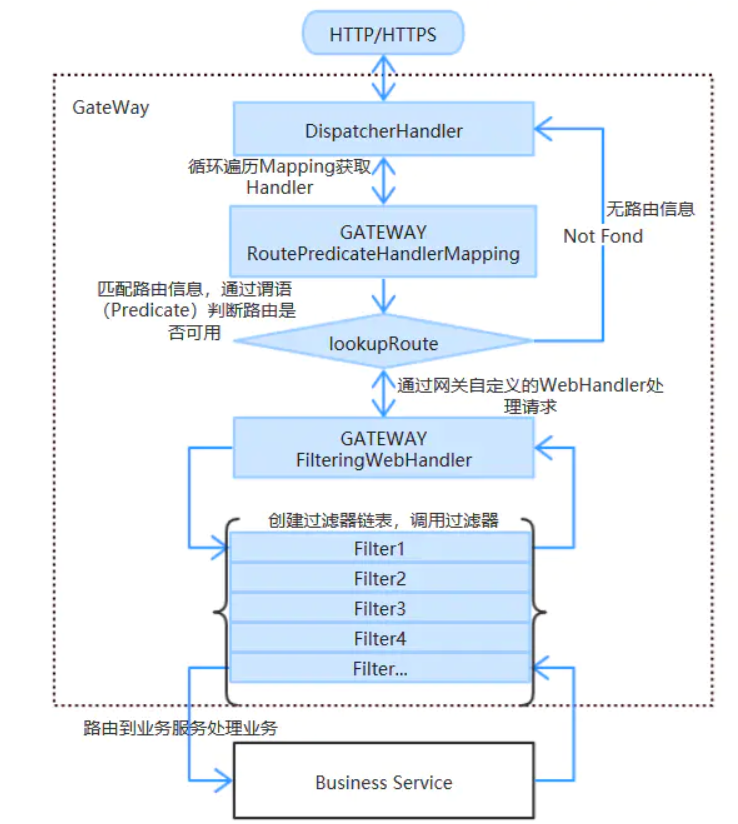

# Gateway

- 代码地址： [SpringCloud/cloud-gateway-9527 at master · chenpc1234/SpringCloud (github.com)](https://github.com/chenpc1234/SpringCloud/tree/master/cloud-gateway-9527)
- 参考资料：[尚硅谷SpringCloud框架开发教程(SpringCloudAlibaba微服务分布式架构丨Spring Cloud)_哔哩哔哩_bilibili](https://www.bilibili.com/video/BV18E411x7eT?spm_id_from=333.337.search-card.all.click)

##  Spring cloud Gateway特性

1. 基于Spring Framework 5，Project  Reactor和Spring Boot 2.0。
2. 集成Hystrix断路器。
3. 集成Spring Cloud DiscoveryClient。
4. Predicates和Filters作用于特定路由，易于编写的Predicates和Filters。
5. 具备一些网关的高级功能：动态路由、限流、路径重写
    6.Webflux中的reactor-netty响应式编程组件，底层使用了Netty通讯框架。

从以上的特征来说，和Zuul的特征区别不大。SpringCloud Gateway和Zuul主要的区别，还是在底层的通信框架上。

## 三大核心概念

- **Route(路由)：**
  - 路由是构建网关的基本模块，它由ID，目标URI，一系列的断言和过滤器组成，如果断言为true则匹配该路由，目标URI会被访问。
- **Predicate(断言)：**
  - 这是一个java 8的Predicate，可以使用它来匹配来自HTTP请求的任何内容，如：请求头和请求参数。断言的输入类型是一个ServerWebExchange。
- **Filter(过滤器)：**
  - 指的是Spring框架中GatewayFilter的实例，使用过滤器，可以在请求被路由前或者后对请求进行修改。

总结：web请求，通过一些匹配条件，定位到真正的服务节点。并在这个转发过程的前后，进行一些精细化控制。predicate就是匹配条件，而filter，就可以理解为一个无所不能的拦截器。有了这两个元素，再加上目标URI，就可以实现具体的路由了。

## IO模型

### zuul的IO模型


​		SpringCloud中所集成的Zuul版本，采用的是Tomcat容器，使用的是传统的Servlet IO处理模型，是阻塞式处理模型。

- **servlet由servlet container进行生命周期管理。**
  - container启动时构造servlet对象并调用servlet init()进行初始化；
  - container运行时接收请求，并为每个请求分配一个线程（一般从线程池中获取空闲线程）然后调用service()。
  - container关闭时调用servlet destory()销毁servlet；
- 弊端：
  - servlet是一个简单的网络IO模型，当请求进入servlet container时，servlet container就会为其绑定一个线程，在并发不高的场景下这种模型是适用的，但是一旦并发上升，线程数量就会上涨，而线程资源代价是昂贵的（上下文切换，内存消耗大）严重影响请求的处理时间。
  - 在一些简单的业务场景下，不希望为每个request分配一个线程，只需要1个或几个线程就能应对极大并发的请求，这种业务场景下servlet模型没有优势。
  - SpringCloud Zuul是基于servlet之上的一个阻塞式处理模型，即Spring实现了处理所有request请求的一个servlet（DispatcherServlet），并由该servleet阻塞式处理。

### Gateway的IO模型


​			在 Servlet3.1之后有了异步非阻塞的支持。而 Webflux是一个曲型非阻塞异步的框架，它的核心是基于 Reactor的相关AP实现的。相对于传统的web框架来说，它可以运行在诸如 Netty， Undertow及支持 Servlet3.1的容器上。非阻塞式+函数式编程( Spring5必须让你使java8)
​			Spring WebFlux是 Spring5.0引入的新的响应式框架，区别于 Spring MVC，它不需要依赖 Servlet api，它是完全异步非阻塞的，并且基于 Reactor来实现响应式流规范。



## 服务网关配置

### yaml方式配置

1. 新建gateway网关模块，加入注册中心，pom配置文件添加gateway依赖(不需要引入 springboot web starter)

   ```xml
   <!-- gateway 网关-->
   <dependency>
       <groupId>org.springframework.cloud</groupId>
       <artifactId>spring-cloud-starter-gateway</artifactId>
   </dependency>
   ```

2.  yaml配置文件中添加gateway相关配置

    ```yaml
    server:
      port: 9527
    spring:
      application:
        name: cloud-gateway-9527
      cloud:
        gateway:
          discovery:
            locator:
              enabled: true        #开启服务发现，配置服务名称进行动态路由
          routes:
            - id: payment_route                # 路由的id,没有规定规则但要求唯一,建议配合服务名
              uri: lb://CLOUD-PAYMENT-SERVICE #匹配后提供服务的路由地址，满足断言条件会路由到此地址 格式：lb://服务名
              predicates:                    #断言，可以编写多个，需要同时满足才能进行路由
                - Path=/consumer/see/** #断言，路径相匹配的进行路由
                - After=2021-05-03T23:43:08.617+08:00[Asia/Shanghai]  #必须在#2021.5.3.23:43 以后才能路由
            - id: customer_route
              uri: http://news.baidu.com/
              predicates:
                - Path=/guoji
                - Age=18,60 # 限制年龄[18, 60)的人能访问国际新闻
              #  - Between=2021-05-03T23:43:08.617+08:00[Asia/Shanghai],2021-05-04T23:43:08.617+08:00[Asia/Shanghai]
    #        - id: payment_route         # 路由的id,没有规定规则但要求唯一,建议配合服务名
    #          uri: http://localhost:88  #匹配后提供服务的路由地址，满足断言条件会路由到此地址
    #          predicates:               #断言，可以编写多个，需要同时满足才能进行路由
    #            - Path=/consumer/see/** #断言，路径相匹配的进行路由
    eureka:
      client:
        register-with-eureka: true
        fetch-registry: true
        service-url:
          defaultZone: http://eureka7001.com:7001/eureka/,http://eureka7002.com:7002/eureka/  #服务端url
      instance:
        instance-id: cloud-gateway-9527
        prefer-ip-address: true  #显示IP
    ```

3.  测试

    访问    http://localhost:9527/consumer/see/**  等同于访问  http://localhost:88/consumer/see/** 

### @Bean组件方式配置

1.  新建gateway网关模块，加入注册中心，pom配置文件添加gateway依赖(不需要引入 springboot web starter)

   ```xml
   <!-- gateway 网关-->
   <dependency>
       <groupId>org.springframework.cloud</groupId>
       <artifactId>spring-cloud-starter-gateway</artifactId>
   </dependency>
   ```

2. 添加配置类，使用到了函数式编程

   ```java
   @Configuration
   public class GatewayConfig {
       @Bean
       public RouteLocator myRouteLocator(RouteLocatorBuilder locatorBuilder){
           RouteLocatorBuilder.Builder routes = locatorBuilder.routes();
           //route的名字：myRoute
           //把此服务下的 /consumer/see/** 请求 转到 http://localhost:88/consumer/see/**
           routes.route("myRoute",r ->r.path("/consumer/see/**").uri("http://localhost:88/consumer/see/**") ).build();
           return routes.build();
       }
   }
   ```

## 常见的断言

### 时间断言 

- After=[time]    

  - 必须在[time]时间之后

- Before=[time] 

  - 必须在[time]时间之前

- Between= [time1], [time2] 

  - 必须在[time1] 到[time2]时间之间

- demo: 

  ```yaml
  - routes:
      id: payment_route                # 路由的id,没有规定规则但要求唯一,建议配合服务名
      uri: lb://CLOUD-PAYMENT-SERVICE #匹配后提供服务的路由地址，满足断言条件会路由到此地址 格式：lb://服务名
      predicates:                    #断言，可以编写多个，需要同时满足才能进行路由
        - Path=/consumer/see/** #断言，路径相匹配的进行路由
        - After=2021-05-03T23:43:08.617+08:00[Asia/Shanghai]  #必须在#2021.5.3.23:43 以后才能路由
        - Between=2021-05-03T23:43:08.617+08:00[Asia/Shanghai],2021-05-04T23:43:08.617+08:00[Asia/Shanghai]  #必须在#2021.5.3.23:43 -2021.5.4.23:43才能路由
  ```

### Query 路由断言

​		Query 路由断言工厂接收两个参数，一个必需的参数和一个可选的正则表达式。

```yaml
spring:
  cloud:
    gateway:
    	routes:
        - id: query_route
          uri: http://c.biancheng.net
          predicates:
        	- Query=foo,ba.
         ##如果请求包含一个值与 ba 匹配的 foo 查询参数，则此路由将匹配。bar 和 baz 也会匹配，因为第二个参数是正则表达式。
         
##         测试链接：http://localhost：2001/?foo=baz。
```

### Method 路由断言工厂

​		Method 路由断言工厂接收一个参数，即要匹配的 HTTP 方法。比如必须是get请求

```yaml
spring:
  cloud:
    gateway:
      routes:
        - id: method_route
          uri: http://baidu.com
          predicates:
            - Method=GET
```

### Header 路由断言

​	Header 路由断言工厂接收两个参数，分别是请求头名称和正则表达式。

```yaml
spring:
  cloud:
    gateway:
      routes:
       - id: header_route
         uri: http://example.org
         predicates:
         - Header=X-Request-Id, \d+
         ##如果请求中带有请求头名为 x-request-id，其值与 \d+ 正则表达式匹配（值为一个或多个数字），则此路由匹配。　　
```

### 自定义路由断言

​		自定义路由断言工厂需要继承 AbstractRoutePredicateFactory 类，重写 apply 方法的逻辑。在 apply 方法中可以通过 exchange.getRequest() 拿到 ServerHttpRequest 对象，从而可以获取到请求的参数、请求方式、请求头等信息。

​		apply 方法的参数是自定义的配置类，在使用的时候配置参数，在 apply 方法中直接获取使用。命名需要以 RoutePredicateFactory 结尾，比如 CheckAuthRoutePredicateFactory，那么在使用的时候 CheckAuth 就是这个路由断言工厂的名称。

- **配置**

```yaml
spring:
  application:
    name: cloud-gateway-9527
  cloud:
    gateway:
      discovery:
        locator:
          enabled: true        #开启服务发现，配置服务名称进行动态路由
      routes:

   - id: age_route
     uri: http://news.baidu.com/
     predicates:
       - Path=/guoji
       - Age=18,60 # 限制年龄[18, 60)的人能访问百度国际新闻
```

- 
  自定义断言类


```java
@Component
public class AgeRoutePredicateFactory extends AbstractRoutePredicateFactory<AgeRoutePredicateFactory.Config> {
    public AgeRoutePredicateFactory() {
        super(AgeRoutePredicateFactory.Config.class);

    }

    // 将配置文件中的值按返回集合的顺序，赋值给配置类
    @Override
    public List<String> shortcutFieldOrder() {
        return Arrays.asList(new String[] {"minAge", "maxAge"});
    }

    // 断言
    @Override
    public Predicate<ServerWebExchange> apply(AgeRoutePredicateFactory.Config config) {

        return (ServerWebExchange serverWebExchange)->{
            // 获取请求参数age，判断是否满足[18, 60)
            String age = serverWebExchange.getRequest().getQueryParams().getFirst("age");
            if (StringUtils.isEmpty(age)) {
                return false;
            }

            if (!age.matches("[0-9]+")) {
                return false;
            }

            int iAge = Integer.parseInt(age);

            if (iAge >= config.minAge && iAge < config.maxAge) {
                return true;
            } else {
                return false;
            }
        };
    }

    // 配置类，属性用于接收配置文件中的值
    @Data
    public static class Config {
        private int minAge;
        private int maxAge;
    }
}                             
```
## 自定义Filter

1. 编写Filter  实现 GlobalFilter, Ordered接口，编写的过滤器是全局的，每个路由都会过滤

   例如： 编写 filter 方法，比如请求参数中 必须name 为chen

   ```java
   @Component
   @Slf4j
   public class MyLogFilter implements GlobalFilter, Ordered {
       @Override
       public Mono<Void> filter(ServerWebExchange exchange, GatewayFilterChain chain) {
           log.info("-----MyLogFilter start--------"+new Date());
           //得到请求参数的第一个name 参数的值
           String name = exchange.getRequest().getQueryParams().getFirst("name");
           if (!"chen".equals(name)){
               log.info("name 不是chen 不允许路由");
               exchange.getResponse().setStatusCode(HttpStatus.NOT_ACCEPTABLE);
               return exchange.getResponse().setComplete();
           }
           return chain.filter(exchange);
       }
   
       @Override
       public int getOrder() {
           return 0;
       }
   
   }
   ```

2. 测试，结合自定义断言常见的断言

   ```tex
   http://localhost:9527/guoji?age=33  不能访问
   http://localhost:9527/guoji?age=33&name=chen  可以访问
   ```