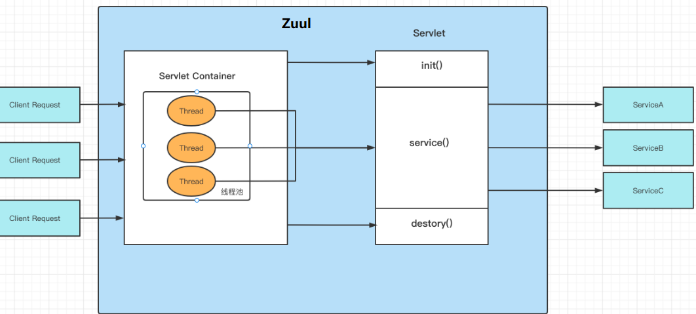
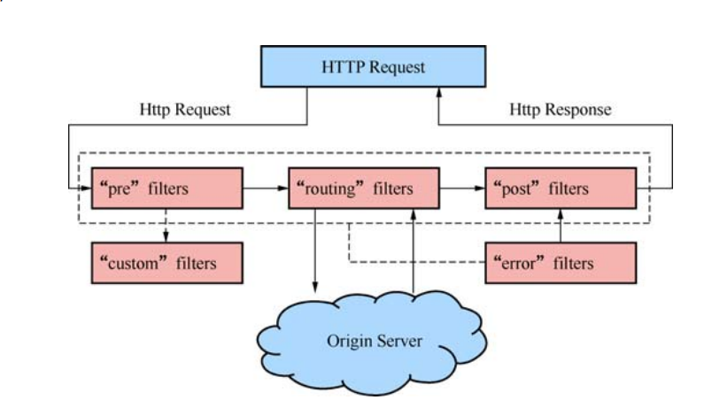
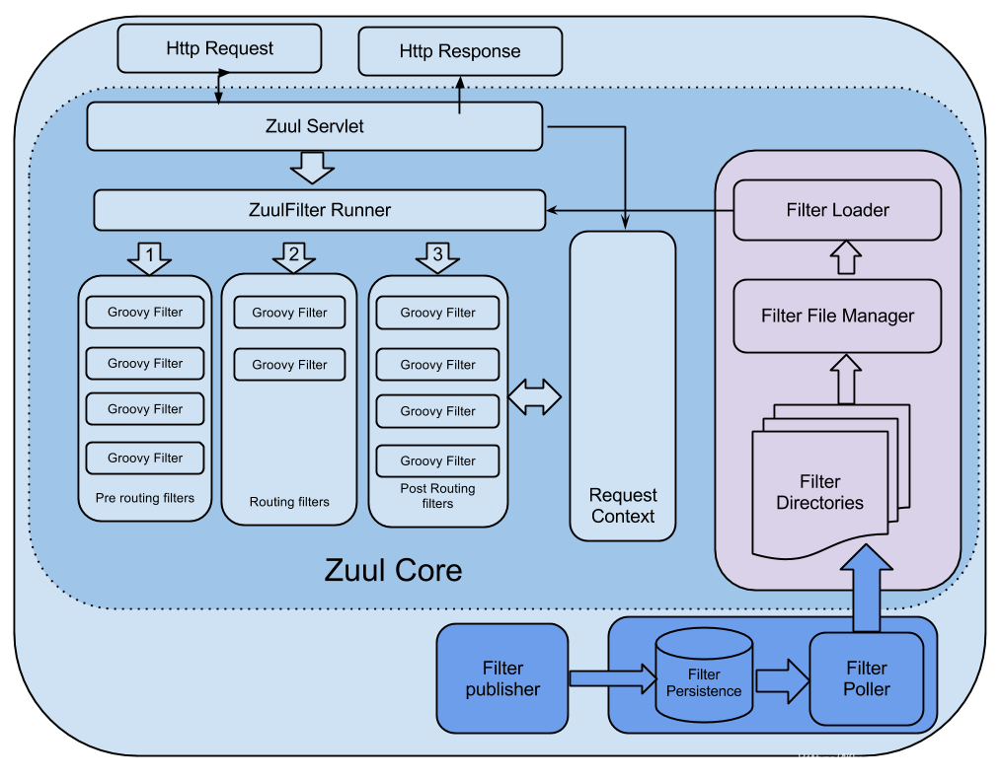

# Zuul网关

## zuul的IO模型

zuul 是netflix开源的一个API Gateway 服务器, 本质上是一个web servlet应用



​		SpringCloud中所集成的Zuul版本，采用的是Tomcat容器，使用的是传统的Servlet IO处理模型，是阻塞式处理模型。

- **servlet由servlet container进行生命周期管理。**
  - container启动时构造servlet对象并调用servlet init()进行初始化；
  - container运行时接收请求，并为每个请求分配一个线程（一般从线程池中获取空闲线程）然后调用service()。
  - container关闭时调用servlet destory()销毁servlet；
- 弊端：
  - servlet是一个简单的网络IO模型，当请求进入servlet container时，servlet container就会为其绑定一个线程，在并发不高的场景下这种模型是适用的，但是一旦并发上升，线程数量就会上涨，而线程资源代价是昂贵的（上下文切换，内存消耗大）严重影响请求的处理时间。
  - 在一些简单的业务场景下，不希望为每个request分配一个线程，只需要1个或几个线程就能应对极大并发的请求，这种业务场景下servlet模型没有优势。
  - SpringCloud Zuul是基于servlet之上的一个**阻塞式处理模型**，即Spring实现了处理所有request请求的一个servlet（DispatcherServlet），并由该servleet阻塞式处理。

## SpirngBoot整合Zuul

```xml
<dependency>
    <groupId>org.springframework.cloud</groupId>
    <artifactId>spring-cloud-starter-netflix-zuul</artifactId>
</dependency>
<dependency>
    <groupId>org.springframework.cloud</groupId>
    <artifactId>spring-cloud-starter-netflix-eureka-client</artifactId>
</dependency>
```

```java
@SpringBootApplication
@EnableEurekaClient
@EnableZuulProxy
public class GatewayApplication {
    ...
}
```

## 过滤器

Zuul 的核心是一系列过滤器，可以在 Http 请求的发起和响应返回期间执行一系列的过滤器。

### 过滤器的类型

- PRE 过滤器
  - 它是在请求路由到具体的服务之前执行的，这种类型的过滤器可以做安全验证，例如身份验证、参数验证等。
- ROUTING 过滤器
  - 它用于将请求路由到具体的微服务实例。在默认情况下，它使用Http Client 进行网络请求。
- POST 过滤器
  - 它是在请求已被路由到微服务后执行的。一般情况下，用作收集统计信息、指标，以及将响应传输到客户端。
- ERROR 过滤器
  - 它是在其他过滤器发生错误时执行的。

### 自定义过滤器

1. 自定义过滤器需要继承 ZuulFilter，重写ZuulFilter的方法

   1. filterType() ---------定义过滤器的类型
   2. filterOrder()---------定义过滤器的优先级 数字越小，越先执行
   3. shouldFilter()---------过滤器是否生效 false=不生效
   4. run() ---------主代码，过滤器业务逻辑

2. Zuul 采取了动态读取、编译和运行这些过滤器。过滤器之间不能直接相互通信，而是通过 RequestContext 对象来共享数据，每个请求都会创建一个 RequestContext 对象。*RequestContext.getCurrentContext();* 每个请求的上下文对象是唯一的。

   ```tex
   context.setSendZuulResponse(false); //中断后续路由
   
   //比如：
   RibbonRoutingFilter.shouldFilter(); //方法会使用sendZuulResponse 获取值进行判断
   ```

## Zuul工作流程






## Zuul路由配置

```properties
zuul.routes.no1.path=/path/**     			//路径匹配
zuul.routes.no1.service-id=service_name   	// 服务名 
zuul.routes.no1.stripPrefix=false          //false = 不删除匹配路径  默认删除
zuul.routes.no1.sensitive-headers=Cookie,Set-Cookie,token,Authorization  // 过滤掉请求头中的信息
```

