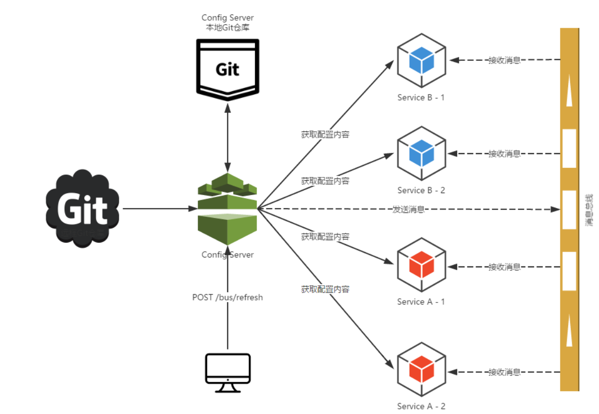
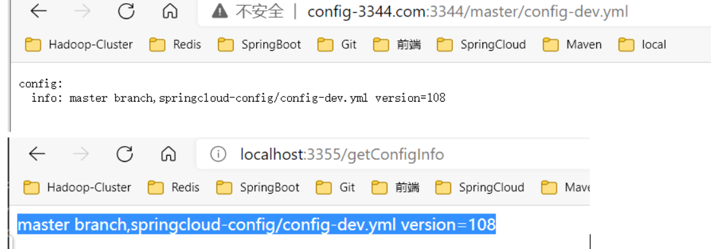

# 服务配置中心

- 代码地址：[chenpc1234/SpringCloud (github.com)](https://github.com/chenpc1234/SpringCloud)
- 参考资料：[尚硅谷SpringCloud框架开发教程(SpringCloudAlibaba微服务分布式架构丨Spring Cloud)_哔哩哔哩_bilibili](https://www.bilibili.com/video/BV18E411x7eT?spm_id_from=333.337.search-card.all.click)

## 简介

### 配置中心的作用

1. 配置集中管理、统一标准
2. 配置与应用分离
3. 实时更新
4. 高可用

### 传统无配置中心的弊端

1. 静态化配置参数修改不灵活，甚至需要重启运行中的项目才能生效。
2. 配置文件无法区分环境，在项目发布的时候，极其容易因开发人员的失误导致出错。其实可以解决 见SpringBoot中 动态配置环境并启动 application-dev.yaml application-sit.yaml application-pro.yaml
3. 配置文件过于分散。现在微服务都是集群模式，分散到每个节点上管理太麻烦
4. 配置修改无法追溯。因为采用的静态配置文件方式，所以当配置进行修改之后，不容易形成记录，更无法追溯是谁修改的、修改时间是什么、修改前是什么内容。既然无法追溯，那么当配置出错时，更没办法回滚配置了。

### 主流配置中心

1.  SpirngCloud Config       只支持java、 依赖git
2.  Alibaba  Nacos               Alibaba支持多语言 、具备服务发现、消息总线 、无权限管理
3.  携程 Apollo                     携程开源 ，支持多语言、 有权限管理

### 配置中心为何需要配置在bootstrap

​			当使用 Spring Cloud 的时候，配置信息一般是从 config server 加载的，为了取得配置信息（比如密码等），你需要一些提早的或引导配置。因此，把 config server 信息放在 bootstrap.yml，用来加载真正需要的配置信息。

​			这是由spring boot的加载属性文件的优先级决定的，你想要在加载属性之前去spring cloud config server上取配置文件，那spring cloud config相关配置就是需要最先加载的，而bootstrap.properties的加载是先于application.properties的，所以config client要配置config的相关配置就只能写到bootstrap.properties里了（bootstrap.yml 和application.yml 也可）。

**bootstrap.yml 和application.yml的异同**

- bootstrap.yml 和application.yml 都可以用来配置参数。bootstrap.yml 先加载。
- bootstrap.yml 可以理解成系统级别的一些参数配置，这些参数一般是不会变动的。
- application.yml 可以用来定义应用级别，主要用于 Spring Boot 项目的自动化配置。

## Config+Bus实现配置中心

### 原理



1. 配置一个Git远程仓库，保存配置文件，运维可以在Git上进行修改
2. 建立一个ConfigServer ，ConfigServer配置可以直接从Git上拉取，ConfigServer也需要注册进入服务注册中心
3. 运维人员可以给ConfigServer 发送一个刷新配置的命令
   1. 提交配置触发post请求给server端的bus/refresh接口
   2. server端接收到请求并发送给Spring Cloud Bus总线
   3. Spring Cloud bus接到消息并通知给其它连接到总线的客户端
   4. 其它客户端接收到通知，请求Server端获取最新配置
   5. 全部客户端均获取到最新的配置,配置完成

### 配置流程

#### 安装RabbitMQ

#### 配置ConfigServer

1. 新建Config模块微服务，加入注册中心，引入Config服务端依赖

   ```xml
   	<!--        引入Config 服务端依赖-->
        <dependency>
            <groupId>org.springframework.cloud</groupId>
            <artifactId>spring-cloud-config-server</artifactId>
        </dependency>
   ```

2. yaml添加Config相关配置

   ```yaml
   server:
     port: 3355
   spring:
     application:
    	name: cloud-config-client
     cloud:
        config:
          #config 客户端配置
          #配置读取  uri/label/name-profile.yaml  = http://localhost:3344/master/config-dev.yaml
          label: master
          name: config
          profile: dev
          uri: http://localhost:3344
   ```

3. 测试  

   1. 访问 http://config-3344.com:3344/master/config-test.yml  
   2. 修改Git上的内容后 再次访问可以看到配置的变化， 需要等待几秒

#### 配置Client

1. 微服务加入注册中心，引入Config starter依赖

   ```xml
     <!--        引入Config starter依赖-->
   <dependency>
       <groupId>org.springframework.cloud</groupId>
       <artifactId>spring-cloud-starter-config</artifactId>
   </dependency>
   ```

2. 微服务bootstrap.yaml配置Config相关内容

   ```yaml
   server:
     port: 3355
   spring:
     application:
       name: cloud-config-client
     cloud:
       config:
         #config 客户端配置
         #配置读取  uri/label/name-profile.yaml  = http://localhost:3344/master/config-dev.yaml
         label: master
         name: config
         profile: dev
         uri: http://localhost:3344
   eureka:
     client:
       register-with-eureka: true   #注册
       fetch-registry: true   #是否从eureka server 已有的注册信息
       service-url:
         defaultZone: http://eureka7001.com:7001/eureka/,http://eureka7002.com:7002/eureka/  #服务端url
     instance:
       instance-id: cloud-config-clinet-3355
       prefer-ip-address: true  #显示IP
   ```

3. 编写测试类测试

   ```java
   @RestController
   public class Test {
       @Value("${config.info}")
       private String configInfo;
   
       @GetMapping("/getConfigInfo")
       public String getConfigInfo(){
           return configInfo;
       }
   
   }
   ```

   

4. 测试

   1. 修改Git上的内容后，再次访问可以看到3344服务端会变化(不变是因为git配置原因)，3355客户端不会变 
   2. 如果服务端3344不变，name是git配置的问题
      git config --get http.postBuffer
      git config --global http.postBuffer 524288000

5. 解决测试问题

   1. 客户端pom 引入spring-boot-starter-actuator

      ```xml
      <dependency>
           <groupId>org.springframework.boot</groupId>
           <artifactId>spring-boot-starter-actuator</artifactId>
      </dependency>
      ```

   2. yaml 暴露监控端点

      ```yaml
      management:
        endpoints:
       web:
         exposure:
           include: "*"
      ```

   3. 测试类添加@RefreshScope

      ```java
      @RestController
      @RefreshScope
      public class Test {
          @Value("${config.info}")
          private String configInfo;
      
          @GetMapping("/getConfigInfo")
          public String getConfigInfo(){
              return configInfo;
          }
      }
      ```

   4. 使用postman发送Post请求  http://localhost:3355/actuator/refresh   ，刷新客户端3355并测试，成功刷新配置

   5. 问题：若3355是集群环境 如何刷新？？？

#### 配置Bus 推送

**基于 以上2个配置，再次配置**

1. ConfigServer添加Bus 依赖

   ```xml
   <dependency>
       <groupId>org.springframework.cloud</groupId>
       <artifactId>spring-cloud-starter-bus-amqp</artifactId>
   </dependency>
   ```

2. ConfigServer 端yaml 添加mq相关配置

   ```yaml
   spring:
     rabbitmq:
       host: localhost
       port: 5672
       username: guest
       password: guest
       #暴露端点
       management:
         endpoints:
       web:
         exposure:
           include: 'bus-refresh'
   ```

3. ConfigClient添加Bus 依赖

   ```xml
   <dependency>
      	 <groupId>org.springframework.cloud</groupId>
      	 <artifactId>spring-cloud-starter-bus-amqp</artifactId>
   </dependency>
   ```

4. ConfigClient 添加mq相关配置

   ```yaml
   spring:
     rabbitmq:
       host: localhost
       port: 5672
       username: guest
       password: guest
   ```

5. 测试

   1. 使用发送post请求到server，
      http://localhost:3344/actuator/bus-refresh     处处都可以刷新git最新配置

   2. 若只刷新固定节点

       http://localhost:3344/actuator/bus-refresh/服务名：端口