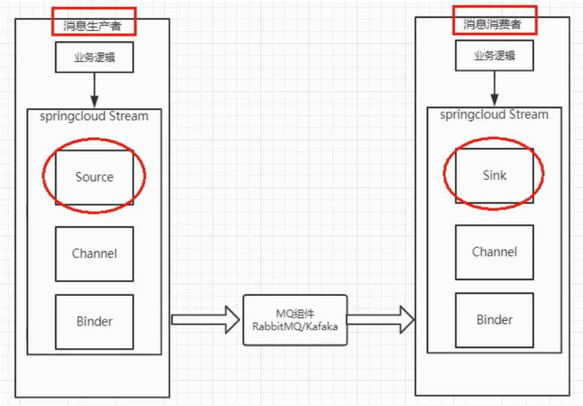
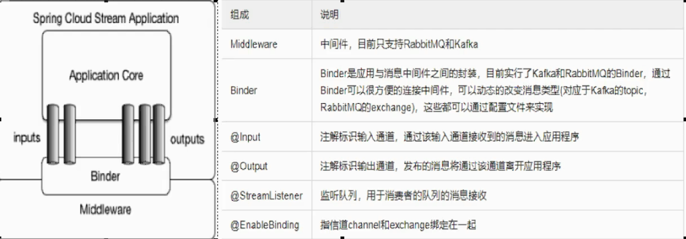

# 消息驱动-Stream

- 代码地址：[chenpc1234/SpringCloud (github.com)](https://github.com/chenpc1234/SpringCloud)
- 参考资料：[尚硅谷SpringCloud框架开发教程(SpringCloudAlibaba微服务分布式架构丨Spring Cloud)_哔哩哔哩_bilibili](https://www.bilibili.com/video/BV18E411x7eT?spm_id_from=333.337.search-card.all.click)

## 简介

​			Spring Cloud Stream 是为了屏蔽底层中间件的差异，节约开发成本，开发的消息驱动组件。支持RabbitMQ、Kafka。用户将消息全部扔到input中，通过Binder传输到消息中间件，用户取消息只需要去output取 ，而不用关心中间件是什么

## 示意图及相关注解






## 项目配置Stream

1. 微服务中消息发送者、接收者都需要引入Stream依赖  

   ```xml
   <!--        引入stream 消息驱动的rabbitmq依赖-->
   <dependency>
       <groupId>org.springframework.cloud</groupId>
       <artifactId>spring-cloud-starter-stream-rabbit</artifactId>
   </dependency>
   ```

2. 消息发送者yaml配置添加Stream相关属性

   ```yaml
   server:
     port: 8890
   spring:
     application:
    name: cloud-stream-rabbitmq-send
     cloud:
    stream:
      binders:
        defaultRabbit:
          type: rabbit    #rabbit 方式
          environment:   #配置mq环境  ip 端口用户名密码
            spring:
              rabbitmq:
                host: localhost
                username: guest
                password: guest
      bindings:
        output: #通道的类型
          destination: testExchange #表示要使用的exchange名称的定义
          content-type: application/json
          binder: defaultRabbit
   eureka:
     client:
    register-with-eureka: true   #注册
    fetch-registry: true   #是否从eureka server 已有的注册信息
    service-url:
      defaultZone: http://eureka7001.com:7001/eureka/,http://eureka7002.com:7002/eureka/  #服务端url
     instance:
    instance-id: cloud-stream-rabbitmq-send
    prefer-ip-address: true  #显示IP
   ```

3. 消息接受者yaml配置添加Stream相关属性  // 发送者与接受者区别只在通道类型：一个是output 一个是input

   ```yaml
   server:
     port: 8891
   spring:
     application:
    name: cloud-stream-rabbitmq-receive
     cloud:
    stream:
      binders:
        defaultRabbit:
          type: rabbit
          environment: #
            spring:
              rabbitmq:
                host: localhost
                username: guest
                password: guest
      bindings:
        input: #通道的类型
          destination: testExchange #表示要使用的exchange名称的定义
          content-type: application/json
          binder: defaultRabbit
          group: cloud-stream-rabbitmq-receive
   eureka:
     client:
    register-with-eureka: true   #注册
    fetch-registry: true   #是否从eureka server 已有的注册信息
    service-url:
      defaultZone: http://eureka7001.com:7001/eureka/,http://eureka7002.com:7002/eureka/  #服务端url
     instance:
    instance-id: cloud-stream-rabbitmq-receive
    prefer-ip-address: true  #显示IP
   ```

4. 消息发送者发送服务配置

   1. 编写发送服务接口及实现类，实现类添加 @EnableBinding(Source.class)注解，引入MessageChannel 组件

   2. 使用MessageChannel 的send方法发送消息，Message<?>类型可以用MessageBuilder 方法生成

   3. demo如下，编写controller 调用此service 即可

      ```java
      @EnableBinding(Source.class)
      public class MessageSendImpl implements IMessageSend {
          @Resource
          private MessageChannel output;
          @Override
          public String Send() {
              String s = UUID.randomUUID().toString();
              output.send(MessageBuilder.withPayload(s).build());
              System.out.println("send 服务发送消息 "+s);
              return null;
          }
      }
      ```

   4. 消息接收接收服务配置

      1. 编写接收消息的监听服务，监听服务类添加注解@EnableBinding(Sink.class)

      2. 编写接收消息的方法，添加监听注解 @StreamListener(Sink.INPUT) 消息。方法的入参是Message类型和发送的类型一致

      3. demo 如下

         ```java
         @Component
         @EnableBinding(Sink.class)
         public class ReceiveMessageListenerController {
         
             @StreamListener(Sink.INPUT)
             public void input(Message<String> message){
                 System.out.println("Receiver 1号 接受到消息" + message.getPayload());
             }
         }
         ```

   5. 如果接收方是集群，都这样配置会导致消息推送到多个节点，引起消息重复消费。

      原因是每个接收节点在rabbitmq中默认的分组是不同的，需要设置分组

      接收服务的yaml中设置group 就可以，必须设置group！！！Group能保证消息不丢失

      ```yaml
      bindings:
          input: #通道的类型
              destination: testExchange #表示要使用的exchange名称的定义
              content-type: application/json
              binder: defaultRabbit
              group: cloud-stream-rabbitmq-receive
      ```