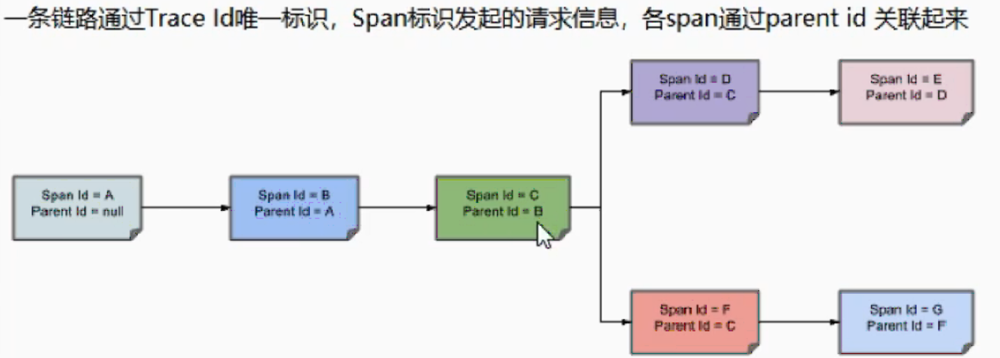

# 服务链路监控

​			微服务模块众多，经常一个请求需要好几个微服务支撑，服务链路复杂，为了更加方便的定位问题，需要添加服务链路监控。

## Sleuth

### 原理图解



###  配置Sleuth 和zipkin

1. 下载运行Zipkin

   ```tex
   //CMD运行
   D:\Zipkin>java -jar zipkin-server-2.23.2-exec.jar
     
   访问 http://localhost:9411  验证 成功
   ```

2. 微服务添加Zipkin相关依赖

   ```xml
   <!--        引入zipkin依赖-->
   <dependency>
       <groupId>org.springframework.cloud</groupId>
       <artifactId>spring-cloud-starter-zipkin</artifactId>
   </dependency>
   ```

3. 微服务yaml添加ZipKin相关配置

   ```yaml
   spring:
     application:
    	name: order
     zipkin:
    	base-url: http://localhost:9411   # 推送到zipkin 
     sleuth:
       sampler:
       	probability: 1   #采样率   0 到1之间的数字  1最大
   ```

4. 微服务链路监控测试 
   查看 http://localhost:9411  能够查询到调用链路 和服务依赖信息

 
