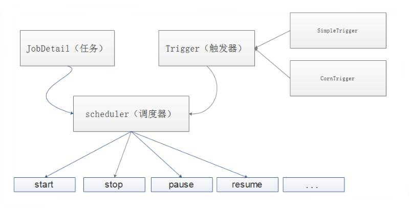

# 定时任务

## Java Api- 

**java.util.Timer类 java.util.TimerTask类**

Timer只是创建了一个thread去执行queue中的task，那么就可能会出现上一个任务执行延迟了，会影响到下一个定时任务。

```java
Timer timer = new Timer();

timer.scheduleAtFixedRate(new TimerTask() {
    @Override
    public void run() {
        System.out.println(LocalDateTime.now());
    }
    //100ms 后执行 ，间隔时间为1000ms
}, 100, 1000);

```

| 返回值 | 方法描述                                                     |
| ------ | ------------------------------------------------------------ |
| `void` | `cancel()`终止此计时器，丢弃任何当前计划的任务。             |
| `int`  | `purge()`从该计时器的任务队列中删除所有取消的任务。          |
| `void` | `schedule(TimerTask task, Date time)`在指定的时间安排指定的任务执行。 |
| `void` | `schedule(TimerTask task, Date firstTime, long period)`从指定 *的时间开始* ，对指定的任务执行重复的 *固定延迟执行* 。 |
| `void` | `schedule(TimerTask task, long delay)`在指定的延迟之后安排指定的任务执行。 |
| `void` | `schedule(TimerTask task, long delay, long period)`在指定 *的延迟之后开始* ，重新执行 *固定延迟*执行的指定任务。 |
| `void` | `scheduleAtFixedRate(TimerTask task, Date firstTime, long period)`从指定的时间 *开始* ，对指定的任务执行重复的 *固定速率执行* 。 |
| `void` | `scheduleAtFixedRate(TimerTask task, long delay, long period)`在指定的延迟之后 *开始* ，重新执行 *固定速率*的指定任务。 |

**ScheduledThreadPoolExecutor**

```java
ScheduledThreadPoolExecutor sc = new ScheduledThreadPoolExecutor(5);
sc.scheduleAtFixedRate(() -> {
   System.out.println(LocalDateTime.now());
     //100ms 后执行 ，间隔时间为1000ms
},100,1000, TimeUnit.MILLISECONDS);

```

## Quartz

[Quartz官方文档](http://www.quartz-scheduler.org/documentation/)

### 概念

- 任务 Job
  - Job 就是你想要实现的任务类，每一个 Job 必须实现 org.quartz.job 接口，且只需实现接口定义的 execute() 方法。
- 触发器 Trigger
  - Trigger 为你执行任务的触发器，比如你想每天定时3点发送一份统计邮件，Trigger 将会设置3点执行该任务。
    Trigger 主要包含两种 SimplerTrigger 和 CronTrigger 两种。
- 调度器 Scheduler
  - Scheduler 为任务的调度器，它会将任务 Job 及触发器 Trigger 整合起来，负责基于 Trigger 设定的时间来执行 Job。

### 体系结构



### 依赖

```xml
<dependencies>
    <!-- Quartz 核心包 -->
    <dependency>
        <groupId>org.quartz-scheduler</groupId>
        <artifactId>quartz</artifactId>
    </dependency>

    <!-- Quartz 工具包 -->
    <dependency>
        <groupId>org.quartz-scheduler</groupId>
        <artifactId>quartz-jobs</artifactId>
    </dependency>
</dependencies>
```


## **Spring Task**

- 依赖- springboot-web 自带

```xml
 <dependency>
        <groupId>org.springframework.boot</groupId>
        <artifactId>spring-boot-starter-web</artifactId>
</dependency>
<!--或者-->
<dependency>
    <groupId>org.springframework</groupId>
    <artifactId>spring-context</artifactId>
</dependency>

```

- 代码

  ```java
  @EnableAsync  // 开启异步，防止不同的任务之间相互阻塞
  @EnableScheduling // 开启对定时任务的支持·
  @Configuration
  public class ScheduledConfig {
  }
  ```

  

  ```java
  @RestController
  public class TaskController {
      @GetMapping
      @Scheduled(cron = "0/5 * * * * ?")
      public ResponseEntity<Map<String,Object>> getAll(){
          System.out.println("定时任务执行了");
          Map<String, Object> map = new HashMap<>();
          map.put("status","定时任务执行了");
          ResponseEntity<Map<String,Object>> responseEntity = new ResponseEntity<>(map, HttpStatus.OK);
          return responseEntity;
      }
  }
  ```

## Linux 定时任务crontab

[crontab](https://github.com/chenpc1234/Note/blob/main/Linux/Linux入门.md)

# 分布式任务调度框架

## XXL-JOB

## ELASTIC-JOB

## SchedulerX

