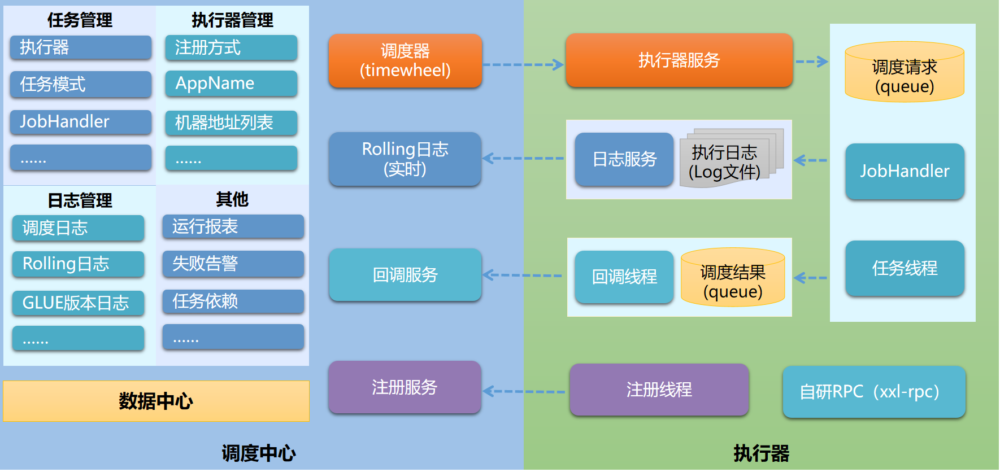
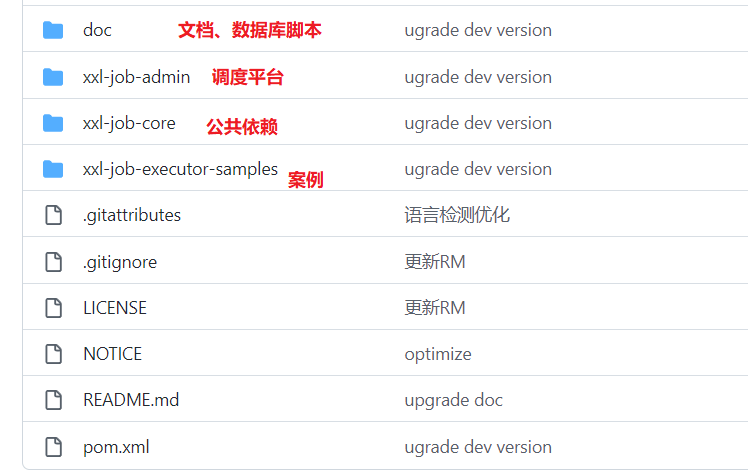
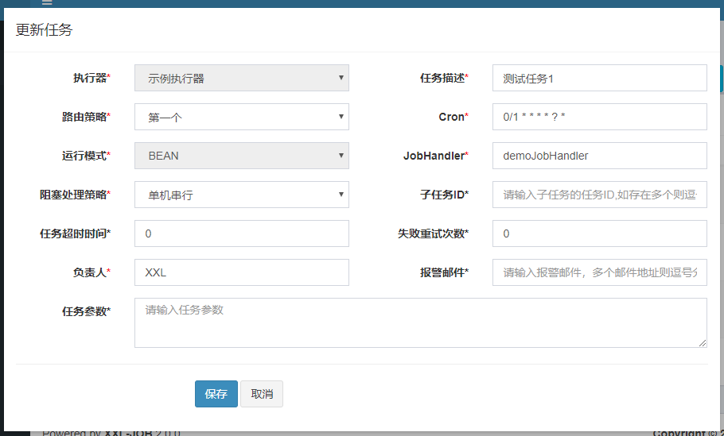

# 定时任务

## Java Api- 

**java.util.Timer类 java.util.TimerTask类**

Timer只是创建了一个thread去执行queue中的task，那么就可能会出现上一个任务执行延迟了，会影响到下一个定时任务。

```java
Timer timer = new Timer();

timer.scheduleAtFixedRate(new TimerTask() {
    @Override
    public void run() {
        System.out.println(LocalDateTime.now());
    }
    //100ms 后执行 ，间隔时间为1000ms
}, 100, 1000);

```

| 返回值 | 方法描述                                                     |
| ------ | ------------------------------------------------------------ |
| `void` | `cancel()`终止此计时器，丢弃任何当前计划的任务。             |
| `int`  | `purge()`从该计时器的任务队列中删除所有取消的任务。          |
| `void` | `schedule(TimerTask task, Date time)`在指定的时间安排指定的任务执行。 |
| `void` | `schedule(TimerTask task, Date firstTime, long period)`从指定 *的时间开始* ，对指定的任务执行重复的 *固定延迟执行* 。 |
| `void` | `schedule(TimerTask task, long delay)`在指定的延迟之后安排指定的任务执行。 |
| `void` | `schedule(TimerTask task, long delay, long period)`在指定 *的延迟之后开始* ，重新执行 *固定延迟*执行的指定任务。 |
| `void` | `scheduleAtFixedRate(TimerTask task, Date firstTime, long period)`从指定的时间 *开始* ，对指定的任务执行重复的 *固定速率执行* 。 |
| `void` | `scheduleAtFixedRate(TimerTask task, long delay, long period)`在指定的延迟之后 *开始* ，重新执行 *固定速率*的指定任务。 |

**ScheduledThreadPoolExecutor**

```java
ScheduledThreadPoolExecutor sc = new ScheduledThreadPoolExecutor(5);
sc.scheduleAtFixedRate(() -> {
   System.out.println(LocalDateTime.now());
     //100ms 后执行 ，间隔时间为1000ms
},100,1000, TimeUnit.MILLISECONDS);

```

## Quartz

[Quartz官方文档](http://www.quartz-scheduler.org/documentation/)

### 概念

- 任务 Job
  - Job 就是你想要实现的任务类，每一个 Job 必须实现 org.quartz.job 接口，且只需实现接口定义的 execute() 方法。
- 触发器 Trigger
  - Trigger 为你执行任务的触发器，比如你想每天定时3点发送一份统计邮件，Trigger 将会设置3点执行该任务。
    Trigger 主要包含两种 SimplerTrigger 和 CronTrigger 两种。
- 调度器 Scheduler
  - Scheduler 为任务的调度器，它会将任务 Job 及触发器 Trigger 整合起来，负责基于 Trigger 设定的时间来执行 Job。

### 体系结构


### 依赖

```xml
<dependencies>
    <!-- Quartz 核心包 -->
    <dependency>
        <groupId>org.quartz-scheduler</groupId>
        <artifactId>quartz</artifactId>
    </dependency>

    <!-- Quartz 工具包 -->
    <dependency>
        <groupId>org.quartz-scheduler</groupId>
        <artifactId>quartz-jobs</artifactId>
    </dependency>
</dependencies>
```


## **Spring Task**

- 依赖- springboot-web 自带

```xml
 <dependency>
        <groupId>org.springframework.boot</groupId>
        <artifactId>spring-boot-starter-web</artifactId>
</dependency>
<!--或者-->
<dependency>
    <groupId>org.springframework</groupId>
    <artifactId>spring-context</artifactId>
</dependency>

```

- 代码

  ```java
  @EnableAsync  // 开启异步，防止不同的任务之间相互阻塞
  @EnableScheduling // 开启对定时任务的支持·
  @Configuration
  public class ScheduledConfig {
  }
  ```

  

  ```java
  @RestController
  public class TaskController {
      @GetMapping
      @Scheduled(cron = "0/5 * * * * ?")
      public ResponseEntity<Map<String,Object>> getAll(){
          System.out.println("定时任务执行了");
          Map<String, Object> map = new HashMap<>();
          map.put("status","定时任务执行了");
          ResponseEntity<Map<String,Object>> responseEntity = new ResponseEntity<>(map, HttpStatus.OK);
          return responseEntity;
      }
  }
  ```

## Linux 定时任务crontab

[crontab](https://github.com/chenpc1234/Note/blob/main/Linux/Linux入门.md)

# 分布式任务调度框架

## 传统定时任务的缺陷

- 不支持集群
- 不支持统计
- 没有管理平台
- 没有失败报警
- 没有监控
- 分布式的架构中部分场景需要分布式任务调度：
  - 同一个服务多个实例的任务存在互斥时，需要统一的调度。
  - 任务调度需要支持高可用、监控、故障告警。
  - 需要统一管理和追踪各个服务节点任务调度的结果，需要记录保存任务属性信息等

## xxl-job

### 官方文档

[XXL-JOB官方文档](https://github.com/xuxueli/xxl-job/blob/master/doc/XXL-JOB官方文档.md)



### 简介

- 轻量级分布式任务调度框架
- 调度多个执行器执行任务，**调度中心通过DB锁保证集群分布式调度的一致性**，这样扩展执行器会增大DB的压力，实际上数据库只是负责任务的调度执行，但是如果没有大量的执行器的话和任务的情况，是不会造成数据库压力的。
- 相对来说，xxl-job中心式的调度平台**轻量级，开箱即用，操作简易，上手快，与SpringBoot有非常好的集成**，而且监控界面就集成在调度中心，界面又简洁，对于**企业维护起来成本不高，还有失败的邮件告警**等等。

### 使用

#### 拉源码

https://github.com/xuxueli/xxl-job.git



1. 导入到IDEA，配置一下Maven，下载相关的jar包
2. 初始化数据库 [脚本](https://github.com/xuxueli/xxl-job/blob/master/doc/db/tables_xxl_job.sql)

#### 配置部署“调度中心”

1. 配置文件  /xxl-job/xxl-job-admin/src/main/resources/application.properties

   ```properties
   ### 调度中心JDBC链接
   spring.datasource.url=jdbc:mysql://127.0.0.1:3306/xxl_job?useUnicode=true&characterEncoding=UTF-8&autoReconnect=true&serverTimezone=Asia/Shanghai
   spring.datasource.username=root
   spring.datasource.password=root_pwd
   spring.datasource.driver-class-name=com.mysql.jdbc.Driver
   
   ### 报警邮箱
   spring.mail.host=smtp.qq.com
   spring.mail.port=25
   spring.mail.username=xxx@qq.com
   spring.mail.password=xxx
   spring.mail.properties.mail.smtp.auth=true
   spring.mail.properties.mail.smtp.starttls.enable=true
   spring.mail.properties.mail.smtp.starttls.required=true
   spring.mail.properties.mail.smtp.socketFactory.class=javax.net.ssl.SSLSocketFactory
   
   ### 调度中心通讯TOKEN [选填]：非空时启用；
   xxl.job.accessToken=
   
   ### 调度中心国际化配置 [必填]： 默认为 "zh_CN"/中文简体, 可选范围为 "zh_CN"/中文简体, "zh_TC"/中文繁体 and "en"/英文；
   xxl.job.i18n=zh_CN
   
   ## 调度线程池最大线程配置【必填】
   xxl.job.triggerpool.fast.max=200
   xxl.job.triggerpool.slow.max=100
   
   ### 调度中心日志表数据保存天数 [必填]：过期日志自动清理；限制大于等于7时生效，否则, 如-1，关闭自动清理功能；
   xxl.job.logretentiondays=30
   ```

2. 部署运行

#### 配置部署“执行器项目“

1. pom文件中引入了 "xxl-job-core" 的maven依赖；

2. 配置文件

   ```properties
   ### 调度中心部署根地址 [选填]：如调度中心集群部署存在多个地址则用逗号分隔。执行器将会使用该地址进行"执行器心跳注册"和"任务结果回调"；为空则关闭自动注册；
   xxl.job.admin.addresses=http://127.0.0.1:8080/xxl-job-admin
   
   ### 执行器通讯TOKEN [选填]：非空时启用；
   xxl.job.accessToken=
   
   ### 执行器AppName [选填]：执行器心跳注册分组依据；为空则关闭自动注册
   xxl.job.executor.appname=xxl-job-executor-sample
   ### 执行器注册 [选填]：优先使用该配置作为注册地址，为空时使用内嵌服务 ”IP:PORT“ 作为注册地址。从而更灵活的支持容器类型执行器动态IP和动态映射端口问题。
   xxl.job.executor.address=
   ### 执行器IP [选填]：默认为空表示自动获取IP，多网卡时可手动设置指定IP，该IP不会绑定Host仅作为通讯实用；地址信息用于 "执行器注册" 和 "调度中心请求并触发任务"；
   xxl.job.executor.ip=
   ### 执行器端口号 [选填]：小于等于0则自动获取；默认端口为9999，单机部署多个执行器时，注意要配置不同执行器端口；
   xxl.job.executor.port=9999
   ### 执行器运行日志文件存储磁盘路径 [选填] ：需要对该路径拥有读写权限；为空则使用默认路径；
   xxl.job.executor.logpath=/data/applogs/xxl-job/jobhandler
   ### 执行器日志文件保存天数 [选填] ： 过期日志自动清理, 限制值大于等于3时生效; 否则, 如-1, 关闭自动清理功能；
   xxl.job.executor.logretentiondays=30
   ```

3. 执行器组件配置

   ```java
   @Bean
   public XxlJobSpringExecutor xxlJobExecutor() {
       logger.info(">>>>>>>>>>> xxl-job config init.");
       XxlJobSpringExecutor xxlJobSpringExecutor = new XxlJobSpringExecutor();
       xxlJobSpringExecutor.setAdminAddresses(adminAddresses);
       xxlJobSpringExecutor.setAppname(appname);
       xxlJobSpringExecutor.setIp(ip);
       xxlJobSpringExecutor.setPort(port);
       xxlJobSpringExecutor.setAccessToken(accessToken);
       xxlJobSpringExecutor.setLogPath(logPath);
       xxlJobSpringExecutor.setLogRetentionDays(logRetentionDays);
   
       return xxlJobSpringExecutor;
   }
   ```

4. 部署运行执行器项目

#### HelloWord

##### BEAN模式

- 执行器项目中，开发Job类

  - 方式1： 类形式

    ```tex
    1. 开发一个继承自"com.xxl.job.core.handler.IJobHandler"的JobHandler类，实现其中任务方法。
    2. 手动通过如下方式注入到执行器容器。XxlJobExecutor.registJobHandler("demoJobHandler", new DemoJobHandler());
    ```

  - 方法2：方法形式

    ```tex
    1、任务开发：在Spring Bean实例中，开发Job方法；
    2、注解配置：为Job方法添加注解 "@XxlJob(value="自定义jobhandler名称", init = "JobHandler初始化方法", destroy = "JobHandler销毁方法")"，注解value值对应的是调度中心新建任务的JobHandler属性的值。
    3、执行日志：需要通过 "XxlJobHelper.log" 打印执行日志；
    4、任务结果：默认任务结果为 "成功" 状态，不需要主动设置；如有诉求，比如设置任务结果为失败，可以通过 "XxlJobHelper.handleFail/handleSuccess" 自主设置任务结果；
    ```

- 调度中心，新建调度任务

  运行模式**选中 "BEAN模式**"，**JobHandler属性填写任务注解“@XxlJob”中定义的值**；

  

## elastic-job

- elasticjob的初衷是为了面对**高并发复杂的业务**，即使是在业务量大，服务器多的时候也能做好任务调度，尽可能的利用服务器的资源。
- elasticjob使用ZooKeeper使其具有高可用、一致性的，而且还具有良好的扩展性。
- **elasticjob是无中心化的，通过ZooKeeper的选举机制选举出主服务器，如果主服务器挂了，会重新选举新的主服务器。因此elasticjob具有良好的扩展性和可用性，但是使用和运维有一定的复杂度**

## SchedulerX

