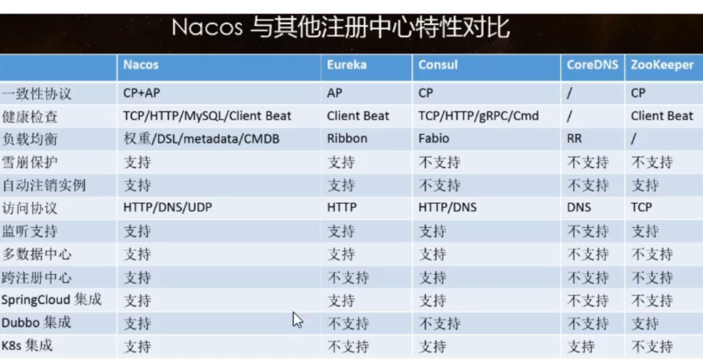
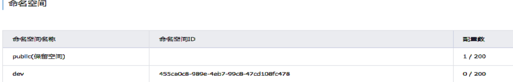
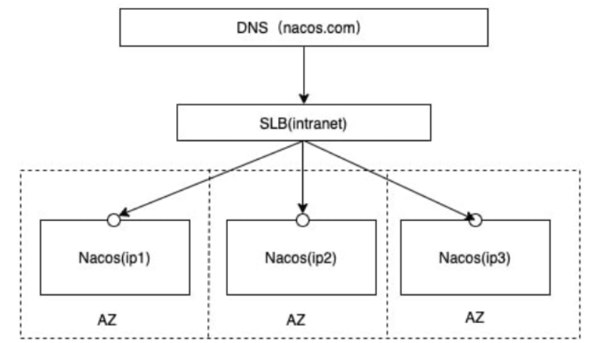

# Nacos

​		Nacos是服务注册中心与服务配置中心。

## 下载及安装

1. 下载 ：  https://github.com/alibaba/nacos/releases/ 下载后直接解压到指定文件夹   文件夹不能含有数字、中文

2. 启动：   执行 start.cmd 启动

   ```bash
   startup.cmd -m standalone    ##单机模式启动  单机模式支持mysql 数据库
   ```

3. 验证：  访问http://localhost:8848/nacos/#/login    用户名密码都是nacos

## 服务注册中心

### 特点

Nacos 支持CP+AP两种模型 ，默认AP，可以切换为CP

- 切换为CP方式，发送put请求给nacos

```bash
curl -X PUT '$NACOS_SERVER:8848/nacos/v1/ns/operator/switches?entry=serverMode&value=CP'
```



### 微服务整合Nacos注册中心

1. 微服务添加nacos服务发现相关依赖
	
   ```xml
   <!--  引入nacos 服务发现-->
        <dependency>
            <groupId>com.alibaba.cloud</groupId>
            <artifactId>spring-cloud-starter-alibaba-nacos-discovery</artifactId>
        </dependency>
   ```
   
2. 微服务yaml配置添加nacos相关地址

   ```yaml
   server:
     port: 6001
   spring:
     application:
    	name: alibaba-cloud-payment
     cloud:
        nacos:
          discovery:
            server-addr: localhost:8848
            namespace: 455ca0c8-989e-4eb7-99c8-47cd108fc478   #添加后可以指定对应的名称空间
   management:
     endpoints:
        web:
          exposure:
            include: "*"    #Spring boot actuator端点暴露-->用于nacos 监控节点状态
   ```

3. 配置类或者主启动类添加注解 @EnableDiscoveryClient，开启服务注册发现功能

4. 配置类给 RestTemplate 实例添加 @LoadBalanced 注解，开启 @LoadBalanced 与 Ribbon 的集成

    ```java
    @LoadBalanced
    @Bean
    public RestTemplate restTemplate() {
        return new RestTemplate();
    }
    ```

## 服务配置中心

### 微服务整合Nacos配置中心

1. 微服务添加nacos服务配置相关依赖
	
   ```xml
   <!--  引入nacos 服务配置-->
   <dependency>
       <groupId>com.alibaba.cloud</groupId>
       <artifactId>spring-cloud-starter-alibaba-nacos-config</artifactId>
   </dependency>
   ```
   
2. bootstrap.yaml配置文件添加nacos相关配置

   ```yaml
   server:
     port: 6002
   spring:
     application:
       name: alibaba-cloud-payment
     cloud:
       nacos:
         discovery:
           server-addr: localhost:8848
           namespace: 455ca0c8-989e-4eb7-99c8-47cd108fc478
         config:
           server-addr: localhost:8848
           file-extension: yaml
           namespace: 455ca0c8-989e-4eb7-99c8-47cd108fc478
           group:  test
   management:
     endpoints:
       web:
         exposure:
           include: "*"
   ```

3. Nacos前台页面，新增配置

   DataId 组成：在 Nacos Spring Cloud 中，dataId 的完整格式如下：

   ${prefix}-${spring.profiles.active}.${file-extension}   例如 alibaba-cloud-payment-dev.yaml 

   - prefix 默认为 spring.application.name 的值，也可以通过配置项 spring.cloud.nacos.config.prefix来配置。
   - spring.profiles.active 即为当前环境对应的 profile，详情可以参考 Spring Boot文档。 注意：当 spring.profiles.active 为空时，对应的连接符 - 也将不存在，dataId 的拼接格式变成 ${prefix}.${file-extension}
   - file-exetension 为配置内容的数据格式，可以通过配置项 spring.cloud.nacos.config.file-extension 来配置。目前只支持 properties 和 yaml 类型。

   

4. 类中通过 添加@RefreshScope 注解实现配置自动更新

   ```java
   @RestController
   @RefreshScope
   public class PaymentController {
        @Value("${config.paymentValue}")
        private String paymentValue;
   
        @GetMapping(value = "/echo/{string}")
        public String echo(@PathVariable String string) {
            return " Payment 6002 Hello Nacos Discovery " +paymentValue+ string;
        }
   }
   ```

### 命名分组

#### 命名空间-NameSpace

1. namaespace主要用于区分测试环境 比如开发/测试/生产，实现环境隔离

2. 管理界面配置

   

3. 微服务引用配置修改bootstarp.yaml  添加到对应的namespace (默认是public)

   ```yaml
   spring:
     application:
       name: alibaba-cloud-payment
     cloud:
       nacos:
         discovery:
           server-addr: localhost:8848
           namespace: 455ca0c8-989e-4eb7-99c8-47cd108fc478
         config:
           server-addr: localhost:8848
           file-extension: yaml
           namespace: 455ca0c8-989e-4eb7-99c8-47cd108fc478
   ```

#### 分组空间-Group

​		分组是为了把不同的微服务划分到一个服务组里。example：	配置引用dev 名称空间下的test分组

```yaml
spring:
  application:
    name: alibaba-cloud-payment
  cloud:
    nacos:
      discovery:
        server-addr: localhost:8848
        namespace: 455ca0c8-989e-4eb7-99c8-47cd108fc478
      config:
        server-addr: localhost:8848
        file-extension: yaml
        namespace: 455ca0c8-989e-4eb7-99c8-47cd108fc478
        group:  test
```

#### DataId：

​	格式： ${prefix}-${spring.profiles.active}.${file-extension}

1. prefix 默认为 spring.application.name 的值，也可以通过配置项 spring.cloud.nacos.config.prefix来配置。
2. spring.profiles.active 即为当前环境对应的 profile，详情可以参考 Spring Boot文档。 注意：当 spring.profiles.active 为空时，对应的连接符 - 也将不存在，dataId 的拼接格式变成 ${prefix}.${file-extension}
3. file-exetension 为配置内容的数据格式，可以通过配置项 spring.cloud.nacos.config.file-extension 来配置。目前只支持 properties 和 yaml 类型。

## 持久化到mysql

1. Nacos保存配置信息在自己携带的derby 数据库中

2. 切换nacos的数据库为mysql数据库（单机模式支持）

  1. 创建nacos_config  database 导入nacos-mysql.sql 创建nacos相关的表

  2. 修改nacos 的配置文件application.properties

    ```properties
    # 修改为mysql 数据库保存nacos配置信息
    spring.datasource.platform=mysql   #指定mysql数据库
    #mysql数据库信息
    db.num=1
    db.url.0=jdbc:mysql://localhost:3306/nacos_config?serverTimezone=GMT%2B8&useUnicode=true&characterEncoding=utf-8
    db.user=root
    db.password=root  
    ```

  3. 以单机模式启动 nacos 

     ```bash
     ##windows		
     startup.cmd -m standalone
     ##linux		
     startup.sh -m standalone
     ```

## 集群部署

### 说明

​		官网说明：    https://nacos.io/zh-cn/docs/cluster-mode-quick-start.html



64 bit OS Linux/Unix/Mac，推荐使用Linux系统。
64 bit JDK 1.8+；下载.配置。
Maven 3.2.x+；下载.配置。
3个或3个以上Nacos节点才能构成集群。
解读：

1. 搭建nacos 高可用集群 ，多个nacos 节点
2. 简单一些： nacos 多个节点暴露给nginx ，形成一个代理ip  暴露给微服务
3. 复杂一点 ： nacos 多个节点暴露给nginx 集群，nginx 集群 映射到DNS 上  ， 域名映射多个代理IP
4. nacos持久化: 使用mysql 高可用集群 作为nacos 的数据源 不是自带的derby

### 部署（nginx(ha)+mysql(ha)+nacos）

1. 下载nacos解压到指定目录

2. 配置集群配置文件

   在nacos的解压目录nacos/的conf目录下，有配置文件cluster.conf，请每行配置成ip:port。（请配置3个或3个以上节点）

   ```tex
   # ip:port
   192.168.121.131:8848
   192.168.121.132:8848
   192.168.121.133:8848
   ```

3. 配置数据源，修改application.properties： 使用mysql数据源、mysql最好是主备或者集群模式

   ```properties
   spring.datasource.platform=mysql
   db.num=1
   db.url.0=jdbc:mysql://192.168.121.131:3306/nacos_config?serverTimezone=GMT%2B8&useUnicode=true&characterEncoding=utf-8
   db.user=root
   db.password=root
   ```

4. nacos 配置mysql的jdbc

   1. nacos 目录下 创建目录 plugins/mysql
   2. 下载jdbc到mysql 目录下
      wget https://repo1.maven.org/maven2/mysql/mysql-connector-java/8.0.20/mysql-connector-java-8.0.20.jar

5. 启动： 3个节点分别启动nacos

   ```bash
   sh  startup.sh     ## 默认集群模式启动
   ```

6. 配置Nginx 高可用

   2个nginx 节点 192.168.121.131   192.168.121.132  修改配置文件nginx.conf  添加负载均衡策略

   ```tex
   upstream nacosserver{
   	server	192.168.121.131:8848;
   	server	192.168.121.132:8848;
   	server	192.168.121.133:8848;
   }
   server {
        listen       8849;
        server_name  nacoslistener;
        location / {
   		proxy_pass	http://nacosserver;
            root   html;
            index  index.html index.htm;
        }
    }	
   ```

7. 启动nginx节点，分别启动两个Nginx节点

   192.168.121.131   && 192.168.121.132的 keepalived服务实现nginx 的高可用

   ```bash
   systemctl start keepalived.service
   ```

8. 测试

   1. 访问 http://192.168.121.140:8849/nacos/#/login  正常  配置完成

      - 192.168.121.140  是keepalived虚拟IP，实现nginx高可用
      - nginx 监听8849 端口，实现nacos反向代理

   2. 测试

      1. nacos 新增一条配置

      2. 查看mysql    192.168.121.131:3306/nacos_config  

         主库是否有记录  以及132 从库是否已经同步更新

