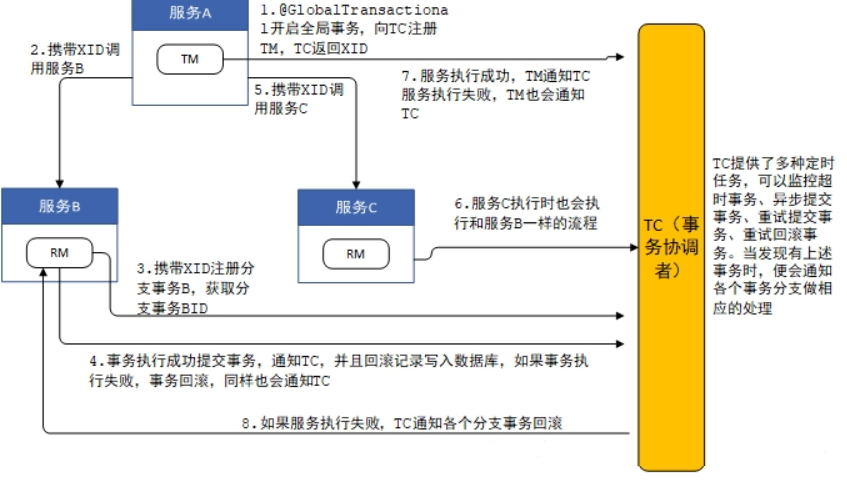
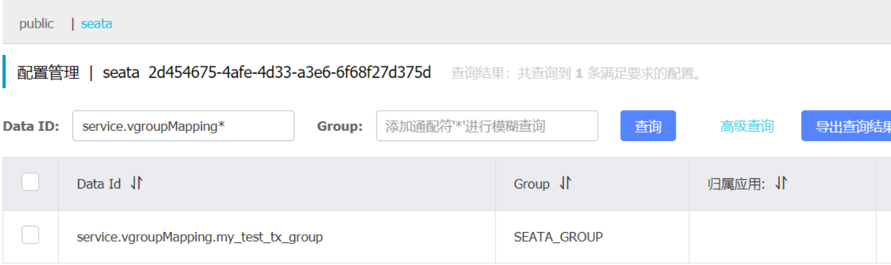

# Seata

​	Seata是一个分布式事务框架。

- 唯一的全局事务ID：XID
- 三个组件模型
  - TC事务协调者(transactionCoordinator)负责协调全局事务，维护全局事务的状态，驱动全局事务提交，回滚
  - TM事务管理者(transactionManager)负责管理事务，定义全局事务的范围。事务开启、提交、回滚的发起者
  - RM资源管理者(resourcemanager)负责分支事务处理的资源，与TC交互，负责分支事务的提交、回滚

## 工作流程



1. 服务A启动时，GlobalTransactionScanner会对有@GlobalTransaction注解的方法进行AOP增强，并生成代理，增强的代码位于GlobalTransactionalInterceptor类中，当调用@GlobalTransaction注解的方法时，增强代码首先向TC注册全局事务，表示全局事务的开始，同时TC生成XID，并返回给TM；
2. 服务A中调用服务B时，将XID传递给服务BRM；
3. 服务BRM得到XID后，访问TC，注册分支事务，并从TC获得分支事务ID，TC根据XID将分支事务与全局事务关联；
4. 接下来服务B开始执行SQL语句，在执行前将表中对应的数据保存一份，执行后在保存一份，将这两份记录作为回滚记录写入到数据库中，如果执行过程中没有异常，服务B最后将事务提交，并通知TC分支事务成功，服务B也会清除本地事务数据；
5. 服务A访问完服务B后，访问服务C；
6. 服务C与TC之间的交互与服务B完全一致；
7. 服务B和服务C都成功后，服务A通过TM通知TC全局事务成功，如果失败了，服务A也会通知TC全局事务失败；
8. TC记录了全局事务下的每个分支事务，TC收到全局事务的结果后，如果结果成功，则通知RM成功，RM收到通知后清理之前在数据库中保存的回滚记录，如果失败了，则RM要查询出之前在数据库保存的回滚记录，对之前的SQL操作进行回滚。

## seata集成nacos

nacos seata 安装在没有空格、没有中文的目录下

1. nacos 修改 application.properties 配置mysql数据源，持久化到mysql


2. seata 修改file.conf  修改mode=db 改为数据库,完善数据库连接信息

   ```tex
   ## transaction log store, only used in seata-server
   store {
         ## store mode: file、db、redis
         ## step1 修改mode=db 改为数据库
         mode = "db"
         ## rsa decryption public key
         publicKey = ""
         ## database store property
         ## step2 修改数据库连接信息,mysql8记得改driverClassName，注意lib/mysql下是否有mysql8的jar包
         db {
           ## the implement of javax.sql.DataSource, such as DruidDataSource(druid)/BasicDataSource(dbcp)/HikariDataSource(hikari) etc.
           datasource = "druid"
           ## mysql/oracle/postgresql/h2/oceanbase etc.
           dbType = "mysql"
           driverClassName = "com.mysql.cj.jdbc.Driver"
           ## if using mysql to store the data, recommend add rewriteBatchedStatements=true in jdbc connection param
           url = "jdbc:mysql://localhost:3306/seata?serverTimezone=GMT%2B8&useUnicode=true&characterEncoding=utf-8"
           user = "seata"
           password = "seata"
           minConn = 5
           maxConn = 100
           globalTable = "global_table"
           branchTable = "branch_table"
           lockTable = "lock_table"
           queryLimit = 100
           maxWait = 5000
         }
   }
   ```

3. seata 修改registry.conf 配置如下：

  *修改 registry.type 注册类型为nacos ，配置类型 config.type为nacos，完善配置信息*
  *application 服务名， serverAddr  nacos地址  ,  group nacos所在分组  、namespace 提前在nacos建立的空间，可以不用*
  *username password nacos登陆的用户名密码在nacos开启了权限校验后使用，默认不开启，不开启不写也可以*

  ```tex
  registry {
    # file 、 nacos 、eureka、redis、zk、consul、etcd3、sofa
    type = "nacos"
    nacos {
  	    
      application = "seata-server"
      serverAddr = "127.0.0.1:8848"
      group = "SEATA_GROUP"
      namespace = "2d454675-4afe-4d33-a3e6-6f68f27d375d"
      cluster = "default"
      #username = "nacos"
      #password = "nacos"
    }
  }
  config {
    # file、nacos 、apollo、zk、consul、etcd3
    type = "nacos"
    nacos {
      serverAddr = "127.0.0.1:8848"
      namespace = "2d454675-4afe-4d33-a3e6-6f68f27d375d"
      group = "SEATA_GROUP"
      username = ""
      password = ""
      dataId = "seataServer.properties"
    }
  }
  ```

4. seata配置进nacos

   1. 下载seata 的源码包  解压 在目录 seata-1.4.2\seata-1.4.2\script\config-center\nacos 找nacos-config.sh，在 seata-1.4.2\seata-1.4.2\script\config-center\下找 config.txt

   2. 将nacos-config.sh文件拷贝到seataserver 的conf文件夹内；将 config.txt文件 ，拷贝到 与conf 文件夹同级

   3.  修改config.txt   修改成自己的数据库信息

      ```tex
      store.db.datasource=druid
      store.db.dbType=mysql
      store.db.driverClassName=com.mysql.cj.jdbc.Driver
      store.db.url=jdbc:mysql://localhost:3306/seata?serverTimezone=GMT%2B8&useUnicode=true&characterEncoding=utf-8
      store.db.user=seata
      store.db.password=seata
      ```

   4. 执行

      ```sh
      sh nacos-config.sh -h localhost -p 8848 -g SEATA_GROUP -t 2d454675-4afe-4d33-a3e6-6f68f27d375d -u nacos -w nacos
      ```

      命令解析：-h -p 指定nacos的端口地址；-g 指定配置的分组; -t 指定命名空间id； -u -w指定nacos的用户名和密码，同样，这里开启了nacos注册和配置认证的才需要指定。

   5. 微服务添加依赖

      ```xml
      <!--   引入nacos 服务发现-->
      <dependency>
       <groupId>com.alibaba.cloud</groupId>
       <artifactId>spring-cloud-starter-alibaba-nacos-discovery</artifactId>
      </dependency>
      <!--  引入seata 分布式事务处理-->
      <dependency>
       <groupId>com.alibaba.cloud</groupId>
       <artifactId>spring-cloud-starter-alibaba-seata</artifactId>
       <exclusions>
           <exclusion>
               <groupId>io.seata</groupId>
               <artifactId>seata-spring-boot-starter</artifactId>
           </exclusion>
       </exclusions>
      </dependency>
      <dependency>
       <groupId>io.seata</groupId>
       <artifactId>seata-spring-boot-starter</artifactId>
       <version>1.4.0</version>
      </dependency>
      ```

   6. 微服务yaml配置文件添加相关配置

      ```yaml
      server:
        port: 2003
      spring:
        application:
          name: cloud-alibaba-seata-account
        cloud:
          nacos:
            discovery:
              server-addr: localhost:8848
              namespace: 2d454675-4afe-4d33-a3e6-6f68f27d375d
              group: SEATA_GROUP
      #      config:
      #        server-addr: localhost:8848
      #        file-extension: yaml
        datasource:
          #数据源连接配置
          url: jdbc:mysql://localhost:3306/seata_account?serverTimezone=GMT%2B8&useUnicode=true&characterEncoding=utf-8
          username: root
          password: root
          driver-class-name: com.mysql.cj.jdbc.Driver
        devtools:
          restart:
            poll-interval: 3000ms
            quiet-period: 2999ms
      mybatis-plus:
        configuration:
          map-underscore-to-camel-case: true  #默认就是true 开启驼峰命名
      seata:
        enabled: true
        enable-auto-data-source-proxy: true
        tx-service-group: my_test_tx_group
        registry:
          type: nacos
          nacos:
            application: seata-server
            server-addr: 127.0.0.1:8848
            username: nacos
            password: nacos
            namespace: 2d454675-4afe-4d33-a3e6-6f68f27d375d
        config:
          type: nacos
          nacos:
            server-addr: 127.0.0.1:8848
            group: SEATA_GROUP
            username: nacos
            password: nacos
            namespace: 2d454675-4afe-4d33-a3e6-6f68f27d375d
        service:
          vgroup-mapping:
            my_test_tx_group: default
          disable-global-transaction: false
        client:
          rm:
            report-success-enable: false
      ```

## 采坑

1. seata 与durid 集成 出现问题
	待解决
	
2. seata 在mybatis 入参为bigdecimal 类型出了点小问题
	待解决

3. yaml配置中 

  1. service.vgroup-mapping必须一致  ，客户端和 server 的也必须一致

  2. seata 注册到nacos  若有名称空间，必须添加名称空间，服务端与client 必须一致

  3. 

  4. ```yaml
    seata:
      enabled: true
      enable-auto-data-source-proxy: true
      tx-service-group: my_test_tx_group
      registry:
        type: nacos
        nacos:
          application: seata-server
          server-addr: 127.0.0.1:8848
          username: nacos
          password: nacos
          namespace: 2d454675-4afe-4d33-a3e6-6f68f27d375d
      config:
        type: nacos
        nacos:
          server-addr: 127.0.0.1:8848
          group: SEATA_GROUP
          username: nacos
          password: nacos
          namespace: 2d454675-4afe-4d33-a3e6-6f68f27d375d
      service:
        vgroup-mapping:
          my_test_tx_group: default
        disable-global-transaction: false
      client:
        rm:
          report-success-enable: false
    ```


