# Sentinel

## 参考

- 官方文档https://github.com/alibaba/Sentinel/wiki/%E4%BB%8B%E7%BB%8D
- 下载地址https://search.maven.org/search?q=g:com.alibaba.csp%20AND%20a:sentinel-core

## 簇点链路

对请求资源的展示，可以直接配置其他内容

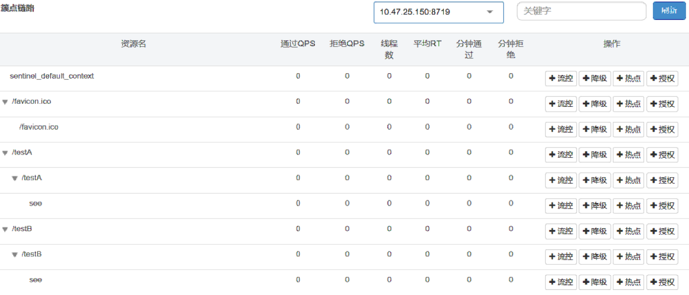

## 流控规则

### 阈值类型

- **QPS直接失败**，对/testA的请求QPS超过1就会失败报错

  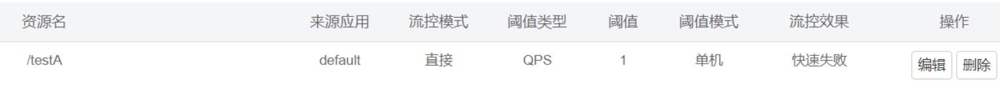

- **线程数直接失败**，对/testB的请求，线程数超过1就会失败报错

  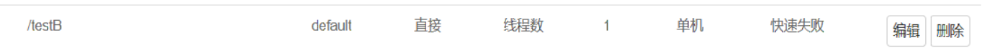

- 区别：若/testB未处理完成线程未关闭，下一个请求过来，会启动第2个线程，线程数超过1就会失败，和qps有区别。qps针对与请求，请求数超过限制，请求就进不去，线程数针对线程，请求进去开启线程时对线程数的校验

### 流控模式

- 直接模式：就是指配置的

- 关联模式：

  - 对/testA资源添加流控关联/testB。此时若/testB的QPS超过1，就会限流/testA，不限流/testB
    	例如：购物高峰期下单请求/testB超过一定的QPS，对用户信息修改限流/testA（下单还是能下，改名不行）
  - 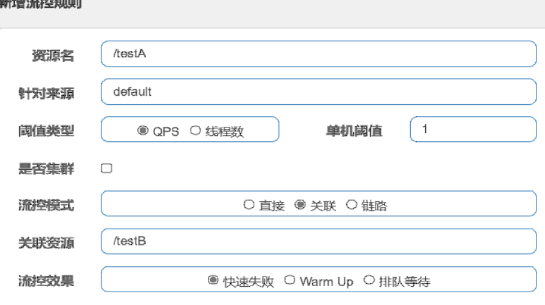

- 链路模式

  - 链路针对于sentinel资源

    - 若controller的testA方法、testB方法都调用service的see方法，而see方法是sentinel资源，对see方法进行限流，链路入口资源为/testB。那么/testB调see方法qps超过1就会被限流，testB方法报错。/testA方法不会被限流。

    - ```java
      @SentinelResource("see")
      publicStringsee(){}
      ```

  - 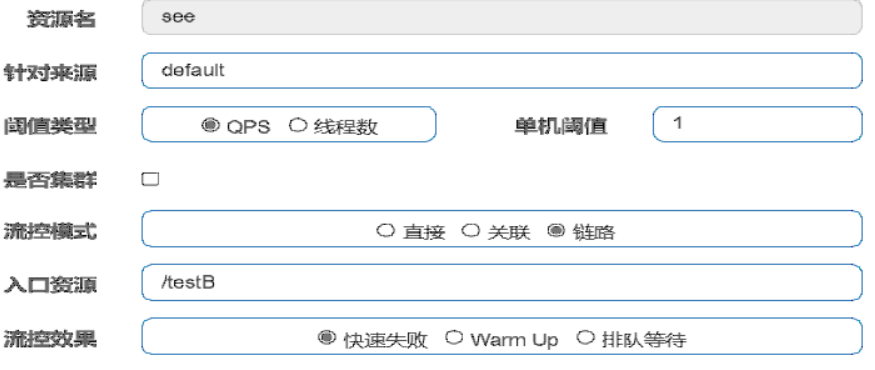

### 流控效果

流控效果仅QPS阈值类型时有效，线程数时无效。

- 快速失败
  - 直接失败，抛出异常
- warmup
  - 设定阈值为30，冷加载因子默认是3，预热时长是10
  - 那么开始的阈值是30/3，经过预热时长10s，最后到达设定阈值30
  - 使用30的QPS去请求，一开始会报错，经过10s后就不会在报错了。适用于预防突然间的高并发访问，给系统一个缓冲时间
  - 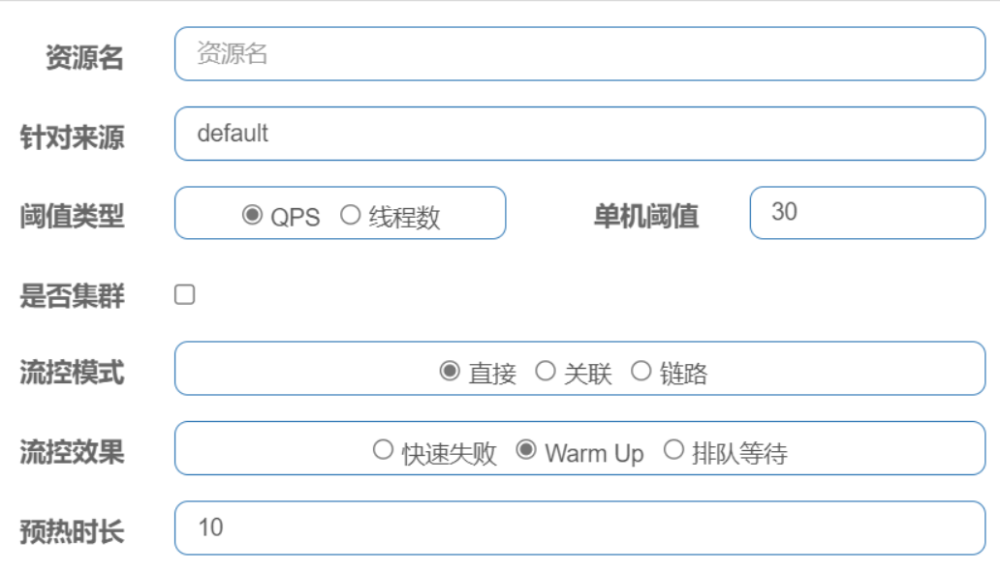
- 排队等待
  - 排队等待适用于接收mq的消息，间隔性的高并发访问
  - 请求过来之后，让请求匀速的进入后台进行处理。采用漏斗算法，控制流量。设置超时时间，超时的则将请求抛弃，返回错误信息
  - 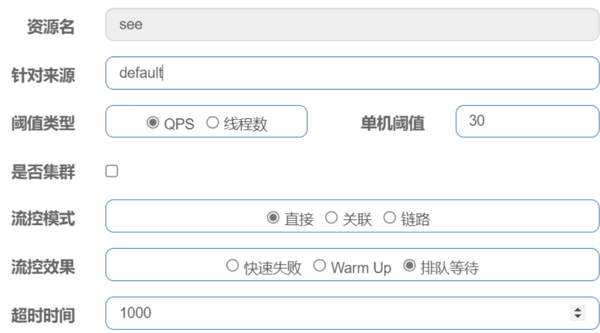

## 服务降级

### 慢调用比例

- 熔断（OPEN）：请求数大于最小请求数并且慢调用的比率大于比例阈值则发生熔断，熔断时长为用户自定义设置。
- 探测（HALFOPEN）：当熔断过了定义的熔断时长，状态由熔断（OPEN）变为探测（HALFOPEN）。
- 关闭（CLOSED）：如果接下来的一个请求小于最大RT，说明慢调用已经恢复，结束熔断，状态由探测（HALF_OPEN）变更为关闭（CLOSED）
- 熔断（OPEN）：如果接下来的一个请求大于最大RT，说明慢调用未恢复，继续熔断，熔断时长保持一致

案例配置如下：对/testB进行降级

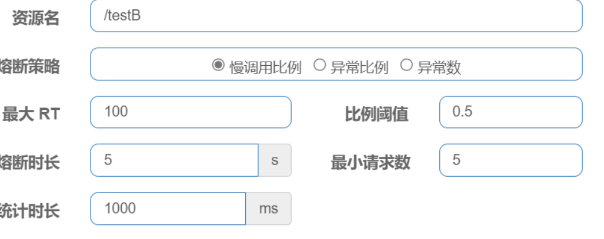

**执行逻辑**

1. **在统计时长1000ms内，资源/testB的请求数>=最小请求数5，响应时间超过最大RT100ms的请求占比例阈值0.5（50%）之后，资源进入熔断**。
2. 经过熔断时长5s后进入探测状态
3. 5s后的一个请求，响应时间请求小于最大RT，关闭熔断；5s后的第一个请求大于最大RT，继续熔断5s

### 异常比例

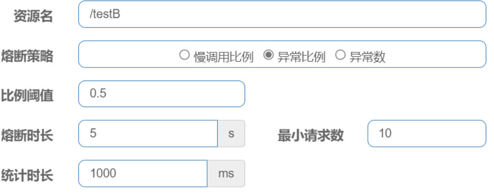

**统计时长1000ms内，/testB请求数大于10，出现异常的比例大于50%，触发熔断，熔断时间为5s**

比如20个请求11个异常了，5s之内都会被限制

### 异常数

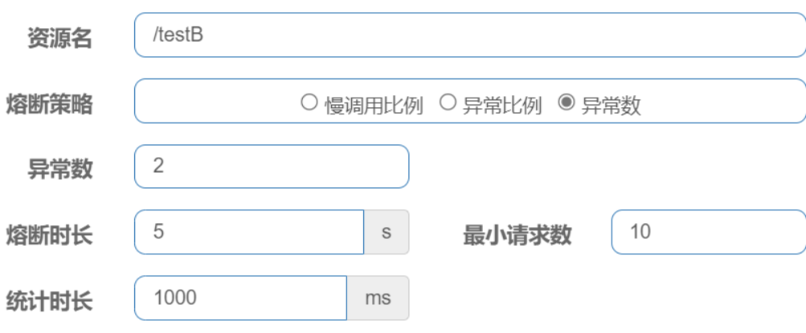

**统计时长1000ms内，/testB请求数大于10，出现异常个数大于2，触发熔断，熔断时间为5s**

比如20个请求3个异常了就熔断，5s之内都会被限制

## 热点key

对请求的第一个参数p1(参数索引为0)进行热点限流，QPS大于单机阈值1时失败，若没有参数P1则不限流

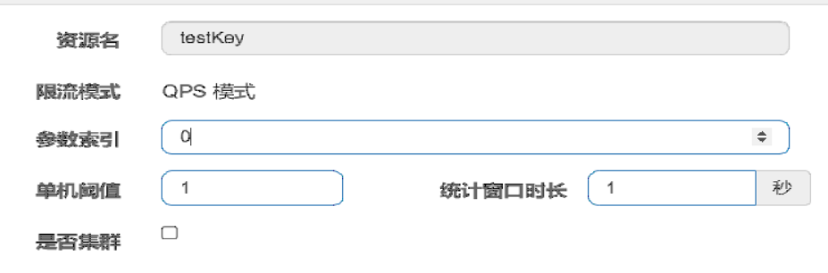


```java
@GetMapping("/testKey")
@SentinelResource(value = "testKey",blockHandler = "fallback_testHotKey")
public String testHotKey(@RequestParam(value = "p1",required = false) String param1, @RequestParam(value = "p2",required = false) String param2){
    return "param1: "+param1+"param2 : "+param2+"   success";
}

/**
 * 服务降级方法
 */
public String fallback_testHotKey(String param1, String param2, BlockException exception){
    return "fail " +exception.getMessage();
}
```

```tex
http://localhost:8401//testKey?p1=aaa           QPS>1       会被限流
http://localhost:8401//testKey?p1=aaa&p2=bbb    QPS>1会被限流
http://localhost:8401//testKey?p2=bbb           不会被限流
```


参数例外项，限流的参数为特定的值时，限流阈值自定义。

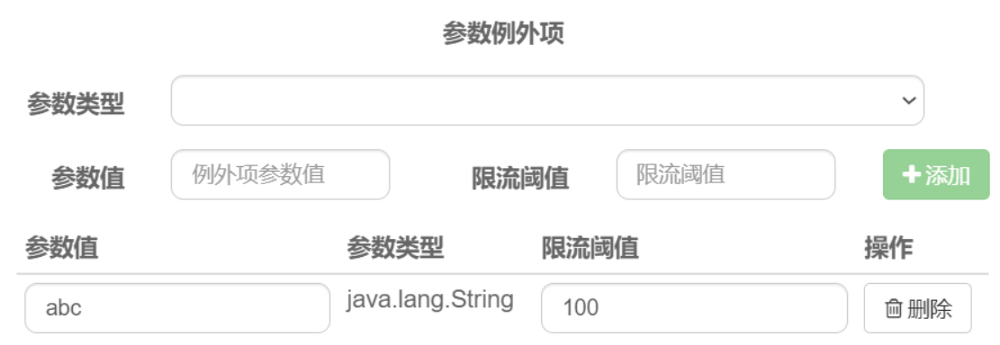

```tex
http://localhost:8401//testKey?p1=abc1<QPS<100不会被限流
http://localhost:8401//testKey?p1=abc&p2=bbb1<QPS<100不会被限流
http://localhost:8401//testKey?p2=bbb不会被限流
```

## 系统规则

系统保护规则是从应用级别的入口流量进行控制，从单台机器的 load、CPU 使用率、平均 RT、入口 QPS 和并发线程数等几个维度监控应用指标，让系统尽可能跑在最大吞吐量的同时保证系统整体的稳定性。

系统保护规则是应用整体维度的，而不是资源维度的，并且仅对入口流量生效。入口流量指的是进入应用的流量（EntryType.IN），比如 Web 服务或 Dubbo 服务端接收的请求，都属于入口流量。

系统规则支持以下的模式：

- Load 自适应（仅对 Linux/Unix-like 机器生效）：
  - 系统的 load1 作为启发指标，进行自适应系统保护。当系统 load1 超过设定的启发值，且系统当前的并发线程数超过估算的系统容量时才会触发系统保护（BBR 阶段）。系统容量由系统的 maxQps * minRt 估算得出。设定参考值一般是 CPU cores * 2.5。
- CPU usage（1.5.0+ 版本）：
  - 当系统 CPU 使用率超过阈值即触发系统保护（取值范围 0.0-1.0），比较灵敏。
- 平均 RT：
  - 当单台机器上所有入口流量的平均 RT 达到阈值即触发系统保护，单位是毫秒。
- 并发线程数：
  - 当单台机器上所有入口流量的并发线程数达到阈值即触发系统保护。
- 入口 QPS：
  - 当单台机器上所有入口流量的 QPS 达到阈值即触发系统保护。

## SentinelResource

@SentinelResource 用于定义资源，并提供可选的异常处理和 fallback 配置项，注解方式埋点不支持 private 方法。

@SentinelResource 注解包含以下属性：

- **value**：资源名称，必需项（不能为空）
- **entryType**： entry 类型，可选项（默认为 EntryType.OUT）
- **blockHandler**  && **blockHandlerClass**: 
  - blockHandler 对应处理 BlockException 的函数名称，可选项。
  - blockHandler函数访问范围需要是 public，返回类型需要与原方法相匹配，参数类型需要和原方法相匹配并且最后加一个额外的参数，类型为 BlockException。
  - blockHandler 函数默认需要和原方法在同一个类中。若希望使用其他类的函数，则可以指定 blockHandlerClass 为对应的类的 Class 对象，注意对应的函数必需为 static 函数，否则无法解析。
- **fallback** && **fallbackClass**
  - fallback 函数名称，可选项。用于在抛出异常的时候提供 fallback 处理逻辑。
  - fallback 函数可以针对所有类型的异常（除了 exceptionsToIgnore 里面排除掉的异常类型）进行处理。
  - fallback 函数签名和位置要求：
    - 返回值类型必须与原函数返回值类型一致；
    - 方法参数列表需要和原函数一致，或者可以额外多一个 Throwable 类型的参数用于接收对应的异常。
    - fallback 函数默认需要和原方法在同一个类中。若希望使用其他类的函数，则可以指定 fallbackClass 为对应的类的 Class 对象，注意对应的函数必需为 static 函数，否则无法解析。
  - 1.6.0 之前的版本，fallback 函数只针对降级异常（DegradeException）进行处理，不能针对业务异常进行处理。
- **defaultFallback**（since 1.6.0）：
  - 默认的 fallback 函数名称，可选项。通常用于通用的 fallback 逻辑（即可以用于很多服务或方法）。
  - 默认的fallback 函数可以针对所有类型的异常（除了 exceptionsToIgnore 里面排除掉的异常类型）进行处理。
  - 若同时配置了 fallback 和 defaultFallback，则只有 fallback 会生效。
  - defaultFallback 函数签名要求：
    - 返回值类型必须与原函数返回值类型一致；
    - 方法参数列表需要为空，或者可以额外多一个 Throwable 类型的参数用于接收对应的异常。
    - defaultFallback 函数默认需要和原方法在同一个类中。若希望使用其他类的函数，则可以指定 fallbackClass 为对应的类的 Class 对象，注意对应的函数必需为 static 函数，否则无法解析。
  - 1.8.0 版本开始，defaultFallback 支持在类级别进行配置
- exceptionsToIgnore（since 1.6.0）：
  	用于指定哪些异常被排除掉，不会计入异常统计中，也不会进入 fallback 逻辑中，而是会原样抛出。
- 注意：
  - 若 blockHandler 和 fallback 都进行了配置，则被限流降级而抛出 BlockException 时只会进入 blockHandler 处理逻辑。
  - 若未配置 blockHandler、fallback 和 defaultFallback，则被限流降级时会将 BlockException 直接抛出（若方法本身未定义 throws BlockException 则会被 JVM 包装一层 UndeclaredThrowableException）。

### 设置限流方法blockHandler

​	blockHandler负责处理Sentinel前台页面配置，不满足页面配置的流控规则、降级规则、热点规则等，都会进入blockhandler指定的方法。

设置方式如下：

1. 使用同一个类的方法，default_blockHandler

   ```java
   @GetMapping("/testCCC")
   @SentinelResource(value = "ccc",blockHandler = "default_blockHandler")
   public String testA(){
       return "Test testCCC-------->";
   }
   public String default_blockHandler(BlockException blockException){
       return "fail ";
   }
   ```

2. 使用全局类的某个方法，全局处理类的方法必须是static

   ```java
   @GetMapping("/testDDD")
   @SentinelResource(value = "ddd",
           blockHandlerClass = GlobalBlockHandler.class,
           blockHandler = "blockHandler")
   public String testB(){
       return "Test testDDD-------->";
   }
   ```

3. 若不设置，则抛出错误信息Blocked By Sentinel(flow limiting)

### 设置降级方法fallback

fallback主要负责方法内部错误，所有的错误都会被捕获，然后到fallback指定的降级方法处理。可以设置忽略掉的某些异常，设置方式为

```java
 //exceptionsToIgnore  + 忽略异常 出现此异常，fallback 不做处理
 //忽略IllegalArgumentException类型的异常，不进行降级
exceptionsToIgnore = {IllegalArgumentException.class}    
```

若同时配置了限流的blockhandler 和 降级的fallback，出现异常会进入fallback方法，但是如果此资源被限流（比如qps过高 或者异常数 异常比例过高等）只会进行blockhandler 的方法。

## 持久化到Nacos

1. pom文件添加相关依赖

   ```xml
   <!-- 引入sentinel 持久化注入到nacos-->
   <dependency>
       <groupId>com.alibaba.csp</groupId>
       <artifactId>sentinel-datasource-nacos</artifactId>
   </dependency>
   ```

2. 修改yaml，添加Sentinel.datasource相关配置

   ```yaml
   spring:
     application:
    name: alibaba-cloud-sentinel-service-constumer
     cloud:
    nacos:
      discovery:
        server-addr: cloud:8849
      config:
        server-addr: cloud:8849
        file-extension: yaml
    sentinel:
      transport:
        dashboard: cloud:8080
        port: 8719
      filter:
        enabled: false
      datasource:            # sentinel 注入到 nacos中
        ds1:
          nacos:
            server-addr: cloud:8849
            dataId: alibaba-cloud-sentinel-service-constumer
            groupId: DEFAULT_GROUP
            data-type: json
            rule-type: flow
   ```

3. nacos 添加配置文件dataid 与 yaml配置的spring.sentinel.datasource.ds1.nacos.dataId一致

   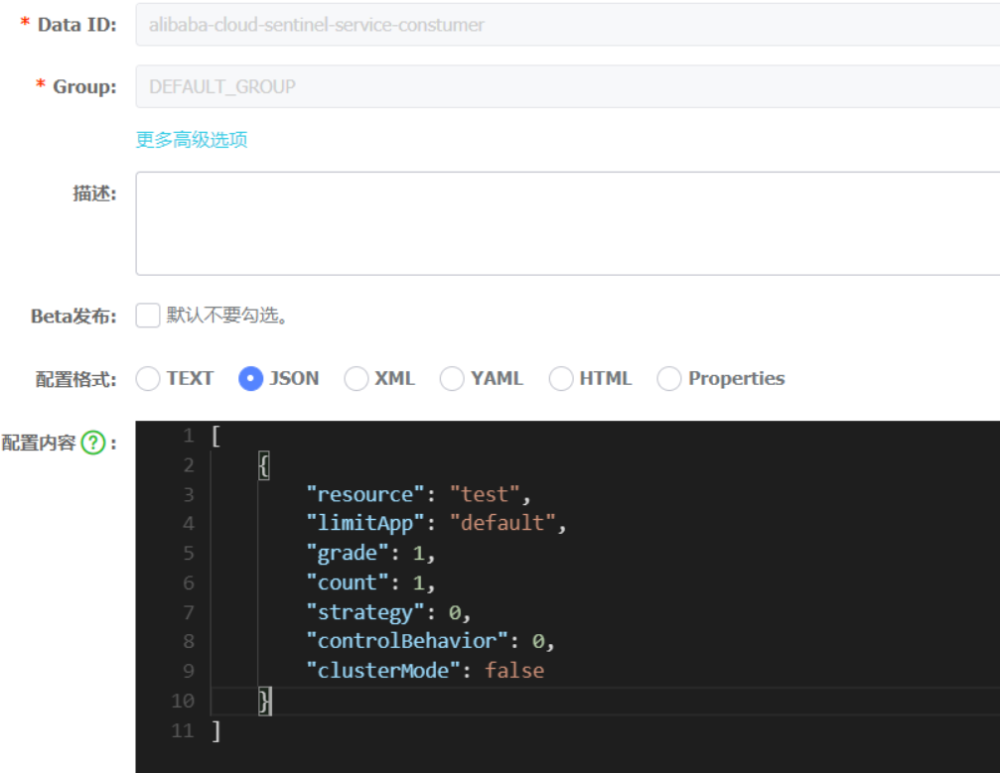