# 数据结构

## 分类

​		数据结构分为 线性结构和非线性结构

- 线性结构
  - 元素之间存在一对一的关系
  - 顺序存储结构(数组)，链式存储结构(链表)
    - 顺序存储结构内存地址是连续的，链式不一定(存放的是数据及相邻节点的地址信息)
  - 数组、队列、链表、栈
- 非线性结构
  - 二维数组、多维数组、广义表、树结构、图结构

# 线性结构

## 队列

- 队列是一个**有序列表**，可以用**数组**或是**链表**来实现。 
- 遵循**先入先出**的原则。即：FIFO先存入队列的数据，要先取出。

### 数组模拟队列

图示：

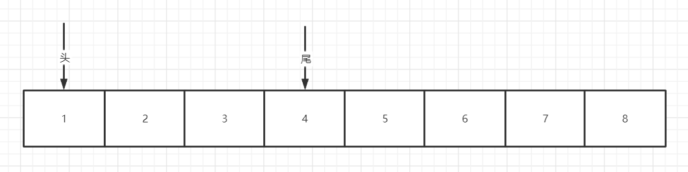

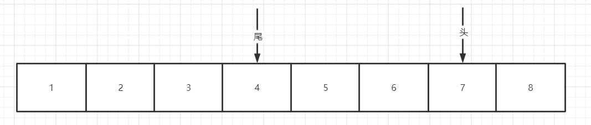

- **长度为N的数组只能保存N-1个数据**
  - 因为**头尾不能指向同一个数组下标**（队列初始化时除外），尾针对应的数组下标中数据为无效数据
  - 头尾指向通一个数组下标时,不能确定是空队列，还是 45678123 ，如下图

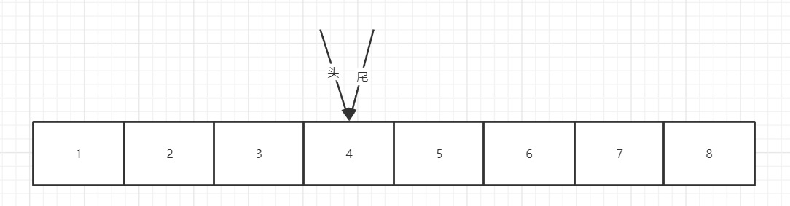


- 使用**对数组长度取模**，实现指针到数组下标尾处重新回到数组下标起始位置

代码设计实现：

```java
 /**
     * 环形数组模拟队列
     * 尾针和头针不能指向数组同一下标，保证环形数组有方向。尾针节点的数据为无效数据
     * 添加数据时，尾针处添加数据，同时尾针后移
     */
    static class ArrayQueue {
        private int maxSize; //队列容量
        private int front; // 队列头针
        private int rear;   //队列尾针
        private int[] data; //数组存放数据

        // 有参构造器
        public ArrayQueue(int size) {
            maxSize = size + 1;
            data = new int[maxSize];
            front = 0;
            rear = 0;
        }

        //判断队列是否满了
        public boolean isFull() {
            return (rear + 1) % maxSize == front;
        }

        //判断队列是否为空
        public boolean isEmpty() {
            return front == rear; //队列头指针 = 队列尾指针
        }

        //添加数据
        public void add(int value) {
            if (isFull()) {
                throw new RuntimeException("队列满了");
            }
            data[rear] = value;
            rear = (rear + 1) % maxSize;
        }

        //获取并移除队列头数据
        public int remove() {
            if (isEmpty()) {
                throw new RuntimeException("队列为空");
            }
            int temp = data[front];
            front = (front + 1) % maxSize;
            return temp;
        }

        //获取队列头数据
        public int element() {
            if (isEmpty()) {
                throw new RuntimeException("队列为空");
            }
            return data[front];
        }

        //获取队列长度
        public int size() {
//            if (front <= rear){
//                return rear-front;
//            }else{
//                return rear+maxSize-front;
//            }
            return (rear + maxSize - front) % maxSize;
        }

        //展示队列数据
        public void showQueue() {
            if (isEmpty()) {
                throw new RuntimeException("队列为空");
            }
            if (front < rear) {
                for (int i = front; i < rear; i++) {
                    System.out.print(data[i] + "\t");
                }
            } else {
                for (int i = front; i < maxSize; i++) {
                    System.out.print(data[i] + "\t");
                }
                for (int i = 0; i < rear; i++) {
                    System.out.print(data[i] + "\t");
                }
            }
        }

    }
```


## 链表

### 单链表

**示意图**

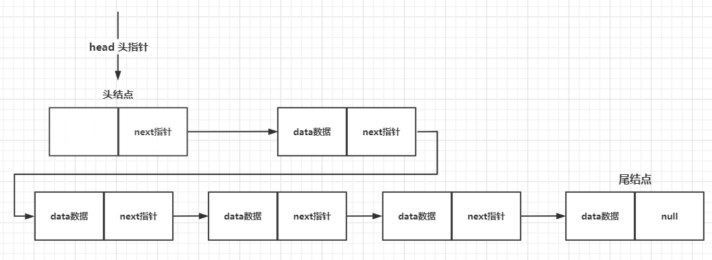

**特点**

- 链表以节点的形式来存储，是**链式存储**
- 单链表每个节点含有**data域和next域**
- 链表的节点在**内存中的分布不一定是连续**的

**代码设计**

[单链表demo]: https://github.com/chenpc1234/Note/blob/main/%E6%95%B0%E6%8D%AE%E7%BB%93%E6%9E%84/Code/src/main/java/struct/linkedList/SingleLinkedListDemo.java

**常见面试题**

1. 求单链表中有效节点的个数

   ```java
   public int length(){
       int length =0;
       Node temp = head;
       while(temp.next!=null){
           length++;
           temp=temp.next;
       }
       return length;
   }
   ```

2. 查找单链表中倒数第K个节点

   ```java
   public Node find(int num){
       int length =length();
       if(num > length){
           return null;
       }
       Node temp = head;
       while(temp.next!=null){
           if(length == num ){
   			return temp;
           }
           length--;
           temp=temp.next;
       }
   }
   ```

3. 反转单链表

   ```tex
   1. 定义一个新的头结点
   2. 遍历链表，依次取出当前节点，将当前节点插入新头结点之后
   	2.1 当前节点的尾指针=新头结点的尾指针（当前节点的指针指向了新头结点尾指针指向的节点） temp.next=newHead.next
   	2.2 头节点的尾指针指向当前节点  newHead.next=temp
   	2.3 链表节点后推 
   3.将老头结点的尾指针指向新节点的尾指针 head.next=newHead.next
   ```

4. 逆序打印单链表

   ```tex
   1.不破原有的链表结构
   2.使用Stack栈的先进后出原则。遍历链表依次推送至栈中
   3.打印栈中信息
   ```

5. 合并两个有序的单链表

   ```tex
   1. 定义一个新的链表
   2. 定义两个临时节点遍历temp1 temp2 分别用来遍历两个链表
   3. 循环处理
   	3.1	若temp1节点为空（链表1遍历完成），则直接将temp2节点插入新链表，temp2有next指针，即链表2未遍历的全部插入新链表
   	3.2 若temp2节点为空（链表1遍历完成），则直接将temp1节点插入新链表，temp1有next指针，即链表2未遍历的全部插入新链表
   	3.3 若temp1节点序号比temp2小 则temp1加入新链表  temp1后移
       3.4 若temp2节点序号比temp1小 则temp2加入新链表  temp1后移
       3.5 注：3.3/3.4不能将temp1/temp2直接插入链表，因为有 next指针,可以使用新对象拷贝data域插入
   4. 新链表就是合并的链表
   ```

### 双向链表

**示意图**

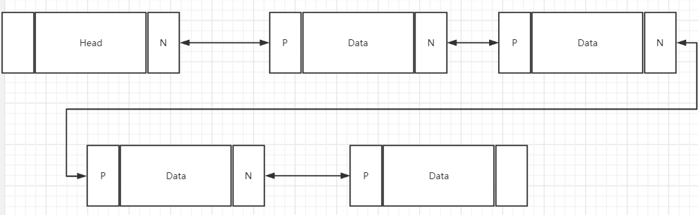

**特点**

- 双向链表每个节点含有data数据域和pre和next
  - pre指针指向前一个节点，next指针指向后一个节点
- 双向链表可以向前查找，也可以向后查找
- 单向链表不能自我删除，只能通过修改前一节点的next指向后一节点来完成
  - 单向链表删除时，需要修改 `node.pre.next` 和`node.next.pre`

**代码分析**

[双向链表]: https://github.com/chenpc1234/Note/blob/main/%E6%95%B0%E6%8D%AE%E7%BB%93%E6%9E%84/Code/src/main/java/struct/linkedList/DoubleLinkedListDemo.java

### 单向环形链表

**示意图**

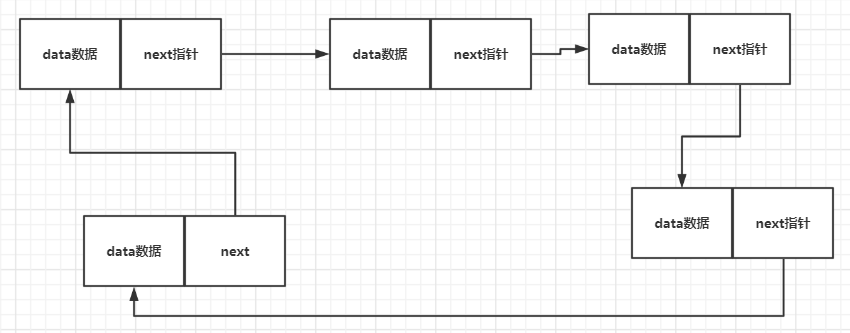

**特点**

- 特殊的单向链表，最后一个节点的next指向第一个节点

**约瑟夫问题**

N个人围成一圈，从第一个开始报数，第M个将被杀掉，最后剩下一个，其余人都将被杀掉。

例如N=6，M=5，被杀掉的顺序是：5，4，6，2，3。

```tex
1. 链表中仅一个节点时 first.next =first
2. 构建一个长度为N的单向循环链表,节点内数据一次+1
3. 遍历单向循环链表
	3.1.从first节点开始计数， 当node.data%M==0 时，说明此节点应该删除 
			即计数到(node.data+1)%M==0 说明下一个节点应该删除，node.next=node.next.next;
	3.2 当node.next =node时 说明只剩下了一个节点。
```

**代码示例**

[约瑟夫问题]: https://github.com/chenpc1234/Note/tree/main/%E6%95%B0%E6%8D%AE%E7%BB%93%E6%9E%84/Code/src/main/java/struct/linkedList/Josephus.java

## 栈

### **示意图**

**入栈**

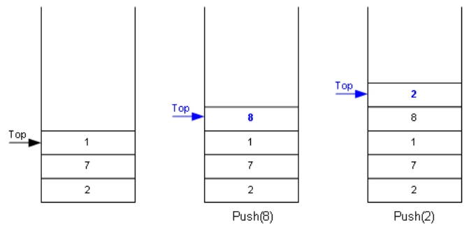

**出栈**

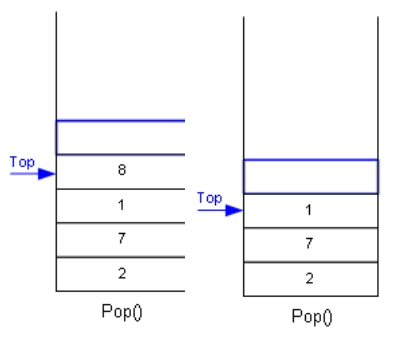

- 栈遵循FILO原则，先入后出
- 栈限制只能在一端进行插入或者删除操作，称为栈顶（Top） 另外一端称为栈底(Bottom)

### **数组模拟栈**

```tex
1. 数组创建时固定长度，因此创建栈的时候需要给一个长度即maxSize
2. 使用
        struct{
            int maxSize; //记录栈的最大保存记录
            int top = -1 ;	//记录指针，用来表示栈顶,初始化为-1
            Object[] data; //使用数组存储数据
        }
3. 	push ,添加元素时,top++并将元素保存到 data[top] 
	pop 弹出栈顶元素时，返回data[top]并 top--
	peek 查看栈顶元素时，返回data[top]
```

[数组模拟栈]: https://github.com/chenpc1234/Note/blob/main/%E6%95%B0%E6%8D%AE%E7%BB%93%E6%9E%84/Code/src/main/java/struct/stack/ArrayStackDemo.java

### **队列模拟栈**

```tex
1. 使用带头和尾的双向队列模拟栈
2. 队列头尾不保存数据,初始化队列时  first.next =last; last.pre=first;
3. 插入,获取都可以使用last来进行
```

[队列模拟栈]: https://github.com/chenpc1234/Note/blob/main/%E6%95%B0%E6%8D%AE%E7%BB%93%E6%9E%84/Code/src/main/java/struct/stack/LinkedListStackDemo.java

### **栈实现简单计算器**

 ```java
1. 给定一个计算表达式 如：7+5*15+561/11-6
2. 定义一个计数器 i 
3. while循环处理.判读字符 charAt(i)是不是运算符
    3.1 若是运算符
    	3.1.1截取 0-i 则是数字,将数字加入数字栈
        3.1.2(运算符栈是空栈||符号的优先级大于栈顶符号的优先级)，当前运算符加入运算栈。
         若小于等于运算符栈顶的优先级，将数字栈顶两个数 使用符号栈顶符号进行运算（注意数字栈数的前后顺序）。将运算后的结果加入数			字栈，当前运算符加入符号栈
        3.1.3 截取字符串srt =str.substring(i+1, str.length())，重置计数器 i=0;
    3.2 若是数字符 i++ ,若i= str.length 则遍历完成
4. 遍历符号栈，将数字栈剩余的数字进行计算，数字栈最后的数字就是结果
 ```

[简单计算器]: https://github.com/chenpc1234/Note/blob/main/%E6%95%B0%E6%8D%AE%E7%BB%93%E6%9E%84/Code/src/main/java/struct/stack/Calculator.java

### **逆波兰计算器**

- **后缀表达式的计算**

  1. 从左至右扫描表达式，遇到数字时，将数字压入堆栈，遇到运算符时，弹出栈顶的两个数，用运算符对它们做相应的计算（次顶元素 和 栈顶元素），并将结果入栈；
  2. 重复上述过程直到表达式最右端，最后运算得出的值即为表达式的结果

- **中缀表达式转后缀表达式**

  1. 初始化两个栈：运算符栈s1和储存中间结果的栈s2；
  2. 从左至右扫描中缀表达式；
     1. 遇到操作数时，将其压s2；
     2. 遇到运算符时，比较其与s1栈顶运算符的优先级：
        1. 如果s1为空，或栈顶运算符为左括号“(”，或优先级比栈顶运算符的高，也将运算符压入s1；
        2. 否则 ，将s1栈顶的运算符弹出并压入到s2中；然后此继续与s1中新的栈顶运算符相比较；
     3. 遇到括号时：
        1. 如果是左括号“(”，则直接压入s1
        2. 如果是右括号“)”，则依次弹出s1栈顶的运算符，并压入s2，直到遇到左括号为止，此时将这一对括号丢弃
  3. 重复直到表达式的最右边, 
  4. 将s1中剩余的运算符依次弹出并压入s2
  5. 依次弹出s2中的元素并输出，结果的逆序即为中缀表达式对应的后缀表达式

- 代码示例

  [逆波兰计算器完整版]: https://github.com/chenpc1234/Note/blob/main/%E6%95%B0%E6%8D%AE%E7%BB%93%E6%9E%84/Code/src/main/java/struct/stack/ReversePolishCalcDemo.java

# 非线性结构

## 稀疏数组

**简介**

​		当一个数组中大部分元素为０，或者为同一个值的数组时，可以使用稀疏数组来保存该数组

稀疏数组的处理方法是: 

1.  记录数组**一共有几行几列，有多少个不同**的值 
2. 把具有不同值的元素的行列及值记录在一个小规模的数组中，从而**缩小程序**的规模

**实际应用**

棋盘：比如一个11*11的棋盘，第2行第3列有一个白棋，第3行第4列以及第5行第6列有一个黑棋

- 二维数组

  ```java
  int[][] chessArr = new int[11][11]; //使用11*11 数组模拟棋盘
  chessArr[1][2] = 1;   //记录下标  1表示白棋
  chessArr[2][3] = 2;
  chessArr1[4][5] = 2; //记录下标  2表示黑棋 
  ```

- 稀疏数组

  ```java
  int[][] sparseArr ={{11,11,3},
                      {1,2,1}
                      {2,3,2}
                      {4,5,2}
                     };
  //1. 不记录空白位置
  //2. 首行记录棋盘大小 长,宽，棋子数(白+黑)
  //3. 从前往后记录每个棋子的坐标
  ```


## 哈希表||散列表

- **问题：**
  ​		对于线性结构（链表）来讲，查找一个值需要去遍历，效率低。

- **方案：**
  - 使用哈希表，使用一个长度为N的数组，每个数组元素都是一个链表。
  - 插入时，通过散列函数(比如	id%n) 找到对应的链表，然后插入此链表
  - 查询时，通过散列函数(比如	id%n) 找到对应的链表，然后在此链表内查询

- **模型：**

  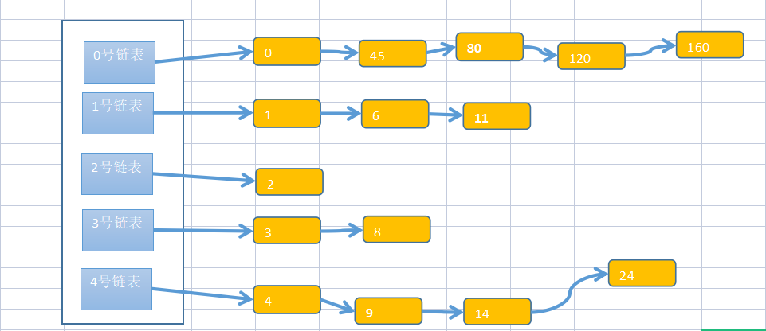

- **代码示例**

  ```java
  
  ```

  

# 算法

## 时间复杂度

### **概念**

#### 时间频度：

**一个算法中语句执行的次数。**

- 使用for循环从1加到n , 执行n+1次,T(n) =n+1  

- 使用 (1+n)/2 * n ,执行1次 ，T(n) =1 

- 若两层for循环  则 
  $$
  T(n) =n^2
  $$

- 时间频度表达式
  $$
  T(n)= aN^i+bN^j+ ...+ cN +d  // 当N趋近于无穷大时  T(n) 趋近于 aN^i
  $$

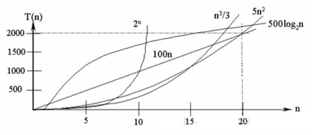

#### 时间复杂度：

如果有某个函数F(n)，使得 T(n)/F(n) 的极限值是一个常数，则称F(n)为T(n)的同量级函数，记作T(n) =O(F(n)）,O(F(n)为算法的渐进时间复杂度，简称时间复杂度。
$$
T(n)/F(n) = x;
T(n)= aN^i+bN^j+ ...+ cN +d ;
x->正无穷
F(n)=aN^i
$$
**时间复杂度 = 时间频度的最高项去掉系数**

### 常见的时间复杂度

**从小到大依次是：**

- 常数阶 O(1) 
  - 就一个表达式，执行依次
- 对数阶 O(logmn)
  - 比如for循环 不是i++ 是 i*10  则是  O(lgn)
- 线性阶O(n)
  - for循环 i++
- 线性对数阶 O(nlogmn)
  - 线性阶 里面套一个 对数阶
- 平方阶O(n^2)
  - 双层for循环
- 立方阶O(n^3)
  - 三层for循环
- k次方阶O(n^k)
  - k层for循环
- 指数阶O(2^n)
  - 求n个元素的子集。n个元素的子集有2^n(含空集)
- 阶乘阶O(n!)  O(n^n) 
  - 求n个元素的全排列 A（n，m）=n!/（n-m）!

### 平均时间复杂度和最坏时间复杂度

​	

## 空间复杂度


## 递归算法

### **概念**

递归就是方法自己调用自己，每次传入的参数不同。

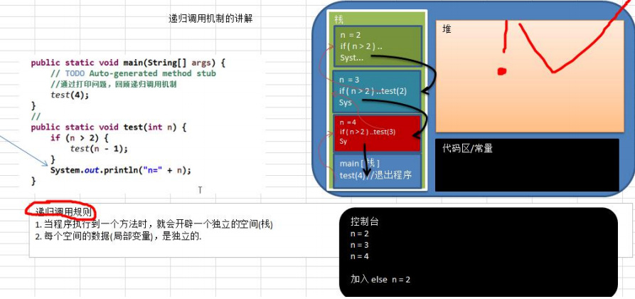

### 规则

1. 递归必须向退出递归的条件逼近，否则就是无限递归
2. 方法的局部变量是独立的，不会相互影响
3. 方法中使用的如果是引用类型变量，会共享该引用类型的数据
4. 当一个方法执行完毕时，就会将结果返回给调用他的地方。

### 相关问题

1. 八皇后问题、汉诺塔问题、迷宫问题
2. 各种算法中、快速排序、归并排序、二分查找、分治算法
3. 栈解决的问题，使用递归更简洁

### 八皇后问题

**问题**

​		在一个8*8 的棋盘上，放8个棋子，每个棋子所在行、列、斜向（↖↘ ↙ ↗） 都没有其他棋子

**图示：**

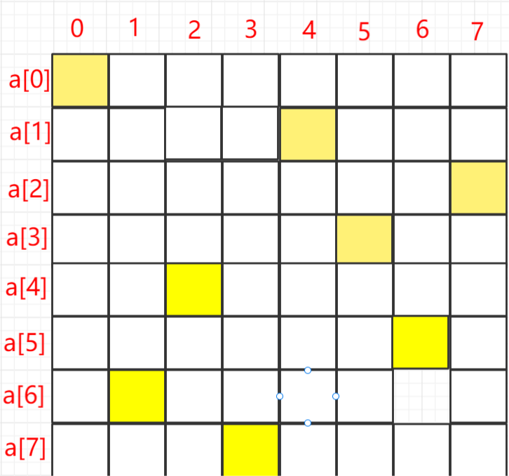

**思路**

```tex
1. 使用长度为8的一维数组表示8个皇后，int a[]=new int[8] 
2. a[i]值就是第i个皇后的位置，入上图 a[1] = 4，表示第2个皇后在第5个位置
3. 依次放入8个皇后
	3.1 每次放入皇后时，放在当前行的第一个, 即 a[i] = 0  
	3.2 判断当前皇后是否与之前的皇后冲突(在同一行列斜线)
		3.2.1 如果不冲突，那么放入下一个皇后
        3.2.2 如果冲突，说明当前位置不行，放入本行后一个位置
    3.3 当开始放第9个皇后时，说明前8个都没有冲突，结束
```

**代码示例**

```java
 public void put(int n) {
        /**
         * n=8 说明开始放arr[8] 此时已经成功放了8个，游戏结束
         */
        if (n == 8) {
            System.out.println(Arrays.toString(arr)); // 打印一下当前数组
            return;
        }
        //依次放入皇后.并判断是否冲突
        // n表示放置的第几个皇后  i表示放在第几列
        for (int i = 0; i < 8; i++) {
            arr[n] = i;
            // 如果放完之后，检查当前皇后和之前的都不冲突，则放置下一个
            if (check(n)) {
                put(n + 1); //放下一个皇后
            }
            //如果冲突 , i++ 当前皇后放在本行下一个位置
        }
    }

public boolean check(int n) {
    /**
         *
         * 循环判断之前的 arr[0] ~ arr[n-1] 是否与 a[n] 冲突，冲突的三种情况
         * 1. arr[i] == arr[n] 表示在同一列
         * 2. n - i = arr[n] - arr[i] 表示 arr[n]在arr[i] ↘ 列
         * 3. n - i = arr[i] - arr[n] 表示 arr[n]在arr[i] ↙ 列
         */
    for (int i = 0; i < n; i++) {
        if (arr[i] == arr[n] || Math.abs(n - i) == Math.abs(arr[n] - arr[i])) {
            return false;
        }
    }
    return true;
}
```


## 排序算法

​			**将无序数组转为有序数组的方法成为排序算法**

### 冒泡排序

**从前往后依次比较相邻的数字并交换, 比较N-1轮**

```tex
1. 轮询：
	从头开始，依次比较相邻两个元素，如果后边比前边大，则互换
	-- 第一轮保证了最后一个数是最大的 
	-- 第二轮只需要比较到倒数第二个数，一次类推
2.如果某一轮中，没有发生任何的数据互换，那么说明整个数据是有序的。提前结束
```

```java
 public int[] sort(int [] a){
        int temp= 0;
        for (int i = a.length-1 ; i >0 ; i--) {
            // 从0开始，依次比较a[j]与a[j+1] 的大小, 并交换
            // j+1 是最后一个 那么 j 最大能与 a.length-2
            boolean flag = false; // 默认没有元素互换
            for (int j = 0; j < i; j++) {
                if (a[j]>a[j+1]){
                    flag =true;  //发生了元素互换
                    temp =a[j];
                    a[j] =a[j+1];
                    a[j+1]=temp;
                }
            }
            //每轮交换确定最大一个值，并且位于最后,下一次只需要确认到确认值之前
            // 如果一轮中都没有 进行元素互换，那么可以提前结束
            if (!flag) {
                break;
            }
        }
        return  a;
    }
```

### 选择排序

**从前往后查找最小的元素，依次放入数组，查找N-1轮**

```tex
1. 每轮确定一个最小元素放。依次确定 a[0]~a[length-1]
2. 默认当前待确定的元素是最小的，从当前元素向后找，找到最小的元素后，将最小元素与当前待确定的元素互换
3. 确定完倒数第二个元素结束，即a[length-2]
```

```java
  public static int[] sort(int[] a) {
        for (int i = 0; i < a.length; i++) {
            // 定义min为 需要遍历的第一个数 记录下标
            int min = a[i];
            int index = i;
            for (int j = i + 1; j < a.length; j++) {
                //从 遍历a[i] 之后的所有元素，找到最小值之后与a[i] 互换
                if (a[j] < min) {
                    min = a[j];
                    index = j;
                }
            }
            //把 a [i] 与 a[index]互换
            a[index] = a[i];
            a[i] = min;
        }
        return a;
    }
```


### 插入排序

**插入排序是把数组分成两部分：前半部分是有序的，后半部分是无序的**

**遍历无序数组，插入有序数组的合适位置，**

```tex
1. 设置数组第一位是有序的
2. 轮询从第二位到数组末尾，依次进行，插入到有序数组里
	2.1 记录有序数组的末尾下标为index，初始为0，每轮结束后+1(因为有序数组再变大)
	2.2 记录当前的值为value
	2.3 轮询：拿value从有序数组的最后依次往前比较，找到合适的位置插入。
			若value < a[index] 则index下标这个数后移
    		a[index+1] =a[index]; // 原来的a[index+1] 其实就是a[i] =value
			index --; // 往前移动，继续比较
		  直到：value < a[index] = false// 说明value 应该在a[index]的后边 
	2.4 a[index+1] =value
```

```java
public static void insertSort2(int[] a) {
    //int[] a = {1, -2, 13, 4, 55, 26, 7};
    // 从第二个开始 到最后一个进行插入排序
    for (int i = 1; i < a.length; i++) {
        //int indexValue = a[i-1];
        int index = i - 1; // 有序列表的尾
        int value = a[i]; // 当前数字
        // 从有序队列的尾 a[index] 向前找
        while (index>= 0&&value <a[index]){
            a[index+1] =a[index];
            index --;
        }
        // 添加判断 index+1 =i 说明一个都没动,不用重新设置值
        assert index+1!=i;
        a[index+1] =value;
    }
    System.out.println(Arrays.toString(a));
}
```

### 希尔排序

- **把数组按轮次分组，第n轮分[length/2^n] 组,直到分为1组**
- **每组内进行排序**
  - 交换式希尔每组内使用冒泡排序
  - 插入式希尔每组内使用插入排序

插入排序存在的问题： 当前数字如果需要移动到有序数组的最前边时，需要移动的次数很多

```tex
int[]a ={8，9，1，7，2，3，5，4，6，0} 
1. 第一轮分组  分 length/2组 =5组
	1.1 分组结果
		第一组	{a[0],a[5]}={8,3}
		第二组	{a[1],a[6]}={9,5}
		第三组	{a[2],a[7]}={1,4}
		第四组	{a[3],a[8]}={7,6}
		第五组	{a[4],a[9]}={2,0}
	1.2 每组进行分别排序
		第一组	{a[0],a[5]}={3,8}
		第二组	{a[1],a[6]}={5,9}
		第三组	{a[2],a[7]}={1,4}
		第四组	{a[3],a[8]}={6,7}
		第五组	{a[4],a[9]}={0,2}
	1.3 第一轮分组排序后结果：
			int[]a ={3，5，1，6，0，8，9，4，7,2  } 	
2.第二轮分组, 分[length/(2^2)] = 2组
	2.1 分组结果：
    	第一组 {a[0],a[2],a[4],a[6],a[8]} ={3,1,0,9,7}
    	第二组 {a[1],a[3],a[5],a[7],a[9]} ={5,6,8,4,2}
	2.2 分别对两组进行排
    	第一组 {a[0],a[2],a[4],a[6],a[8]} ={0,1,3,7,9}
    	第二组 {a[1],a[3],a[5],a[7],a[9]} ={2,4,5,6,8}
    2.3 第二轮排序后结果
    		int[]a ={0，2，1，4,3,5,7,6,9,8 }
3. 第三轮分组, 分[length/(2^3)] = 1组
	对int[]a ={0，2，1，4,3,5,7,6,9,8 }
	进行排序。
```

针对分组内的排序使用冒泡还是插入，分为交换式希尔排序和插入式希尔排序

**交换式希尔排序**

```java
  public static void sort(int[] a) {
        // 记录第几轮
        int count = 0;
        //临时变量
        int temp;
        // 分组,第一次分[a.length/2]组、第二次分[a.length/4]组  [x]=x取整
        for (int g = a.length / 2; g >= 1; g = g / 2) {
            // 每组有 a.length/[a.length/g] 个元素
            // 从每组的第二个元素开始比较，直到数组末尾
            for (int i = g; i < a.length; i++) {
                // 分组内排序： j 从本组第一个元素开始，依次与后边的比对（冒泡）
                for (int j = i - g; j >= 0; j = j - g) {
                    // 拿本组第x个元素与 下一个元素比对
                    if (a[j] > a[j + g]) {
                        temp = a[j];
                        a[j] = a[j + g];
                        a[j + g] = temp;
                    }
                }
            }
            count++;
            System.out.println("第" + count + "轮分组后----" + Arrays.toString(a));
        }
        System.out.println(Arrays.toString(a));
    }
```

**插入式希尔排序**

```java
  public static void sort2(int[] a) {
        // 记录第几轮
        int count = 0;
        //临时变量
        int temp;
        // 分组,第一次分[a.length/2]组、第二次分[a.length/4]组  [x]=x取整
        for (int g = a.length / 2; g >= 1; g = g / 2) {
            // 每组有 a.length/[a.length/g] 个元素
            // 从每组的第二个元素开始比较，直到数组末尾
            for (int i = g; i < a.length; i++) {
                // 分组内排序：使用插入的方式
                {
                    int index = i; // 定义下标
                    int value = a[i]; // 当前数字
                    // 从有序队列的尾 a[index] 向前找
                    // 如果当前值 > = 此分组的前一个值 a[index - g],不用处理了
                    if (value < a[index - g]) {
                        //从有序队列的尾 a[index] 向前找
                        // 直到找到比当前元素大的数或者找到头，即找插入的点在那里
                        while (index - g >= 0 && value < a[index - g]) {
                            //上一个元素a[index - g]大,后移
                            a[index] = a[index - g];
                            //继续向前
                            index -= g;
                        }
                        //找到了插入当前数字到合适的位置
                        a[index] = value;
                    }
                }
            }
            count++;
            System.out.println("第" + count + "轮分组后----" + Arrays.toString(a));
        }
        System.out.println(Arrays.toString(a));
    }
```

### 快速排序

**特点：左右递归**

​			找数组中左侧或者右侧或者中间的数字作为基准数，比基准数小的放在基准数的左侧，比基准数大的放在基准数的右侧。把左侧、右侧分别看成2个新的数组。一直进行此操作，直到全部有序。

**左侧作为base数**

```tex
1. 定义一个基准数。左侧第一个数
2. 左右开弓，先从右侧第一个向左找，在从左侧第一个开始向右找。
	循环处理：l初始为数组最左侧，l++  r 初始为数组最右侧 r--  有可能多次交换
	2.1. 右侧向左找到比base值小的数记录下标r ，左侧向右找到比base值大的数记录下标l，(左侧基数先从右找，右侧基数先从左找)
	2.2. 如果 l < r 交换 a[r] 和a[l]
	2.3  l=r 退出循环
	现在数组是 [base,x,x,x,x,x,x,a[l]a[r],y,y,y,y,y]  x<base y>base 
3. 基准数放到中间的位置（基准数归位） a[left] 与a[l] 互换
     array[left] = array[l];
     array[l] = base;
4.  左侧递归 sort(array, left, i - 1);
	右侧递归 sort(array, i + 1, right);
```

**代码示例：**

```java
 /**
     * 左侧作为基数
     *
     * @param array 数组
     * @param left 左侧起始点
     * @param right 右侧结束点
     */
    public static void sortBaseOnLeft(int[] array, int left, int right) {
        if (left > right) {
            return;
        }
        // base中存放基准数
        int base = array[left];
        int i = left;
        int j = right;
        while (true) {
            // 先从右边开始往左找，直到找到比base值小的数
            while (array[j] >= base && i < j) {
                j--;
            }
            // 再从左往右边找，直到找到比base值大的数
            while (array[i] <= base && i < j) {
                i++;
            }
            // 当i 与j 还没有相遇时，元素互换
            if (i < j) {
                int tmp = array[i];
                array[i] = array[j];
                array[j] = tmp;
            }
            // 当i 与 j 相遇时退出
            if (i == j) {
                break;
            }
        }
        // 将基准数放到中间的位置（基准数归位）
        array[left] = array[i];
        array[i] = base;
        // 递归，继续向基准的左右两边执行和上面同样的操作，基准值不动
        sortBaseOnLeft(array, left, i - 1);
        sortBaseOnLeft(array, i + 1, right);
    }
```

**右侧作为base数**

```tex
1. 定义一个基准数。右侧第一个数
2. 左右开弓，，从左侧第一个开始向右找， 再从右侧第一个向左找
	循环处理：l初始为数组最左侧，r 初始为数组最右侧 
	2.1. 左侧向右找到比base值大的数记录下标l，右侧向左找到比base值小的数记录下标r ，(左侧基数先从右找，右侧基数先从左找)
	2.2. 如果 l < r 交换 a[r] 和a[l]
	2.3  l=r 退出循环
	现在数组是 [x,x,x,x,x,x,a[l]a[r],y,y,y,y,y,base]  x<base y>base 
3. 基准数放到中间的位置（基准数归位） a[right] 与a[r] 互换 其实 l=r
     array[right] = array[l];
     array[r] = base;
4.  左侧递归 sort(array, left, i - 1);  // left ~r-1
	右侧递归 sort(array, i + 1, right); // r+1 ~right
```

**代码示例：**

```java
   /**
     * 右侧作为基数
     *
     * @param array 数组
     * @param left 左侧起始点
     * @param right 右侧结束点
     */
    public static void sortBaseOnRight(int[] array, int left, int right) {
        if (left > right) {
            return;
        }
        // base中存放基准数
        int base = array[right];
        int l = left;
        int r = right;
        while (true) {
            // 从左往右边找，直到找到比base值大的数
            while (array[l] <= base && l < r) {
                l++;
            }
            // 先从右边开始往左找，直到找到比base值小的数
            while (array[r] >= base && l < r) {
                r--;
            }
            // 当i 与j 还没有相遇时，元素互换
            if ( l < r) {
                int tmp = array[l];
                array[l] = array[r];
                array[r] = tmp;
            }
            // 当i 与 j 相遇时退出
            if (l  == r) {
                break;
            }
        }
        // 将基准数放到中间的位置（基准数归位）
        array[right] = array[r];
        array[r] = base;
        // 递归，继续向基准的左右两边执行和上面同样的操作，基准值不动
        sortBaseOnRight(array, left, r - 1);
        sortBaseOnRight(array, r + 1, right);
    }
```

**中间作为基数**

```tex
1. 定义一个基准数。中间数 a[(left + right) / 2];
2. 左右开弓，但左侧的索引要小于右侧才能找。
	循环处理：l初始为数组最左侧，r 初始为数组最右侧 
	2.1. 左侧向右找到比base值大的数记录下标l，右侧向左找到比base值小的数记录下标r
	2.2  l=r 退出循环 ,说明左右都指向了基数位置。
	2.3. 交换 a[r] 和a[l]
	2.4 右侧指针左移，左侧指针右移
3.	循环处理结束后	
		数组情形1： [x,x,x,x,x,x,a[r],base,a[l],y,y,y,y,y]    x<=base y>=base 
					r+1 =l ，a[r]！= a[l]
        数组情形2： [x,x,x,x,x,x,(a[r]=base=a[l]),y,y,y,y,y]  x=<base y>=base 
        			r=l，a[r]=base=a[l]
4.  情形1: 构建左侧数组 [left ->r]  右侧数组[l -> right]
    情形2：构建左侧数组 [left ->r-1]  右侧数组[l+1 -> right]，中间的base 忽略，因为已经确定位置
    		处理一下：r--, l++
5. 左右递归处理
	 sort(a, left, r); // left必须小于 r 
	 sort(a, l, right); //l必须小于 right
```

**代码示例**

```java
 /**
     * 中间作为基数
     *
     * @param a     数组
     * @param left  左侧起始点
     * @param right 右侧结束点
     * @return 排序后数组
     */
    public static int[] sort(int[] a, int left, int right) {
        // 起点比终点大 结束
        if (left >= right){
            return;
        }
        int l = left;
        int r = right;
        int value = a[(left + right) / 2];
        int[] b = new int[right + 1 - left];
        int temp;
        // 左侧逐渐右移  右侧逐渐左移
        while (l < r) {
            //左侧找比base 大的数
            while (a[l] < value) {
                l++;
            }
            //右侧找比base小的数
            while (a[r] > value) {
                r--;
            }
            //说明左右都指向了基数位置
            if (l == r) {
                break;
            }
            //左右值互换
            temp = a[l];
            a[l] = a[r];
            a[r] = temp;
            // 此时 a[r] >= base，并且r右边的全部都大于base
            // 此时 a[l] <= base，并且l左边的全部都小于base
            // 右侧指针左移
            r--;
            // 左侧指针右移
            l++;
        }
        // index 图示  [left -> r-1] l=r [l+1 - >right]
        // l与r 相等说明指向了基数值 即a[l]=base,但不一定等于baseIndex 看看例如
        // {base,base,base,x,x} 或者  {x,x,base,base,base}
        // 两种情况 baseIndex =2
        // 但不一定指向baseIndex 第一个 l=r=1 ，第二个 l=r=3,
        // 此时可以跳过基数值去进行左右两侧的递归排序
        if (l == r) {
            System.out.println(value == a[l]);
            // ||-23, -23, -23, -2, 0,||
            // 计算基于几点的偏移量
            int baseIndex = (left + right) / 2;
            l= l < baseIndex? baseIndex:l;
            r= r > baseIndex? baseIndex:r;
            // 向右递归  从左指针 l+1 ->  right
            // 向左递归  从左指针 left <- r-1
            l++;
            r--;
        }else {
            //r 一定小于 l [left-r] 是左数组 [l-right]是右数组
            // 并且 r +1 =l
        }
        // 向左递归 ,r逐渐变小，直到左侧起点，可以不加判断
        if (left < r) {
            sort(a, left, r);
        }
        //向右递归 ,l逐渐变大，直到右侧终点，可以不加判断
        if (l < right) {
            sort(a, l, right);
        }
        return a;
    }
```


### 归并排序

**分治思想：**

**分： 数组中间劈开，分为两组{left -->mid}{mid+1--->right}，一直分成单个元素**

**治： 左数组{left -->mid} 与右数组{mid+1--->right}比较，按大小依次插入临时数组，**

​		**再把临时组数拷贝到 a {left ->right }**

```tex
1. 递归分割数组   
	左数组{left -->mid} 与右数组{mid+1--->right}
	// 分割mergeSort(数组,left,right) 
	// left >= right 退出递归
2.	左数组 {left -->mid} +右数组排序{mid+1--->right}  //左右是连续的 a{left->right}排序
	2.1 创建临时数组temp用于保存数据，数组长度  = right-left+1
	2.2 同时遍历左数组、右数组并比较，小的放入temp临时数组
		直到有一个数组遍历结束
	2.3 把没有遍历完成的数组放入temp中  // 此时 temp是有序的
	2.4 把temp拷贝到a{left-->right} 中
 	
	     
```


```java
 /**
     * 归并排序
     *
     * @param a 待排序数组
     */
    public static void sort(int[] a) {
        // 创建临时数组，用于保存数据
        int[] temp = new int[a.length];
        mergeSort(a, 0, a.length - 1);
        System.out.println(Arrays.toString(a));
    }

    /**
     * 排序
     *
     * @param a     待排序数组
     * @param left  数组左指针
     * @param right 数组右指针
     *              //@param temp  临时数组
     */
    public static void mergeSort(int[] a, int left, int right) {
        //当左指针小于右指针时，进行分割
        if (left < right) {
            int mid = (left + right) / 2;
            // 分离左侧数组 {left -->mid}
            mergeSort(a, left, mid);
            // 分离右侧数组 {mid+1--->right}
            mergeSort(a, mid + 1, right);
            // 进行排序
            merge(a, left, right);
        }
    }

    /**
     * 左右数组 排序
     *
     * @param a     排序
     * @param left  左数组起点
     * @param right 右数组终点
     */
    private static void merge(int[] a, int left, int right) {
        int[] temp = new int[right - left + 1];
        int mid = (left + right) / 2;
        // 数组 {left -->mid}{mid+1--->right}
        // i 指针 用于遍历左数组j指针，用于遍历右数组
        int i = left;
        int j = mid + 1;
        // t 用于保存temp临时数组时记录下标位置
        int t = 0;
        // 左右必须有一个遍历完成
        while (i <= mid && j <= right) {
            //将小的数据依次放入临时数组
            if (a[i] < a[j]) {
                temp[t] = a[i];
                i++;
                t++;
            } else {
                temp[t] = a[j];
                j++;
                t++;
            }
        }
        // 左侧有剩余的
        while (i <= mid) {
            temp[t] = a[i];
            t++;
            i++;
        }
        if (j <= right) {
            temp[t] = a[j];
            t++;
            j++;
        }
        
        //拷贝temp 到 a
        for (int value : temp) {
            a[left] = value;
            left++;
        }
    }
```

### 基数排序

```tex
1. 定义10个桶子[0~9]
2. 处理
	2.1 遍历数组，按照个位数元素放入对应编号的桶里；然后从0-9桶依次取出放回数组。 //此时数组中个位数从小到大排列
		个位数 = 数字/1%10  = 数字/10^0%10 
	2.2 遍历数组，按照十位数元素放入对应编号的桶里；然后从0-9桶依次取出放回数组。 //此时数组中十位数从小到大排列
	    十位数 = 数字/10%10  = 数字/10^1%10 
	2.3 遍历数组，按照百位数元素放入对应编号的桶里；然后从0-9桶依次取出放回数组。 //此时数组中百位数从小到大排列
		百位数 = 数字/100%10  = 数字/10^2%10 
	。。。
	最后都会放入0桶中，结束；
```

```java
   public static void sort(int[] a) {
        // 1. 定义10个桶，每个桶最多放a.length个数
        int[][] bucket = new int[10][a.length];
        // 统计每个桶放了多少个数
        int[] bucketCount = new int[10];
        // 2. 定义轮数，数字除以 10^n 再对10取模得到当前位置的数
        int n = 0;
        while (true){
            System.out.println("第"+n+"轮");
            // 除数
            int divisor = (int) Math.pow(10, n);
            // 统计轮数
            n++;
            for (int j = 0; j < a.length; j++) {
                //取模
                int element = a[j]/divisor % 10;
                // 放入对应的桶中
                bucket[element][bucketCount[element]] = a[j];
                // 对应桶数+1
                bucketCount[element]++;
            }
            // 如果全被放入了0号桶，结束
            if (bucketCount[0] == a.length){
                break;
            }
            // 取10个桶的数据 放回原数组
            int index = 0;
            for (int j = 0; j < 10; j++) {
                // 判断桶里有没有数字
                if (bucketCount[j] != 0) {
                    // 桶里有数，放回原数组
                    for (int k = 0; k < bucketCount[j]; k++) {
                        a[index] = bucket[j][k];
                        index++;
                    }
                    // 桶里的数字放回数组后，清空桶
                    bucketCount[j] = 0;
                }
            }
            System.out.println(Arrays.toString(a));
        }
        System.out.println(Arrays.toString(a));
    }
```

### 排序算法总结

| **排序算法** | **平均时间复杂度** | **最坏**  | **最好**  | **空间复杂度** | 额外空间 | **稳定性** |
| ------------ | ------------------ | --------- | --------- | -------------- | -------- | ---------- |
| **冒泡排序** | O(n^2)             | O(n)      | O(n^2)    | O(1)           | 不需要   | 稳定       |
| **选择排序** | O(n^2)             | O(n^2)    | O(n^2)    | O(1)           | 不需要   | 不稳定     |
| **插入排序** | O(n^2)             | O(n)      | O(n^2)    | O(1)           | 不需要   | 稳定       |
| **希尔排序** | O(n*logn)          | O(n*logn) | O(n*logn) | O(1)           | 不需要   | 不稳定     |
| **快速排序** | O(n*logn)          | O(n*logn) | O(n^2)    | O(logn)        | 不需要   | 不稳定     |
| **归并排序** | O(n*logn)          | O(n*logn) | O(n*logn) | O(n)           | 需要     | 稳定       |
| **基数排序** | O(n*k)             | O(n*k)    | O(n*k)    | O(n+k)         | 需要     | 稳定       |
| **桶排序**   |                    |           |           |                |          |            |
| **计数排序** |                    |           |           |                |          |            |
| **堆排序**   |                    |           |           |                |          |            |

**解释**

1. 稳定性： 若 a = b  排序之前为{...a,b...} 排序后可能是{...b,a...} 则不稳定
2. n = 数据规模   
3. k =桶的个数

## **查找算法**

### 线性查找

- 线性查找，从前往后遍历依次查找。

- 不要求数组有序


### **二分查找**

- 要求数组有序
- 比对数组中间值(例如从小到大)
  - mid = [(left+right)/2]
  - 小于被查找数（递归查找左侧节点与当前节点的中间数）
  - 大于被查找数（递归查找右侧节点与当前节点的中间数）

### 插值查找

- 要求数组有序。 **使用理想值均匀分布情况下，查找值对左侧偏移量的分割取代二分**
- 插值查找想象数组是分布均匀的
  - a[left] / left  ≈≈≈ a[right] / right  ≈≈≈  value /index 
  - 故：index = left + (value - a[left])(right-left) /( a[right] -a[left])  // 左侧加偏移量
- 分布均匀下比二分快，不均匀不比二分快

### 斐波那契查找

- 斐波那契特点：**使用斐波那契的自然分割，取代了二分的分割**
  - F(n)= F(n-1)+F(n-2) 。 n >2
- 构建一个长度不小于数组长度的斐波那契额数列
  - F(n) > a.length  
  - F(n-2)+F(n-1) =F(n) 
    -  所以分割点index是F(n-2)靠前一点
    - 当然分割点也可以是index是F(n-1)靠后一点
  - 当vaue > arr[index] 说明 落在了后半部分
    - 下一次的分割点是这次分割点+后半部分的分割点
  - 当vaue < arr[index] 说明 落在了前半部分
    - 下一次的分割点是前半部分的分割点
  - value ==  arr[index]  找到了