# 数据结构

## 分类

​		数据结构分为 线性结构和非线性结构

- 线性结构
  - 元素之间存在一对一的关系
  - 顺序存储结构(数组)，链式存储结构(链表)
    - 顺序存储结构内存地址是连续的，链式不一定(存放的是数据及相邻节点的地址信息)
  - 数组、队列、链表、栈
- 非线性结构
  - 二维数组、多维数组、广义表、树结构、图结构

# 线性结构

## 队列

- 队列是一个**有序列表**，可以用**数组**或是**链表**来实现。 
- 遵循**先入先出**的原则。即：FIFO先存入队列的数据，要先取出。

### 数组模拟队列

图示：

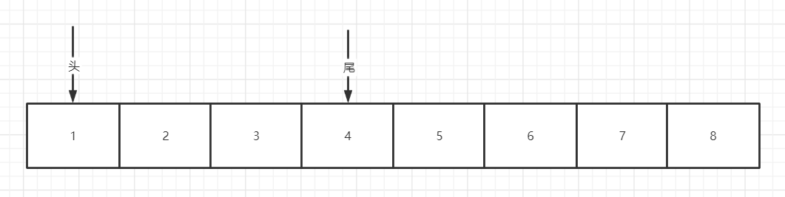

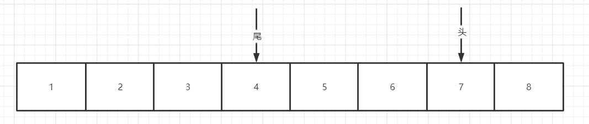

- **长度为N的数组只能保存N-1个数据**
  - 因为**头尾不能指向同一个数组下标**（队列初始化时除外），尾针对应的数组下标中数据为无效数据
  - 头尾指向通一个数组下标时,不能确定是空队列，还是 45678123 ，如下图

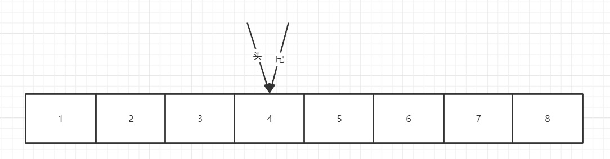


- 使用**对数组长度取模**，实现指针到数组下标尾处重新回到数组下标起始位置

代码设计实现：

```java
 /**
     * 环形数组模拟队列
     * 尾针和头针不能指向数组同一下标，保证环形数组有方向。尾针节点的数据为无效数据
     * 添加数据时，尾针处添加数据，同时尾针后移
     */
    static class ArrayQueue {
        private int maxSize; //队列容量
        private int front; // 队列头针
        private int rear;   //队列尾针
        private int[] data; //数组存放数据

        // 有参构造器
        public ArrayQueue(int size) {
            maxSize = size + 1;
            data = new int[maxSize];
            front = 0;
            rear = 0;
        }

        //判断队列是否满了
        public boolean isFull() {
            return (rear + 1) % maxSize == front;
        }

        //判断队列是否为空
        public boolean isEmpty() {
            return front == rear; //队列头指针 = 队列尾指针
        }

        //添加数据
        public void add(int value) {
            if (isFull()) {
                throw new RuntimeException("队列满了");
            }
            data[rear] = value;
            rear = (rear + 1) % maxSize;
        }

        //获取并移除队列头数据
        public int remove() {
            if (isEmpty()) {
                throw new RuntimeException("队列为空");
            }
            int temp = data[front];
            front = (front + 1) % maxSize;
            return temp;
        }

        //获取队列头数据
        public int element() {
            if (isEmpty()) {
                throw new RuntimeException("队列为空");
            }
            return data[front];
        }

        //获取队列长度
        public int size() {
//            if (front <= rear){
//                return rear-front;
//            }else{
//                return rear+maxSize-front;
//            }
            return (rear + maxSize - front) % maxSize;
        }

        //展示队列数据
        public void showQueue() {
            if (isEmpty()) {
                throw new RuntimeException("队列为空");
            }
            if (front < rear) {
                for (int i = front; i < rear; i++) {
                    System.out.print(data[i] + "\t");
                }
            } else {
                for (int i = front; i < maxSize; i++) {
                    System.out.print(data[i] + "\t");
                }
                for (int i = 0; i < rear; i++) {
                    System.out.print(data[i] + "\t");
                }
            }
        }

    }
```


## 链表

### 单链表

**示意图**

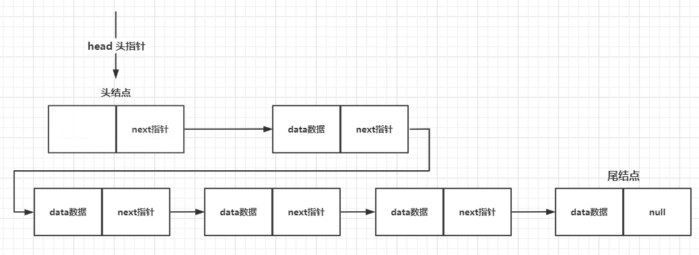

**特点**

- 链表以节点的形式来存储，是**链式存储**
- 单链表每个节点含有**data域和next域**
- 链表的节点在**内存中的分布不一定是连续**的

**代码设计**

[单链表demo] （https://github.com/chenpc1234/Note/tree/main/数据结构与算法/Code/src/main/java/struct/linkedList/SingleLinkedListDemo.java)

**常见面试题**

1. 求单链表中有效节点的个数

   ```java
   public int length(){
       int length =0;
       Node temp = head;
       while(temp.next!=null){
           length++;
           temp=temp.next;
       }
       return length;
   }
   ```

2. 查找单链表中倒数第K个节点

   ```java
   public Node find(int num){
       int length =length();
       if(num > length){
           return null;
       }
       Node temp = head;
       while(temp.next!=null){
           if(length == num ){
   			return temp;
           }
           length--;
           temp=temp.next;
       }
   }
   ```

3. 反转单链表

   ```tex
   1. 定义一个新的头结点
   2. 遍历链表，依次取出当前节点，将当前节点插入新头结点之后
   	2.1 当前节点的尾指针=新头结点的尾指针（当前节点的指针指向了新头结点尾指针指向的节点） temp.next=newHead.next
   	2.2 头节点的尾指针指向当前节点  newHead.next=temp
   	2.3 链表节点后推 
   3.将老头结点的尾指针指向新节点的尾指针 head.next=newHead.next
   ```

4. 逆序打印单链表

   ```tex
   1.不破原有的链表结构
   2.使用Stack栈的先进后出原则。遍历链表依次推送至栈中
   3.打印栈中信息
   ```

5. 合并两个有序的单链表

   ```tex
   1. 定义一个新的链表
   2. 定义两个临时节点遍历temp1 temp2 分别用来遍历两个链表
   3. 循环处理
   	3.1	若temp1节点为空（链表1遍历完成），则直接将temp2节点插入新链表，temp2有next指针，即链表2未遍历的全部插入新链表
   	3.2 若temp2节点为空（链表1遍历完成），则直接将temp1节点插入新链表，temp1有next指针，即链表2未遍历的全部插入新链表
   	3.3 若temp1节点序号比temp2小 则temp1加入新链表  temp1后移
       3.4 若temp2节点序号比temp1小 则temp2加入新链表  temp1后移
       3.5 注：3.3/3.4不能将temp1/temp2直接插入链表，因为有 next指针,可以使用新对象拷贝data域插入
   4. 新链表就是合并的链表
   ```

### 双向链表

**示意图**

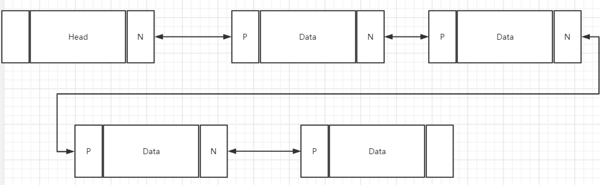

**特点**

- 双向链表每个节点含有data数据域和pre和next
  - pre指针指向前一个节点，next指针指向后一个节点
- 双向链表可以向前查找，也可以向后查找
- 单向链表不能自我删除，只能通过修改前一节点的next指向后一节点来完成
  - 单向链表删除时，需要修改 `node.pre.next` 和`node.next.pre`

**代码分析**

[双向链] (https://github.com/chenpc1234/Note/tree/main/数据结构与算法/Code/src/main/java/struct/linkedList/DoubleLinkedListDemo.java)

### 单向环形链表

**示意图**

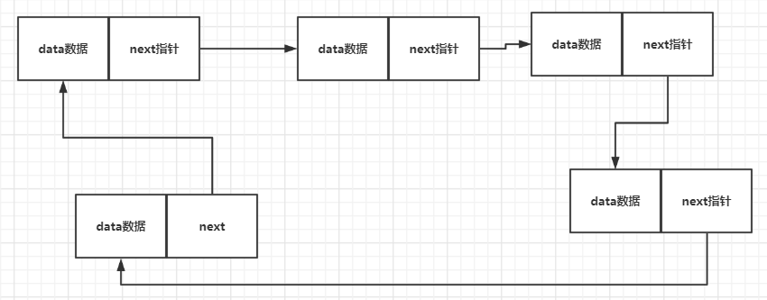

**特点**

- 特殊的单向链表，最后一个节点的next指向第一个节点

**约瑟夫问题**

N个人围成一圈，从第一个开始报数，第M个将被杀掉，最后剩下一个，其余人都将被杀掉。

例如N=6，M=5，被杀掉的顺序是：5，4，6，2，3。

```tex
1. 链表中仅一个节点时 first.next =first
2. 构建一个长度为N的单向循环链表,节点内数据一次+1
3. 遍历单向循环链表
	3.1.从first节点开始计数， 当node.data%M==0 时，说明此节点应该删除 
			即计数到(node.data+1)%M==0 说明下一个节点应该删除，node.next=node.next.next;
	3.2 当node.next =node时 说明只剩下了一个节点。
```

**代码示例**

[约瑟夫问题](https://github.com/chenpc1234/Note/tree/main/数据结构与算法/Code/src/main/java/struct/linkedList/Josephus.java)

## 栈

### **示意图**

**入栈**

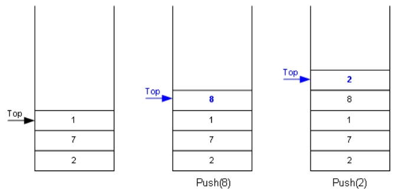

**出栈**

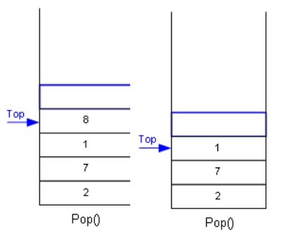

- 栈遵循FILO原则，先入后出
- 栈限制只能在一端进行插入或者删除操作，称为栈顶（Top） 另外一端称为栈底(Bottom)

### **数组模拟栈**

```tex
1. 数组创建时固定长度，因此创建栈的时候需要给一个长度即maxSize
2. 使用
        struct{
            int maxSize; //记录栈的最大保存记录
            int top = -1 ;	//记录指针，用来表示栈顶,初始化为-1
            Object[] data; //使用数组存储数据
        }
3. 	push ,添加元素时,top++并将元素保存到 data[top] 
	pop 弹出栈顶元素时，返回data[top]并 top--
	peek 查看栈顶元素时，返回data[top]
```

[数组模拟栈] (https://github.com/chenpc1234/Note/tree/main/数据结构与算法/Code/src/main/java/struct/stack/ArrayStackDemo.java)

### **队列模拟栈**

```tex
1. 使用带头和尾的双向队列模拟栈
2. 队列头尾不保存数据,初始化队列时  first.next =last; last.pre=first;
3. 插入,获取都可以使用last来进行
```

[队列模拟栈] (https://github.com/chenpc1234/Note/tree/main/数据结构与算法/Code/src/main/java/struct/stack/LinkedListStackDemo.java)

### **栈实现简单计算器**

 ```java
1. 给定一个计算表达式 如：7+5*15+561/11-6
2. 定义一个计数器 i 
3. while循环处理.判读字符 charAt(i)是不是运算符
    3.1 若是运算符
    	3.1.1截取 0-i 则是数字,将数字加入数字栈
        3.1.2(运算符栈是空栈||符号的优先级大于栈顶符号的优先级)，当前运算符加入运算栈。
         若小于等于运算符栈顶的优先级，将数字栈顶两个数 使用符号栈顶符号进行运算（注意数字栈数的前后顺序）。将运算后的结果加入数			字栈，当前运算符加入符号栈
        3.1.3 截取字符串srt =str.substring(i+1, str.length())，重置计数器 i=0;
    3.2 若是数字符 i++ ,若i= str.length 则遍历完成
4. 遍历符号栈，将数字栈剩余的数字进行计算，数字栈最后的数字就是结果
 ```

[简单计算器](https://github.com/chenpc1234/Note/tree/main/数据结构与算法/Code/src/main/java/struct/stack/Calculator.java)

### **逆波兰计算器**

- **后缀表达式的计算**

  1. 从左至右扫描表达式，遇到数字时，将数字压入堆栈，遇到运算符时，弹出栈顶的两个数，用运算符对它们做相应的计算（次顶元素 和 栈顶元素），并将结果入栈；
  2. 重复上述过程直到表达式最右端，最后运算得出的值即为表达式的结果

- **中缀表达式转后缀表达式**

  1. 初始化两个栈：运算符栈s1和储存中间结果的栈s2；
  2. 从左至右扫描中缀表达式；
     1. 遇到操作数时，将其压s2；
     2. 遇到运算符时，比较其与s1栈顶运算符的优先级：
        1. 如果s1为空，或栈顶运算符为左括号“(”，或优先级比栈顶运算符的高，也将运算符压入s1；
        2. 否则 ，将s1栈顶的运算符弹出并压入到s2中；然后此继续与s1中新的栈顶运算符相比较；
     3. 遇到括号时：
        1. 如果是左括号“(”，则直接压入s1
        2. 如果是右括号“)”，则依次弹出s1栈顶的运算符，并压入s2，直到遇到左括号为止，此时将这一对括号丢弃
  3. 重复直到表达式的最右边, 
  4. 将s1中剩余的运算符依次弹出并压入s2
  5. 依次弹出s2中的元素并输出，结果的逆序即为中缀表达式对应的后缀表达式

- 代码示例

  [逆波兰计算器完整版](https://github.com/chenpc1234/Note/tree/main/数据结构与算法/Code/src/main/java/struct/stack/ReversePolishCalcDemo.java)

# 非线性结构

## 稀疏数组

**简介**

​		当一个数组中大部分元素为０，或者为同一个值的数组时，可以使用稀疏数组来保存该数组

稀疏数组的处理方法是: 

1.  记录数组**一共有几行几列，有多少个不同**的值 
2. 把具有不同值的元素的行列及值记录在一个小规模的数组中，从而**缩小程序**的规模

**实际应用**

棋盘：比如一个11*11的棋盘，第2行第3列有一个白棋，第3行第4列以及第5行第6列有一个黑棋

- 二维数组

  ```java
  int[][] chessArr = new int[11][11]; //使用11*11 数组模拟棋盘
  chessArr[1][2] = 1;   //记录下标  1表示白棋
  chessArr[2][3] = 2;
  chessArr1[4][5] = 2; //记录下标  2表示黑棋 
  ```

- 稀疏数组

  ```java
  int[][] sparseArr ={{11,11,3},
                      {1,2,1}
                      {2,3,2}
                      {4,5,2}
                     };
  //1. 不记录空白位置
  //2. 首行记录棋盘大小 长,宽，棋子数(白+黑)
  //3. 从前往后记录每个棋子的坐标
  ```


## 哈希表||散列表

- **问题：**
  ​		对于线性结构（链表）来讲，查找一个值需要去遍历，效率低。

- **方案：**
  - 使用哈希表，使用一个长度为N的数组，每个数组元素都是一个链表。
  - 插入时，通过散列函数(比如	id%n) 找到对应的链表，然后插入此链表
  - 查询时，通过散列函数(比如	id%n) 找到对应的链表，然后在此链表内查询

- **模型：**

  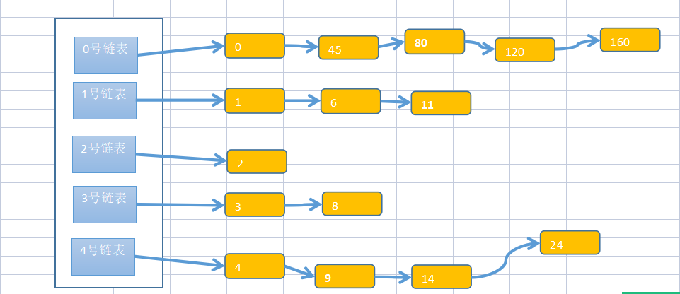

- **代码示例**

  ```java
  class HashTab{
      EmpLinkedList[] arr;
      int maxSize;
      public HashTab(int maxSize) {
          this.maxSize =maxSize;
          arr =new EmpLinkedList[maxSize];
          for (int i = 0; i < maxSize; i++) {
              arr[i] = new EmpLinkedList();
          }
      }
      public void add(Emp emp){
          int i = emp.id % this.maxSize;
          arr[i].add(emp);
      }
      public Emp find(int id ){
          int i = id % this.maxSize;
          return arr[i].findById(id);
      }
      public void list(){
          for (int i = 0; i < this.maxSize; i++) {
              arr[i].list(i);
          }
      }
  }
  class EmpLinkedList{
      Emp head;
      public void add(Emp emp){
          if (head == null){
              head =emp;
              return;
          }
          Emp temp = head;
          while (temp.next!=null){
              temp = temp.next;
          }
          temp.next =emp;
      }
      public void list(int no ){
          if (head == null){
              System.out.println("第"+no+"条链表为空");
          }
          Emp temp = head;
          System.out.print("第"+no+"条链表为");
          while (temp!=null){
              System.out.print(temp+"\t");
              temp = temp.next;
          }
      }
  
      public Emp findById(int id){
          if (head == null){
              return null;
          }
          Emp temp = head;
          while (temp.next!=null){
              if (temp.next.id == id){
                  return temp.next;
              }
          }
          return null;
      }
  }
  
  class Emp{
      int id;
      String name;
      Emp next;
  
      public Emp(int id, String name) {
          this.id = id;
          this.name = name;
      }
  
      @Override
      public String toString() {
          return "Emp{" +
                  "id=" + id +
                  ", name='" + name + '\'' +
                  '}';
      }
  }
  ```

## 树

### 二叉树(BT)

#### 图示

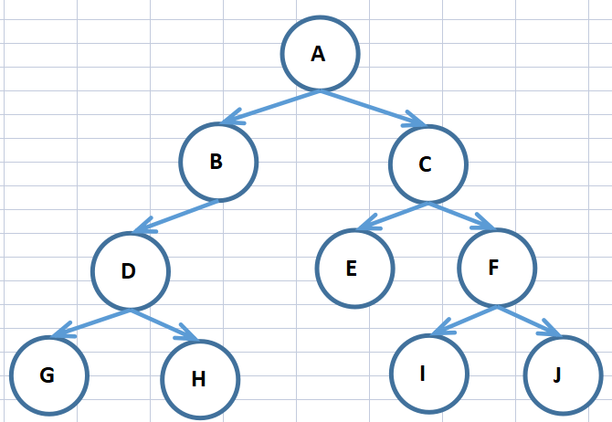

#### 概念

- 节点： 集合中的元素
- 根节点：A节点
- 父节点：B和C的父节点是A
- 子节点： A的子节点是B和C
- 叶子节点： 没有子节点的节点 G H E I J
- 路径：寻找D 的路径 为 A-B-D
- 层： 根节点所在的为第一层、根节点的子节点为第二层、类推
- 树高： 最大层数=树高
- 子树：D G H 构成一个D为根节点的子树
- 满二叉树： 所有叶子节点都在最后一层，节点总数 = 2^n  -1   n=层数
- 完全二叉树：所有叶子节点都在最后一层或倒数第二层，最后一层的叶子节点连续，倒数第二层的节点也连续

#### 二叉树遍历

##### 前序遍历

​	根节点-->递归左节点-->递归右节点

##### 中序遍历

​	递归左节点-->根节点-->递归右节点

##### 后序遍历

​	递归左节点-->递归右节点-->根节点

#### 查找指定节点

​	使用不同的遍历方式进行查找即可

#### 删除指定节点

- 删除的是叶子节点，直接删除；删除的是子节点，删除子树
- 删除：节点的子节点是不是待删除的节点，是就把当前节点对应的子节点置空

#### 顺序存储二叉树

- 把数组顺序存储到二叉树中

- A[n] 的左子节点是A[2n+1] 右子节点是A[2n+2]

  ```tex
                 	a[0]
          a[1]			a[2]
      a[3]	a[4]	a[5]	a[6]
  a[7]
  ```

  

#### 线索化二叉树

在二叉树的结点上加上线索的二叉树称为线索二叉树，对二叉树以某种遍历方式（如先序、中序、后序或层次等）进行遍历，使其变为线索二叉树的过程称为对二叉树进行线索化。

在节点数为N的完全二叉树中，有N+1个空指针域，将这些空指针域（left  || right ）变为某种遍历方式下的前驱节点，和后继节点，能有效的对树进行遍历。


```tex
               	a[0]
        a[1]			a[2]
    a[3]	a[4]	a[5]	a[6]
a[7]

// 在中序遍历下。
a[7].left=null		 a[7].right=a[3]后继
a[3].left=a[7]左子   	a[3].right=a[1]后继
a[1].left=a[3]左子   	a[1].right=a[4]右子
a[4].left=a[1]前驱   	a[4].right=a[0]后继
a[0].left=a[1]左子	a[0].right=a[2]右子
a[5].left=a[0]前驱	a[5].right=a[2]后继
a[2].left=a[5]左子	a[2].right=a[6]右子
a[6].left=a[2]前驱	a[6].right= null
```

[中序线索化二叉树](https://github.com/chenpc1234/Note/tree/main/数据结构与算法/Code/src/main/java/struct/tree/ThreadedBinaryTreeDemo.java)

### 哈夫曼树(Huffman)

#### 概念

- 节点路径： 从根节点到该节点的通路，成为路径。
- 节点路径长度：根节点(1层)到N层的的路径长度为N-1
- 节点权：节点的权值
- 节点带权路径长度：节点权值*路径长度
- 树的带权路径长度(WPL)：所有叶子节点的带权路径长度之和
- huffman 树: WPL最小的树

#### 构建哈夫曼树

1. 将给定的数组从大到小排序。
2. 取最小的两个数构成一个树，父节点为两个数之和
3. 数组删除最小的2个数，加入父节点的数
4. 重复2.3 步，直到数组内只有一个数。最后一个即为根节点（根节点是所有数的和）

#### 哈夫曼编码

- 编码
  - 传入byte数组，数组元素作为data，元素出现的次数作为权重构建哈夫曼节点
  - 构建哈夫曼树
  - 初始化译码表 Map(Byte,String)：译码表记录元素与路径的对应关系，每个节点元素路径唯一的路径，左路径为0，右路径为1。
  - 将byte数组根据译码表进行转换，得到String字符串（0和1组成）
  - 1 byte = 8bit 。将String字符串8位分割，二进制转byte，得到新的byte数组
  - 新的byte数组就是哈夫曼编码后的数组
- 解码
  - 传入哈夫曼编码的byte数组
  - byte数组转二进制，得到String字符串（0和1组成）
  - 反转译码表的K V   Map(String ,Byte)
  - 根据译码表将String字符串转为byte数组
    - 遍历截取字符串，查找在译码表中的源byte
  - 解码完成

#### 哈夫曼压缩文件

- 压缩
  - 输入流转byte数组
  - byte数组哈夫曼压缩
  - 输出流写入哈夫曼编码
  - 输出流写入哈夫曼译码表
- 解压
  - 输入流读取哈夫曼编码
  - 输入流读取哈夫曼译码表
  - 哈夫曼解码
  - 输出流写入解码后byte数组

### 二叉排序树(BST)

#### 概念

​	二叉排序树BST，对于任何一个非叶子节点，左子节点的值比当前节点的值小，右子节点的值比当前节点的值大

#### 创建&新增

​	节点加入，与当前节点比较

- 小于当前节点
  - 当前节点左节点为空
    - 当前节点的左节点=加入加点
  - 当前节点左节点不为空
    - 递归当前左节点
- 大于当前节点
  - 当前节点右节点为空
    - 当前节点的右节点=加入加点
  - 当前节点右节点不为空
    - 递归当前右节点

#### 遍历

​		同二叉树遍历，中序遍历结果是一个有序数组。

#### 删除

1. 找到要删除的节点
2. 找到要删除节点的父节点
3. 找到替代节点
   1. 当前节点没有子节点，没有替代节点
   2. 当前节点只有一个子节点，替代节点为子节点
   3. 当前节点有两个子节点，替代节点为右子树的最小节点 (也可以是左子树的最大节点)
4. 替代节点的left 、right 分别指向删除节点的left，rigtht
5. 删除节点的父节点（left ||right）指向替代节点

### 平衡二叉树(AVL)

#### 概念

1. 左右两个子树的高度差绝对值小于1
2. 左右两个子树都是平衡二叉树

#### 左旋转

**节点的右子树高度-左子树高度 > 1 进行左旋转**

**步骤：**

1. 创建一个新节点，与根节点data一致
2. 新节点的左子节点指向根节点的左子节点
3. 新节点的的右子节点为根节点的右子节点的左子节点
4. 根节点替换为根节点的右子节点
5. 根节点的左子节点为新节点

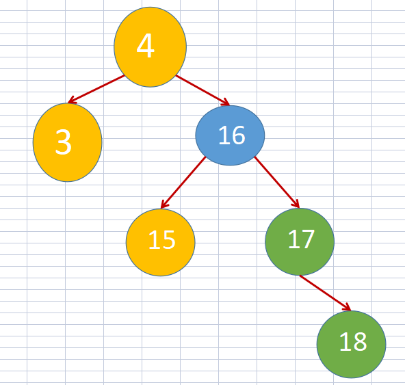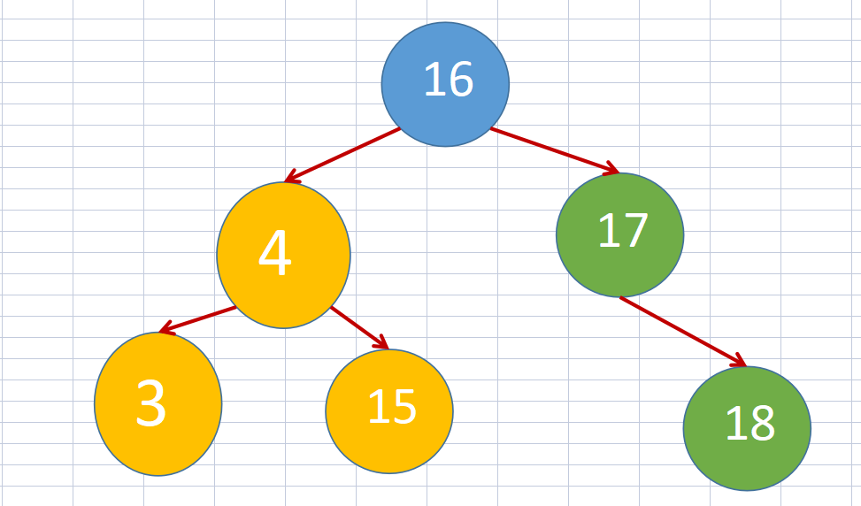

**对比原来的树：** 

1. 根节点变化： 原根节点的右子节点变为根节点

2. 新树左子树： 原根节点及原根节点的左子树（4&3），原根节点右子节点的左树

3. 新树右子树： 原根节点右子节点的右子树

4. 树高： 

   - 原左子树树高为 A  ，右子树树高为B    ，右子树的左子树为C， 右子树的右子树为D

   - B = max (C , D) +1

   - A+1< B   时进行左旋转

   - 旋转后新树 左子树高度  max(A+1  ,  C+1)   右子树高度 D 

     ------

     

   - 若 C <= D   

   - A+1 < B  <  D+1    == A < D

   - 新左子树 A+1 和 C+1   <= D   没有问题

     ------

     

   - 若C > D

   - 新树左子树树高C+1  右子树树高D        C+1 -D  >1 旋转出现问题 见下图

**问题：**

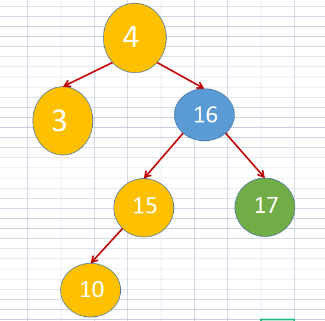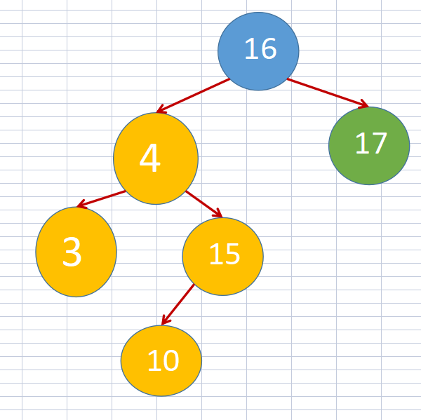

- 若插入的是是10 不是18 , 插入位置在根节点右子节点的左子树上
- 左树树高 = 3    右树 =1 

**解决**

​		**当C >D 时 ：即根节点的右子节点的（左树高度 > 右树高度），对根节点的右子节点进行右旋转**

#### 右旋转

**节点的左子树高度-右子树高度 > 1 进行右旋转**

*  1. 创建一个新节点，与当前节点一致
*  2. 新节点的右子节点指向 当前节点的右子节点
*  3. 新节点的的左子节点 设置为 当前节点的左节点的右节点
*  4. 当前节点 设置为左子节点
*  5. 当前节点的右子节点为新节点

**问题及解决方案 **

1. 问题：由于根节点的左子节点的右树会转移到新树的右子节点的右树上，会与左旋转遇到相似的问题。即根节点的左子节点的（右树高度> 左树高度）时，右旋转后，新树右子树高度-新树左子树高度 > 1
2. 方案：**根节点的左子节点的（右树高度 > 左树高度），对根节点的左子节点进行左旋转**

#### 双旋转

​	左旋转与右旋转组合，形成双旋转。

### 多路查找树

- **二叉树**		二叉树的问题在于如果数据量大，会导致二叉树的层高过高，层高 = log2(N+1)。

- **多叉树**       多叉树通过增加节点的子节点，来控制树的高度，减少IO的次数

#### 2-3树，2-3-4树

**2-3树**是最简单的B树，特点如下

- 2-3树 所有叶子节点都在同一层
- 有2个子节点的节点成为二节点；二节点要么有2个子节点，要么没有子节点
- 有3个子节点的节点称为三节点；三节点要么有3个子节点，要么没有子节点

**2-3-4树**相比2-3树多了一个4节点

#### B树，B-树

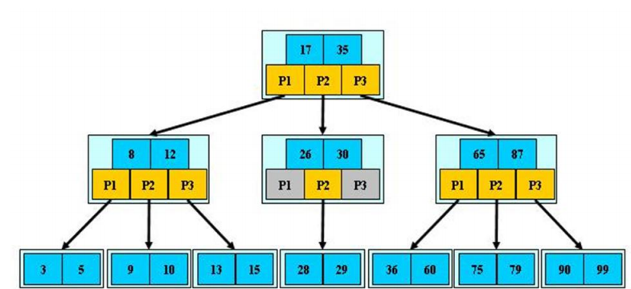

​		B树是 B-Tree（Balanced Treee） 又称B- 树

- **B树的阶: M** 

  ​				节点的子节点个数最多是多少， 比如2-3树阶是3， 2-3-4树的阶是4

- **B树的高度：H** 

  ​				 树最多可以保存  M^H-1 个数据

- **节点：   **    

  - 除根节点与叶子节点外，每个节点最多M 个子节点，最少有m/2 个子节点
  - 根节点至少有两个子节点，除非只有一个根节点

- **B树的搜索**     从根节点开始，对节点内的关键字进行二分查找，如果找到则结束，找不到进入查询范围内的儿子节点。重复进行搜索，直到找到或者到达叶子节点；搜索有可能在非叶子节点结束

- **B树特点：**  关键字分布在整个树中，有可能在叶子节点，也有可能在非叶子节点。

- **搜索性能： ** 等价于关键字的二分查找。

#### B+树

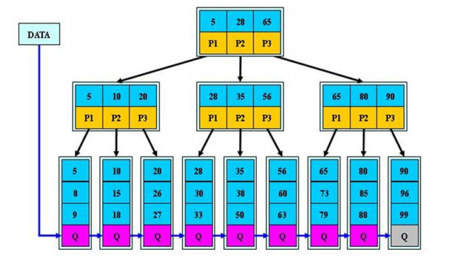

​		B+树是B树的变体。B树的非叶子节点保存数据，会导致非叶子节点保存的关键字变少，B树的阶变低，树高边高。

- 非叶子节点只保存关键字，不保存数据项
- 所有遍历都需要遍历到叶子节点才能结束，叶子节点比较关键字进行数据确认

#### B*树

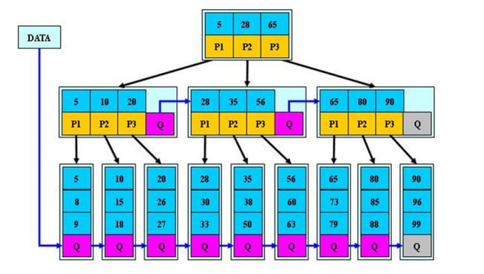

- B* 树在B+树的基础上，在非根节点和非叶子节点上 添加了指向兄弟节点的指针
- B+树的分裂：当一个结点满时，分配一个新的结点，并将原结点中1/2的数据复制到新结点，最后在父结点中增加新结点的指针；B+树的分裂只影响原结点和父结点，而不会影响兄弟结点，所以它不需要指向兄弟的指针。
- B*树的分裂：当一个结点满时，如果它的下一个兄弟结点未满，那么将一部分数据移到兄弟结点中，再在原结点插入关键字，最后修改父结点中兄弟结点的关键字（因为兄弟结点的关键字范围改变了）；如果兄弟也满了，则在原结点与兄弟结点之间增加新结点，并各复制1/3的数据到新结点，最后在父结点增加新结点的指针

## 图

### 基本介绍

​		图用来表示多对多的关系。

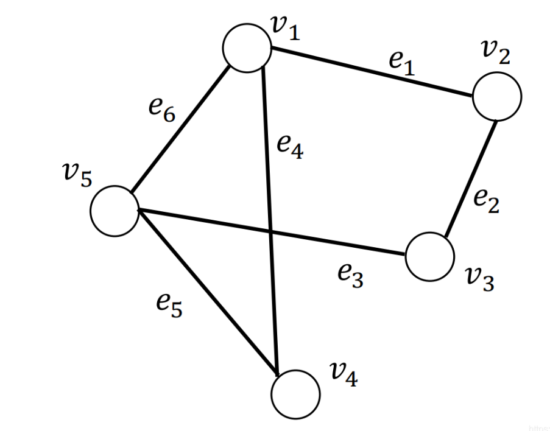

**概念:**

- 顶点 vertex： v
- 边： 顶点间的连线 e
- 路径 ： 某个顶点 到另一个顶点的路径  v1-v2-v3
- 无向图：边没有方向的图
- 有向图： 边有方向的图 
- 带权图：边带有权值的图 
- 无权图： 边没有权值，默认每条边的权值都是1

### 图的表示方式

#### 邻接矩阵

一般使用二维数组表示，如下

|      | V1   | V2   | V3   | V4   | V5   |
| ---- | ---- | ---- | ---- | ---- | ---- |
| V1   | 0    | 1    | 0    | 1    | 1    |
| V2   | 1    | 0    | 1    | 0    | 0    |
| V3   | 0    | 1    | 0    | 0    | 1    |
| V4   | 1    | 0    | 0    | 0    | 1    |
| V5   | 1    | 0    | 1    | 1    | 0    |

#### 邻接表

数组+链表来表示，只保存有边的节点，不保存其他节点


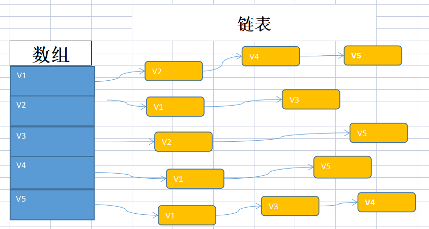

### 图的遍历

#### 深度优先遍历

从某个顶点开始进行深度优先遍历：

1. 输出该顶点，并标记该顶点被访问
2. 遍历处理顶点的邻接节点
   1. 邻接节点没有被访问过：深度优先计算此邻接节点(递归运算)
   2. 邻接节点被访问过，处理下一个邻接节点

#### 广度优先遍历

从某个顶点开始进行广度优先遍历：

1. 准备一个队列
2. 顶点加入队列，并输出顶点，标记顶点被访问
3. 队列不是空的话循环处理队列里的信息
   - 弹出队列里第一个节点，查找第一个节点的相邻节点
     - 邻接节点没有被访问过，邻接节点加入队列，并输出该相邻节点，标记该相邻节点被访问
     - 邻接节点被访问过，处理下一个相邻节点，直到此节点的所有相邻节点全部处理。

**备注：** 

- 广度优先分层：层数=与顶点的路径长度+1 （即顶点为第一层，顶点邻接点为第二层，路径长度为2的是第三层
- 队列用来保存哪个节点先被访问，为第二层遍历顺序做准备
