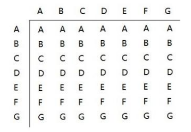

# 算法

## 时间复杂度

### **概念**

#### 时间频度：

**一个算法中语句执行的次数。**

- 使用for循环从1加到n , 执行n+1次,T(n) =n+1  

- 使用 (1+n)/2 * n ,执行1次 ，T(n) =1 

- 若两层for循环  则 
  $$
  T(n) =n^2
  $$

- 时间频度表达式
  $$
  T(n)= aN^i+bN^j+ ...+ cN +d  // 当N趋近于无穷大时  T(n) 趋近于 aN^i
  $$


#### 时间复杂度：

如果有某个函数F(n)，使得 T(n)/F(n) 的极限值是一个常数，则称F(n)为T(n)的同量级函数，记作T(n) =O(F(n)）,O(F(n)为算法的渐进时间复杂度，简称时间复杂度。
$$
T(n)/F(n) = x;
T(n)= aN^i+bN^j+ ...+ cN +d ;
x->正无穷
F(n)=aN^i
$$
**时间复杂度 = 时间频度的最高项去掉系数**

### 常见的时间复杂度

**从小到大依次是：**

- 常数阶 O(1) 
  - 就一个表达式，执行依次
- 对数阶 O(logmn)
  - 比如for循环 不是i++ 是 i*10  则是  O(lgn)
- 线性阶O(n)
  - for循环 i++
- 线性对数阶 O(nlogmn)
  - 线性阶 里面套一个 对数阶
- 平方阶O(n^2)
  - 双层for循环
- 立方阶O(n^3)
  - 三层for循环
- k次方阶O(n^k)
  - k层for循环
- 指数阶O(2^n)
  - 求n个元素的子集。n个元素的子集有2^n(含空集)
- 阶乘阶O(n!)  O(n^n) 
  - 求n个元素的全排列 A（n，m）=n!/（n-m）!

### 平均时间复杂度和最坏时间复杂度

​	

## 空间复杂度


## 递归算法

### **概念**

递归就是方法自己调用自己，每次传入的参数不同。


### 规则

1. 递归必须向退出递归的条件逼近，否则就是无限递归
2. 方法的局部变量是独立的，不会相互影响
3. 方法中使用的如果是引用类型变量，会共享该引用类型的数据
4. 当一个方法执行完毕时，就会将结果返回给调用他的地方。

### 相关问题

1. 八皇后问题、汉诺塔问题、迷宫问题
2. 各种算法中、快速排序、归并排序、二分查找、分治算法
3. 栈解决的问题，使用递归更简洁

### 八皇后问题

**问题**

​		在一个8*8 的棋盘上，放8个棋子，每个棋子所在行、列、斜向（↖↘ ↙ ↗） 都没有其他棋子

**图示：**


**思路**

```tex
1. 使用长度为8的一维数组表示8个皇后，int a[]=new int[8] 
2. a[i]值就是第i个皇后的位置，入上图 a[1] = 4，表示第2个皇后在第5个位置
3. 依次放入8个皇后
	3.1 每次放入皇后时，放在当前行的第一个, 即 a[i] = 0  
	3.2 判断当前皇后是否与之前的皇后冲突(在同一行列斜线)
		3.2.1 如果不冲突，那么放入下一个皇后
        3.2.2 如果冲突，说明当前位置不行，放入本行后一个位置
    3.3 当开始放第9个皇后时，说明前8个都没有冲突，结束
```

**代码示例**

```java
 public void put(int n) {
        /**
         * n=8 说明开始放arr[8] 此时已经成功放了8个，游戏结束
         */
        if (n == 8) {
            System.out.println(Arrays.toString(arr)); // 打印一下当前数组
            return;
        }
        //依次放入皇后.并判断是否冲突
        // n表示放置的第几个皇后  i表示放在第几列
        for (int i = 0; i < 8; i++) {
            arr[n] = i;
            // 如果放完之后，检查当前皇后和之前的都不冲突，则放置下一个
            if (check(n)) {
                put(n + 1); //放下一个皇后
            }
            //如果冲突 , i++ 当前皇后放在本行下一个位置
        }
    }

public boolean check(int n) {
    /**
         *
         * 循环判断之前的 arr[0] ~ arr[n-1] 是否与 a[n] 冲突，冲突的三种情况
         * 1. arr[i] == arr[n] 表示在同一列
         * 2. n - i = arr[n] - arr[i] 表示 arr[n]在arr[i] ↘ 列
         * 3. n - i = arr[i] - arr[n] 表示 arr[n]在arr[i] ↙ 列
         */
    for (int i = 0; i < n; i++) {
        if (arr[i] == arr[n] || Math.abs(n - i) == Math.abs(arr[n] - arr[i])) {
            return false;
        }
    }
    return true;
}
```


## 排序算法

​			**将无序数组转为有序数组的方法成为排序算法**

### 冒泡排序

**从前往后依次比较相邻的数字并交换, 比较N-1轮**

```tex
1. 轮询：
	从头开始，依次比较相邻两个元素，如果后边比前边大，则互换
	-- 第一轮保证了最后一个数是最大的 
	-- 第二轮只需要比较到倒数第二个数，一次类推
2.如果某一轮中，没有发生任何的数据互换，那么说明整个数据是有序的。提前结束
```

```java
 public int[] sort(int [] a){
        int temp= 0;
        for (int i = a.length-1 ; i >0 ; i--) {
            // 从0开始，依次比较a[j]与a[j+1] 的大小, 并交换
            // j+1 是最后一个 那么 j 最大能与 a.length-2
            boolean flag = false; // 默认没有元素互换
            for (int j = 0; j < i; j++) {
                if (a[j]>a[j+1]){
                    flag =true;  //发生了元素互换
                    temp =a[j];
                    a[j] =a[j+1];
                    a[j+1]=temp;
                }
            }
            //每轮交换确定最大一个值，并且位于最后,下一次只需要确认到确认值之前
            // 如果一轮中都没有 进行元素互换，那么可以提前结束
            if (!flag) {
                break;
            }
        }
        return  a;
    }
```

### 选择排序

**从前往后查找最小的元素，依次放入数组，查找N-1轮**

```tex
1. 每轮确定一个最小元素放。依次确定 a[0]~a[length-1]
2. 默认当前待确定的元素是最小的，从当前元素向后找，找到最小的元素后，将最小元素与当前待确定的元素互换
3. 确定完倒数第二个元素结束，即a[length-2]
```

```java
  public static int[] sort(int[] a) {
        for (int i = 0; i < a.length; i++) {
            // 定义min为 需要遍历的第一个数 记录下标
            int min = a[i];
            int index = i;
            for (int j = i + 1; j < a.length; j++) {
                //从 遍历a[i] 之后的所有元素，找到最小值之后与a[i] 互换
                if (a[j] < min) {
                    min = a[j];
                    index = j;
                }
            }
            //把 a [i] 与 a[index]互换
            a[index] = a[i];
            a[i] = min;
        }
        return a;
    }
```


### 插入排序

**插入排序是把数组分成两部分：前半部分是有序的，后半部分是无序的**

**遍历无序数组，插入有序数组的合适位置，**

```tex
1. 设置数组第一位是有序的
2. 轮询从第二位到数组末尾，依次进行，插入到有序数组里
	2.1 记录有序数组的末尾下标为index，初始为0，每轮结束后+1(因为有序数组再变大)
	2.2 记录当前的值为value
	2.3 轮询：拿value从有序数组的最后依次往前比较，找到合适的位置插入。
			若value < a[index] 则index下标这个数后移
    		a[index+1] =a[index]; // 原来的a[index+1] 其实就是a[i] =value
			index --; // 往前移动，继续比较
		  直到：value < a[index] = false// 说明value 应该在a[index]的后边 
	2.4 a[index+1] =value
```

```java
public static void insertSort2(int[] a) {
    //int[] a = {1, -2, 13, 4, 55, 26, 7};
    // 从第二个开始 到最后一个进行插入排序
    for (int i = 1; i < a.length; i++) {
        //int indexValue = a[i-1];
        int index = i - 1; // 有序列表的尾
        int value = a[i]; // 当前数字
        // 从有序队列的尾 a[index] 向前找
        while (index>= 0&&value <a[index]){
            a[index+1] =a[index];
            index --;
        }
        // 添加判断 index+1 =i 说明一个都没动,不用重新设置值
        assert index+1!=i;
        a[index+1] =value;
    }
    System.out.println(Arrays.toString(a));
}
```

### 希尔排序

- **把数组按轮次分组，第n轮分[length/2^n] 组,直到分为1组**
- **每组内进行排序**
  - 交换式希尔每组内使用冒泡排序
  - 插入式希尔每组内使用插入排序

插入排序存在的问题： 当前数字如果需要移动到有序数组的最前边时，需要移动的次数很多

```tex
int[]a ={8，9，1，7，2，3，5，4，6，0} 
1. 第一轮分组  分 length/2组 =5组
	1.1 分组结果
		第一组	{a[0],a[5]}={8,3}
		第二组	{a[1],a[6]}={9,5}
		第三组	{a[2],a[7]}={1,4}
		第四组	{a[3],a[8]}={7,6}
		第五组	{a[4],a[9]}={2,0}
	1.2 每组进行分别排序
		第一组	{a[0],a[5]}={3,8}
		第二组	{a[1],a[6]}={5,9}
		第三组	{a[2],a[7]}={1,4}
		第四组	{a[3],a[8]}={6,7}
		第五组	{a[4],a[9]}={0,2}
	1.3 第一轮分组排序后结果：
			int[]a ={3，5，1，6，0，8，9，4，7,2  } 	
2.第二轮分组, 分[length/(2^2)] = 2组
	2.1 分组结果：
    	第一组 {a[0],a[2],a[4],a[6],a[8]} ={3,1,0,9,7}
    	第二组 {a[1],a[3],a[5],a[7],a[9]} ={5,6,8,4,2}
	2.2 分别对两组进行排
    	第一组 {a[0],a[2],a[4],a[6],a[8]} ={0,1,3,7,9}
    	第二组 {a[1],a[3],a[5],a[7],a[9]} ={2,4,5,6,8}
    2.3 第二轮排序后结果
    		int[]a ={0，2，1，4,3,5,7,6,9,8 }
3. 第三轮分组, 分[length/(2^3)] = 1组
	对int[]a ={0，2，1，4,3,5,7,6,9,8 }
	进行排序。
```

针对分组内的排序使用冒泡还是插入，分为交换式希尔排序和插入式希尔排序

**交换式希尔排序**

```java
  public static void sort(int[] a) {
        // 记录第几轮
        int count = 0;
        //临时变量
        int temp;
        // 分组,第一次分[a.length/2]组、第二次分[a.length/4]组  [x]=x取整
        for (int g = a.length / 2; g >= 1; g = g / 2) {
            // 每组有 a.length/[a.length/g] 个元素
            // 从每组的第二个元素开始比较，直到数组末尾
            for (int i = g; i < a.length; i++) {
                // 分组内排序： j 从本组第一个元素开始，依次与后边的比对（冒泡）
                for (int j = i - g; j >= 0; j = j - g) {
                    // 拿本组第x个元素与 下一个元素比对
                    if (a[j] > a[j + g]) {
                        temp = a[j];
                        a[j] = a[j + g];
                        a[j + g] = temp;
                    }
                }
            }
            count++;
            System.out.println("第" + count + "轮分组后----" + Arrays.toString(a));
        }
        System.out.println(Arrays.toString(a));
    }
```

**插入式希尔排序**

```java
  public static void sort2(int[] a) {
        // 记录第几轮
        int count = 0;
        //临时变量
        int temp;
        // 分组,第一次分[a.length/2]组、第二次分[a.length/4]组  [x]=x取整
        for (int g = a.length / 2; g >= 1; g = g / 2) {
            // 每组有 a.length/[a.length/g] 个元素
            // 从每组的第二个元素开始比较，直到数组末尾
            for (int i = g; i < a.length; i++) {
                // 分组内排序：使用插入的方式
                {
                    int index = i; // 定义下标
                    int value = a[i]; // 当前数字
                    // 从有序队列的尾 a[index] 向前找
                    // 如果当前值 > = 此分组的前一个值 a[index - g],不用处理了
                    if (value < a[index - g]) {
                        //从有序队列的尾 a[index] 向前找
                        // 直到找到比当前元素大的数或者找到头，即找插入的点在那里
                        while (index - g >= 0 && value < a[index - g]) {
                            //上一个元素a[index - g]大,后移
                            a[index] = a[index - g];
                            //继续向前
                            index -= g;
                        }
                        //找到了插入当前数字到合适的位置
                        a[index] = value;
                    }
                }
            }
            count++;
            System.out.println("第" + count + "轮分组后----" + Arrays.toString(a));
        }
        System.out.println(Arrays.toString(a));
    }
```

### 快速排序

**特点：左右递归**

​			找数组中左侧或者右侧或者中间的数字作为基准数，比基准数小的放在基准数的左侧，比基准数大的放在基准数的右侧。把左侧、右侧分别看成2个新的数组。一直进行此操作，直到全部有序。

**左侧作为base数**

```tex
1. 定义一个基准数。左侧第一个数
2. 左右开弓，先从右侧第一个向左找，在从左侧第一个开始向右找。
	循环处理：l初始为数组最左侧，l++  r 初始为数组最右侧 r--  有可能多次交换
	2.1. 右侧向左找到比base值小的数记录下标r ，左侧向右找到比base值大的数记录下标l，(左侧基数先从右找，右侧基数先从左找)
	2.2. 如果 l < r 交换 a[r] 和a[l]
	2.3  l=r 退出循环
	现在数组是 [base,x,x,x,x,x,x,a[l]a[r],y,y,y,y,y]  x<base y>base 
3. 基准数放到中间的位置（基准数归位） a[left] 与a[l] 互换
     array[left] = array[l];
     array[l] = base;
4.  左侧递归 sort(array, left, i - 1);
	右侧递归 sort(array, i + 1, right);
```

**代码示例：**

```java
 /**
     * 左侧作为基数
     *
     * @param array 数组
     * @param left 左侧起始点
     * @param right 右侧结束点
     */
    public static void sortBaseOnLeft(int[] array, int left, int right) {
        if (left > right) {
            return;
        }
        // base中存放基准数
        int base = array[left];
        int i = left;
        int j = right;
        while (true) {
            // 先从右边开始往左找，直到找到比base值小的数
            while (array[j] >= base && i < j) {
                j--;
            }
            // 再从左往右边找，直到找到比base值大的数
            while (array[i] <= base && i < j) {
                i++;
            }
            // 当i 与j 还没有相遇时，元素互换
            if (i < j) {
                int tmp = array[i];
                array[i] = array[j];
                array[j] = tmp;
            }
            // 当i 与 j 相遇时退出
            if (i == j) {
                break;
            }
        }
        // 将基准数放到中间的位置（基准数归位）
        array[left] = array[i];
        array[i] = base;
        // 递归，继续向基准的左右两边执行和上面同样的操作，基准值不动
        sortBaseOnLeft(array, left, i - 1);
        sortBaseOnLeft(array, i + 1, right);
    }
```

**右侧作为base数**

```tex
1. 定义一个基准数。右侧第一个数
2. 左右开弓，，从左侧第一个开始向右找， 再从右侧第一个向左找
	循环处理：l初始为数组最左侧，r 初始为数组最右侧 
	2.1. 左侧向右找到比base值大的数记录下标l，右侧向左找到比base值小的数记录下标r ，(左侧基数先从右找，右侧基数先从左找)
	2.2. 如果 l < r 交换 a[r] 和a[l]
	2.3  l=r 退出循环
	现在数组是 [x,x,x,x,x,x,a[l]a[r],y,y,y,y,y,base]  x<base y>base 
3. 基准数放到中间的位置（基准数归位） a[right] 与a[r] 互换 其实 l=r
     array[right] = array[l];
     array[r] = base;
4.  左侧递归 sort(array, left, i - 1);  // left ~r-1
	右侧递归 sort(array, i + 1, right); // r+1 ~right
```

**代码示例：**

```java
   /**
     * 右侧作为基数
     *
     * @param array 数组
     * @param left 左侧起始点
     * @param right 右侧结束点
     */
    public static void sortBaseOnRight(int[] array, int left, int right) {
        if (left > right) {
            return;
        }
        // base中存放基准数
        int base = array[right];
        int l = left;
        int r = right;
        while (true) {
            // 从左往右边找，直到找到比base值大的数
            while (array[l] <= base && l < r) {
                l++;
            }
            // 先从右边开始往左找，直到找到比base值小的数
            while (array[r] >= base && l < r) {
                r--;
            }
            // 当i 与j 还没有相遇时，元素互换
            if ( l < r) {
                int tmp = array[l];
                array[l] = array[r];
                array[r] = tmp;
            }
            // 当i 与 j 相遇时退出
            if (l  == r) {
                break;
            }
        }
        // 将基准数放到中间的位置（基准数归位）
        array[right] = array[r];
        array[r] = base;
        // 递归，继续向基准的左右两边执行和上面同样的操作，基准值不动
        sortBaseOnRight(array, left, r - 1);
        sortBaseOnRight(array, r + 1, right);
    }
```

**中间作为基数**

```tex
1. 定义一个基准数。中间数 a[(left + right) / 2];
2. 左右开弓，但左侧的索引要小于右侧才能找。
	循环处理：l初始为数组最左侧，r 初始为数组最右侧 
	2.1. 左侧向右找到比base值大的数记录下标l，右侧向左找到比base值小的数记录下标r
	2.2  l=r 退出循环 ,说明左右都指向了基数位置。
	2.3. 交换 a[r] 和a[l]
	2.4 右侧指针左移，左侧指针右移
3.	循环处理结束后	
		数组情形1： [x,x,x,x,x,x,a[r],base,a[l],y,y,y,y,y]    x<=base y>=base 
					r+1 =l ，a[r]！= a[l]
        数组情形2： [x,x,x,x,x,x,(a[r]=base=a[l]),y,y,y,y,y]  x=<base y>=base 
        			r=l，a[r]=base=a[l]
4.  情形1: 构建左侧数组 [left ->r]  右侧数组[l -> right]
    情形2：构建左侧数组 [left ->r-1]  右侧数组[l+1 -> right]，中间的base 忽略，因为已经确定位置
    		处理一下：r--, l++
5. 左右递归处理
	 sort(a, left, r); // left必须小于 r 
	 sort(a, l, right); //l必须小于 right
```

**代码示例**

```java
 /**
     * 中间作为基数
     *
     * @param a     数组
     * @param left  左侧起始点
     * @param right 右侧结束点
     * @return 排序后数组
     */
    public static int[] sort(int[] a, int left, int right) {
        // 起点比终点大 结束
        if (left >= right){
            return;
        }
        int l = left;
        int r = right;
        int value = a[(left + right) / 2];
        int[] b = new int[right + 1 - left];
        int temp;
        // 左侧逐渐右移  右侧逐渐左移
        while (l < r) {
            //左侧找比base 大的数
            while (a[l] < value) {
                l++;
            }
            //右侧找比base小的数
            while (a[r] > value) {
                r--;
            }
            //说明左右都指向了基数位置
            if (l == r) {
                break;
            }
            //左右值互换
            temp = a[l];
            a[l] = a[r];
            a[r] = temp;
            // 此时 a[r] >= base，并且r右边的全部都大于base
            // 此时 a[l] <= base，并且l左边的全部都小于base
            // 右侧指针左移
            r--;
            // 左侧指针右移
            l++;
        }
        // index 图示  [left -> r-1] l=r [l+1 - >right]
        // l与r 相等说明指向了基数值 即a[l]=base,但不一定等于baseIndex 看看例如
        // {base,base,base,x,x} 或者  {x,x,base,base,base}
        // 两种情况 baseIndex =2
        // 但不一定指向baseIndex 第一个 l=r=1 ，第二个 l=r=3,
        // 此时可以跳过基数值去进行左右两侧的递归排序
        if (l == r) {
            System.out.println(value == a[l]);
            // ||-23, -23, -23, -2, 0,||
            // 计算基于几点的偏移量
            int baseIndex = (left + right) / 2;
            l= l < baseIndex? baseIndex:l;
            r= r > baseIndex? baseIndex:r;
            // 向右递归  从左指针 l+1 ->  right
            // 向左递归  从左指针 left <- r-1
            l++;
            r--;
        }else {
            //r 一定小于 l [left-r] 是左数组 [l-right]是右数组
            // 并且 r +1 =l
        }
        // 向左递归 ,r逐渐变小，直到左侧起点，可以不加判断
        if (left < r) {
            sort(a, left, r);
        }
        //向右递归 ,l逐渐变大，直到右侧终点，可以不加判断
        if (l < right) {
            sort(a, l, right);
        }
        return a;
    }
```


### 归并排序

**分治思想：**

**分： 数组中间劈开，分为两组{left -->mid}{mid+1--->right}，一直分成单个元素**

**治： 左数组{left -->mid} 与右数组{mid+1--->right}比较，按大小依次插入临时数组，**

​		**再把临时组数拷贝到 a {left ->right }**

```tex
1. 递归分割数组   
	左数组{left -->mid} 与右数组{mid+1--->right}
	// 分割mergeSort(数组,left,right) 
	// left >= right 退出递归
2.	左数组 {left -->mid} +右数组排序{mid+1--->right}  //左右是连续的 a{left->right}排序
	2.1 创建临时数组temp用于保存数据，数组长度  = right-left+1
	2.2 同时遍历左数组、右数组并比较，小的放入temp临时数组
		直到有一个数组遍历结束
	2.3 把没有遍历完成的数组放入temp中  // 此时 temp是有序的
	2.4 把temp拷贝到a{left-->right} 中
 	
	     
```


```java
 /**
     * 归并排序
     *
     * @param a 待排序数组
     */
    public static void sort(int[] a) {
        // 创建临时数组，用于保存数据
        int[] temp = new int[a.length];
        mergeSort(a, 0, a.length - 1);
        System.out.println(Arrays.toString(a));
    }

    /**
     * 排序
     *
     * @param a     待排序数组
     * @param left  数组左指针
     * @param right 数组右指针
     *              //@param temp  临时数组
     */
    public static void mergeSort(int[] a, int left, int right) {
        //当左指针小于右指针时，进行分割
        if (left < right) {
            int mid = (left + right) / 2;
            // 分离左侧数组 {left -->mid}
            mergeSort(a, left, mid);
            // 分离右侧数组 {mid+1--->right}
            mergeSort(a, mid + 1, right);
            // 进行排序
            merge(a, left, right);
        }
    }

    /**
     * 左右数组 排序
     *
     * @param a     排序
     * @param left  左数组起点
     * @param right 右数组终点
     */
    private static void merge(int[] a, int left, int right) {
        int[] temp = new int[right - left + 1];
        int mid = (left + right) / 2;
        // 数组 {left -->mid}{mid+1--->right}
        // i 指针 用于遍历左数组j指针，用于遍历右数组
        int i = left;
        int j = mid + 1;
        // t 用于保存temp临时数组时记录下标位置
        int t = 0;
        // 左右必须有一个遍历完成
        while (i <= mid && j <= right) {
            //将小的数据依次放入临时数组
            if (a[i] < a[j]) {
                temp[t] = a[i];
                i++;
                t++;
            } else {
                temp[t] = a[j];
                j++;
                t++;
            }
        }
        // 左侧有剩余的
        while (i <= mid) {
            temp[t] = a[i];
            t++;
            i++;
        }
        if (j <= right) {
            temp[t] = a[j];
            t++;
            j++;
        }
        
        //拷贝temp 到 a
        for (int value : temp) {
            a[left] = value;
            left++;
        }
    }
```

### 基数排序

```tex
1. 定义10个桶子[0~9]
2. 处理
	2.1 遍历数组，按照个位数元素放入对应编号的桶里；然后从0-9桶依次取出放回数组。 //此时数组中个位数从小到大排列
		个位数 = 数字/1%10  = 数字/10^0%10 
	2.2 遍历数组，按照十位数元素放入对应编号的桶里；然后从0-9桶依次取出放回数组。 //此时数组中十位数从小到大排列
	    十位数 = 数字/10%10  = 数字/10^1%10 
	2.3 遍历数组，按照百位数元素放入对应编号的桶里；然后从0-9桶依次取出放回数组。 //此时数组中百位数从小到大排列
		百位数 = 数字/100%10  = 数字/10^2%10 
	。。。
	最后都会放入0桶中，结束；
```

```java
   public static void sort(int[] a) {
        // 1. 定义10个桶，每个桶最多放a.length个数
        int[][] bucket = new int[10][a.length];
        // 统计每个桶放了多少个数
        int[] bucketCount = new int[10];
        // 2. 定义轮数，数字除以 10^n 再对10取模得到当前位置的数
        int n = 0;
        while (true){
            System.out.println("第"+n+"轮");
            // 除数
            int divisor = (int) Math.pow(10, n);
            // 统计轮数
            n++;
            for (int j = 0; j < a.length; j++) {
                //取模
                int element = a[j]/divisor % 10;
                // 放入对应的桶中
                bucket[element][bucketCount[element]] = a[j];
                // 对应桶数+1
                bucketCount[element]++;
            }
            // 如果全被放入了0号桶，结束
            if (bucketCount[0] == a.length){
                break;
            }
            // 取10个桶的数据 放回原数组
            int index = 0;
            for (int j = 0; j < 10; j++) {
                // 判断桶里有没有数字
                if (bucketCount[j] != 0) {
                    // 桶里有数，放回原数组
                    for (int k = 0; k < bucketCount[j]; k++) {
                        a[index] = bucket[j][k];
                        index++;
                    }
                    // 桶里的数字放回数组后，清空桶
                    bucketCount[j] = 0;
                }
            }
            System.out.println(Arrays.toString(a));
        }
        System.out.println(Arrays.toString(a));
    }
```

### 堆排序

**大顶堆**

​		每个节点的值都大于左右子节点的完全二叉树。升序使用大顶堆

**小顶堆**

​		每个节点的值都小于左右子节点的完全二叉树。降序使用小顶堆

```tex
 // 堆顶元素与末尾元素交换---数组如下-------------------
int[]a = {100,80,90,66,55,12,86}
------堆的示意图----------------------
			a[0]
    a[1]			a[2]
a[3]	a[4]	a[5]	a[6]
------堆的示意图----------------------
// a[0] >a[1] && a[0]>a[2]
// a[1] >a[3] && a[1]>a[4]
// a[2] >a[5] && a[2]>a[6]
===
a[i] > a[2i+1] && a[i] > a[2i+2]

```
**大顶堆排序思路**

```tex
-----排序如下数组
int[]a = {80,100,66,90,55,12,86}
			80
    100        66
 90     55    12    86 
step1： 从最后一个非叶子节点开始（从上到下，从左到右） a[a.length/2-1]= a[2]  = 66 比较
    	a[2] 与 a[5] 和 a[6]比较 ===》 a[2] 与a[6] 互换
          int[]a = {80,100,86,90,55,12,66}  
                    80
            100        86
         90     55    12    66 
step2： 然后倒数第二个叶子节点 a[1] 调整==》 无需调整
 
step3： a[0] 与a[1] a[2] 调整 ==》 a[0] 与a[1] 互换
        int[]a = {100,80,86,90,55,12,66}  
                100
             80       86
         90     55    12    66 
 	   a[0] 与a[1] 互换影响a[1]树  调整a[1]
           int[]a = {100,90,86,80,55,12,66}  
                    100
                 90       86
             80     55    12    66
====大顶堆调整完成
step4 堆顶元素a[0]与末尾元素index = a.length-1交换，去掉末尾元素构建大顶堆
			int[]a = {66,90,86,80,55,12,100} || 把100 开除
                    66
                90	      86
            80    55    12
step4.1 此时只有根节点66 不满足大顶堆的要求
		a[0] 与a[1] a[2] 中较大的数交换 即 a[1]
                90
           66 	      86
        80    55    12
     	与a[1] 交换就会影响到a[1] 子树 所以处理a[1]
                90
          80  	      86
        66    55    12
        int a[90,80,86,66,55,12]
 循环进行step4，index 从 a.length-1 到1 全部完成即可
```

### 排序算法总结

| **排序算法** | **平均时间复杂度** | **最坏**  | **最好**  | **空间复杂度** | 额外空间 | **稳定性** |
| ------------ | ------------------ | --------- | --------- | -------------- | -------- | ---------- |
| **冒泡排序** | O(n^2)             | O(n)      | O(n^2)    | O(1)           | 不需要   | 稳定       |
| **选择排序** | O(n^2)             | O(n^2)    | O(n^2)    | O(1)           | 不需要   | 不稳定     |
| **插入排序** | O(n^2)             | O(n)      | O(n^2)    | O(1)           | 不需要   | 稳定       |
| **希尔排序** | O(n*logn)          | O(n*logn) | O(n*logn) | O(1)           | 不需要   | 不稳定     |
| **快速排序** | O(n*logn)          | O(n*logn) | O(n^2)    | O(logn)        | 不需要   | 不稳定     |
| **归并排序** | O(n*logn)          | O(n*logn) | O(n*logn) | O(n)           | 需要     | 稳定       |
| **基数排序** | O(n*k)             | O(n*k)    | O(n*k)    | O(n+k)         | 需要     | 稳定       |
| **桶排序**   |                    |           |           |                |          |            |
| **计数排序** |                    |           |           |                |          |            |
| **堆排序**   |                    |           |           |                |          |            |

**解释**

1. 稳定性： 若 a = b  排序之前为{...a,b...} 排序后可能是{...b,a...} 则不稳定
2. n = 数据规模   
3. k =桶的个数

## **查找算法**

### 线性查找

- 线性查找，从前往后遍历依次查找。

- 不要求数组有序


### **二分查找**

- 要求数组有序
- 比对数组中间值(例如从小到大)
  - mid = [(left+right)/2]
  - 小于被查找数（递归查找左侧节点与当前节点的中间数）
  - 大于被查找数（递归查找右侧节点与当前节点的中间数）

### 非递归二分查找

```java
    private static int search(int[] a, int i) {
        int left  =0 ;
        int right =a.length-1;
        while (left <= right){
            int mid = left+right/2;
            if (a[mid] == i){
                return mid;
            }else if (a[mid] >i){
                right = mid-1;
            }else {
                left =mid+1;
            }
        }
        return -1;
    }
```

### 插值查找

- 要求数组有序。 **使用理想值均匀分布情况下，查找值对左侧偏移量的分割取代二分**
- 插值查找想象数组是分布均匀的
  - a[left] / left  ≈≈≈ a[right] / right  ≈≈≈  value /index 
  - 故：index = left + (value - a[left])(right-left) /( a[right] -a[left])  // 左侧加偏移量
- 分布均匀下比二分快，不均匀不比二分快

### 斐波那契查找

- 斐波那契特点：**使用斐波那契的自然分割，取代了二分的分割**
  - F(n)= F(n-1)+F(n-2) 。 n >2
- 构建一个长度不小于数组长度的斐波那契额数列
  - F(n) > a.length  
  - F(n-2)+F(n-1) =F(n) 
    -  所以分割点index是F(n-2)靠前一点
    - 当然分割点也可以是index是F(n-1)靠后一点
  - 当vaue > arr[index] 说明 落在了后半部分
    - 下一次的分割点是这次分割点+后半部分的分割点
  - 当vaue < arr[index] 说明 落在了前半部分
    - 下一次的分割点是前半部分的分割点
  - value ==  arr[index]  找到了

## 分治算法(DC算法)

### 概念

​			分治算法(Devide and Conquer)分而治之，把一个复杂的问题分解成相似的子问题，子问题继续拆分成更小的问题，直到小问题可以简单求解，子问题解的合并就是原问题的解。

### 步骤

1. 分解： 将原问题分解为若干个规模较小，相互独立，与原问题相似的子问题
2. 解决： 若子问题规模较小而容易被解决则直接解决，否则递归解各个子问题
3. 合并：将各个子问题的解合并为原问题的解

### 案例

二分搜索、快速排序、找伪币、棋盘覆盖

### 汉诺塔问题

1. 一个盘子直接从A -->C
2. N个盘子(两个盘子及以上)，将最下面看成一个，上边N-1个看成另一个
3. 把上边N-1个 A --B  
4. 然后 把第N 个 A-->C
5. N-1 个B-->C

## 动态规划算法(DP算法)

### 概念

​			动态规划算法(Dynamic Programming)的核心思想是把大问题化为小问题进行解决，从而一步一步获取最优解的算法

### 特点

1. 与DC算法类似，都是大问题化小问题
2. 与DC算法不同的是，DP算法的子问题往往不是相互独立的(**下一个子阶段的解释建立在上一个子阶段解的基础上**)
3. 动态规划可通过填表的方式逐步推进，得到最优解。

### 背包问题

​			一个背包，能装4KG的东西，现在有如下物品： （吉他 : 1 KG: 1500块）（音箱：4 KG：3000块）（电脑：3 KG：2000块）

要求：

1. 装入背包的总价值最大
2. 装入的物品不能重复（01 背包）

**思路分析：**


1. 记录 物品重量w[] ={1,4,3}  物品价格  p[] ={1500,3000,2000}

2. 构建二位数组 v[] [] =new int [5] [4]     4是背包容量+1  3是物品种类+1  预留一个0位方便处理

3. 使用i,j 遍历二维数组V[i] [j]

4. i = 0 时 没有物品，所有容量下价格都是0

5. j = 0 时 代表背包没有容量， 价格都是0 

6. i=1 时，表示只有吉他

   1. 此时吉他容量 w[i-1] ，价格p[i-1]   → 取物品数组第一个元素

   2. 背包容量为 j  

      1. 若 w[i-1] > j，则无法放入背包  V[i] [j] = 0

      2. 若 w[i-1] <= j 则可以放入背包  v[i] [j] =p[i-1]

         此时背包剩余容量为  j -w[i]  ,剩余容量没有可放的

7. i =2 时，表示加入了音箱

   1. 此时音箱容量w[i-1]， 价格p[i-1] → 取物品栏第二个元素 
   2. 背包容量为j   
      1. 若 w[i-1] > j ，则无法放入背包 v[i] [j] =v[i-1] [j] →取同容量下只有吉他的价格
      2. 若w[i-1]  >= j   则可以放入背包 ，此时背包剩余容量为 j-w[i-1]
         1. p[i-1] 是当前物品的价值
         2. v[i-1] [ j-w[i-1] ] 加入当前物品后，剩余容量下不含当前物品的最大价值
         3. v[i-1] [j]   没有加入当前物品时同容量下的价值
         4. 最大价格为  p[i] +v[i-1] [ j-w[i-1] ]   或者 v[i-1] [j]  取最大值

6. i =3 时，表示加入了电脑
   1. 此时音箱容量w[i-1]  价格p[i-1] → 取物品栏第三个元素
   2. 背包容量为j   
      1. 若 w[i-1] > j ，则无法放入背包 v[i] [j] =v[i-1] [j] →取同容量下有吉他和音箱的价格
      2. 若w[i-1]  >= j   则可以放入背包 ，此时背包剩余容量为 j-w[i-1]
         1. p[i-1] 是当前物品的价值
         2. v[i-1] [ j-w[i-1] ] 加入当前物品后，剩余容量下不含当前物品的最大价值
         3. v[i-1] [j]   没有加入当前物品时同容量下的价值
         4. 最大价格为  p[i] +v[i-1] [ j-w[i-1] ]   或者  取最大值

7. 总结，每一行加入物品后，价值规律 V[i] [j] = max (p[i] +v[i-1] [ j-w[i-1] ]  , v[i-1] [j]  )

   都与前一行相关。

## KMP算法

### 概念

​			D.E.Knuth、J.H.Morris和V.R.Pratt 三个人同时发现的字符串查找算法。

​			KMP算法要解决的问题就是在字符串中的模式（pattern）定位问题。说简单点就是我们平时常说的关键字搜索。模式串就是关键字（接下来称它为P），如果它在一个主串（接下来称为T）中出现，就返回它的具体位置，否则返回-1（常用手段）

### 暴力破解

查找 字符串 String find=“abcabcd”在字符串 String base=“abcaacdabbabcabcdd”中 的下标

如下图


**步骤**

1.  使用i 遍历 base基字符串， j 遍历find字符串

2. index 从 0 开始到 base.size() 

   1. i =index，j=0 ， 依次比较base[i]与 find[j]

   2. 发现 i =4 与j=4 时，base[i]与 find[j]不相同 

      结束次轮比较，

      开始下一轮比较，此时 index++ ， j=0； 

   3. 当 j = find.length-1时 说明比较完成，完全匹配 返回 index

3. 若最后都没有匹配成功则返回-1

**问题**

​		对于第一次比较，i =4 时不相符，其实已经知道了base 串 a 后是 bca，bc 其实不需要进行比较，如何确定后移多少位呢？？

### KMP算法

#### **字符串前后缀最大长度**

- 前缀集合： 长度为1时没有前缀，长度大于1时的字符串前缀集合(首位开头，依次向后取到末位之前)

  ```java
       String find ="abcabcd";
          for (int i = 1; i < find.length(); i++) {
              System.out.println(find.substring(0,i));//打印前缀集合
          }
  ```

  

- 后缀集合：长度为1时没有前缀，长度大于1时的字符串后缀集合(最后一位结尾，依次向前取到首位之后)

  ```java
       for (int i = find.length()-1; i > 0; i--) {
              System.out.println(find.substring(i)); 
       }
  ```


- 字符串最大长度： maxLength
  - 最大长度就是**前后缀元素集合交集**中元素的最大长度
  - 代表含义若字符串长度为n，最大长度为maxLength 
    - 字符串下标从  0 → maxlength-1 与 n-1-maxlength-1 → n-1  一一对应，共计maxLength 个字符
    - n-1是字符串末位的下标
- 最大长度数组  int max[n]
  - 长度为n的字符串
  - max[i] = 字符串 0 到 i 位子字符串的   字符串最大长度

#### **计算字符串最大长度数组**

```java
    /**
     * 查找字符串数组的前缀、后缀 相同的最大长度
     *
     * @param str 传入数组
     * @return  字符串最大长度数组
     */
    public static int[] getMaxLength(char[] str) {
        int[] max = new int[str.length];
        max[0] = 0;
        int j = 0;
        for (int i = 1; i < next.length; i++) {
            //如果当前字段和j不相等
            while (str[i] != str[j] && j > 0) {
                j = max[j - 1];
            }
            // 如果后边的出现了
            if (str[i] == str[j]) {
                j++;
            }
            max[i] = j;
        }
        return max;
    }
```

#### **KMP--基于最大长度数组**

- 先构建出查找字符串最大长度数组

- 匹配时，base数组指针i 与 find 数组指针j 同时后移，进行逐步匹配
- 当第 j 个不匹配时
  1.  若不匹配的是find的第一个元素，即 j=0。 只需要将 i 进行后移比较下一个
  2.  若不是第一个元素 ，find[j] ! =base[i]    j >=1
     1. find[0] →find[j-1] 与 base[i-j] →  base[i-1]  一一对应，直到find[j]与base[i] 时不同
     2. find[0] →find[j-1] 的前后缀最大长度是 maxLength[j - 1] ,记作 n
        - find[0]→find[n-1]  与  find[j-1- n] → find[j-1]    共计n个字符一一对应
        - find[0]→find[n-1]  与 base[i-1-n] → base[i-1]   也是一一对应，共计n个 无需比较
        - 那么直接将j 定位到 n 处 ，比较 find[n] 与base[i] 及之后的数据即可      

```java
private static int indexByKMP(char[] base, char[] find) {
        int i = 0;
        int j = 0;
        int baseLength = base.length;
        int findLength = find.length;
        int[] maxLength = getMaxLength(find);
        while (i < baseLength && j < findLength) {
            // 当匹配时，同时后移
            if (base[i] == find[j]) {
                i++;
                j++;
            } else if (j == 0) {
                // 当第一个字符就不匹配时，i后移
                i++;
            } else {
                j = maxLength[j - 1];
            }
        }
        if (j == findLength) {
            return i - j;
        } else {
            return -1;
        }
    }
```

#### **KMP--基于Next数组**

- **Next数组就是把最大长度数组右移一位，起始位置为 -1**
- base[i] == find[j] 或者 j 是-1 时 直接进行后移 i++ j++
- 不相等时  j = next[j] 
  - 当 j =0 且 base[i] != find[j] 是会变成 -1 
- 原理类似，写法不同

## 贪心算法

### 概念

​			贪心算法在对问题进行求解时，每一步都采取最好或者最优的选择，从而希望能够导致的结果是最好或者最优的算法。贪心算法的结果不一定是最优解，但都是相对接近最优解。

### 集合覆盖案例

找到最少的广播台覆盖全部区域。

| 广播台 | 覆盖区域         |
| ------ | ---------------- |
| K1     | 北京、上海、天津 |
| K2     | 广州、北京、深圳 |
| K3     | 成都、上海、杭州 |
| K4     | 上海、天津       |
| K5     | 杭州、大连       |

1. 获取区域集合，电台集合
2. 遍历电台集合，查找覆盖了未覆盖区域值最大的电台
3. 电台集合删除此电台，区域集合删除此电台覆盖区域
4. 直到区域集合为0

## 普利姆算法


​		将A-G顶点连接，使得每个顶点都能到达其他顶点，并且总的权值最小。

### 最小生成树

**定义**

​			给定一个带权的无向图，选取一颗树，使得树上所有边的权值总和最小，称之为最小生成树MST。

**特点**

1. N 个顶点，一定有N-1 条边
2. 最小生成树包含图的全部顶点
3. 最小生成树的N-1 条边都在图中

### 普利姆算法

1. 选取任意一顶点，加入已选取集合 (如 A )
2. 寻找已选取集合中所有顶点的相邻节点中路径权值最小的顶点（如G），加入已选取集合，记录边 (A-G)
3. 重复2，直到所有顶点都被选取完成

## 克鲁斯卡尔算法


​		将A-G顶点连接，使得每个顶点都能到达其他顶点，并且总的权值最小。

​		克鲁斯卡尔算法解决的也是带权图的最小生成树问题

### 克鲁斯卡尔算法步骤

1.  对图的每条边进行排序
2. 依次取最小的边，加入集合，加入时需要满足的条件如下
   - 加入的边与原有的边不能构成回路
   - 共计取N -1 条边    N 为顶点个数

### 如何判断形成回路


**按照大小依次加入边**

**定义终点： 顶点可达的最大顶点为终点**

1. 加入边 A-G ；
   -  A的终点是G 
   - G 的终点是G
2. 加入边B-G   ；              
   -    B的终点是G
3. 加入边 E-G ,D-F   都可以加入       
   - E 的终点是G
   - D的终点是F
   - F 的终点是F
4. 边A-B 不能加入，边E-F可以加入
   - 因为A、 B 的终点都是G；边A-B 不能加入
   - E的终点是G ， F的终点是F；边E-F可以加入
     - 加入后F的终点是G
     - 所有以F 为终点的，终点全部变为G
5. 不能加入F-G，因为FG 的终点都是G
6. 加入A-C

### 克鲁斯卡尔算法代码

1. 初始化终点数组，每个顶点的终点都是自己
2. 得到所有边的集合并排序，记录边的开始顶点、结束顶点、权重
3. 遍历边的集合
   1. 判断边的开始顶点的终点与结束顶点的终点是否相同（构成回路）
   2. 不相同则将边加入结果集
      1. 取开始顶点的终点与结束顶点的终点的较大值作为总终点
      2. 所有以开始顶点、结束顶点为终点的终点换成总终点
   3. 相同处理下一个

## 迪杰斯特拉算法

​			计算带权图，某个顶点到其他顶点的最小权值

例如下图：从A开始，计算A点到其他顶点的最小权值


### 思路分析图解：

1. A节点为出发顶点，计算A节点到其他相邻节点的距离

   

   - 记录出发节点到该节点的最短距离：   length={0,5,7,N,N,N,2} 
   - 记录节点是否被访问过了  ：         vertex={1,0,0,0,0,0,0} 
   - 记录节点的前一个节点的下标  ：  pre ={-1, 0,0,-1,-1,-1,0}  // -1表示没有前一个节点

2. 标记**G顶点**为已访问，即**出发点A可达的未访问顶点中距离最小的顶点为已访问**,并遍历G的相邻未访问顶点，标记为可达

   - 记录节点是否被访问过了:  vertex={1,0,0,0,0,0,1}

   - 遍历G的未访问相邻节点 B，E，F，标记为可达
   - 记录出发点A 到每个节点的距离：  **节点总距离 < length中距离**  进行记录（ B是5距离相等不记录  记录 E、F）
     - 出发节点到此节点的距离   		length={0,5,7,N,6,8,2}   
     - 此节点的前置节点为G顶点       pre ={-1, 0,0,-1,6,6,0}  // -1表示没有前一个节点   E、F 前节点是G

   

3.  标记B顶点为已访问, 即**出发点A可达的未访问顶点中距离最小的顶点为已访问**,并遍历B的相邻未访问顶点，标记为可达

   - 记录节点B是被访问过了     :   vertex={1,1,0,0,0,0,1} 

   - 遍历B的未访问相邻节点，**节点总距离 < length中距离**    进行记录 
     - 记录出发节点到此节点的距离             length={0,5,7,14,6,8,2}  
     - 记录此节点的前置节点下标为B节点    pre ={-1, 0,0,1,6,6,0}                   // -1表示没有前一个节点   E、F 前节点是G


4.  标记E顶点为已访问,即**出发点A可达的未访问顶点中距离最小的顶点为已访问**,并遍历B的相邻未访问顶点，标记为可达

   - 记录节点E是被访问过了     :   vertex={1,1,0,0,1,0,1} 

   - E 顶点的相邻未访问节点  C  F 两个顶点都不满足  **节点总距离 <length中距离**，所以都不进行处理

   

5. 标记C顶点为已访问，即**出发点A可达的未访问顶点中距离最小的顶点为已访问**,并遍历B的相邻未访问顶点，标记为可达

   - 记录节点C是被访问过了     :   vertex={1,1,1,0,1,0,1} 

   - C 节点没有相邻未被访问的节点
   - 

6. 标记F顶点为已访问，即**出发点A可达的未访问顶点中距离最小的顶点为已访问**,并遍历F的相邻未访问顶点，标记为可达

   - 记录节点F是被访问过了     :   vertex={1,1,1,0,1,1,1} 
   - F的相邻未被访问节点D ,节点总距离  2+6+4  < 原纪录最短距离 5+9  更新 D 的距离 及前置节点
     - length={0,5,7,12,6,8,2}
     -  pre ={-1, 0,0,5,6,6,0}     

   

7. 标记D顶点为已访问，即**出发点A可达的未访问顶点中距离最小的顶点为已访问**,并遍历D的相邻未访问顶点，标记为可达

   - D 顶点无未访问相邻节点
   - 

8. 所有节点都被标记为已访问，计算结束。

### 代码：

```java
 /**
     * 迪杰斯特拉算法
     *
     * @param index 出发点下标
     */
    public void dsj(int index) {
        //得到index 点到其他顶点的距离
        int[] length = weight[index];
        length[index] = 0;
        // 记录节点是否被访问过了
        int[] vertexes = new int[this.vertex];
        vertexes[index] = 1;
        // 记录节点的前驱节点,初始化为-1 没有任何前驱节点
        int[] pre = new int[this.vertex];
        Arrays.fill(pre, -1);
        // 循环处理vertex-1 次
        for (int i = 0; i < vertex - 1; i++) {
            getMinAndHandle(index, length, vertexes, pre);
        }
        // 节点到
        System.out.println(Arrays.toString(length));
        for (int i = 0; i < vertex; i++) {
            System.out.println("顶点" + data[index] + "到节点" + data[i] + "的最短距离是" + length[i]+
                    "\t\t\t路径是 "+getPath(index, pre, i));
        }
    }


 /**
     * 获取顶点到当前节点的路径
     * @param start 起点
     * @param pre  前置节点
     * @param i 当前节点
     * @return 路径
     */
    private String getPath(int start, int[] pre, int i) {
        StringBuilder path = new StringBuilder();
        if (pre[i] == -1) {
            path.append("当前节点就是起点");
            return path.toString();
        }
        while ( i != start) {
            path.insert(0, "->"+data[i]);
            i = pre[i];
        }
        path.insert(0,data[start]);
        return path.toString();
    }

    /**
     * 得到最短节点并处理
     * @param index 起点
     * @param length 起点到其他节点的路径数组
     * @param vertexes 节点是否被访问数组
     * @param pre 节点前置节点--计算路径使用
     */
    private void getMinAndHandle(int index, int[] length, int[] vertexes, int[] pre) {
        //1. 得到length 中最小的值的下标
        int min = Integer.MAX_VALUE;
        int minIndex = 0;
        for (int i = 0; i < length.length; i++) {
            // 下标最小并且没有被访问
            if (length[i] < min && vertexes[i] == 0) {
                min = length[i];
                minIndex = i;
            }
        }
        // 标记最短的下标为已访问,更新最短路径
        vertexes[minIndex] = 1;
        // 如果当前节点的前置节点为空
        if (pre[minIndex] == -1) {
            pre[minIndex] = index;
        }
        //得到节点minIndex 的相邻未访问节点
        for (int i = 0; i < weight[minIndex].length; i++) {
            if (weight[minIndex][i] != Integer.MAX_VALUE && vertexes[i] == 0) {
                // 原来到出发点的距离是oldLength
                int oldLength = length[i];
                // 新的到出发点的距离newLength 出发点到minIndex 的距离+出发点到minIndex到相邻节点的距离
                int newLength = length[minIndex] + weight[minIndex][i];
                // 判断并处理
                if (oldLength > newLength) {
                    length[i] = newLength;
                    pre[i] = minIndex;
                }
            }
        }
    }
```

## 弗洛伊德算法

### 概念

对于一个无向带权图，计算每个节点到其他节点的最短路径，可以使用弗洛伊德算法

### 思路


1. 构建图的邻接矩阵data[] []，初始化如下

   

   ​			N 表示不可连接，其他表示距离

2. 构建前驱节点矩阵pre[] []，初始化如下：（前驱节点：节点X 到节点Y的全路径中，Y之前的那个节点）

   

3. 依次每个节点都作为中间节点

   1. 邻接矩阵表示了节点到其他节点的距离，节点X到 节点Y的路径是X→Y，距离是 data[x] [y]
   2. 当使用 节点K 作为中间节点时， 节点X -到节点Y 的路径 变成  X→K→Y ，新距离是：newLength=data[x] [k]+ data[k] [y]
   3. 比较 新距离和 原距离， 如果 新距离< 原来的距离，那么更新邻接矩阵data[x] [y] = newLength，以及前驱节点 pre[i] [j] =pre[k] [j]

## 骑士周游、马踏棋盘

### 介绍

​		马从一个点开始走，不可重复走同一个格子，走完全部位置。


### 思路

**马踏棋盘基于图的深度优先遍历，然后回溯当前点的每一个可走的下一个点**

1. 开始格子，标记当前格子没走，标记当前步数
2. 根据马的当前位置计算马可以走的下一个位置的集合
   1. 遍历集合，依次取集合的每个点 next
   2. next点 如果没有走过，使用next 作为当前点 ，递归计算
3. 如果步数小于应走的步数，并且没有走完，当前节点标记为没走，步数清理
4. 如果走完了，结束。

### 代码

```
/**
 * @param chessboard 棋盘
 * @param x          出发点的横坐标
 * @param y          出发点的纵坐标
 * @param step       步数
 */
private static void traversalChessboard(int[][] chessboard, int x, int y, int step) {
    chessboard[y][x] = step;
    //标记该位置已经访问
    visited[y * X + x] = true;
    //获取当前位置可以走的下一个位置的集合
    ArrayList<Point> ps = next(new Point(x, y));
    sort(ps);
    while (!ps.isEmpty()){
        Point remove = ps.remove(0);
        // 如果没有被访问过
        if (!visited[remove.y * X + remove.x]){
            traversalChessboard(chessboard, remove.x, remove.y, step+1);
        }
    }
    if(step < X * Y && !finished ) {
        chessboard[y][x] = 0;
        visited[y * X + x] =  false;
    } else {
        finished = true;
    }
}
```